> 무슨 말부터 어떻게 시작해야할지 모르겠지만,  
> 그래도 쭉 생각났던 순간들을 기록하자는 의미에서 써내려가본다.

# 1월

2022년 12월 29일, 교통안전공단 청년인턴을 퇴사하고 3일 뒤인 1월 1일.

내 Github 가장 첫 번째 commit은 Nomad coder의 Chrome App Javascript 강의였다.

아무 것도 모르고, 챌린지를 신청해서 무작정 달려나갔다. 개발을 하는게 재밌고, 나도 개발자가 될 수 있다는 엄청난 희망을 품은 채 그저 아침에 일어나면 운동을 하고, 샤워를 하고, 커피를 사서 집에 와서 개발만 했다.

## Wecode prestudy

노션 기록을 보니 1월 19일부터 시작했다.

기록을 해두면 좋은 점이 이런게 아닐까 싶다.

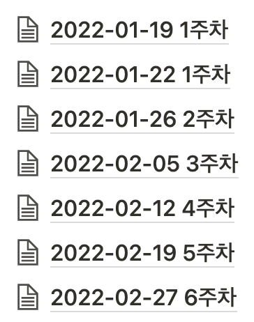

참,,, 꾸준하게 기록해뒀다. 회고를 작성하며 그 때 그 순간을 기억하고 싶어 하나씩 읽어보다, 다시 기록하고 싶은 내용이 있어서 인용으로 적어보려 한다.

 

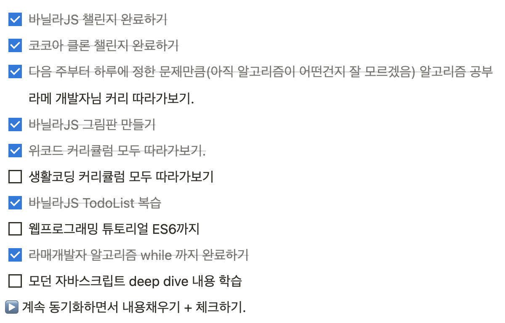

이후에 나오겠지만 `모던 자바스크립트 Deep Dive`는 `그니그니팝팝쥬쥬` 스터디를 통해 완독할 수 있었다.  
(감사합니다 🙏)

 

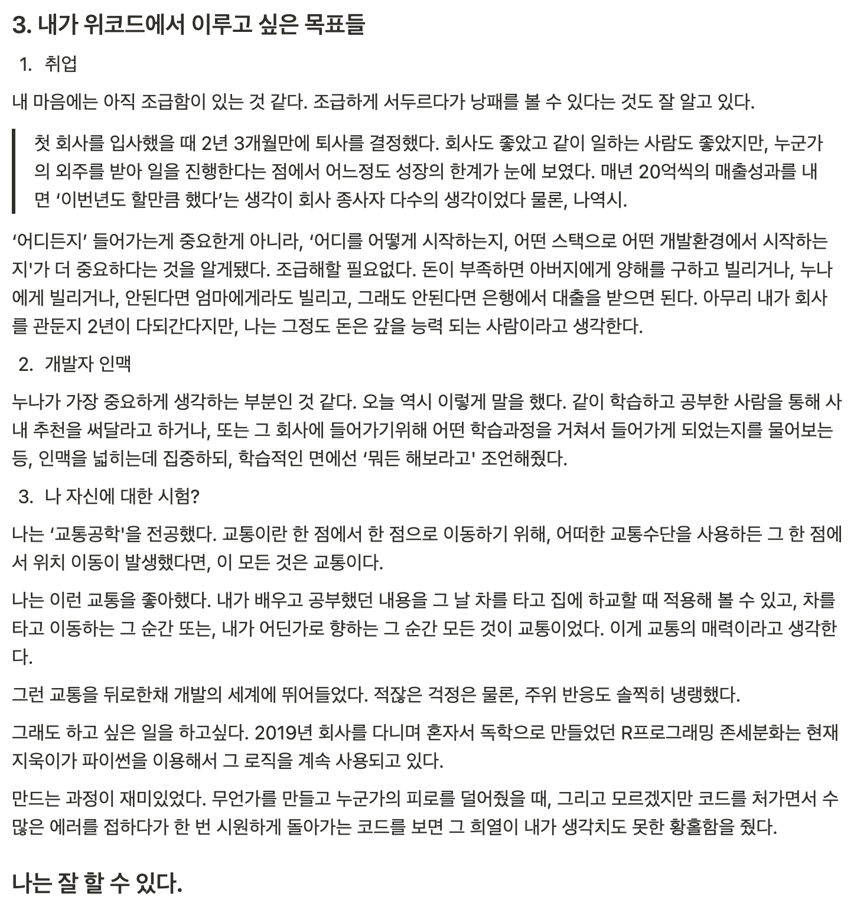

어떤 생각을 가지고 당시에 이런 글을 써내려 갔는지 기억나지 않지만, 지금도 틀린 말 하나 없다고 생각한다.
그리고 목표로 한 내용은, 엄청난 행운이 따라서 모두 이룰 수 있었다.

 

# 3월

## Wecode 31기

정확히 2월 28일, 선릉 위워크로 첫 등교(?)를 했다.

위워크에서 생활은 만족스러웠다. 사실 주위에선 위코드를 다시 들어가라면 들어갈거냐는 질문에 잘 모르겠다고 답하곤 한다. 가격도 가격이고, 수료했을 당시 생각보다 훨씬 미흡한게 많아서 부족한 부분은 알아보고, 찾아서 공부해야했다. 그 과정에서 스터디도 하게되고 사이드프로젝트도 하게됐다.

어쨌든 장점과 단점이 있다고 생각한다. 하지만 ‘그 당시’로 돌아가게 된다면, 똑같이 하겠다고 답할 것 같다.

왜냐하면, 개발자가 너무 되고 싶었다. 어떻게 시작해야할지 몰랐던 상황에서 큰 돈을 내고 선택을 했다.  
만약 그 선택이 없었다면, 익숙한 환경으로 돌아가서 일을 하고 있진 않을까?

 

# 5월

## 취준 시작

취업 준비를 시작했다. 당시 ‘프로그래머의 길, 멘토에게 묻다’는 책을 읽었는데, 누군지 모르더라도 가장 가까운 멘토를 구하라, 그저 이메일을 보내서 시간을 내 달라고 연락해보라는 문구가 있다.

어릴 적 나는 운이 좋지 않다고 생각했다. 인복도 없고, 운이란건 나에게 존재하지 않았다.  
내가 원하는 대로 세상이 흘러가지 않는다는 것을 아주 어릴 적부터 경험했다.

하지만 20대 후반부터 기억을 더듬어보면, 나는 운이 좋다. 인복도 많은 거 같다.  
부트캠프에서 좋은 동료를 만날 수 있었고, 현재 회사에서도 배울 점 많은 동료들에게 자극받으며 성장하고 있다고 생각한다.

그 중, 나에게 가장 큰 천운은 누나가 아닐까 싶다. 어릴 적 누나는 내가 모르는게 있을 때마다 ‘알아서 해’라는 답변을 했다. 그래서 점점 커가면서 누나에게 무언가를 물어보는 일은 거의 없었다.

2020년 8월 쯤이었나, 가족에게 처음으로 개발자를 한 번 도전해보고 싶다는 말씀드렸다. 예상대로 부모님은 전혀 달가워하지 않으셨다. 아무래도 내가 교통을 엄청 좋아하고(교통공학을 전공했다면 대부분은 공공기관을 준비한다.), 특히 아빠와 같은 공공기관, 또는 공무원 같은 안정적인 직장을 가지게 되길 바라셨던 거 같다.

하지만 시간이 흐를 수록 전혀 부모님이 원하는 삶을 살고 싶지 않아졌다. 아무래도 10월부터 시작했던 공공기관 인턴이 나에겐 적잖은 충격이었던 것 같다.

'편한 삶이란 이런 것이지만, 목표없이 하루하루 보내는 삶도 이런 것일까?' 하는 혼자만의 고민에 빠졌다. 물론 공공기관에서도 성과를 내는 사람이 많다. 하지만, 민원앞에 한 없이 약해지는 삶, 직장동료를 책임져 주지않는 상사, 이 모든 것들이 부당해보였다.

마찬가지로 8월 쯤 서울에서 누나와 부동산 일을 처리하고, 누나 집에서 점심을 먹었다. 부모님과 별 다를 것 없는 반응이라고 예상한 뒤, 마음의 준비를 하고 누나에게 개발자가 되고 싶다고 했는데, 의외의 대답은 “해봐” 였다.

누나 직장 동료 중 신입으로 들어온 사람들 중 전공자는 아무도 없다. 다 비전공자였다. 대체 전공자 어디갔는지 모르겠다. 그러니 “너도 해봐 개발자 좋은 거 같애” 라는 대답을 해줬다.

뭔지 모르겠지만 지지 받은 기분이 이런 걸까 하는 생각에 내려가는 KTX 안에서 다시 한 번 다짐했다.  
꼭 개발자가 되어야겠다고.

### 모던 Deep Dive 스터디

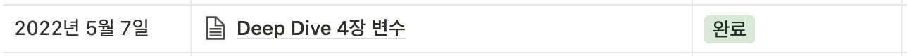

5월 7일을 시작으로 모던 Deep Dive 스터디를 [효정님](https://github.com/hyodduru), [민주님](https://github.com/minju1009)과 함께 시작했다.

당시에 우리는 Wecode 수료하지도 않았고, 기업협업을 나가있던 상태였는데, “미루다간 시작도 못할 거 같아요.“라고 말씀하신 민주님 덕분에 추진력을 얻어 스터디를 시작할 수 있었다.

처음엔 어떤 방법으로 스터디를 해야할지부터 고민했었는데, 결국 정착한 방법은 다음과 같다.

1. 범위를 정해서 내용을 블로그에 정리하자.
2. 정리한 내용을 단원별로 나눠서 서로에서 설명해주자.

참고로 서로에서 설명해줄 내용은 그때 그때 랜덤으로 정했다. 그러다보니, 결국 범위내 모든 내용을 잘 숙지해서 다른 사람에게 설명할 수 있어야 했다.

스터디는 11월 20일이 되어서야 모두 완독할 수 있었다. 생각한 것보다 기간이 훨-씬 길어졌었다. 하지만 목표가 완독이었고, 한 명의 낙오자도 없이 모두 완주했다는 점에서 작은 성공을 이루었다고 생각한다.

개인적으로 채워야할 부분은 남아있다. 내용 정리는 꼼꼼히 작성했지만, 미흡한 부분이 존재하고, 특히 19장은 아직 정리하지 못했다. (스터디를 하면서 유일하게 정리하지 못했던 부분이다.) 또한, 내용을 정확히 이해하지 못했던 부분, 추가로 정리해야할 부분은 체크해 두었다. 2023년에 해야햘 일이 벌써부터 정해졌다.

 

# 6월

## Side Project

본격적으로 사이드 프로젝트를 시작했다.

팀원들과 왕십리에서 모여 회의를 하고, Figma로 디자인시안도 만들고, 기능도 구현해보면서 즐겁게 시간을 보냈다. 사실 걱정도 많이했다. 프론트 3명 중 내가 가장 부족해보였고 실제로도 그랬던 거 같다.

어떻게든 피해를 주고 싶지 않아서, 하루종일 찾아보고 고민해보면서 개발했던 것 같다.

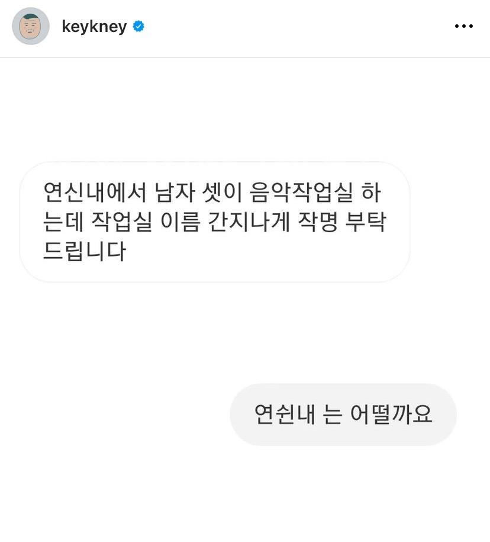

최근 SNS에서 보게 된 글, [원빈님](https://github.com/Onbin97)과 [지훈님](https://github.com/angrybirdpark)이 생각났다.

특히, 원빈님과 지훈님 3명이서 연신내 투썸에 앉아 개발했던 기억이 많이 난다. 아무래도 민주님과 효정님은 일찍이 취업이 결정됐기 때문이다. 나도 얼른 두 분처럼 커리어를 시작하고 싶어, 면접도 보고 이력서도 쓰면서 바쁘게 시간을 보냈던 것 같다.

사실 취업준비기간이 이렇게 길어질 거라고 생각하진 못했었다.

그래도 6월엔 하겠지, 7월엔 하겠지, 8월엔 하겠지,,, 하다가 9월 초에 취업을 할 수 있었다. (제조도 만세 🙌)

Side Project를 조금 더 이야기하고 싶다. 프로젝트 회고를 작성해야지 하다가 결국 하지 못했다.

[Wesalad](https://wesalad.net/)

아직도 AWS에서 돌아가고 있는 우리 Wesalad 웹사이트는 Hola를 많이 참고했다. 클론 코딩이라 해도 좋을 만큼 밴치마킹을 많이했다.

[Hola](https://holaworld.io/)의 [github repo](https://github.com/tmkimm/hola)는 공개되어있고, 해당 코드를 참고할 수 있다. 심지어 테오 단톡방에 Hola를 만드신 분께서 직접 답변도 해주셨다.

프로그래밍, 개발자의 세계는 신기하다. 모두가 자신이 했던 코드를 숨기지 않고 공유한다. 그리고 더 나은 방향으로 코드를 개선할 수 있다면 아낌없이 조언을 나눈다.

나는 이런 문화에 매료되어 개발자가 더욱 되고 싶었던 것 같다. 이전 직장을 비하할 생각은 없지만, 이전 직장에서 나는 [EMME/4](https://www.inrosoftware.com/en/products/emme/)라는 교통수요 패키지 프로그램을 다루었다.

당시, Lock Key 가격만 몇 백~ 몇 천만원을 왔다갔다 했었는데, 국내에 해당 프로그램을 잘 다루는 회사가 몇 없었다. 그 중 운이 좋게도 내가 속했던 회사는 프로그램 전문가분들께서 많이 포진 되어있었고, 프로그램을 여러모로 배울 기회가 많았다.

그러다보니, 프로그램을 배우고 싶어서 타 회사에서 우리회사로 교육을 신청하는 경우가 드뭇있었다. 프로그램을 하루 배우는데 60만원을 제안했던 회사도 있었다. (결국 타 회사측에서 하지 않겠다고 하여 무산됐다.)

프로그램의 Macro 역시 회사의 자산이었고, Bank(프로젝트 단위의 파일) 역시 함부로 공개할 수 없었다.  
개발은 github에 모든 소스코드가 공유되어있다. 마음만 먹으면 다른 사람의 코드를 이용해서 하나의 서비스를 만들어 낼 수도 있다.

최근 테오단톡방에서 질문을 올렸는데, 답변을 달아주신 분의 코드를 인용해도 괜찮겠냐는 나의 질문에 다음과 같은 사진을 공유해주셨다.

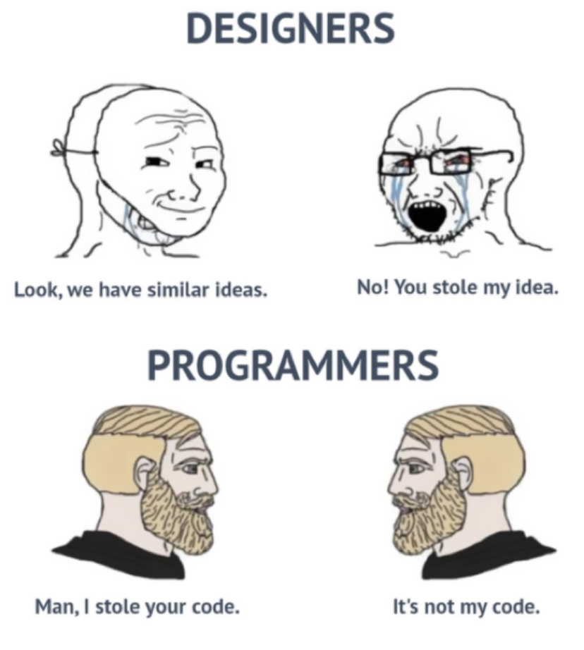

**개발자의 문화는 항상 나를 겸손하게 만들고, 더욱 성장하고 싶게 만든다.**

 

# 9월

갑자기 9월로 껑충 뛰어버렸다. 사실 7월 8월은 Side Project를 했던 기억과, 모아놨던 돈을 거의 다 써서 31살에 아빠에게 용돈을 받고, 그것도 부족해서 서울에서 청년수당을 받으며 하루하루를 보냈다.

그래도 개발 관련된 서적, 인강에는 돈을 아끼지 않았다. 처음 맥북을 살 때도 비슷한 생각을 했었는데, 나에게 투자하는 만큼 내가 성장할 기회가 많다는 것을 알고 있었다.

지금 역시, 근 3년동안은 내가 성장할 기회가 많다고 판단되면 망설이지 않고 지갑을 열 생각이다.  
 `Next Step TDD` 강의 역시, 강의가 열린다는 메일을 받기 전부터 고대하며 기다렸고, 강의 신청 시작 날 오전 10시가 되자마자 카드를 꺼내 해당 강의를 결제했다.

## 획기획, 제조도 프론트엔드 개발자.

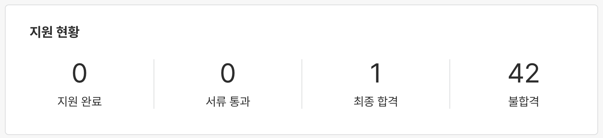

100번을 지원해서 99번 떨어지더라도, 1번 성공하면 취업이다. 는 말을 실감했다.

정확히 기억나진 않는데, 8월 10일 쯤 획기획(제조도) 프론트엔드 개발자 공고가 올라왔었고, 이력서를 넣었다.

하지만 몇 주가 지나도 합격 또는 불합격 통보가 없어서 이력서는 확인하고 답변은 안해주는 것 같아 지원 취소를 눌렀다가, 조금만 기다려보자는 생각을 가지고 지원 취소하기를 다시 취소했다. (isCancel?)

지원 취소하지 않는 게 올해 나의 가장 큰 행운이 아닐까 싶다.

서류합격 메일을 받고, 과제를 진행했다. 사실 과제 테스트를 진행하기 전, 모 모빌리티 회사에서 면접을 봤다.

질문에 대한 답변이 지금 생각해봐도 형편없었다. Typescript에 관한 내용 역시 답변을 잘 못했지만, 가장 부끄러운 건 Javascript에서 가비지 컬렉터 관련 질문이었다. 해당 질문은 다음과 같다.

> “공부하신 내용을 정리한 노션블로그가 있네요, 그 중에서 하나만 여쭤볼게요. 클로저를 구현했을 때 참조한 변수는 가비지컬렉터의 대상이 될까요?

> ”네! 가비지 컬렉터의 대상이 됩니다.”

 

정말 바보 같은 답변을 했다. 모던 Deep Dive에서 스터디 했고, 실제로 해당 내용을 발표하며 스터디원에게 설명까지 했는데, 가비지 컬렉터의 대상이 된다고 답변했다.

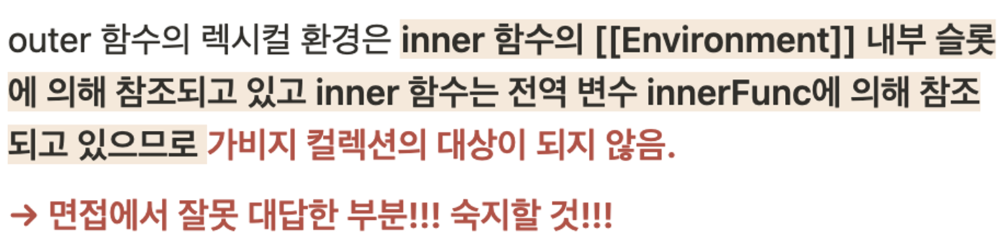

오전 백신 부작용으로 피부가 너무 가려워 피부과에서 약 받으러 갔다가, 문자 한 통을 받았고, 혹여나 붙었나 싶어 다시 전화를 드리니 “합격”하셨다는 답변을 들었다.
하지만, 이상했다. 기분이 좋아야하는데 그렇지 않았다. 한 마디로 찝찝했다.

그 이유를 생각해보면,

> 면접에 대한 답변을 단 하나도, 똑바로 한 거 같지 않은데, 뽑혔다.

 

이전 직장에서 나는 면접을 보고 그 자리에서 합격 소식을 들었다.

물론 교통을 정말 좋아했고, 그 회사를 정말 가고 싶었고, 연봉도 만족스러워서 기뻐하기만 했다. 하지만, 회사를 다니며 생각이 조금 바뀌었다.

직장 상사는 내가 당연히 알 거라는 표정으로 개념을 물어봤을 때, 내 대답이 “잘 모르겠습니다.”고 답변하면 물론 친절히 설명해주셨다.

하지만 내 머릿 속은 나에게 전혀 친절하지 않았다.
당연히 알아야할 것을 모른다는 생각에 자책했고, 면접에서 너무 쉽게 합격했기 때문이라는 이상한 생각을 했다.

하지만 이 이상한 생각이 틀렸다고 생각하진 않는다. 회사는 나에게 좀 더 염격한 잣대로 나를 평가해야 했던 것 같다.

그래서 회사를 다니는 동안 가장 부족한 것은 나였고, 그런 나를 성장시키기 위해 많은 일을, 못할 수 없고 잘 해야한다고 생각했다.

이 과정에서 몸도 많이 상했고, 건강도 잃었다. 무엇보다 정신적으로 “잘해야한다”는 생각에 나를 계속 짓누르고 압박했던 것 같다.

S대 출신이 가장 많았던 직장 상사분들, 그 사이에서 지방대인 내가 살아남기 위해 견뎌야했던 압박은 엄청 났다.

그래서 일까, 개발자로 전향한 후 회사에서 들어가기 전엔 면접만이 아닌 과제 또는 코테를 통해서 나를 검증할 수 있는 단계가 있었으면 좋겠다고 생각했고, 그 단계를 통과해야 회사에 일하며 나 역시 자신감을 가지고 일할 수 있다고 생각했다.

그래야 모르는 것을 모른다고 당당하게 말할 수 있고, 떳떳할 수 있다고 생각했던 것 같다.

어찌됐건, 모 모빌리티 합격 소식을 듣고 그 다음날(화요일)까지 과제를 제출해야할 곳(제조도)에서 월요일 마무리한 과제를 github repo로 제출했다.

아니 근데 이게 웬걸? 생각보다 훨씬 많은 사람들이 과제를 제출한게 아닌가;

github repo에서 jejodo를 검색했을 때 결과로 나오는 과제제출 github repo는 내가 생각한 것보다 훨씬 많았고, 나는 `Typescript`, `react`만 사용했는데 반해 다른 사람들은 `recoil`, `react-query`, `redux` 등등 상태관리 라이브러리를 마음 껏 뽑냈다.

과제 전형을 통과했지만, 당시 제출할 때 내 마음속 한 마디는 “쉽지 않네…”였다.

과제를 통과하고, 면접을 보러 갔다. 사실 면접을 보기 전 많은 준비를 하지 않았다. 내 면접전략 단 하나였다.

**1. 관심있는 내용의 개발 블로그 글을 꾸준히 읽는다.**

끝이다. 정말 이게 다였다. 지금에서야 브라우저 동작원리나 네트워크 관련 내용, 웹에 전반적인 내용 등등이 중요하다고 생각하지만(몰라서 실무에서 너무 헤매는 중 ㅠㅠ) 당시에는 관심있는 블로그 글을 찾아서 꾸준히 읽었다. 그리고 면접에서 질문이 나왔을 때 해당 내용을 내가 모른다면, 그냥 모른다고 답하자. 하지만 아는 내용, 또는 관심있는 내용이라면 아는 만큼 다 말해보자. 는게 나의 전략이었다.

운이 좋게도 이 전략을 지금 일하고 있는 획기획/제조도 면접에서 빛을 발했다.

면접에서 여러 질문들을 들었는데, 내가 관심있던 그리고 잘 대답할 수 있던 내용들로 질문이 주어졌다. 특히 기억남는게,

> “상태관리 라이브러리를 사용하지 않고 과제를 진행하셨는데, 그 이유가 있나요?”

이 질문에, 내 대답은 이러했다.

> “과제에서 props drilling의 depths가 그렇게 깊지 않았던 거 같아요. 그래서 상태관리까지 사용할 필요성을 못 느꼈습니다. Redux-toolkit을 사이드프로젝트에서 적용했었는데, 사실 보일러플레이트 양이 많다고 생각했어요. 그래서 보일러플레이트양과 Props drilling 중 고민해봤을 때 이 정도 규모라면 Props drilling해도 괜찮다고 생각합니다.”

 

고 답변했다. 면접이후 입사가 결정되고 면접 봐 주신 두 분의 생각을 들을 기회가 있었는데, 역시 상태관리 라이브러리를 바로 적용하는 것보단, `contextAPI`를 써보고, 불편하다면 상태관리 라이브러리를 고려하는게 좋은 것 같다는 답변을 들었다.

결과는 다음과 같다.

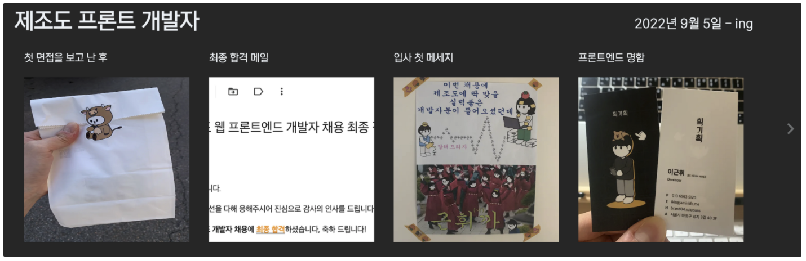

 

# 그 외,

## 내 나이만큼 책 읽기

31살, 개발자 준비를 위해 들었던 인프런 [비전공자를 위한 개발자 취업 올인원 가이드](https://www.inflearn.com/course/%EA%B0%9C%EB%B0%9C%EC%9E%90-%EC%B7%A8%EC%97%85-%ED%86%B5%ED%95%A9%ED%8E%B8/dashboard)의 강사인 한정수님이 매년 자신의 나이만큼 책을 읽는다는 말씀을 하셨던게 인상깊어서 시작하게 됐다.

결과는 총 10권, 초라한 성적이다. (ㅎ…)

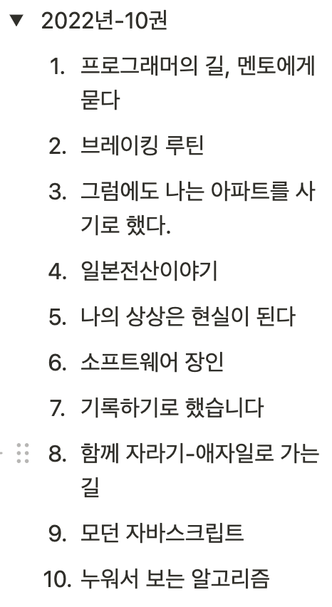

올해 2023년엔 꼭 내 나이만큼 책을 읽어야겠다.

## 완료한 일들

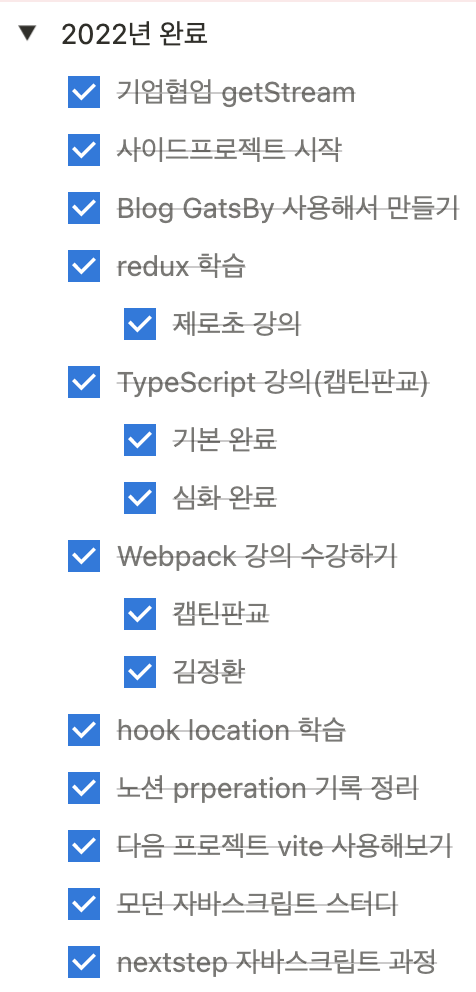

노션에 한 해를 보내면서 하고싶은 일들을 기록해둔다. 그리고 기회가 되거나 시간이 날 때 하나씩 올려보며 실행한다. 캡처를 이렇게 해서 그렇지 하고 싶은 일들, 공부하고 싶던 내용, 해야할 일들은 산더미인데 겨우겨우 이 만큼 한 거 같아서 많이 아쉽다. (유튜브 쇼츠를 조금만 줄였어도, 더 할 수 있었을텐데.)

이 중 가장 기억에 남는 건 Next Step에서 자바스크립트 과정을 들었던 것이다. 후반부로 갈수록 회사 일을 더 많이 하게 되어 매번 주말마다 녹화된 영상으로 공부해야겠지만, 그래도 목표로 했던건 racingCar까진 완료할 수 있어서 다행이라고 생각한다.

과정을 진행하면서 다른 분들과 비교를 많이 하고, 자신감도 많이 떨어졌었던 시기가 있었는데, 결국 극복할 수 있었다. ‘어제의 나와 비교해서 오늘 더 성장했다면, 그걸로 만족하자.’는 말이 많은 위로가 됐다.

결국, 개발은 ‘나 자신과의 싸움이구나.’를 실감했다.

## 운동에 대한 나의 생각 정리

["퇴사하겠습니다."](https://velog.io/@geuni620/%ED%87%B4%EC%82%AC%ED%95%98%EA%B2%A0%EC%8A%B5%EB%8B%88%EB%8B%A4)

5월 26일 운동을 끝내고, 작성했던 “퇴사하겠습니다”라는 글을 다시 읽어보며, 운동을 해야겠다고 다짐했다.  
8월까진 꾸준히 운동을 해오다가, 9월부터 차츰차츰 빈도가 줄기 시작하더니 결국 하지 않게 됐다.

2023년 운동을 다시 시작해야겠다.

## 2023년에 하고 싶은 일, 목표

회고를 작성하다보니 2023년 내가 해야할 목표들이 정해졌다.

- 내 나이만큼 책 읽기
- 모던 자바스크립트 Deep Dive 내용을 다시 정리
- 블로그 리뉴얼하기
- TIL 레포에 흩어져있는 기록들을 블로그에 정리
- 서비스를 만들어 사용자 트래픽 감당해보기
- 운동을 꾸준히 하기(= 시스템화 하기)

아주 작은, 아주 하찮은 일부터 다시 꾸준히 시작해보자 ⭐️
