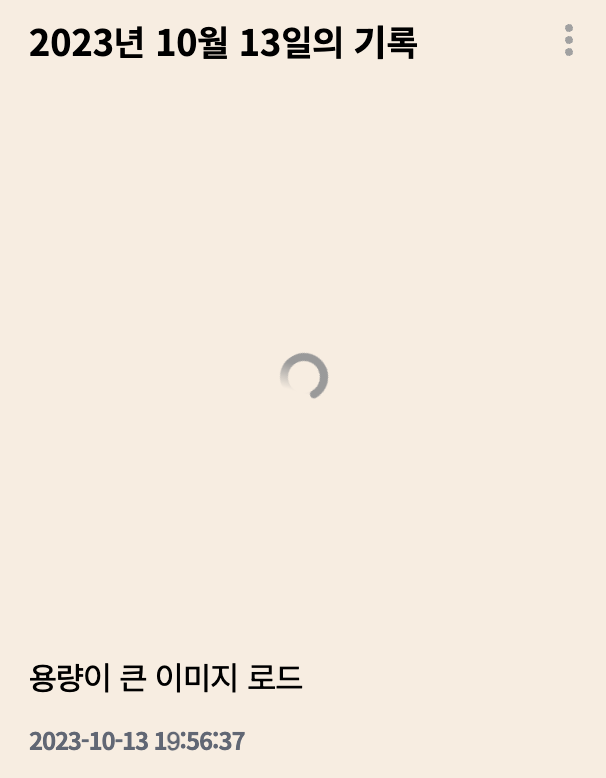
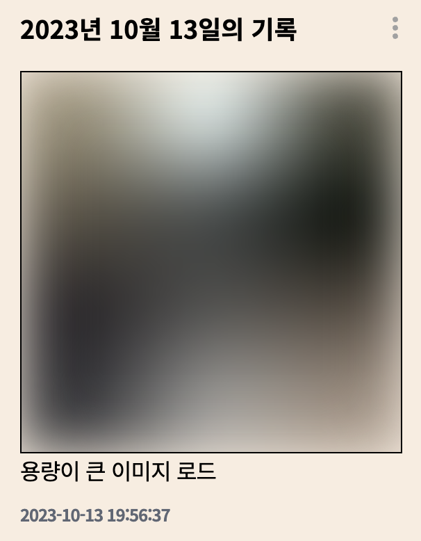
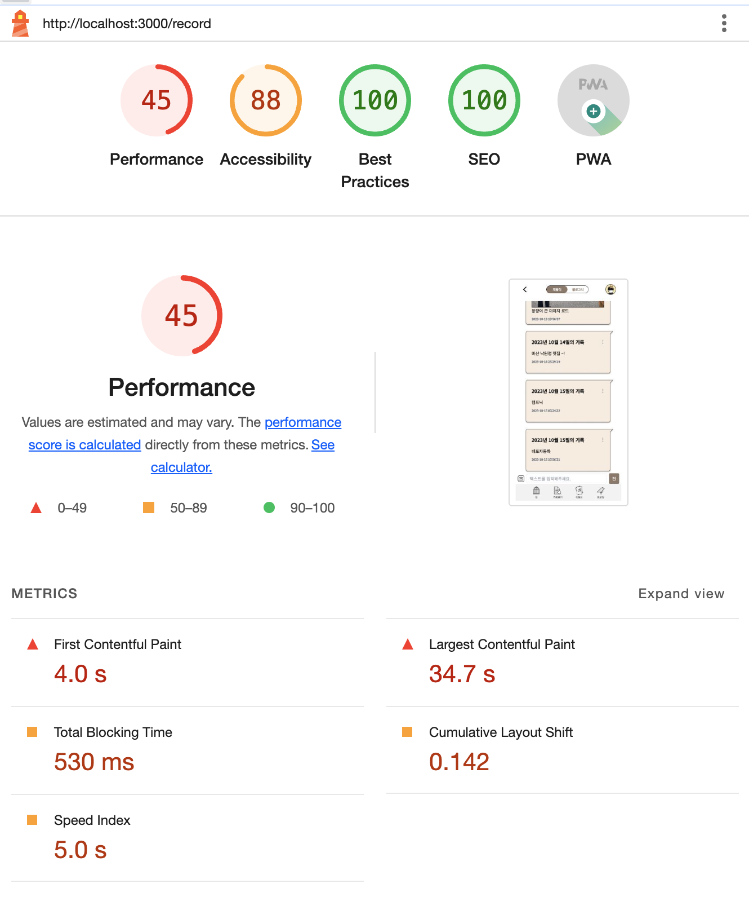
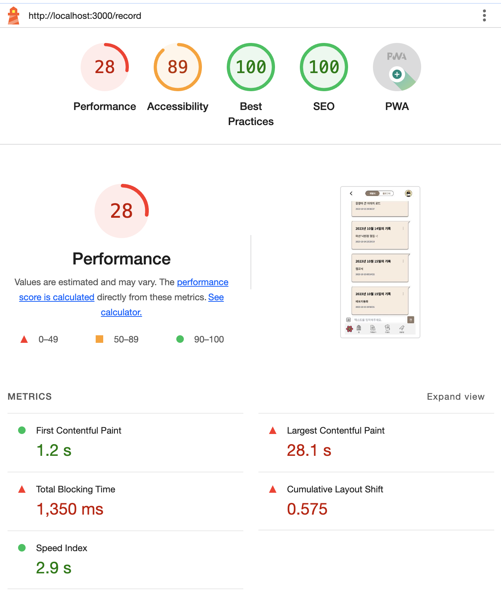
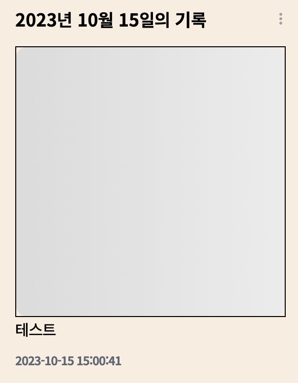
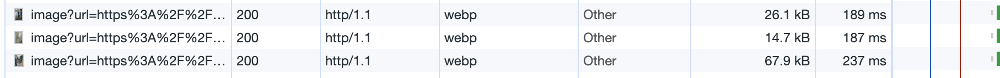
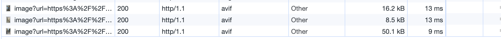
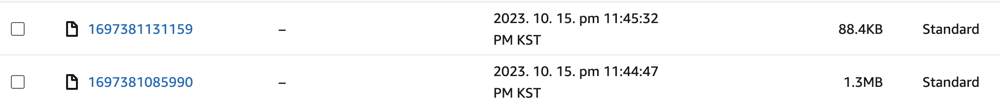
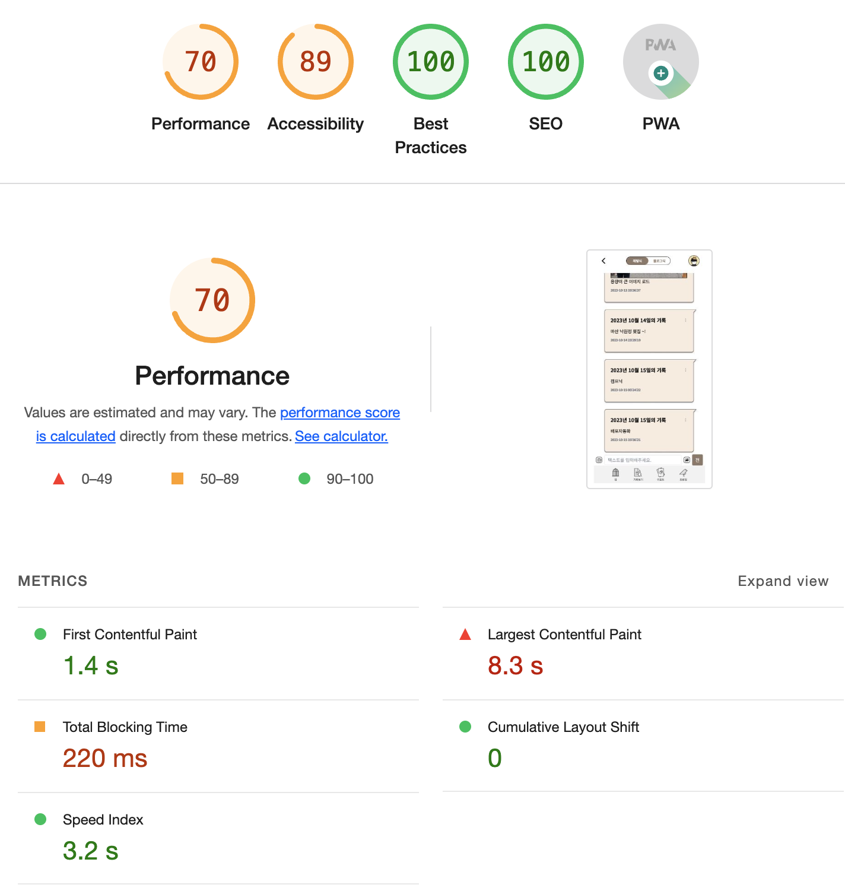

> 내가 개발하고 있는 기록이 서비스는 '기록'을 하기위한 플랫폼이다.  
> 즉 하루하루의 한 문장이라도 기록을 남긴다.  
> 이때 이미지도 함께 올릴 수 있는데, 이미지 업로드 속도가 너무 느리다.

<br>

## 현재 상황

일단 간단하게 설명하면 다음과 같다.

1. 이미지와 메시지를 업로드 하고 싶다.
2. 메시지를 작성한다. + 이미지를 선택한다.
3. 전송버튼을 누른다.

<br>

그럼 다음과 같은 로직으로 돌아간다.

1. tanstack-query를 통해 메시지를 서버로 전송한다.
2. 서버에 메시지를 저장한 후, record id를 반환한다. (mutateAsync)
3. 반환된 record id를 통해 이미지를 서버로 전송한다.
4. 서버에서 이미지를 S3로 업로드 한다.
5. 업로드한 url, record id를 db에 저장한다.
6. 다시 클라이언트 tanstack-query내에 onSuccess를 통해 invalidate queries를 무효화한다.
7. refresh한 메시지 리스트 + 이미지를 불러온다.

<br>

## 원인파악

위의 상황 중 7번에서 문제가 발생하는데, 메시지는 바로 UI상에 반영되지만, 이미지는 바로 반영되지 않는다.
일정시간이 지난 후 layout shift가 발생하면서 이미지가 생긴다.

<br>

먼저 원인을 파악하기 위해 network tab에서 확인해본 결과, 이미지를 불러오는 과정에 문제가 있는 듯 했다.
다음과 같은 고민을 했다.

- 로직이 문제인건가?  
  (recordId를 반환받고 그 후에 image를 업로드하는 saveImage를 병렬이 아닌 직렬로 동작해서 그런건가?)
- image 로딩처리를 해주면 사용자가 업로드 중인걸 아니까 조금은 낫지 않을까?
- lighthouse로 성능지표를 확인해봐야겠다.

<br>

## 실천방안 1. loading처리를 해주자.

- loading 처리도 크게 두 가지로 나눌 수 있다.

1. useQuery를 가져올 때 loading처리를 해줄 수 있다.
2. next/image를 통해 Image 컴포넌트에 props로 onLoad를 사용해서 loading 처리를 해줄 수도 있다.

<br>

### 1-1 useQuery loading 처리

먼저 1번부터 살펴보자.  
핵심은 Suspense로 UploadImageList를 감싸줬고,  
UploadImageList에는 `placeholder`,`blurDataURL`를 넣어줬다.

```TSX
import { Suspense, useState } from 'react';

const MessageBox: React.FC<MessageBoxProps> = ({
  id,
  timeStamp,
  text,
  title,
  userEmail,
  onEditMessage,
  token,
  hasImage,
}) => {

  return (
    <div>
      <Link>
        <div className="z-20 w-full px-5 py-[25px] text-[18px] font-bold leading-[26px] text-black">
          // Image를 Suspense로 감싸줬다.
          {hasImage && (
            <Suspense
              fallback={
                <div className="relative flex h-[275px] w-[275px] items-center justify-center">
                  <LoadingIcon />
                </div>
              }
            >
              <UploadImageList token={token} userEmail={userEmail} id={id} />
            </Suspense>
          )}
        </div>
      </Link>
    </div>
  );
};

export default MessageBox;
```

<br>

```TSX
import Image from 'next/image';

import { useImageGetByRecordIdQuery } from './useImageGetByRecordIdQuery';

interface Image {
  img: {
    height: number;
    width: number;
    src: string;
  };
  base64: string;
}

interface UploadImageListProps {
  token: string | undefined;
  userEmail: string | undefined;
  id: string;
}

const UploadImageList: React.FC<UploadImageListProps> = ({
  token,
  userEmail,
  id,
}) => {
  const { imageList } = useImageGetByRecordIdQuery({
    token,
    userEmail,
    recordId: id,
  });

  return (
    <div className="relative h-[275px] w-[275px] ">
      {imageList.data.slice(0, 1).map((image: Image, idx: number) => {
        return (
          // Image에 blur와 blurDataURL을 넣어줬다.
          <Image
            key={idx}
            src={image.img.src}
            alt="user upload image"
            className="border-[1px] border-solid border-black object-cover"
            blurDataURL={image.base64}
            placeholder="blur"
            fill
          />
        );
      })}
    </div>
  );
};

export default UploadImageList;
```

<br>





순차적으로 로딩이 돌고(useQuery), Image가 불러와졌더라도, 완전히 load되기 전에 blur가 동작해서 희미하게 나마 이미지를 보여주기 시작한다.

<br>

언뜻보기엔 잘 된것 같아보이지만, 이미지와 메시지를 바로 작성한 뒤 업로드가 될 때는

1. 메시지가 먼저 올라가고,
2. 이미지가 loading fallback을 보이더니
3. blur처리가 된다.

즉, layout shift는 여전히 발생한다.  
또한 input box의 text는 submit으로 전송한 후엔 reset되어야하는데, 이 역시 느리게 동작한다.  
위와 같이 작성했을 땐 lighthouse 기준 Performance가 오히려 더 낮아졌다.



<br>



<br>

First Contentful Paint와 Largest Contentful Paint는 줄었다.

- First Contentful Paint: 브라우저가 화면에 무언가를 그리기 시작하는 시점 (4.0s → 1.2s)
- Largest Contentful Paint: 화면에 가장 큰 요소가 그려지는 시점 (34.7s → 28.1s)

하지만 총 Total Blocking Time은 두 배 이상 늘어났다. 즉, Performance 점수는 45에서 28로 크게 줄어들어버렸다.

- 원인은, 이미지와 메시지를 한 번에 불러왔지만 변경 후엔 Image를 각각 서버로 요청해서 불러와야한다는 점, (await)
- 그리고 서버쪽에서 blur처리를 위한 plaiceholder lib를 사용해서 base64를 생성하는데,  
  이것 또한 Blocking의 원인이 아니었나 싶다.(서버에서 base64를 변환하고 저장해야하니)

<br>

### 1-2 next/image loading 처리

> 다시 원점으로 돌아와서 시작해보기로 했다.

대체적으로 대부분의 블로그에서 Image컴포넌트를 사용하는 걸 권한다. 왜냐하면 해주는게 많기 때문이다.

- 1-1에서의 문제점은 로딩과 이미지, 메시지가 따로 동작한다.  
  메시지 올라가고, 로딩폴백 뜨더니, blur처리된 이미지가 보이고, 이미지가 적용되었다.  
  그리고 메시지가 올라가서부터 로딩폴백이 뜨기까지 term이 긴 편이었다.

- 이미지를 올리자마자 skeleton loading을 보여주고,  
  이미지가 로딩되면 skeleton loading을 없애주는 방식으로 적용해주려고 했다.

```TSX
const MessageBox: React.FC<MessageBoxProps> = () => {

  return (
<div
      key={index}
      className="relative h-[275px] w-[275px] border-[1px] border-solid border-black"
    >
      <div className="skeleton" aria-hidden="true" />
      <Image
        fill
        style={{
          objectFit: 'cover',
        }}
        key={index}
        sizes="(max-width: 400px) 275px"
        src={image.url}
        alt="user upload image"
        quality={70}
        // 이미지가 로드되면 skeleton을 없애준다.
        onLoad={() => document.querySelector('.skeleton')?.remove()}
      />
    </div>
  );
};
```

- 위 코드에선 다음과 같은 의도로 코드를 작성했다.

1. Image 사이즈를 고정시켜줘야할 것 같다.
2. quality는 default 75이지만, 70으로 낮춰줬다.
3. global.css에 skeleton style를 추가한 뒤, onLoad를 통해 이미지가 로드 되면, skeleton을 없애줬다.

<br>



<br>

1. 'Image 사이즈를 고정시켜줘야할 것 같다.'의 의도는 다음과 같다.

- 이미지가 275px x 275px로 맞춰놓고 UI를 구상했다. 이것보다 height가 큰 이미지는 UI가 깨져버린다.
- 이를 위해 처음엔 width와 height를 각각 275px로 지정해줬다. width는 275px로 잘 고정되는 반면, height는 275px이 아닌 300px이 넘어가는 경우도 발생했다. (정확히 원인이 왜 그런지 잘 모르겠지만.)
- 그래서 fill 속성을 사용했다. 하지만 fill 속성은 브라우저에서 이미지를 그릴 때 몇으로 그릴지를 지정해주지 못한다. width와 height props를 사용했다면 가능했겠지만, fill 속성으로 변경했다면 sizes를 추가해줘야한다.

  - 나의 경우엔 mobile-first-ui로 제작했고, max-width가 400px이다. sizes를 275px로 지정해줬다.
  - 이로써, 브라우저는 최대 400px을 기준으로 275px로 이미지를 그리게 될 것이다.
  - 이 내용은 [공식문서 sizes내용을 참고했다.](https://nextjs.org/docs/app/api-reference/components/image#sizes)

<br>

이외에 처리해준게 더 있는데, 이는 다음 챕터(실천방안.2)에서 다루려고 한다.

## 실천방안 2. 이미지의 용량을 줄여보자.

[이미지 최적화를 위한 전략 feat.Nextjs](https://velog.io/@yesbb/Nextjs%EC%97%90%EC%84%9C-%EC%9D%B4%EB%AF%B8%EC%A7%80-%EC%B5%9C%EC%A0%81%ED%99%94%ED%95%98%EA%B8%B0)

이미지 최적화를 위한 글을 참고하다가 위 블로그를 발견했다.
그래서 블로그에서 제시하는 방법을 하나씩 적용해보려고 했다.

### 2-1 이미지 최적화 적용하기

위 블로그에서 이미지 압축률을 높이는 포맷을 추천해준다.
avif와 webp인데, 기존에 next/image 컴포넌트를 사용하면, webp를 적용해준다.
next.js 공식문서에선 [avif가 webp에 비해 20% 높은 압축률을 자랑한다고 소개한다.](https://nextjs.org/docs/app/api-reference/components/image#formats) 그래서 적용해봤다.

```JS
// next.config.js
module.exports = withPWA({
  images: {
    formats: ['image/avif', 'image/webp'],
});
```

- next.config.js에서 images를 만들고 formats를 다음과 같이 작성해준다.
- 이렇게 했을 때, image/avif를 우선적으로 사용하고, 만약 브라우저 호환이 안되는 경우가 생기면 image/webp를 사용해준다.
- avif가 용량이 더 적은 것을 알 수 있다.





<br>

그리고 이미지 용량을 압축시켰다.  
위 블로그에서 추천하는 [browser-image-compression](https://github.com/Donaldcwl/browser-image-compression)라이브러리를 적용했다.

```TSX
import imageCompression from 'browser-image-compression';

  const onImageChange = async (e: React.ChangeEvent<HTMLInputElement>) => {
    // ...

    const options = {
      maxSizeMB: 0.2,
      maxWidthOrHeight: 800,
    };

    const compressedFilesPromises = Array.from(files).map(async (file) => {
      try {
        const compressedFile = await imageCompression(file, options);
        return compressedFile;
      } catch (error) {
        console.error('Image compression failed:', error);
        return file;
      }
    });

    const compressedFiles = await Promise.all(compressedFilesPromises);

    // ...
  };
```

- 리팩터링하지 않은 상태여서 역할 분리가 잘 안되어있긴한데, onImageChange함수는 이미지를 업로드하면, imageCompression 함수가 이미지를 압축한다.
- 그리고 preview image를 만들어주고, formData를 만들어서 uploadImageList에 넣어준다.
- uploadImageList는 submit 할 때 서버로 보내게 된다.

<br>



- 이미지 압축이후 용량을 비교해보면, 1.3mb → 88.4kb로 압축해준다.

<br>


- 모바일 환경이라고 생각하고 비교해봤을 땐 크게 깨지는 것 같진 않다.

<br>


- AWS에서 URL을 통해 이미지를 열어보면 다음과 같다.
- `browser-image-compression`가 이미지를 압축할 때, width와 height까지 변경하기 때문에, 이미지 크기를 똑같이 캡처할 순 없었다.
- 위 이미지 같은 경우엔, 강아지(망고)이기 때문에 큰 화질 변화는 없는 듯 보이나, 코드를 캡처한 이미지를 올렸을 땐 확연한 이미지 화질차이가 존재했다.
- 그래서 상황에 맞게 잘 적용해야할 것 같다. (화질이 중요한 경우라면 options에서 maxSizeMB를 적절히 선택해야할 것 같다.)

<br>



- 최적화 이후 performance 점수는 다음과 같다.
- 아직, 근본적인 원인인 이미지를 업로드했을 때 로딩처리는 여전히 느리다.  
  이는 다음 포스팅에서 공유해보려고 한다.

<br>

### 참고자료

[next.js 공식문서 <Image>](https://nextjs.org/docs/app/api-reference/components/image)

[이미지 최적화를 위한 전략 feat.Nextjs](https://velog.io/@yesbb/Nextjs%EC%97%90%EC%84%9C-%EC%9D%B4%EB%AF%B8%EC%A7%80-%EC%B5%9C%EC%A0%81%ED%99%94%ED%95%98%EA%B8%B0)

[NEXT.JS의 이미지 최적화는 어떻게 동작하는가?](https://oliveyoung.tech/blog/2023-06-09/nextjs-image-optimization/)
