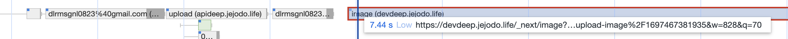

> [이전에 작성한 블로그 글](https://geuni620.github.io/blog/2023/10/13/next-image-optimization/)에 이어서 추가로 몇 가지 더 작성해보려고 한다.

### performance로 측정해보자.

[이전에 작성한 블로그 글](https://geuni620.github.io/blog/2023/10/13/next-image-optimization/)에서는 계속 lighthouse만을 통해서 성능을 검증했다. 하지만 위 글에서도 언급했듯이, 근본적으로 해결하고 싶던 문제는 **사용자가 이미지를 업로드했을 때, 이미지가 최소한의 로딩시간 후 렌더링 되는 것**이다.

이미지 용량 다운, loading처리, 심지어 CDN까지 많은 것을 고려했지만, 결국 원인은 Image 컴포넌트 내부에 있었다.

- 이상하게 이미지를 업로드하고, stale한 데이터를 react-query로 refresh 시키면 이미지가 로드되는데 시간이 오래걸렸다.
- 이를 performance로 측정해보니, 이미지가 로드되는데, 3s 이상 걸릴 때도 있었다.
- 원인은 .next/image cache에 있었다.

 

Image 컴포넌트가 문제인 듯 하여, img 태그를 사용하려고 했다. img태그를 아무 동작없이 사용하면, 로딩속도는 급감시킬 수 있다.
하지만 이 img태그 역시 avif로 변환하는 라이브러리를 사용했을 때 로딩속도가 지연된다는 것을 알 수 있었다.

즉, avif가 이미지 압출율은 좋지만, 압축하는데 걸리는 시간은 오히려 더 많이 소요된다는 것을 알 수 있었다.

그래서, webp를 사용하되, avif는 제거하였다. 그리고 minimumCacheTTL을 추가했다.

### .next/image cache

- next.js Image 컴포넌트는 많은 기능을 대체해준다.

 
