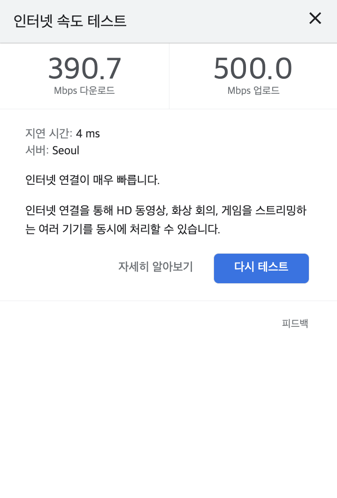
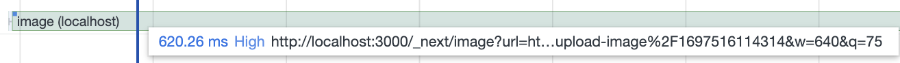

> [이전에 작성한 블로그 글](https://geuni620.github.io/blog/2023/10/13/next-image-optimization/)에 이어서 추가로 몇 가지 더 작성해보려고 한다.

### performance로 측정해보자

이전에 작성한 블로그 글에서는 계속 lighthouse만을 통해서 성능을 검증했다. 하지만 위 글에서도 언급했듯이, 근본적으로 해결하고 싶던 문제는 다음과 같다.

사용자가 이미지를 업로드했을 때, 이미지가 **최소한의 로딩시간** 후 렌더링 되는 것이다.

이미지 용량 다운, loading처리, 심지어 CDN까지 많은 것을 고려했지만,  
결국 원인은 Image 컴포넌트 내부에 있었다.

 

참고로 회사 인터넷 속도가 빨라서 이를 기준으로 측정했다.

 

### 이미지 최적화 이전

이전 블로그를 기준으로 이미지를 최적화하기 위해 크게 두 가지를 변경했었다.

1. 이미지 용량 압축(browser-image-compression lib)
2. 이미지 포맷을 webp → avif로 변경

 

그럼 변경하기 전과 변경하고 난 후에 lighthouse performance 점수는 45 → 70으로 25 증가했었다.  
(이전 블로그 작성할 때에 비해 매일 이미지와 기록을 더 많이 남겼다. 현재는 당시기준으로 돌아가서 light-house를 테스트해보면 performance점수가 24로 떨어졌다. 🥲)

 

하지만 performance를 확인해보자

- 먼저 record를 불러오는데 → 251.45ms
- 이미지를 submit해서 서버에서 이미지를 s3에 업로드하고, db에 저장하는데까지 → 397.04ms
- record 데이터를 refresh 시켜서 useQuery가 다시 불러오는데 → 140.24ms
- 그리고 이미지를 Image컴포넌트에 src로 지정해주는데, 이때 next.js 자체 서버에 cache 및 re-size 등등을 수행하는 듯하다. → `620.26ms`
- 총 1408.99ms 걸린다.

 

### 이미지 최적화 이후

위에서 언급했듯이, 최적화 이후엔 용량압축, 포맷을 webp → avif로 변경했다.
webp에서 avif로 변경한 이유는 압축율이 20% 더 좋다는 vercel 공식문서를 참고했다.

 

동일하게 performance를 측정해봤다.

- record를 불러오는데 → 226.85ms
- 이미지를 submit해서 서버에서 이미지를 s3에 업로드하고, db에 저장하는데까지 → 225.36ms
- record 데이터를 refresh 시켜서 useQuery가 다시 불러오는데 → 140.33ms
- Image 컴포넌트 src에 이미지를 지정하는데 → `921.52ms`
- 여긴 하나 더 추가되는게, 이미지를 압축하는 browser-image-compression이 추가된다. → 132.22ms
- 총 1646.28ms 걸린다.

오히려 이미지를 업로드하고 불러오는데 더 많은 시간이 걸린다.
하지만 light-house 점수는 더 높게 나왔었다.

 

### webp로 다시 변경 후, sharp 설치

나는 Image 컴포넌트에 src를 입혀줄 때 cache, resize 등을 수행하는데, 이게 너무 오래걸리는 것을 performance를 통해 확인했다.
그래서 Image컴포넌트를 제거하고, img 태그를 바로 적용하면 어떨까하는 생각을 했고 실제로 적용해봤다.

 

- 하지만 이렇게 했을 때, jpg 파일이나, png 파일이 그대로 s3에 올라가게 되는 점
- browser-image-compression로 압축을 한 번 했지만, Image 컴포넌트에서 최적화를 한 번 더 해줘서 최종적으로 용량을 줄일 수 있었는데 이를 누릴 수 없는 점
  - 이는 업로드 기능 성능과는 큰 연관이 없을지 모르나, record+image를 모두 불러올 때 이점을 상쇄시킨다.
- Image 컴포넌트는 cache를 해주는데, img 태그는 별도 cache를 해줘야한다는 점.

 

> 잠깐 번외  
> 실제로 img 태그를 사용하고 백엔드에서 sharp library를 설치해서 이미지 파일을 avif로 변환해보았다.
> 그때 performance로 성능을 검사해보니 역시 avif로 변환하는데 시간이 오래 걸렸다.

- 결국 **webp를 사용하기로 했고**, **minimalCacheTTL을 1년으로 지정**해줬다.
- 또한 sharp를 설치해줬다.
- 그 결과 다음과 같은 성능 개선이 있었다.

 

- record 불러오는데 → 242.86ms
- 이미지를 submit해서 서버에서 이미지를 s3에 업로드하고, db에 저장하는데까지 → 229.49ms
- record 데이터를 refresh 시켜서 useQuery가 다시 불러오는데 → 129.20ms
- Image 컴포넌트 src에 이미지를 저장하는데 → 124.14ms
- browser-image-compression 압축하는데 → 79.90ms
- 총 805.59ms 걸린다.

 

### 결론

- 결국
