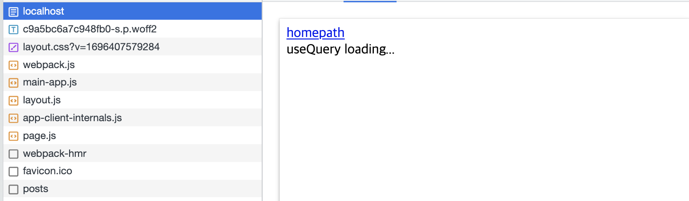
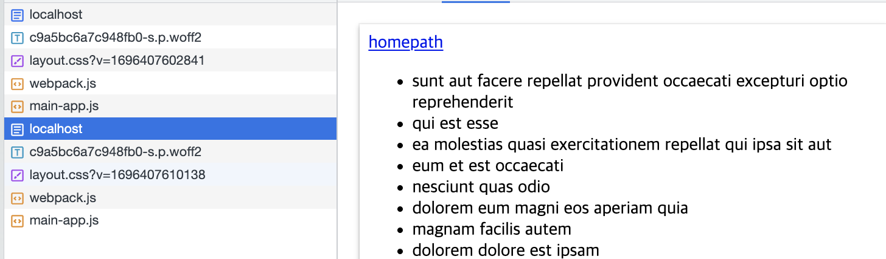
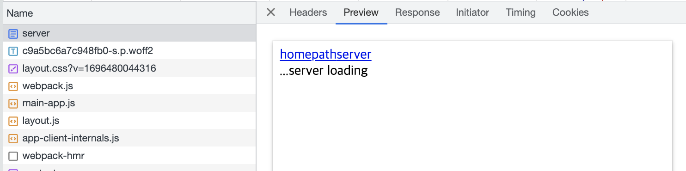
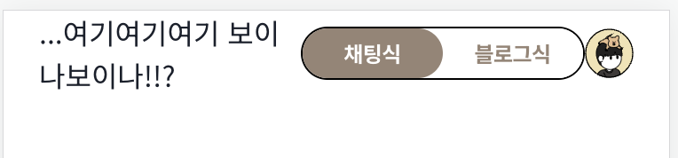

[실험 레포](https://github.com/Geuni620/suspense-fallback-ui)

> 현재 진행 중인 프로젝트에서 Nav Bar에 user의 정보를 서버로 요청한 후 반환받아 보여줘야하는 게 있다.  
> 이때 Nav Bar 내에서 useQuery로 데이터를 가져오는데, 새로고침을 하면 Suspense를 적용해서 fallback ui를 보여주고자 했다.  
> 하지만 fallback ui가 보이지 않는다. 그래서 테스트해보기 시작했다.

<br>

### 구성요소

```TSX
// app/page.tsx
'use client';

import UsequeryComp from 'app/components/UsequeryComp';
import { Suspense } from 'react';

export default function Home() {
  return (
    <Suspense fallback={<div>useQuery loading...</div>}>
      <div className="flex items-center justify-center bg-blue-500">
        <UsequeryComp />
      </div>
    </Suspense>
  );
}
```

- 먼저 root page에 client-components로 변경시켜주고, `UsequeryComp`를 Suspense로 감싸줬다.
- 여기서 `UsequeryComp`는 다음과 같이 구성했다.

```TSX
// app/components/UsequeryComp.tsx
'use client';

import { useQuery } from '@tanstack/react-query';
import { axiosPostQuery } from 'app/api/route';
import React from 'react';

import { Post } from '@/type';

const UsequeryComp = () => {
  const { data: posts } = useQuery(['posts'], axiosPostQuery);

  return (
    <ul>
      {posts.map((post: Post) => (
        <li key={post.id}>{post.title}</li>
      ))}
    </ul>
  );
};

export default UsequeryComp;
```

- 그리고 `axiosPostQuery`는 다음과 같이 구성했다.

```TSX
// app/api/route.ts
import axios from 'axios';

const wait = async (ms: number) => {
  return new Promise((resolve) => {
    setTimeout(resolve, ms);
  });
};

export const axiosPostQuery = async () => {
  await wait(3000); // 명확히 fallback ui를 확인하기 위해 wait를 걸어줬다.

  const response = await axios.get(
    'https://jsonplaceholder.typicode.com/posts',
  );
  return response.data;
};
```

- axiosPostQuery를 사용한 이유는, next.js 13 version의 fetch는 Web API인 **fetch와 조금 다르기 때문이다.**
- next.js app디렉토리에 맞게 cache 등이 포함된 확장된 [fetch API](https://nextjs.org/docs/app/api-reference/functions/fetch) 이다.
- 그래서 순수하게 cache 설정을 따로 하지 않은 axios를 설치해서 사용했다.

<br>

### 원하는 동작

- 원하는 동작은 심플하다.

> 새로고침을 할 때마다 fallback ui가 보여야한다.

- 원인을 파악할 수 없어, `react`로 동일하게 구성했었다.  
  `* react는 위 실험레포에서 branch로 분리시켜놓았다.`
- react는 새로고침할 때마다 suspesne의 fallback ui가 띄워진다.
- 하지만 next.js를 새로고침할 때마다 suspesne fallback ui를 띄우다가 어느순간엔 **즉시 데이터를 반환해버린다.**

<br>

### 원인파악 중

- 현재 원인을 계속 파악하는 중이다.
- cache 되었는게 분명하긴 한데, 어디서 어떻게 cache 된 것인지 모르겠다.
- network tab에서 `disable cache`옵션을 체크했는데도 불구하고 새로고침을 연발하다보면, 즉시 데이터를 반환한다.
- 의아해서 Nav Bar를 만들고 페이지 라우팅을 시켜보았는데, 페이지 라우팅을 시키면 Suspense의 fallback UI가 돌기시작한다.

<br>

### Network tab 확인하기

network tab의 `throttling`도 걸어보고, `disable cache`도 적용해보았는데,  
이번엔 **localhost로 가져오는 HTML를 확인**해보기로 했다.

왜냐하면, 서버컴포넌트는, 서버에서 HTML를 그려서 가져올테니까, 데이터 fetching이 끝나지 않았다면, Suspense가 컴포넌트를 그리다가 중단하고 다른 컴포넌트부터 그리게 되고,  
컴포넌트가 다 그려지면 다시 Suspense로 돌아와서 해당 데이터가 resolve 되었는지 확인한다.  
resolve 되지 않았다면 fallback ui를 보여줄 것이다.  
[위 내용은 이전 블로그 글에서 작성한 내용이다.](https://geuni620.github.io/blog/2023/9/8/useQuery%20vs%20userQuery+Suspense/#%EC%97%AC%EA%B8%B0%EC%84%9C-%EC%9E%A0%EA%B9%90%EB%A7%8C)

<br>

그럼 fallback ui인 loading이라고 찍혀있어야하지 않을까?



- 위 이미지 처럼 fallback ui가 잘 보여지는 것을 확인 할 수 있다.

<br>



- 새로고침을 하면 데이터가 caching되어 fallback ui를 보여주지 않는다.

<br>

### 서버 컴포넌트는?

- 위의 테스트는 클라이언트 컴포넌트를 테스트해본 것이다.
- 그럼 서버컴포넌트도 동일하게 suspense로 감싸줬을 때 fallback ui를 잘 띄워줄까?

```TSX
// app/server
import { Suspense } from 'react';

import UseServerComp from '../components/server/UseServerComp';

export default function Home() {
  return (
    <>
      <Suspense fallback={<div>...server loading</div>}>
        <div className="flex items-center justify-center bg-yellow-400">
          <UseServerComp />
        </div>
      </Suspense>
    </>
  );
}

// app/components/server/UseServerComp.tsx
import { Post } from '@/type';

import { serverPostQuery } from '../../api/route';

const UseServerComp: React.FC = async () => {
  const posts = await serverPostQuery();

  return (
    <>
      <ul>
        {posts.map((post: Post) => (
          <li key={post.id}>{post.title}</li>
        ))}
      </ul>
    </>
  );
};

export default UseServerComp;
```

- 위와 같이 server components를 구성해줬다.
- 똑같이 network tab에서 이미지



- 동일하게 첫 로딩시 Suspense가 잘 돌기 시작한다.
- 하지만, 위의 useQuery + Suspense를 감싸줬을 때와는 다르게 새로고침할 때마다 fallback ui가 잘 보인다.

<br>

### 결론

- 결국 **next.js app directory는 client components / server components 모두 suspense를 지원한다.**
- 하지만 client components 중 useQuery + Suspense는 cache Time을 0으로 설정해줬어도, cache 되어서 새로고침했을 때 바로 데이터를 반환하는 경우가 있다.
- 이럴 경우에 새로고침할 때마다 loading fallback을 보여주려면 다음과 같이 구성해주면 된다.

```TSX
'use client';

// import UsequeryComp from 'app/components/UsequeryComp';
import dynamic from 'next/dynamic';
import { Suspense } from 'react';

const UsequeryComp = dynamic(() => import('./components/UsequeryComp'), {
  ssr: false,
  loading: () => <div>useQuery loading...</div>,
});

export default function Home() {
  return (
    <>
        <div className="flex items-center justify-center bg-blue-500">
          <UsequeryComp />
        </div>
    </>
  );
}
```

- 위와 같이 구성해주면 dynamic import 내 Suspense가 포함되어있어 loading fallback을 새로고침할 때마다 보여줄 수 있었다.
- 하지만 useQuery + Suspense를 사용하면 새로고침 연발하다가 어느순간 cache 된 데이터를 즉시 반환한다.
  - `이게 원인이 무엇인지 모르겠다. ㅠㅠ, cache 된 거 같은데, query가? next가? 어떻게 cache 된 건지 원인을 모르겠다.`

<br>

### 번외

> 맨 처음 '이때 Nav Bar 내에서 useQuery로 데이터를 가져오는데, 새로고침을 하면 Suspense를 적용해서 fallback ui를 보여주고자 했다.'에 대한 원인은 다음과 같다.

- next-auth를 통해 useSession hooks으로 user의 email을 가져와서 api 요청시 params에 넣어 함께 요청을 보낸다.
- 이때 다음과 같이 useQuery를 설정했다.

```TSX
export const useUserInfoGetQuery = (userEmail: string | undefined) => {
  const userInfo = useQuery(
    [...userManagerKeys.userInfo, userEmail],
    () => getUserInfo(userEmail),
    {
      enabled: !!userEmail, // enabled
    },
  );

  return { userInfo: userInfo.data, isLoading: userInfo.isLoading };
};
```

- 주석으로 표시해두었듯이, useEmail이 존재할 때만 useQuery가 api를 요청한다.
- 즉, userEmail 또한 session에 userEmail을 가져와서 요청을 보내야한다.
- Suspense로 감싸줬다 한 들, userEmail이 없다면 Suspense가 돌지 않는다.
- 아마 이것 때문이었던 것 같다. userEmail이 없는 상태라서 useQuery가 돌지 않았다.
- 그래서 Nav 요청을 보낼 때 userEmail을 mocking으로 넣어주고 테스트를 진행했다.



확인결과 enabled 때문에 useQuery가 돌지 않았던 게 맞았다.

<br>
