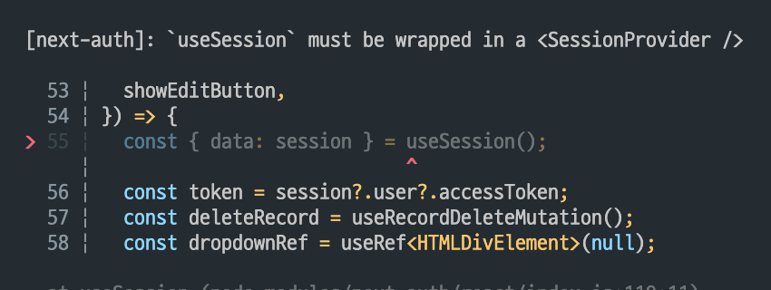
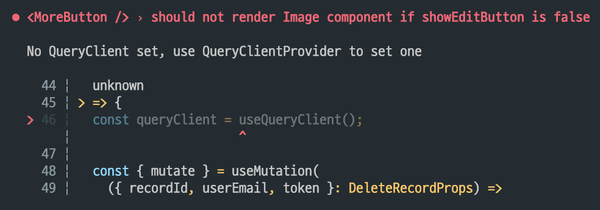

> 기록이 서비스에서 첫 번째 기록은 인트로를 진행할 때 작성하게 된다.  
> 첫 기록은 수정과 삭제가 불가능하게 하자고 권했고 받아들여져서 수정해주었다.  
> 메시지 내에서 첫 기록일 경우, DB에 isFirstRecord를 true로 저장하였고, query로 받아와서 뿌려줬다.  
> 뿌려줄 때 isFristRecord라면 MoreButton이 보이지 않도록 처리했다.  
> Test code도 작성해주면 좋겠다는 생각에 적용했다. 하지만 다음과 같은 에러 메시지가 떴다.



기록이 서비스에 로그인을 구현할 때 next-auth를 사용했다.  
next-auth는 내부적으로 contextAPI를 사용하는 듯하고 (명확하지 않다. 추측일 뿐이다.), 이로인해, Provider를 감싸주어야한다.

유닛테스트의 경우 최대한, 순수하게 작성해줘야했으나, 컴포넌트 테스트의 경우, Provider까지 고려해야하는 것 같다.
그래서 단순히, 테스트코드 내에서 Provider로 감싸주면 되는 줄 알았다.

```TSX
// 잘못된 방식
describe('<MoreButton />', () => {
  it('showEditButton이 true일 경우, MoreButton이 렌더링되어야 한다.', () => {
    const props = {
      //...
    };

    render(
  <SessionProvider>
        <MoreButton {...props} />
      </SessionProvider>,
    );
    const imageElement = screen.getByAltText('more-btn');
    expect(imageElement).toBeInTheDocument();
  });
});
```

- 이렇게 했을 때 두 가지 에러가 났는데, 첫 번째는 여전히 `useSession`에 관한 에러이고, 두 번째는 `useQuery`에 관한 에러였다.
- useQuery 역시, Provider를 감싸주어야한다. 그래서 이번에도 단순히, QueryProvider를 감싸주면 되는 줄 알았다.

<br>

하지만 문제는 해결되지 않았다. 그래서 크게 두 가지를 해결해야겠다.

1. next-auth provider
2. tanstack-query provider

<br>

그리고 번외로, API Mocking 테스트를 할 때, `MSW`를 쓰는 경우를 블로그에서 많이 봤다.  
그래서, **MSW도 필요한 건가?** 염두만 해둔 채, 위 두 가지부터 해결하려고 했다.

<br>

### next-auth provider

next-auth 공식문서, 또는 next-auth github의 issue 탭부터 찾아보고 검색해보는 편인데, 이번엔 Discussions에서 발견했다.  
사실 next-auth의 메인테이너는 MSW를 권하는 댓글을 달았으나, 이걸 적용해서 어떻게 테스트한다는 건지 이해하진 못한 상태였다.

[How to mock useSession with v4? #4185](https://github.com/nextauthjs/next-auth/discussions/4185)  
Discussion에서 발견한 글은 위와 같다.  
Mocking을 하는 방법이 었는데, 예시를 다음과 같다.

```TSX
jest.mock("next-auth/react", () => {
  const originalModule = jest.requireActual('next-auth/react');
  const mockSession = {
    expires: new Date(Date.now() + 2 * 86400).toISOString(),
    user: { username: "admin" }
  };

  return {
    __esModule: true,
    ...originalModule,
    useSession: jest.fn(() => {
      return {data: mockSession, status: 'authenticated'}
    }),
  };
});
```

- 말그대로 useSession으로 제공받을 데이터를 mockSession으로 제공하는 것이었다.
- 이를 적용하니, useSession에 관한 에러는 해결할 수 있었다.

<br>

### Tanstack-query provider



두 번째 에러를 만나고, 가장 먼저 떠올랐던 글은 공식문서도 아닌, TkDodo의 [Testing React Query](https://tkdodo.eu/blog/testing-react-query) 글이었다.
위 글에선 어떻게 테스트를 작성하는지, 소개해주는데 나의 경우엔 이 글을 읽고, 실천방안으론, react-query 수업을 들었던 유데미의 [React Query : React로 서버 상태 관리하기](https://www.udemy.com/course/react-query-react/)의 강의를 다시 참고했다.

<br>

```TSX
// test-utils.tsx
import { QueryClient, QueryClientProvider } from '@tanstack/react-query';
import { render, RenderResult } from '@testing-library/react';
import { ReactElement } from 'react';

const generateQueryClient = () => {
  return new QueryClient();
};

export function renderWithQueryClient(
  ui: ReactElement,
  client?: QueryClient,
): RenderResult {
  const queryClient = client ?? generateQueryClient();

  return render(
    <QueryClientProvider client={queryClient}>{ui}</QueryClientProvider>,
  );
}
```

- 위와 같이 `renderWithQueryClient`를 만들어주었다.
- 이 만들어준 renderWithQueryClient를 test code를 작성할 때, render를 대신해서 불러오는 것이다.

```TSX
import '@testing-library/jest-dom';
import { screen } from '@testing-library/react';
import { renderWithQueryClient } from '../../../../utils/testUtils';
import MoreButton from './MoreButton';

jest.mock('next-auth/react', () => {
  const originalModule = jest.requireActual('next-auth/react');
  const mockSession = {
    expires: new Date(Date.now() + 2 * 86400).toISOString(),
    user: { username: 'admin' },
  };
  return {
    __esModule: true,
    ...originalModule,
    useSession: jest.fn(() => {
      return { data: mockSession, status: 'authenticated' };
    }),
  };
});

describe('<MoreButton />', () => {
  it('showEditButton이 true일 경우, MoreButton이 렌더링되어야 한다.', () => {
    const props = {
      //...
    };

    // render → renderWithQueryClient
    renderWithQueryClient(<MoreButton {...props} />);
    const imageElement = screen.getByAltText('more-btn');
    expect(imageElement).toBeInTheDocument();
  });
});
```

- 이렇게 했을 때 렌더링된 쿼리 데이터를 테스트하는 것은 아니기에, 테스트는 온전히 통과하게 된다.

<br>

### 궁금증에 대한 답

처음 위 에러를 만나서 크게 궁금했던 두 가지,

1. next-auth provider
2. tanstack-query provider

는 모두 해결할 수 있었다.

번외로 궁금했던 MSW 같은 경우, 현재 나의 프로덕트에선 사용하지 않아도 될 것 같다.  
MSW를 찾아봤을 때, 결국 **서버에서 보내주는 데이터를 Mocking 해주기 위해서 사용하는 것**이다.  
즉, 백엔드 API가 온전히 완성되지 않은 상태에서, 빠르게 프론트엔드 개발자가 UI 및 기능을 완성하고, API가 필요할 때, Mocking으로 MSW를 사용하는 것 같다.

하지만 현재 나의 경우엔, 클라이언트와 서버 모두 내가 핸들링 할 수 있기 때문에, 필요하다면 서버에서 API를 뚫고, 클라이언트로 데이터를 보내주면 된다.  
즉, (아직까진) 나의 프로덕트에선 필요성을 느끼진 못했다.

<br>

### 참고자료

[Testing React Query](https://tkdodo.eu/blog/testing-react-query#for-components)  
[React Query : React로 서버 상태 관리하기](https://www.udemy.com/course/react-query-react/)
