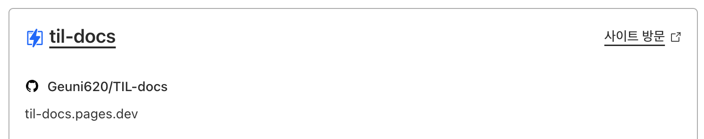

> 회사에선 AWS EC2에 배포를 한다.  
> 예전 [조직문화 블로그](https://deep.jejodo.life/)를 만들 때는, 초반 vercel을 이용했다.  
> 이전 vercel 서버리스 API 경로가 5초를 초과하면 504 게이트웨이 시간초과 오류를 응답하는데,  
> 이땐 요금제를 올려야했다.  
> 도쿠사우르스 TIL-docs는 netlify로 배포해보려고 했지만, 안해봤던 것을 해보고 싶어서 cloudflare로 배포해보기로 했다.

[CloudFlare Pages로 Next.js 서비스 배포하기](https://jojoldu.tistory.com/657)  
사실 배포방법은 위 글보다 더 자세히 쓸 자신이 없다.  
그래서 내가 쓰려고 하는 내용은,  
**main으로 merge 했을 때, github action을 이용해서 Deploy 하는 방법** 이다.

<br/>

### Github Action with Cloudflare Pages

먼저 도쿠사우르스 레포 내에 `.github/workflows/pages-deployment.yaml` 경로로 파일을 생성해줬다.  
아래와 같이 작성해주었는데,

```yaml
# main으로 merge 되었을 때 배포자동화 스크립트가 실행되었으면 좋겠다.
on:
  push:
    branches:
      - main

jobs:
  deploy:
    runs-on: ubuntu-latest
    permissions:
      contents: read
      deployments: write
    name: Deploy to Cloudflare Pages
    steps:
      - name: Checkout
        uses: actions/checkout@v3
      # Run your project's build step
      # - name: Build
      #   run: npm install && npm run build
      - name: Publish
        uses: cloudflare/pages-action@1
        with:
          apiToken: ${{ secrets.CLOUDFLARE_API_TOKEN }}
          accountId: ${{ secrets.CLOUDFLARE_ACCOUNT_ID }}
          projectName: til-docs # cloudflare workers name을 작성하면 된다.
          directory: ./ # 배포할 디렉토리를 작성하면 된다, build 파일로 경로를 지정해줘야하는 듯 했으나, 루트로 지정해주면 적용되더라
          gitHubToken: ${{ secrets.GITHUB_TOKEN }}
```



<br/>

그 다음으로 token을 발급해야한다.

<br/>

여기서 나는 시행착오를 겪었는데, 결국 cloudflare docs내에 모두 상세히 적혀있었다.

[#Get credentials from Cloudflare](https://developers.cloudflare.com/pages/how-to/use-direct-upload-with-continuous-integration/#get-credentials-from-cloudflare)

<br/>

### API Token

1. 해당 내용을 확인하면, [Cloudflare dashboard](https://dash.cloudflare.com/profile/api-tokens)를 들어간다.
2. 상단에 Create Token을 클릭한다.
3. 페이지 이동 후, 가장 하단에, Create Custom Token을 누른다.
4. User API Tokens가 뜨는데, 여기서 빨간박스 부분만 작성해 준 뒤 Continue to summary를 누른다.


5. 그리고 생성된 Token을 복사한다
6. github repo로 페이지를 이동한다
7. repo내에서 Settings > 왼쪽 탭에서 Secrets > New repository secret을 클릭한다.
8. Name와 Secret를 저장한다. CLOUDFLARE_API_TOKEN으로 Name을 지정해서 저장했다.

<br>

### Account ID

이제 나머지 한 개의 Token을 더 추가해주자.

<bf>

1. Cloudflare Wokers > overview로 이동한다.
2. 오른쪽을 확인하면 Account ID가 있다 이를 복사한다.


3. 다시 github repo로 이동한 뒤 Settings > Secrets > New repository secret을 클릭한다.
4. Name과 Secret를 저장한다. CLOUDFLARE_ACCOUNT_ID로 Name을 지정해서 저장했다.


<br>

### Github Action

- 내용을 입력한 후, main으로 merge 하거나, main에서 바로 push를 날리면 Action을 통해서 배포가 완료된다.


- 참고로 github token은 추가안해도 되는지 궁금할 수 있는데, 안해도 된다.
- github token은 github에서 자동으로 생성하는 token이다. 별도로 설정할 필요는 없었다.

<br>

### 참고자료

[CloudFlare Pages로 Next.js 서비스 배포하기](https://jojoldu.tistory.com/657)  
[Use Direct Upload with continuous integration](https://developers.cloudflare.com/pages/how-to/use-direct-upload-with-continuous-integration/)
