> 최근에 Tanstack-Table 라이브러리를 '다시' 사용하게 되었다.  
> 어드민을 개발할 때 동료분께서 도입하셨었는데,  
> 그 업무를 내가 맡게 되면서 처음 접하게 되었다.

현재 Tanstack-Table은 v8버전이며, 당시에 v7에서 v8로 업데이트된지 얼마 안되어서 공식문서를 제외한 자료를 찾기 어려웠다.  
그렇다고 공식문서가 친절한 것도 아니었다.  
(GitHub 이슈 탭을 확인해보면 '이거 좋아 근데, 예시보단 문서 좀 잘 적어줘'라는 문구를 한 번씩 접하게 된다.)

<br/>

한 날은 트위터에서 Tanstack-table을 Material-ui로 커스텀한 라이브러리인 [material-react-table](https://github.com/KevinVandy/material-react-table)의 메인테이너가 ['이 영상 추천해'](https://x.com/KevinVanCott/status/1706408044874055973?s=20)라고 올려주었다.

<br/>

'한번 봐야지..' 생각하고 있던 찰나, 써볼 일도 생겨서 영상을 보게됐고, 라이브러리가 제공해주는 기능을 사용하면서 평소 많이 듣던 '바퀴를 다시 발명하지 마라'는 격언에 크게 공감하게 됐다.  
오늘은 이 영상을 정리해보려고 한다.

<br/>

- 영상을 보면서 [부숴도 괜찮은 장난감](https://geuni620.github.io/%ED%94%84%EB%A1%9C%EA%B7%B8%EB%9E%98%EB%A8%B8%EC%9D%98%20%EA%B8%B8,%20%EB%A9%98%ED%86%A0%EC%97%90%EA%B2%8C%20%EB%AC%BB%EB%8B%A4./#%EB%B0%91%EC%A4%84-%EC%B9%9C-%EB%AC%B8%EC%9E%A5%EB%93%A4)을 만들었다. 모든 내용은 [여기](https://github.com/Geuni620/tanstack-table-v8-tutorials)에 보관되어있다.
- 당시 내가 필요했던 기능은

  1. 총 4개의 column을 가진 테이블
  2. 전체, 테이블 row 단위 체크박스
  3. Pagination 적용하기 단, 20개, 50개, 100개 Size를 선택할 수 있고, 테이블이 즉시 업데이트 되어야했다.

<br/>

## 1. 총 4개의 column을 가진 테이블

- 먼저 tanstack-table에서 [useReactTable](https://tanstack.com/table/v8/docs/adapters/react-table#usereacttable)이라는 hook을 제공해준다.
- 이 hook엔 helper function을 다양하게 제공해주는데, 필요한 것을 가져와서 사용하면 된다.

```TSX
import { getCoreRowModel, useReactTable } from '@tanstack/react-table';
import { useState } from 'react';

import DATA from '@/data';

const columns = [
  {
    accessorKey: 'task',
    header: 'Task',
    cell: (props) => <p>{props.getValue()}</p>,
  },
  {
    accessorKey: 'status',
    header: 'Status',
    cell: (props) => <p>{props.getValue()?.name}</p>,
  },
  {
    accessorKey: 'due',
    header: 'Due',
    cell: (props) => <p>{props.getValue()?.toLocaleTimeString()}</p>,
  },
  {
    accessorKey: 'notes',
    header: 'Notes',
    cell: (props) => <p>{props.getValue()}</p>,
  },
];

export const Table: React.FC = () => {
  const [data, setData] = useState(DATA);

  //  useReactTable
  const table = useReactTable({
    data,
    columns,
    getCoreRowModel: getCoreRowModel(),
  });

  return (
    <table>
      <thead>
        {/* Table 헤더 */}
        {table.getHeaderGroups().map((headerGroup) => (
          <tr key={headerGroup.id}>
            {headerGroup.headers.map((header) => (
              // 여기는 변경해야함!
              <th key={header.id}>{header.column.columnDef.header}</th>
            ))}
          </tr>
        ))}
      </thead>
    </table>
  );
};
```

```TSX
// data
{
  task: 'Add a New Feature',
  status: STATUS_ON_DECK,
  due: new Date('2023/10/15'),
  notes: 'This is a note',
},
```

- `task`, `status`, `due`, `notes`는 `accessorKey`로 사용된다.(위 columns에 작성되어있는 부분)
- `getCoreRowModel`은 테이블의 row를 구성하는데 필요한 기본적인 정보를 제공해준다.
- 'th' 태그에서 `header.column.columnDef.header`를 넣어주었는데, 지금은 헤더를 잘 렌더링 하는 듯 보이지만, 변경해줘야한다.

<br>

- 이를 위해 `flexRender`라는 유틸리티를 import 시켜준다.
- 그 이유는, cell이 jsx를 반환하고 있다.

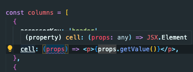

- 이를 `flexRender`함수로 감싸주면, jsx를 반환하는 cell을 렌더링 할 수 있다.

수정해보면 다음과 같다.

```TSX
const columns = [
  //...
];

export const Table: React.FC = () => {
  const [data, setData] = useState(DATA);
  const table = useReactTable({
    //...
  });

  return (
    <table>
      <thead>
        {/* Table 헤더 */}
        {table.getHeaderGroups().map((headerGroup) => (
          <tr key={headerGroup.id}>
            {headerGroup.headers.map((header) => (
              <th key={header.id}>
              // flexRender로 감싸주었다.
                {flexRender(
                  header.column.columnDef.header,
                  header.getContext(),
                )}
              </th>
            ))}
          </tr>
        ))}
      </thead>

      // cell 또한 header와 유사하다
      <tbody>
        {table.getRowModel().rows.map((row) => (
          <tr key={row.id}>
            {row.getVisibleCells().map((cell) => (
              <td key={cell.id}>
                {flexRender(cell.column.columnDef.cell, cell.getContext())}
              </td>
            ))}
          </tr>
        ))}
      </tbody>
    </table>
  );
};
```

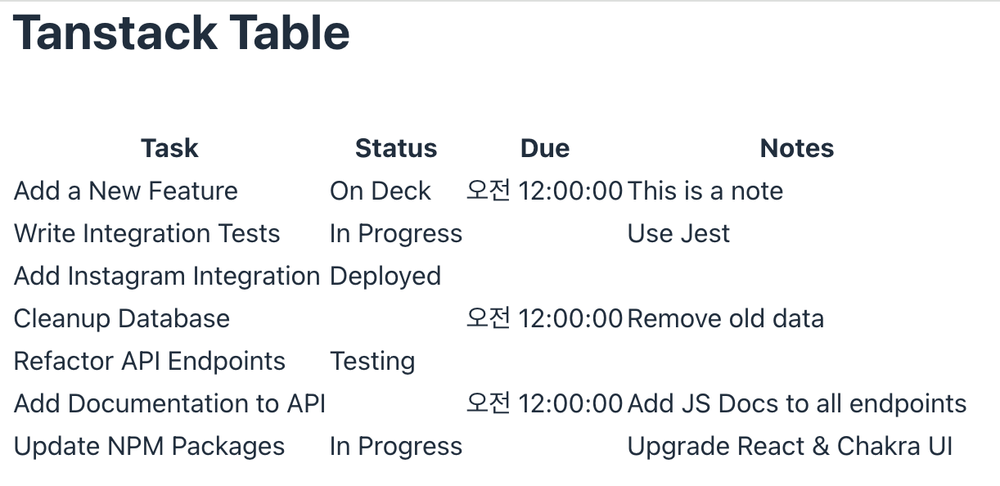

<br/>

### 🤔 간격을 맞춰보자.

- 첫 번째 목표(4개 컬럼을 렌더링하기)는 이룬 듯 하지만, 간격(cell의 width)이 맞지 않는 듯하다.
- tanstack-table에서는 [getTotalSize](https://tanstack.com/table/v8/docs/api/features/column-sizing#gettotalsize)라는 이름을 가진 helper function을 제공해주는데  
  이를 적용해보면,

```TSX
export const Table: React.FC = () => {
  //...

  return (
    // table의 width를 getTotalSize()로 조정해준다.
    <table style={{ width: `${table.getTotalSize()}px` }}>
      <thead>
        {/* Table 헤더 */}
        {table.getHeaderGroups().map((headerGroup) => (
          <tr key={headerGroup.id}>
            {headerGroup.headers.map((header) => (
              <th
                key={header.id}
                style={{
                  // header의 column의 size를 가져와서 width를 조정해준다.
                  width: `${header.getSize()}px`,
                }}
              >
                {flexRender(
                  header.column.columnDef.header,
                  header.getContext(),
                )}
              </th>
            ))}
          </tr>
        ))}
      </thead>

      <tbody>
        {table.getRowModel().rows.map((row) => (
          <tr key={row.id}>
            {row.getVisibleCells().map((cell) => (
              <td
                key={cell.id}
                style={{
                  // cell의 column의 size를 가져와서 width를 조정해준다.
                  width: `${cell.column.getSize()}px`,
                  textAlign: 'center',
                }}
              >
                {flexRender(cell.column.columnDef.cell, cell.getContext())}
              </td>
            ))}
          </tr>
        ))}
      </tbody>
    </table>
  );
};
```

- `getTotalSize()`와 `header.getSize()`, `cell.column.getSize()`를 사용해서 간격을 맞춰주었다.

```TSX
const columns = [
  {
    accessorKey: 'task',
    header: 'Task',
    cell: (props) => <p>{props.getValue()}</p>,
    size: 250,
  },
  {
    accessorKey: 'status',
    header: 'Status',
    cell: (props) => <p>{props.getValue()?.name}</p>,
    size: 100,
  },
  {
    accessorKey: 'due',
    header: 'Due',
    cell: (props) => <p>{props.getValue()?.toLocaleTimeString()}</p>,
    size: 100,
  },
  {
    accessorKey: 'notes',
    header: 'Notes',
    cell: (props) => <p>{props.getValue()}</p>,
    size: 300,
  },
];
```

- width를 커스텀하게 변경시킬 수도 있는데, 간단히 column에 `size property`를 추가해주면 된다.
- 나의 경우엔 셀의 데이터가 두 줄로 변환되는 것을 원하지 않았고, 한 셀에 한 줄로 표현되길 원했다.
- size를 추가해서 각각 cell의 width 값을 조정해주었다. 최대 800px로 고정시켜놓은 상태에서, size를 모두 합하면 750px이지만, 비율만큼 tanstack-table이 알아서 조정해준다.

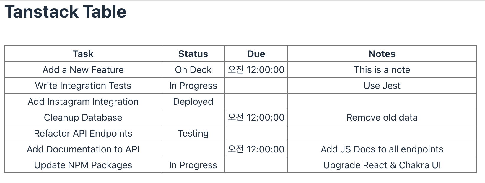

<br/>

## 2. 전체, 테이블 row 단위 체크박스

- 이 다음엔 전체/테이블 row 단위 체크박스를 만들어보자.

```TSX
const columns = [
  {
    id: 'select',
    header: ({ table }) => (
      <input
        id="header-checkbox"
        type="checkbox"
        checked={table.getIsAllPageRowsSelected()} // 전체 row가 선택되었는지 확인
        onChange={table.getToggleAllPageRowsSelectedHandler()} // 전체 row를 선택/해제하는 handler
      />
    ),
    cell: ({ row }) => (
      <input
        id={`cell-checkbox-${row.id}`}
        type="checkbox"
        checked={row.getIsSelected()} // row가 선택되었는지 확인
        disabled={!row.getCanSelect()} // row가 선택 가능한지 확인
        onChange={row.getToggleSelectedHandler()} // row를 선택/해제하는 handler
      />
    ),
    size: 50,
  },
  {
    accessorKey: 'task',
    header: 'Task',
    cell: (props) => <p>{props.getValue()}</p>,
    size: 250,
  },
   //...
];
```

- 처음 column을 만들 때 사용했던 columns 변수에, select 부분을 추가해주면 된다.

<br/>

### 🤔 체크박스에 row를 체크했을 때, 체크한 row는 어디에 보관되는걸까?

- 먼저, rowSelection이라는 state를 만들어주었다.
- 그리고, tanstack-table에서 제공하는 useReactTable hooks내에 rowSelection을 추가해주면 된다.

```TSX
export const Table: React.FC = () => {
  const [data, setData] = useState(DATA);
  const [rowSelection, setRowSelection] = useState({});

  const table = useReactTable({
    data,
    columns,
    getCoreRowModel: getCoreRowModel(),

    // 여기에 onChange와 state를 저장해주면 된다.
    onRowSelectionChange: setRowSelection,
    state: {
      rowSelection,
    },
  });

  return (
    <table style={{ width: '100%', borderCollapse: 'collapse' }}>
    //...
    </table>
  );
};
```

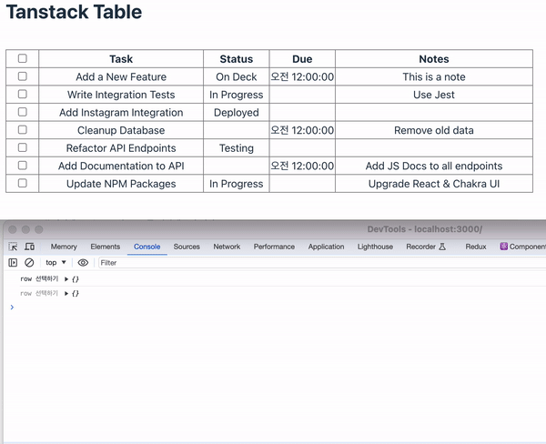

- 이렇게 하면, row를 선택할 때마다, rowSelection이라는 state에 선택한 row의 id가 저장된다.

<br/>

## 3. Pagination 적용하기

- 먼저 데이터가 너무 적어서, faker.js를 사용해서 데이터를 늘려주었다. (6개 → 100개)

```TSX
import {
  //...
  getPaginationRowModel,
} from '@tanstack/react-table';

export const Table: React.FC = () => {
  //...

  const table = useReactTable({
    data,
    columns,
    getCoreRowModel: getCoreRowModel(),
    onRowSelectionChange: setRowSelection,
    state: {
      rowSelection,
    },

    // Pagination
    getPaginationRowModel: getPaginationRowModel(),
  });


  return (
    <table style={{ width: '100%', borderCollapse: 'collapse' }}>
      <thead>
       //...
      </thead>

      <tbody>
       //...
      </tbody>

      // Pagination
      <div>
        {table.getState().pagination.pageIndex + 1} // 현재 페이지
        {table.getPageCount()} // 총 페이지 수
      </div>
    </table>
  );
};
```

- useReactTable에 `getPaginationRowModel`을 추가하면, 현재 페이지와 총 페이지 수를 알 수 있다.
- 여기서 `getPaginationRowModel`은 import 시켜서 사용하면 된다.

<br/>

- 버튼도 추가해보면,

```TSX
  <div className="mt-[10px] flex items-center justify-center gap-2">
    <button
      disabled={!table.getCanPreviousPage()} // 이전페이지가 없을 때 버튼 비활성화
      onClick={() => table.previousPage()} // 이전 페이지
    >
      {'‹'}
    </button>

    <div className="text-base font-bold">
      Page {table.getState().pagination.pageIndex + 1} of{' '}
      {table.getPageCount()}
    </div>

    <button
      disabled={!table.getCanNextPage()} // 다음페이지가 없을 때 버튼 비활성화
      onClick={() => table.nextPage()} // 다음 페이지
    >
      {'›'}
    </button>
  </div>
```

- 마지막으로 pageSize를 변경했을 때 pagination의 pageIndex가 적절히 변경되도록 해보자

  - 예를들어 총 100개의 데이터가 있는데, 20개씩 보여줄 경우 index는 1~5까지 존재
  - 100개씩 보여주려면 pageSize를 100으로 변경 → index는 1로 변경

<br/>

- 먼저 TableControls를 만들어주었다.

```TSX
const PAGE_SIZE_OPTIONS = [
  {
    value: 20,
    label: '20개씩 보기',
  },
  {
    value: 50,
    label: '50개씩 보기',
  },
  {
    value: 100,
    label: '100개씩 보기',
  },
];

  {/* TableControls */}
  <div>
    <select
      className="my-2 rounded-[4px] border-[1px] py-1 pl-2 pr-9 text-sm"
      value={table.getState().pagination.pageSize} // 현재 페이지 사이즈
      onChange={(e) => {
        table.setPageSize(Number(e.target.value)); // 페이지 사이즈 변경
      }}
    >
      {PAGE_SIZE_OPTIONS.map(({ value, label }) => (
        <option key={label} value={value}>
          {label}
        </option>
      ))}
    </select>
  </div>
```


- 잘 적용되는 것을 확인할 수 있다!

<br/>

### 🤔 초기에 pageSize를 20개로 설정하기

근데, 조금 이상하다..; 처음 테이블이 렌더링 되면 pageSize는 20개씩 보여야한다.

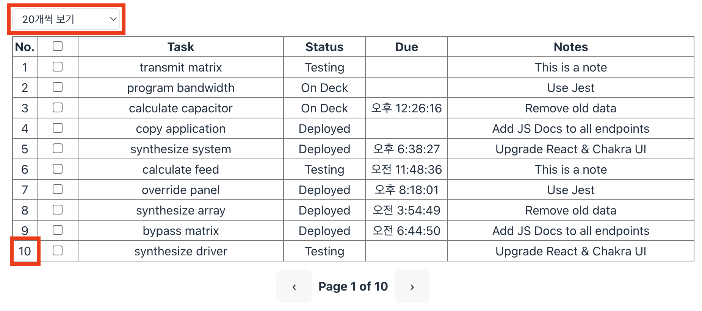

- 하지만, 20개라고 하기엔 너무 적은 것 같은데.. 🤔 → 직접 세아려보니, 10개씩 렌더링 되었다.  
  추가로 TableControls를 통해 20개를 선택해야 20개씩 보였다.
- 처음부터 20개씩 보여줄 순 없는걸까..?

```TSX
const table = useReactTable({
  data,
  columns,
  getCoreRowModel: getCoreRowModel(),
  onRowSelectionChange: setRowSelection,
  state: {
    rowSelection,

    pagination: {
      pageSize: 20, // 이렇게 추가해주면, 처음부터 20개씩 보여주지만, 컨트롤러에 의해 개수가 변경되지 않는다.
    },
  },

  getPaginationRowModel: getPaginationRowModel(),
});
```

- 영상에선 useReactTable내에서 pagination을 추가한 뒤, pageSize와 pageIndex를 커스텀 할 수 있다고 제시해준다.
- 하지만 pageSize를 20개로 넣어놓으면, 컨트롤러를 통해 개수가 변경되지 않았다. 즉, state를 통해 값을 변경해야하는 것 같다.
- 나의 경우엔 state를 추가할 필요 없이, 초기 설정될 때 20개로만 변경해주면 되는데, 이런 기능은 없는걸까?
- github issues를 찾아보니, 역시 있었다. 👏

[How to set default page size? #2029](https://github.com/TanStack/table/discussions/2029#discussioncomment-4860455)

```TSX
const table = useReactTable({
  data,
  columns,
  getCoreRowModel: getCoreRowModel(),
  onRowSelectionChange: setRowSelection,
  state: {
    rowSelection,
  },

  // initialState에 pagination을 추가해주면 된다. 초기에 몇 개씩 렌더링할 것인지 정할 수 있다.
  initialState: {
    pagination: {
      pageSize: 20,
    },
  },

  getPaginationRowModel: getPaginationRowModel(),
});
```

- initialState에 pagination을 추가하고, pageSize를 원하는 숫자로 설정해주면 된다.

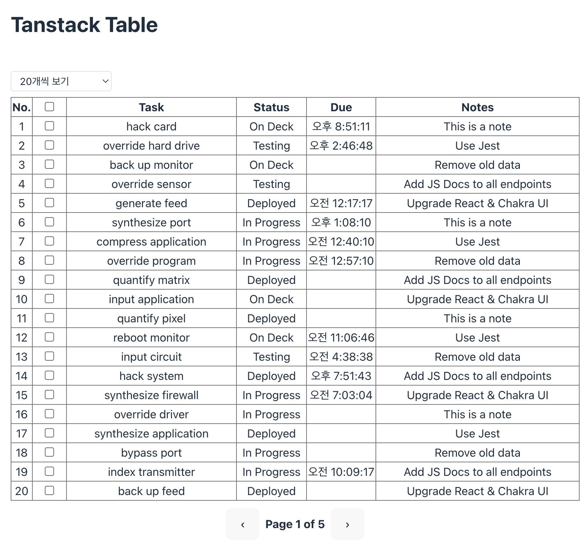

- 이제 새로고침 했을 때 20개씩 렌더링 된다~!

<br/>

## 4. Typescript 적용하기

**추가로 몇 가지만 더 정리해보자!**

- 영상에선 Javascript로 작업했지만, 타입을 추가해서 사용할 수 있다.
- 그전에 먼저, 수정하고 싶은게 한 가지 있다.
- 영상에선 columns 객체를 만들고, useReactTable에 columns를 넣어주었다.
- 나의 경우엔 영상에서 제시한 방법보단, [createColumnHelper](https://tanstack.com/table/v8/docs/guide/column-defs#column-helpers)로 만드는 걸 더 선호한다.
  - `createColumnHelper` 타입추론이 잘 되어서 따로 타입을 명시하는 것보다 효과적이라고 생각했다.
  - [소개 했던 이 영상](https://youtu.be/CjqG277Hmgg?si=8akT789D-x4p2AD-&t=1)의 가장 많은 좋아요를 받은 [Tanner Linsley](https://github.com/tannerlinsley) 댓글도 `createColumnHelper`를 사용하길 권한다.

<br/>

- 그럼 한번 변경해보자

```TSX
// column 직접 컬럼 선언
const columns = [
  {
    accessorKey: 'task',
    header: 'Task',
    cell: (props) => {
      console.log('props', props);
      return <p>{props.getValue()}</p>;
    },
    size: 250,
  },
  // ...
];


// createColumnHelper를 사용해서 컬럼 선언
const columnHelper = createColumnHelper<ColumnDataProps>();
const columns = [
    // 보통은 type을 ColumnDef<ColumnDataProps>[]과 같이 명시해주지만,
    // 명시했을 때 오히려 발생하는 에러가 더 많아서 추론되도록 하였다.
    columnHelper.accessor('task', {
      header: () => <p>Task</p>,
      cell: (info) => info.getValue(),
      size: 250,
    }),
    //...
  ];
```

- createColumnHelper에서 제공해주는 accessor를 사용해서 컬럼을 추가해주었다.

```TSX
// table과 row type은 import 시켜주었다.
import type { Row as TRow, Table as TTable } from '@tanstack/react-table';
import {
  type ColumnDef,
  //...
} from '@tanstack/react-table';

// 데이터에 관한 타입
interface Status {
  id: number;
  name: string;
}

interface ColumnDataProps {
  task: string;
  status: Status;
  due?: Date | null;
  notes: string;
}

// table & row에 관한 타입 → 체크박스를 위해 사용될 것이다.
interface TableProps {
  table: TTable<ColumnDataProps>;
}

interface RowProps {
  row: TRow<ColumnDataProps>;
}

const PAGE_SIZE_OPTIONS = [
  //...
];

export const Table: React.FC = () => {
  //...
  const columnHelper = createColumnHelper<ColumnDataProps>();
  const columns = [
    {
      id: 'select',
      header: ({ table }: TableProps) => (
        <input
          id="header-checkbox"
          type="checkbox"
          checked={table.getIsAllPageRowsSelected()}
          onChange={table.getToggleAllPageRowsSelectedHandler()}
        />
      ),
      cell: ({ row }: RowProps) => (
        <input
          id={`cell-checkbox-${row.id}`}
          type="checkbox"
          checked={row.getIsSelected()}
          disabled={!row.getCanSelect()}
          onChange={row.getToggleSelectedHandler()}
        />
      ),
      size: 50,
    },
    columnHelper.accessor('task', {
      header: 'Task',
      cell: (props) => <p>{props.getValue()}</p>,
      size: 250,
    }),
    columnHelper.accessor('status', {
      header: 'Status',
      cell: (props) => <p>{props.getValue().name}</p>,
      size: 100,
    }),
    columnHelper.accessor('due', {
      header: 'Due',
      cell: (props) => <p>{props.getValue()?.toLocaleTimeString()}</p>,
      size: 100,
    }),
    columnHelper.accessor('notes', {
      header: 'Notes',
      size: 300,
      cell: (props) => <p>{props.getValue()}</p>,
    }),
  ];

  const table = useReactTable({
    //...,
  });

  return (
  //...
  );
};
```

- props의 getValue()를 사용할 때도 이제, 뒤에 무엇이 오는지 타입으로 체크가능하다

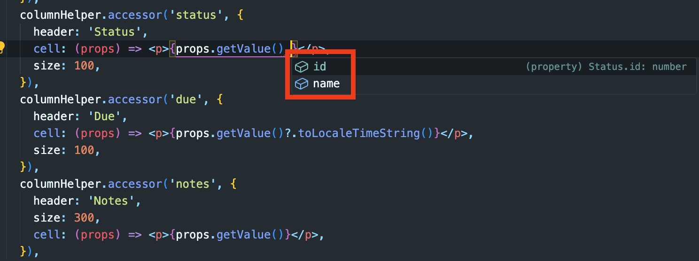

<br/>

## 5. 스타일

- 보통 css를 적용할 때, tailwind를 사용하는 편인데, 디자이너분들이 잡아주신 시안으로 어드민까지 작업하면 시간이 한 없이 딜레이되었다.
- 그래서 항상, 10%만 더 빨리 작업할 수 있는 '무언가'가 있었으면 하는 바람이었다.
- 그래던 중 우연히 [유투브에서 뜬 영상](https://youtu.be/j6-ImdZW7aM?si=Ucj2VRk4svCCFLhZ)에서 [shadcn/ui table](https://ui.shadcn.com/docs/components/data-table)과 tanstack-table을 함께 사용하면 시너지가 좋다는 말을 듣게 되었다.
- 그래서 적용해봤다. 너무 길어질 것 같아서, shadcn/ui 설치는 생략하고 table에만 적용해보려고 한다 🙏

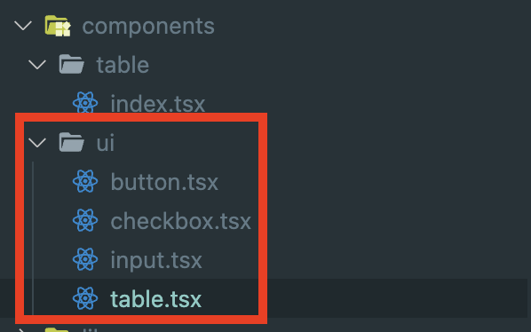

- shadcn/ui는 설치시, 패키징하여 제공하는게 아니라, 컴포넌트파일을 제공한다.
- 파일의 다운받을 수 있는 위치는, 처음 init할 때 설정해줄 수 있다.

<br/>

```TSX
import {
  Table,
  TableBody,
  TableCell,
  TableHead,
  TableHeader,
  TableRow,
} from '@/components/ui/table';
```

- 설치를 마치면, 처음 init할 때 지정된 ui 폴더에 table 파일이 생기고, 위와 같이 import하여 사용하면 된다.

<br/>

### 🤔 그럼 shadcn/ui를 적용해보자.

- 처음엔 table | thead | tbody와 같은 html 태그를 사용했는데, shadcn/ui Table을 import 시킨 후 하나씩 변경하면 됐다.

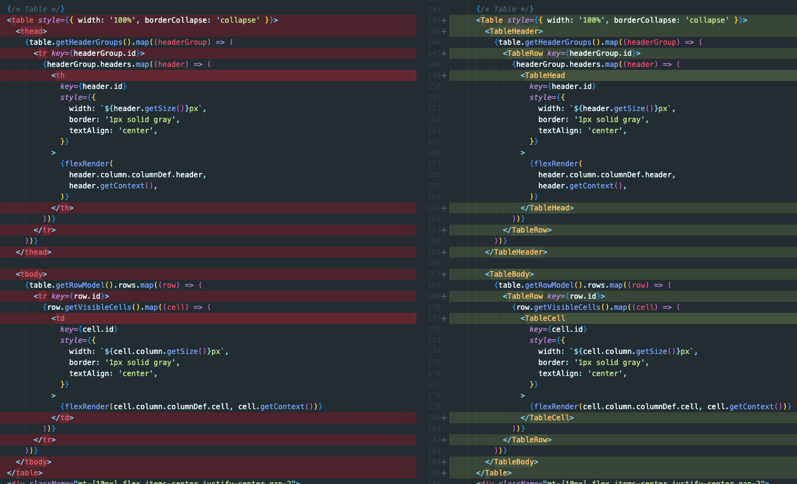

- 기본적으로 적용되어있는 스타일은, 커스텀 할 수도 있었다.
- 이는 tailwind를 사용할 때처럼, className을 사용해서 스타일을 적용하면 되는 구조다.
- shadcn/ui 공식문서에서는 [데이터 테이블을 만들 때 따라갈 수 있는 가이드](https://ui.shadcn.com/docs/components/data-table)를 제공한다. 나의 경우엔 이 가이드를 따라서 작업해보았다.

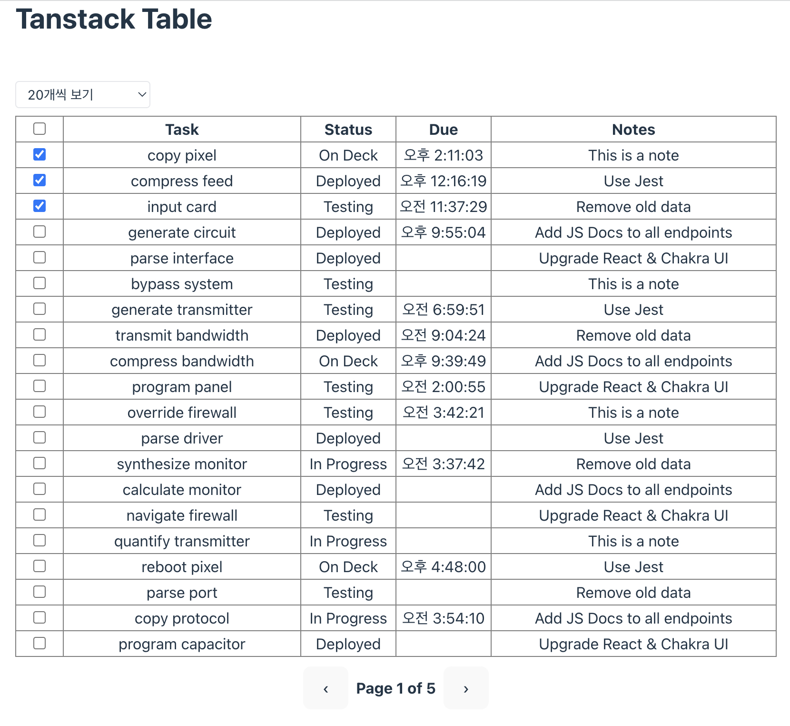

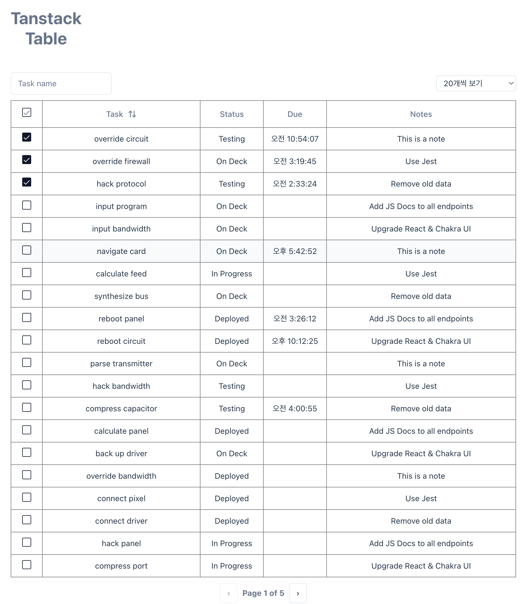

- 제공해주는 스타일에서 크게 변경한 것은 없고, 단순 import 시켜서 tag를 변경한 후, 간격이나, 텍스트크기와 같은 작은 요소를 수정해주었다.
- 그리고 영상에서 제공했던 기능도, shadcn/ui 가이드에 더 쉽게 적용할 수 있는 방법이 존재했다.  
  이 부분 역시 수정해주었다.
- 하나만 예를 들면 필터 기능을 추가할 때 영상에선 다음과 같이 제공했다.

<br/>

\*영상에서 제공하는 방법

```TSX
// 타입선언
interface Filter {
  id: string;
  value: string;
}

const [columnFilters, setColumnFilters] = useState<Filter[]>([]);

// filter 기능을 만들어줌
const taskName =
  columnFilters.find((column) => column.id === 'task')?.value ?? '';

const onFilterChange = ({ id, value }: Filter) => {
  setColumnFilters((prev) =>
    prev.filter((column) => column.id !== id).concat({ id, value }),
  );
};

// 컴포넌트에 적용
  <Input
    value={taskName}
    onChange={(e) =>
      onFilterChange({ id: 'task', value: e.target.value })
    }
  />
```

- 타입선언하고, 함수를 만들고, Input 컴포넌트에 적용했다.

<br/>

\*shadcn/ui에서 제공하는 방법

```TSX
// tanstack-table에선 ColumnFiltersState type을 제공해준다.
import { ColumnFiltersState } from '@tanstack/react-table';

const [columnFilters, setColumnFilters] = useState<ColumnFiltersState>([]);

const table = useReactTable({
    //...

    // filter 기능을 만들어줌
    getFilteredRowModel: getFilteredRowModel(),
    onColumnFiltersChange: setColumnFilters,

    state: {
      //...

      // 선언했던 state를 추가
      columnFilters,
    },
  });

// 기존에 만든 건 주석
// const taskName =
//   columnFilters.find((column) => column.id === 'task')?.value ?? '';

// const onFilterChange = ({ id, value }: Filter) => {
//   setColumnFilters((prev) =>
//     prev.filter((column) => column.id !== id).concat({ id, value }),
//   );
// };

// input 컴포넌트에 적용하기
  <Input
    value={(table.getColumn('task')?.getFilterValue() as string) ?? ''}
    onChange={(e) =>
      table.getColumn('task')?.setFilterValue(e.target.value)
    }
  />
```

- 타입은 `ColumnFiltersState`를 사용했고, useReactTable hooks에 onColumnFiltersChange를 추가해주었다.
- 그리고 table을 이용해서 간단히 Filtering을 Input 컴포넌트에 적용하면 된다.

<br/>

## 6. 마치며

- 추가로 써보고 싶던 기능이 많았는데 글도 너무 길어지고, 같은 내용의 반복이라고 생각되어 초반에 소개했던 [github repo](https://github.com/Geuni620/tanstack-table-v8-tutorials)에 정리해두었다.
- 처음 Tanstack-table을 사용할 때에 비해 확실히 쉽고, 편하게 기능을 추가할 수 있었다.
- 처음 접할 당시엔, state를 여러 개 만들어서 하나씩 상태을 관리했었는데, 그러다보니 Table 컴포넌트가 점점 뚱뚱해지는 기분이 들었었다.
- 역시, 라이브러리도 철학에 맞게 사용하는 방법이 존재한다. 뭔가 너무 어렵다거나, 복잡해지는 것은 내가 라이브러리에서 제공하는 기능을 제대로 사용하고 있지 못하고 있다는 시그널 일 수도 있겠다는 생각이 들었다.
- 이제부터 의심해봐야겠다. 뭔가 어렵다거나, 복잡하다거나, 이게 아닌거 같다는 생각이 들면 사용법을 다시 확인해보자. 분명 더 쉬운 방법이 있을 것이다. 🥲

<br/>

### 참고자료

[Tanstack-table 공식문서](https://tanstack.com/table/v8)  
[shadcn/ui 공식문서](https://ui.shadcn.com/)  
[React Table Tutorial (TanStack Table)](https://www.youtube.com/watch?v=CjqG277Hmgg&t=1s&ab_channel=NikitaDev)  
전반적인 글을 작성할 수 있게 해준 튜토리얼 영상  
[I Never Want to Create React Tables Any Other Way](https://youtu.be/j6-ImdZW7aM?si=oTjAtC7MdighbaWt)  
`5. 스타일`에서 소개했던 유튜브 영상'

<br/>

> [재사용 가능하게, Tanstack-table 사용하기](https://geuni620.github.io/blog/2024/5/19/tanstack-table-reusable/)  
> 해당 내용의 글을 쓴 뒤, 지속적으로 tanstack-table을 사용해보면서,  
> 재사용 가능한 Table 구조로 변경하는 글을 써봤어요 🙇‍♂️
