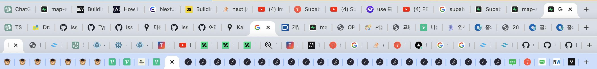
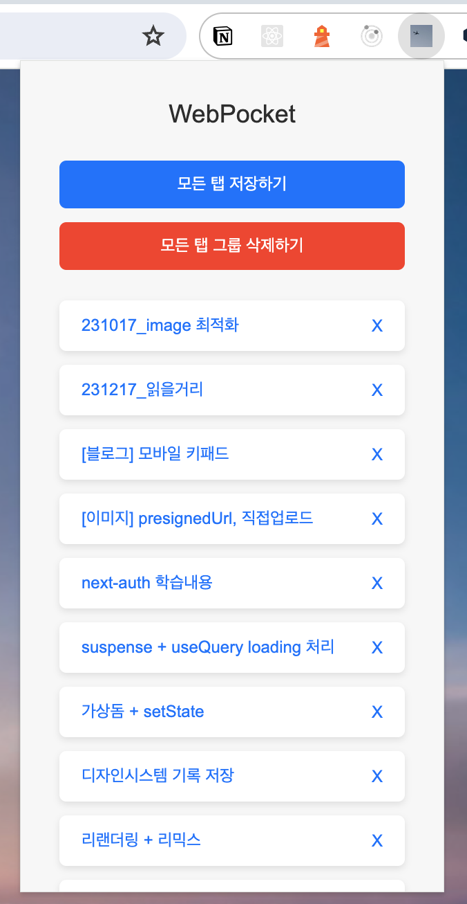
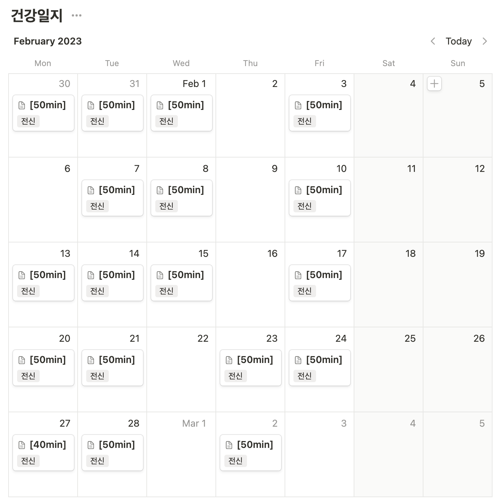

> 마음 것 일을 벌려보고, 수습은 제대로 못한 한 해

 

# 1. 내 나이만큼 책 읽기

작년에 이어 올해도 내 나이만큼 책 읽기를 도전했다. 결론부터 말하자면, 이번년도 역시 **목표를 달성하지 못했다.**
총 8권을 읽었는데, 내 나이가 8살보다 훨씬 많다는 걸 감안했을 때 공개하기 부끄러운 수준이다.
8권의 책은 다음과 같다

1. 유난한 도전
2. UX/UI의 10가지 심리학 법칙
3. 개발자의 원칙
4. 실리콘밸리에선 어떻게 일하나요
5. 일놀놀일
6. 만들면서 배우는 클린 아키텍처
7. 코끼리와 벼룩
8. 계속 가봅시다 남는 게 체력인데

 

### 1-1 크리에이터, 메이커

올해 읽은 책 중 가장 인상깊었던 책은 [코끼리와 벼룩](https://geuni620.github.io/%EC%BD%94%EB%81%BC%EB%A6%AC%EC%99%80%20%EB%B2%BC%EB%A3%A9/)이다.

 

이 책을 읽고나서, 다시 한번 나는 **'크리에이터', '메이커'가 되어야겠다고 다짐했다.**  
제품을 만드는 메이커, 콘텐츠를 창작하는 크리에이터가 되고 싶어졌다.

 

책을 읽기 전 나는, 그저 회사에서 잘 쓰일 수 있는 도구가 되길 희망했던 것 같다.  
누구나 선망하는 이름있는 대기업에 취직해서, 그 조직 꼭대기에 나의 이름 적힌 깃발하나 꽂아보는게 꿈이었다.

책을 읽으며 나라는 사람에 대해 돌아보니 회사에서 시키는 일을 하는 것보다, 내가 하고 싶고 재밌어하는 일을 하는 삶을 더 갈망한다는 것을 알게 됐다.
또한, 그런 삶을 꿈꾸며 달려오다보니, 현재 개발자라는 직업을 가지게 된 것 같기도 하다.

이 책을 읽을 당시에, 자연스럽게 그런 개발자를 찾아보게 됐고, 그런 삶을 사는 사람들을 많이 알게 됐던 것 같다.
용기가 없어 커피챗을 신청하진 못했지만, github을 팔로우하거나, 그들의 블로그에 써진 글을 읽어보며 내가 꿈꿔왔던 삶을 사는 사람을 간접적으로나마 경험할 수 있었다.
더더욱 목표가 선명해졌다.

그런 점에서 개발자는 위에서 언급한 '크리에이터', '메이커'가 되기 정말 좋은 직종이라는 생각이 들었다.  
작게 만들어보고, 링크를 공유하며 내가 만든 것을 다른 분들에게 권할 수 있으니 말이다.

커리어로 전환하기 전 개발자는 그저 직업 자체가 멋있어보였고, 개발자가 되어 일을 시작하길 바랐다면,  
현재는 크리에이터가 되고 싶고, 되기 위한 도구로 개발을 사용하려고 한다.

 

# 2. 사이드프로젝트

2023년의 중반이 지나갈 무렵부터, 기술스택을 공부하기 위해 `react`, `Next.js` 등의 공식문서를 **미리** 읽는 것보단, **필요할 때** 찾아보는게 더 효율적이라는 것을 체감했다.

물론 머리로는 이해하고 있었으나, 미리 대비하고 싶던 마음에 당시 내게 필요하지 않은 지식의 글을 읽고, 이해하지 못했던 글은 시간 들여 공부하곤 했었다.
이 모든게 나에게 하나도 도움되지 않았다고 말할 순 없겠지만, 돌아보니 **가장 빠른 성장은 무언가를 만들 때**라는 것을 깨달았다.

마침 올해부터 `ChatGPT`, `Copilot`를 알게되면서 사이드프로젝트를 시작하기 훨씬 쉬워졌다.
무엇을 만들까 고민하던 찰나, **'지금 현재 내게 가장 불편을 주는 것이 무엇일까'** 생각해보게 됐다.

 

### 2-1. Web Pocket 만들기

올해 6월부터 3D 웹사이트에 관심이 생겼다. 기획회의에 참여할 기회가 있을 때면, 만들어야하는 페이지를 3D를 활용해보고 싶다고 어필했다.
어필한 내용이 반려(?)되긴 했지만, 잔잔한 시냇물에 돌멩이를 하나 던진 것으로 만족하고 있었다.
그러던 찰나, 한 동료 디자이너분께서 3D에 관심있다며 메신저를 주셨다. 같이 강의를 들어보자며 강의도 추천해주셨다.
그렇게 모 기업의 `Three.js` 온라인 강의를 듣게 되었다.

여기서부터 불편함이 시작되었는데, 이 강의를 크롬으로 듣게 되면, **녹화감지** 기능이 동작해서 영상이 실행되지 않았다.
원인이 무엇인지 모르겠지만`(아마 크롬익스텐션 때문인 것 같기도 함)`, 크롬으로 들었을 때만 녹화가 감지된다는 경고문구가 뜨고 영상이 닫혀버렸다.  
결국 다른 브라우저를 통해서 들어야했고, 열려있던 크롬은 온전히 종료시켜야했다.

나의 경우엔 크롬 탭별로 여러 글을 띄워놓는다. 이 탭들은 기능을 개발하기 위한 글들을 모아놓은 탭일 수도 있고, 관심있던 기술스택에 관한 유익한 글들의 탭, 커리어 성장에 관한 탭 등등
주제별로 탭을 여러 개 열어놓는 편이다. (글을 쓰는 현재도 6개의 탭이 열려있다.)

이 탭을 영상을 보기위해 모두 종료시킨 뒤, 영상 시청 후 다시 여는 것은 당시 내겐 너무 불편했다.  
크롬에서 방문기록을 잘 저장해주긴 하지만, 까딱하다가 영상 시청 후 바로 탭을 복원하지 않으면 최신 기록으로 덮혀버린 방문기록을 뒤져서 찾아야했다.  
사실 바로 복원하는 것도 깜빡하고 노트북 덮고 잠들었다가 날려버린 적도 많았다.. 🤦‍♂️

 

몇 번의 탭을 날려버린 뒤, "탭들을 크롬익스텐션으로 저장할 순 없나" 하는 생각이 들었다. 만들어진 크롬익스텐션을 검색해보기도 했다.
물론 내가 원하는 기능을 하는 익스텐션이 있긴 했었지만, 한편으로 만들어보고 싶다는 생각이 들어 GPT를 열어서 만들어보기 시작했다.

 

사실 만드는 과정에서 온전히 코드를 이해했다고 볼 수도 없었다. 생각한 기능을 GPT에게 계속 요구했고, 그 기능이 잘 동작하는지, 오류가 발생하면 무엇이 오류인지만 GPT에게 알려준 뒤 다시 고쳐주길 바랐다. 그렇게 몇 일동안 GPT와 티키타카를 한 뒤, 프로젝트를 완성할 수 있었다.

이 기능 덕분에 탭이 너무 많거나, 지저분하다 싶을 때만 Pocket에 저장해두는 편이다.
한 가지 치명적인 이슈가 존재하긴 하지만, 수정방법을 찾지 못해 그냥 사용하는 중이다. 🥲  
하지만 내가 예측할 수 있는 이슈라서, 큰 불편함 없이 나만 잘 쓰고 있다. 😎  
([Arc 브라우저](https://arc.net/)에선 위 기능이 온전히 잘 동작한다는 말을 들어서 Arc를 써보려고 생각도 하고 있다.)

 

# 3. 운동

2018년 허리에 디스크가 파열되어서 한달 정도 병원에 입원했었다. 그 뒤부턴 허리는 내 몸의 가장 큰 약점이 되었다.
당시 재미를 붙였던 웨이트도 겁이나서 하지 않게 됐고, 허리에 무리가 간다는 생각이 들면 무조건 하지 않고 피하기 일수였다.

그러다가, 작년부터 정선근 선생님의 백년허리, 백년 목을 읽고 나서 조금씩 스스로 재활을 시작했었다.  
가장 먼저 했던 것은 걷기였는데, 걷기를 시작으로 맨몸운동을 섞어서 했다.  
(맨몸운동이라고 말할 것도 없는게, 그냥 꾸준히 팔굽혀펴기만 했다.)

2023년 2월부턴, 맨몸운동보단, 웨이트를 다시 시작해보려고 했다. 지하 헬스장을 등록하고, 아침 7시에 운동을 갔다가 올라와서 샤워 후 출근했다.
그렇게 주 4일은 꼭 운동을 하려고 했다.

하지만 예전처럼 웨이트에 흥미를 가지지 못했다. 아무래도 허리에 무리가 간다고 생각되면, 포기해버렸다.  
하나 더 당길 때, 끝까지 당길 때 그 맛(?)으로 웨이트를 했었는데, 무리하지 않다보니 하나, 둘 더 당길 수 있음에도 쉽게 놓아버렸기 때문이다.

 

5월부턴 결국 조깅을 하기로 했다. 퇴근 후 30~1시간 정도 꾸준히 조깅을 했다.  
조깅의 매력은 남을 이길 필요가 없다는 것이다. 그저 나와의 경쟁이다.  
뛰다보면 컨디션에 따라 어제보다 못 뛸 때도 있다. 하지만 몇 달의 기록을 돌아보면 이전의 나보다 훨씬 기록이 좋은 나를 발견한다.
이게 조깅의 매력이라고 생각했다.

 

또한, 2022년 인프콘에서 김영한님의 [어느 날 고민 많은 주니어 개발자가 찾아왔다](https://youtu.be/QHlyr8soUDM?si=0O6tkS8wMHB3Ydkf&t=2164)의 시스템에 관련된 내용을 설명해주시는 내용을 보면, 회사의 고민을 집에도 가져오지 않기 위해 운동을 하신다는 말이 인상 깊었다.

> "저는 퇴근하면 30분 정도 운동을 해요.  
> (중략)  
> 운동을 하면 저는 가비지 컬렉터가 작동해서 이걸(회사의 고민) 싹 비우더라고요."

나 역시 회사의 고민을 집으로 가져오고 싶지 않았다. 그래서 회사에서 많은 스트레스를 받은 날이면, 퇴근 후엔 집에와서 저녁 먹기도 전에 조깅을 하러 갔다.
그리고 집에 돌아와서 샤워를 하면, 퇴근 후 저녁시간을 어떻게 보낼지 머리속에 하나 둘 아이디어가 샘솟았다.
이렇게 육체적 건강은 물론, 정신적 건강도 챙기고 싶었다.

 

아쉬운 점은 10월 이후부턴 운동이 끊겨버렸다. 이래저래, 개인적인 일로 스트레스를 엄청나게 받았다. 현재는 10월에 비해 5kg가 빠졌다.
그렇게 살 빼려고 운동을 했는데, 살은 빠지지 않더니, 육체보다 정신적 스트레스로 인해 빠지는 살이 더 두드러지게 보였다. 나 스스로에게 미안하다.  
하지만 후회하지 않고 온전히 나의 선택이었다. 이는 아직 공개할 수 없기에 이쯤에서 마무리.

 

# 4. 블로그에 글 쓰기

내 개인블로그는 취업하기 전, 개발을 시작한지 얼마 안되었을 때 [인프런 강의]()를 따라서 gatsby로 만들었다. 하지만 블로그에 글을 남기기보단, [TIL](https://github.com/Geuni620/TIL)저장소에 하루하루의 빵부스러기라는 표현으로 배운 것들을 남기고, 시간이 될 때 키워드에 따라 정리하였다.  
하지만 이는 점점 더 큰 고민들로 번져갔는데, 쭉 나열하고 보니 **정리가 되지 않는다**는게 가장 큰 고민이었다.

다른사람에게 내가 공부한 내용을 공유하고 싶어도, 일자별로 기록한 나의 공부내용을 여러 링크를 통해 공유해야했다. (깔끔하지 못함)
이걸 받는 사람도 여러 링크를 탭으로 띄워야했을 것이다. 또한 키워드에 맞게 분류하였지만, 한 눈에 볼 수 있는 목차 역시 존재하지 않았다.
그리고 훗날 내가 다시 보려고 해도, 이 레포를 클록 받은 후, 검색을 통해 찾아봐야했다.

 

그래서 결국 정리를 잘하고 싶었고, 비슷한 키워드들의 내용을 뭉쳐서 잘 정제한 후 블로그에 업로드하고 싶었다.
올해는 이 작업을 시작한 한해이다. 매 달마다 인상깊게 읽은 글을 스크랩하고, 이를 블로그에 달달이 마지막 일에 업로드를 하고 있었는데, 5월부턴 개발에 관련된 공부한 내용을 업로드하기 시작했다.

 

블로그에 글을 쓰면서, 다시 한번 글을 꾸준히 쓰는(머릿속에 떠오른 유명한 글을 꾸준히 생산하는 개발자)분들이 존경스러웠다. 짧은 글이더라도 시간이 한 없이 오래걸렸다.
그래서 많은 글을 쓰고 싶다는 생각을 초반에 했었으나, 시간이 갈수록 그런 생각보단, **나도 이해할 수 있고, 다른 사람도 이해할 수 있게** 적어보려고 노력했다.

 

올해만 개발에 관련된 글을 총 42개 업로드했다.

 

이렇게 글을 쓰다보니 또 다시 한번 갈증이 생겼다. 바로, 누군가 나의 글을 읽어주었으면 하는 바람이 생긴 것이다.
초반엔 그저 내가 기록한 것을 잘 정제해서 이쁘게 정돈해둬야겠다는 다이어리 느낌이었다면, 이젠 이 글을 누군가 읽어줬으면 하는 바람이 커진 것이다.
그러던 찰나, 과거의 내가 미래의 나를 위해 글또라는 글쓰기 모임이 모집을 시작할 때 알림을 걸어둔 것이다. 평소와 다를 것 없던 하루 출근하고 메일을 확인했을 때 글또 9기 모집 메일이 와있었다. (당시 커피를 마셔서인지) 심장이 뛰었다. 그리고 주변 개발자 지인에게 공유하고 나 역시 신청할 것이라는 걸 알렸다. (그렇게 알리지 않는다면 또 흐지부지 했을 것 같다.) 다행히 [효정님]()께서 함께 신청한다고 해주셔서 현재는 효정님의 글도 재밌게 읽고 있다.

 

마지막으로 TIL레포에 저장된 글들은 Docusaurus를 통해 옮겨질 예정이다. 이번에도 키워드를 통해 정리할 예정이고, 잘 정돈한다면 블로그에 기재하려고 한다.
TIL-docs에 하루하루의 빵부스러기 남기기 → 비슷한 콘텐츠가 쌓이면, 블로그로 기재

이런 패턴을 가져가려 한다. 현재 쓰고 싶은 글들을 노션에 정리해두었는데, 벌써 키워드만 8개정도 된다. 물론 고민없이 휘갈기듯 이것도 저것도 써봐야지 하며 적긴 했지만 이러면서 글 주제에 대해 다시 한번 생각하게 되고, 더 좋은 주제를 선정할 수 있는 고민의 시작이 될 거라고 생각한다.

 

### 2024년

### TMI

실용적이고, 효율적인 것을 좋아하는 여자친구, 개발자에게 키보드는 생산성을 높여주는 도구일 수 있으나, 개발자가 아닌 그녀가 봤을 때 키보드는 그저 사치품에 불과했을 것이다.
심지어 키보드가 40만원이 넘었으니 말이다. 하지만 너무 가지고 싶었다. 이 키보드로 타자를 치고 개발을 하고 싶어, 생일 날 한번도 무언가를 사달라고 말해본 적 없는데, 여자친구에게 생일 선물로 받고 싶은게 있다고 솔직하게 말했다. 바로 해피해킹 키보드였다.

 

처음엔 키보드 하나에 이렇게 큰 돈을 들여야한다는 사실에 어이없어했지만, 내가 너무 가지고 싶어했기에, 어쩔 수 없이 사준다던 여자친구. 그 키보드는 현재 내 옆에 먼지가 쌓이고 있다.
올해는 이 키보드로 개발을 해야겠다...

 

수연유도제

돌아보니, 참 다사다난한 삶을 살았던 것 같다. 좋아했던 전공 잘 살려서 자부심가지고 일했던 첫 회사를 뒤로한채, 1년간 공공기관을 준비했고, 개발자로 커리어를 전환했다.
그 과정에서 스스로에게 수 많은 의심을 품었다. '내가 할 수 있을까?' '그 만큼 될까?' '갈 수 있을까?' '해낼 수 있을까?' 등등의 고민들,
그런 고민들은 새벽에 파도처럼 밀려왔다. 잠을 못자고 불면증이 생겨버렸다. 우연히 약국에서 수면유도제를 구입하시던 손님을 보고, 나 역시 수면 유도제를 따라 구입했다.
그렇게 21년부터 꾸준히 수면유도제를 먹고 잠에 들었다. 그때까진 몰랐다. 지금도 그 원인은 모르지만, 한 번씩 주말이 되면 머리가 깨질 듯한 통증으로 하루를 누워서 온전히 보내야했다.
9월 쯔음 수면유도제를 끊어보겠다고 다짐하고 수면유도제 없이 잠을 자려다 3시간을 못자고 출근한 적이 있다. 차츰차츰 패턴을 맞춰갈 수 있겠거니, 생각했으나 쉽지 않았다.

 

그러다가 도둑맞은 집중력이라는 책에서 이런 문구를 보게 됐다.

(중략)

그 뒤로, 수면유도제를 끊고, 자기 전에 휴대폰도 멀리 두고 그냥 가만히 누워있었다. 하루 이틀, 그렇게 잠들다 보니 벌써 수면유도제를 끊은지 3개월이 되었다.
요즘은 1시~2시쯤 잠들고 아침 9시쯤 일어나는 삶의 패턴이 맞춰졌다. 더 이상 주말마다 찾아오던 머리가 깨질 듯한 통증도 더 이상 생기지 않는다.
