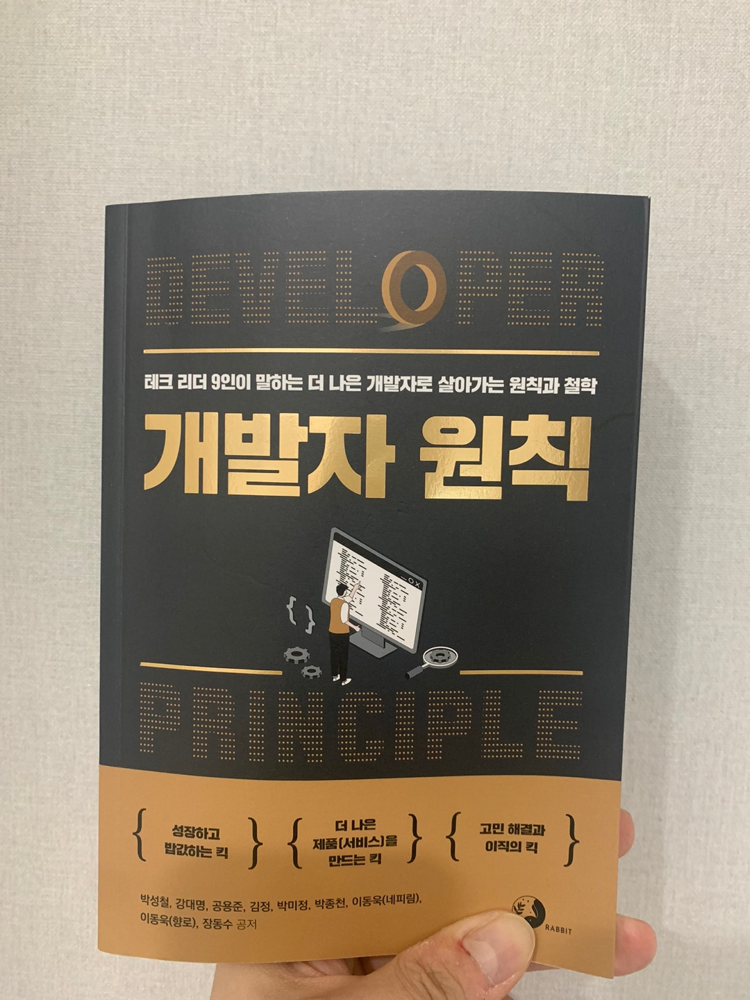

## 요약

- IT회사에서 근무하고 있는 9명의 테크 리더들이 말하는 더 나은 개발자로 살아가기 위한 원칙과 전략에 대해 소개합니다.

 

## 감상

신기하게 9명의 테크리더가 말하는 내용이 모두 달랐다.

 

책을 순서대로 읽지 읽지 않았다. 목차를 확인하고 관심이 가는 주체부터 먼저 읽었다.
이렇게 읽으니, 내가 좋아하는, 관심있는 분야가 무엇인지 명확히 알 수 있었다. 반대로 나중에 읽은 주제가 중요하지 않다거나, 관심이 없다는 의미는 아니다. 단지, 나중에 읽은 주제는 “학습”, “공부”를 병행해야한다고 생각하는 주제들이었다.

예를 들면, “커리어”, “성장”에 관심을 가졌고, “소프트웨어 디자인”, “개발자의 문제해결”에 관한 주제는 공부해야하는 주제라고 생각하며 읽었다. 실제 인터넷에 내용을 찾아보면서 읽기도 했으니 말이다.

 

나는 책을 굉장히 지저분하게 읽는다. 줄도 많이 긋고, 접어놓기도하고, 생각나는 내용을 적어놓기도 한다. 그리고 책을 돌아봤을 때 줄 그어진 부분이 많고, 접혀있는게 많을수록 꼭 정리해놓고 두고두고 보고 싶은 책들이었다.  
그런 점에서 이 책은 위에서 언급했던, 내가 관심있는 주제에 대한 내용은 한 장을 다 줄 그어놓기도 했다.

 

현재 나는 사수가 없는 회사에서 일하고 있다. 하지만 좋은 동료들이 있다. 동료들과, 그리고 앞으로 새롭게 만날 동료들을 포함해서, 이 조직을 더 나은 조직으로 만들어가고 싶다.  
이 책은 나의 바램의 방향을 정해주는 책이었다.

 

## 인상깊은 문장

1. 무엇보다 프로그래머라고 해서 프로그래밍만 잘하면 되는 것이 아니라는 것을 알게 되었습니다. 여러 사람에게 설명도 할 줄 알고 협상도 하고 계획도 세울 줄 알아야 하고 무엇보다 진행 중에 닥치게 되는 난관을 해치고 목표를 달성하며 이를 위해 여러 결정도 스스로 내릴 수 있어야 한다는 것도 배웠습니다.  
   (1. 덕업일치를 넘어서, p27)

 

2. 저는 웹을 수용하기로 한 이후로 진짜 프로그래머를 추구하던 자세를 버리고 기술 선택 기준을 바꾸어 선각 수용자 단계로 넘어 전기 다수 단계로 넘어오지 않는 (캐즘을 못 넘고 사라질 수도 있는) 기술을 실무에서 사용하지 않기로 했습니다. 그리고 그때까지 거들떠도 안 보았던 스크립팅 언어를 본업에 적극 사용하기 시작했습니다. 그 후로도 여러 새 기술을 맛보거나 학습하기는 해도 실무로 사용할 때는 엄격하게 이 기준을 적용합니다.  
   (1. 덕업일치를 넘어서, p34)

 

3. 내가 뭔가를 만들어냈다면 그 성과는 그 자체로 의미 있지 않고 원래 나에게 기대된 성과의 방향에 비추어 평가된다고 봤고 이는 결국 두 백터의 정사영에 해당했습니다. 만약 나에게 기대된 성과와 직교 방향의 성과를 냈다면 그 성과는 아무리 큰 것이라도 인정받을 수 있는 성과는 아무것도 없습니다. 심지어 마이너스 성과를 낼 수도 있다는 겁니다.  
   (1. 덕업일치를 넘어서, p40)

 

4. 개발 역량을 확보해 누구나 들어가고 싶어 하는 회사에는 제 역할이 별로 필요 없고 이미 좋은 분이 많기 때문입니다. 저는 사업에 비해서 아직 개발 역량이 떨어지고, 제가 그 부족한 부분을 채우게 되었을 때 훨씬 경쟁력이 있고 사회적으로 가치 있는 일을 할 수 있는 회사를 선택하기로 했습니다.  
   (1. 덕업일치를 넘어서, p43)

 

5. 제대로된 정보를 확인하는 최선의 방법은 소스 코드를 확인하는 겁니다.  
   (2. 오류를 만날 때가 가장 성장하기 좋을 때다, p67)

 

6. 언젠가는 익숙한 도구를 익숙하지 않은 다른 도구로 바꾸거나, 익숙한 라이브러리를 대신해서 새로운 라이브러리를 사용해야 합니다. 배워야 할 지식을 저처럼 현재 업무랑 관련된 것에 50%, 앞으로 관련될 것에 30%, 관련 없지만 관심 있는 것에 20% 정도만 시간을 투자해보세요. 개발자에게 성장은 멈춰 있는 약속 장소가 아니라, 계속해서 움직이는 사냥감에 가깝습니다. 두리번거리며 준비하다 보면 회사 업무가 나와 상관없이 변화하더라도 기회가 될 겁니다.  
   (4. 나의 메이저 버전을 업데이트하는 마이너 원칙들, p122)

 

7. 익숙한 것을 반복하면 더 오래 기억할 수 있게 되지만 성장하지는 못합니다. 성장을 위한 더 효과적인 방법은 의도적으로 낯선 환경을 만들고, 제약사항을 추가해서, 도전적이면서 살짝어렵지만 재밌는 요소를 찾아서 학습하는 겁니다.  
   (4. 나의 메이저 버전을 업데이트하는 마이너 원칙들, p128)

 

8. “내가 무언가를 잘합니다”라는 표현에는 다른 누군가보다 잘한다는 맥락이 숨어있습니다. 숨겨진 의미는 그대로 감춰둡시다. 자신을 다른 누군가와 비교하면 그 순간부터 괴로울 뿐입니다. 비교하는 대상을 다른 사람으로 향하지 말고, 스스로 내면을 향하도록 해야 합니다. 몇 시간 전에 몰랐던 것을 깨닫거나 하루 이틀 전에 작성한 코드를 개선할 점을 찾을 수 있으면 조금씩 자신만의 속도로 성장한다는 증거입니다.  
   (4. 나의 메이저 버전을 업데이트하는 마이너 원칙들, p133)

 

9. 쉽고 작은 목표를 세우는 GetThingDon(줄여서 GTD) 방법론이나 S.M.A.R.T 목표에 대해 찾아보길 권장합니다. 제가 주로 사용하는 GTD 방법은 우편함처럼 Inbox 수신함에 일감을 넣어놓고 자주 확인하면서, 장소와 맥락에 따라 큰 일보다는 작은 일부터 해치우는 방식입니다. S.M.A.R.T 목표는 자료에 따라서 약자가 조금씩 다르지만 핵심 사항은 비슷합니다. 업무나 학습과 관련되어(Relevant) 있고 달성 가능한(Achievable) 구체적인(Specific) 목표를 달성하는 기준(Measurable)을 정하고 목표 시간(Time-Boxed)을 정하라고 합니다. GTD 방식이나 S.M.A.R.T 하게 작은 목표를 세세하게 나누는 일이 처음에 어렵습니다. 개발자라면 개발 일정을 계획할 때 작은 스토리 단위를 나누는 데 익숙하지 않습니까? 평소 일감이나 학습 목표를 개발이다 생각하면 그리 어렵지 않을 겁니다. 모든 방법론이 그렇듯이 계획을 그럴듯하게 세워도 실천이 가장 중요하다는 사실에는 변함이 없습니다.  
   (4. 나의 메이저 버전을 업데이트하는 마이너 원칙들, p135)

 

10. 문제 해결 과정에서 만든 결과물에는 문제 해결 코드뿐만 아니라 개발 과정에서 이루어지는 가정, 추론, 논리적인 판단, 비교, 분류, 설득, 전달 과정이 포함되어야 합니다. 모든 것을 코드로 표현하지 않아도 됩니다. 요구사항 분석, 설계부터 테스트, 코드 리뷰 과정, 이슈 관리, 협업 과정 전체가 소프트웨어 개발 과정입니다. (중략) 부끄럽지만 제 경험을 하나 털어놓겠습니다. 스위프트 언어에서 표준 입력 readline() 함수가 동기로만 동작하는데 비동기 방식으로 사용할 일이 생겼습니다. 비동기 방식 표준 입력 함수를 누군가 만들어놓지 않았을까 싶어서 구글에 검색했습니다. 고맙게도 누군가 구현한 코드와 예제를 깃허브사이트에 올려놓은 것을 찾았습니다. 링크를 눌러 들어가봤더니 놀랍게도 2년 전에 바로 내가 작성한 코드였습니다. 과정을 전혀 기록하지 않고 코드만 기록해놓고 잊어버린 겁니다.  
    (4. 나의 메이저 버전을 업데이트하는 마이너 원칙들, p136)

 

11. 다양한 부야 전문가와 함께 일하는 다학제적 환경에 놓이게 되면 익숙한 사고 방식이 다른 분야에서는 닫혀버린 사고방식일 수도 있다는 걸 깨닫게 됩니다. 코드 리뷰뿐만 아니라 설계 리뷰처럼 동료들의 다른 의견을 듣는 것은 유연한 사고를 기르는데 도움이 됩니다. 리뷰 과정에서 나와 다른 의견이라서 남을 설득한다는 핑계로 혹은 잘잘못을 가리거나 논리적으로 독소 가득한 표현을 써서 상대를 이겨야 하는 건 아닙니다. 함께 실험을 해보거나 서로 납득할 수 있는 기준을 정해보길 추천합니다.  
    (4. 나의 메이저 버전을 업데이트하는 마이너 원칙들, p142)

 

12. 구체적으로 지식을 학습하고 코드를 작성하는 단계에서는 책이나 블로그를 보면서 따라 하는 것으로 만족하면 안 됩니다. 그건 사고하는 과정이 빠진 상태로 결과를 복사해서 붙여넣는 단순 노동일 뿐입니다. 죽은 개구리를 해부한 것처럼 펼쳐진 코드를 공부하기보다는, 직접 만들려고 시도합시다.  
    (4. 나의 메이저 버전을 업데이트하는 마이너 원칙들, p146)

 

13. 1시간 정도 둘러볼 마음의 여유가 있어야 가능합니다. 이미 마음이 조급한 상태로는 실수 자체가 괴로울 수 있습니다. 그러면 그 마음이 긍정적으로 바뀔 때까지 회복과 휴식도 필요합니다. 무작위로 아무 방향이나 시도하기보다는 실험 조건을 가정하고 결과를 예측하고 시도하고 테스트하면서 측정해서 가정이 맞는지 공학적인 반복 주기를 만들어보기 바랍니다. 그러고 나서 개선해도 늦지 않습니다.  
    (4. 나의 메이저 버전을 업데이트하는 마이너 원칙들, p146)

 

14. 내가 속한 조직 내에 기술 교류를 위한 장 만들기 시도, 업무 프로세스 개선 시도, 심지어 조직 이동 가능성까지. 하지만 조식의 오래된 관습, 경험이 부족한 나의 서툰 시도 등으로 만족할 만한 개선책을 만들어내지 못했습니다. 그렇게 두 번째 프로젝트를 마무리하고 퇴사 결심이 섰습니다. 이후 직장을 정해놓은 것은 아니지만 하루라도 빨리 더 성장할 수 있는 환경을 만나고 싶었기에 회사에 의사를 밝히고 퇴사했습니다.  
    (5. 이직, 분명한 이유가 필요해, p155)

 

15. 주니어 입장에서 기술 교류를 통한 성장만큼 나에게 중요했던 것은 내가 만드는 제품에 대한 주인의식이었습니다. “회사의 주인이 아니니 주인의식을 가질 수 없다”는 분도 있지만 개인의 성향에 따라 다를 수 있다고 봅니다. (중략) 내가 만드는 제품의 의사결정에 참여하는 겁니다. 나에게 온전한 결정권이 없더라도 의견을 낼 수 있는 환경과 작더라도 나의 의견이 반영되는 경험은 제품에 필요한 일을 자발적으로 찾게끔 만드는 중요한 요인이 됩니다.  
    (5. 이직, 분명한 이유가 필요해, p156)

 

16. 이직에서 가장 중요한 것은 기존 환경에서 책임을 다하고 마무리하는 태도라고 생각합니다. 적절한 비유일지는 모르겠지만 온전히 아름다운 이별은 없습니다. 회사와 동료를 떠나는 이별 또한 다르지 않습니다. 그럼에도 기존 환경에서 담당하던 일을 책임감 있게 마무리하고, 내가 맡고 있던 일을 이어서 수행하게 될 누군가를 위해 배려있게 정리하는 태도는 늘 필요합니다.  
    (5. 이직, 분명한 이유가 필요해, p164)

 

17. 모든 목표를 수치화해야 합니다. 경영학의 구루 피터 드러커는 “측정할 수 없으면 관리할 수 없다”고 말했습니다. 수치화해야 평가할 수 있습니다.  
    (6. 목표를 달성하는 나만의 기준, GPAM, p172)

 

18. 작은 목표가 좋습니다. 비전은 커도 되지만, 목표는 작게 그리고 단계적으로 여러 개가 있어야 합니다. 그래야 성취감을 느끼며 한 걸음씩 ‘비전에 다가갈 수 있습니다. 커다란 목표와 계획은 실패 위험이 높습니다. 목표가 작으면 계획 수립도 쉽습니다.  
    (6. 목표를 달성하는 나만의 기준, GPAM, p173)

 

19. 시장에서 원하는 것이 무엇인지 알 수 있는 최고의 방법은 실제 제품을 만들어서 출시하는 겁니다. 핵심을 담은 최소 기능의 제품을 빠르게 출시해서 사용자의 반응을 보면서 계속 개선해나가는 방식이 제일 안전하고 빠른 방법입니다. 이런 애자일 개념을 적용해 만든 제품을 최소 기능 제품(Minimum Viable Product, MVP)이라고 하며, 많은 회사가 활용하고 있습니다.  
    (6. 목표를 달성하는 나만의 기준, GPAM, p178)

 

20. 그분들은 A 코드와 B 코드 중 현재 상황에 더 적합한 코드를 판별하는 기준과 원칙이 있어 고민 없이 곧바로 선택합니다. 기준과 원칙에 따라 빠르게 결정을 내리면, 정말 중요한 설계와 선택이 필요할 때 더 깊게 사고할 수 있는 시간을 확보하고 사용하게 됩니다.  
    (8. 제어할 수 없는 것에 의존하지 않기, p208)

 

21. 큰 회사에 다녔던 제가, 여기 있는 분에게 스타트업에서 일하는 것의 장점을 이야기하면 내로남불처럼 느껴질 수 있습니다. 확실하게 이야기할 수 있는 것은 전 직장은 제가 입사할 때까지만 하더라도 수 많은 스타트업 중 하나였습니다. 퇴사하는 시점에 빅테크가 되고 있고, 그러다 보니 빅테크의 퇴사자가 된 것뿐입니다. 제가 폭발적으로 성장할 수 있던 것은 스타트업이었던 조직이 빅테크로 성장하는 그 과정을 그대로 겪었기 때문입니다. 여기 계신 분들도 그 경험을 꼭 했으면 좋겠습니다.  
    (8. 제어할 수 없는 것에 의존하지 않기, p223)

 

22. 제어할 수 없는 것에 집중하다 보면 그 무엇도 해결하지 못할 수 있습니다. 제어할 수 있는 것에 의존하고 집중해야만 어떤 일과 상황을 만나더라도 앞으로 전진할 수 있습니다. 제어할 수 있는 것과 제어할 수 없는 것을 구분한 뒤 제어할 수 없는 것을 멀리하고, 제어할 수 있는 것에 집중하면 됩니다.  
    (8. 제어할 수 없는 것에 의존하지 않기, p225)

 

23. 개발자는 컴퓨터 소프트웨어를 이용해서 문제를 해결하는 사람입니다. 문제를 해결하는 코드를 만드는 일을 합니다. 딱딱하게 표현하면 “요구사항을 충족하라”로 말할 수 있습니다. 조금 더 편한 표현으로 “제대로 동작하는 코드를 만들자”라고 할 수 있겠죠. 동작하지 않으면 쓸모가 없습니다.  
    (9. 달리는 기차의 바퀴를 갈아 끼우기, p231)

 

24. 일관성 있는 코드가 읽기 좋습니다. 일관성은 없지만 사전적 의미에 더 잘 맞는변수 이름보다는 뜻이 안맞더라도 규칙이 일관된 변수 이름이 좋습니다. (중략) 영어 단어의 뜻을 제대로 살리겠다고 새로 만든 코드에만 sinc/until을 사용하는 것은 더 바른 영어일지는 모르지만 더 좋은 코드는 아닙니다. since/until을 쓰고 싶다면 기존 코드에 있는 from/to도 모두 since/until로 바꿔야 합니다.  
    (9. 달리는 기차의 바퀴를 갈아 끼우기, p233)

 

25. 짧은 코드가 읽기 좋습니다. 함축적인 코드보다는 명시적인 코드가 읽기 좋습니다. 단순 명료한 코드가 읽기 좋습니다. 코드가 없으면 버그도 없겠지만, 월급도 없습니다. 코드의 양으로 평가를 하는 조직이라면 미련 없이 떠나야 하고, 그렇지 않다면 코드를 짧게 작성하도록 노력합시다. 코드가 늘어나는 PR보다 줄어드는 PR이 좋습니다. 삭제해야할 코드를 코멘트로 감싸서 남겨두지 마세요. 버전 관리 시스템이 잘 보관하고 있고, 필요하면 언제든지 복구할 수 있으니 과감히 삭제하세요.  
    (9. 달리는 기차의 바퀴를 갈아 끼우기, p234)

 

26. 좋은 코드는 유연성이 있습니다. 그러나 유연성이 있고 어려운 코드보다는 유연성이 없더라도 쉬운 코드가 더 좋은 코드입니다. 유연성에는 추상화가 필요합니다. 유연성을 위해서 시작한 추상화가 재사용성과 잘못 만나면 “추상화의 함정”에 빠지게 됩니다. 개발자들만 걸리는 직업병이자 난치병입니다. 막 중급에서 벗어나 고급으로 올라서려는 개발자(대개 7~10년차)들에게 자주 발생하는데, if문을 극단적으로 배제하고, Factor를 과도하게 사용하고, 클린 코드와 SOLID를 숭배합니다. 클린 코드와 SOLID는 좋은 출발점입니다. 그러나 그것이 전부는 아닙니다. SOLID는 도구 일 뿐 목표가 아닙니다. 클린 코드도 부수효과일 뿐 목표가 아닙니다.  
    (9. 달리는 기차의 바퀴를 갈아 끼우기, p236)

 

27. 부채 청산의 시작은 자동화된 테스트를 확보하는 겁니다. 테스트 작성이 어렵다면 명백한 기술 부채입니다. 이때도 먼저 구현 코드와 무관한 E2E 테스트를 작성하고, 이를 기반으로 단위 테스트가 가능한 코드로 천천히 조금씩 리팩터링해나가야 합니다. 처음부터 테스트 커버리지에 집착하면 끝까지 갈 수 없습니다. 시스템 전반에 걸쳐 테스트를 확보하는 것이 중요합니다. 자동화된 테스트가 확보되면 한 숨 돌릴 수 있습니다. 관리 가능한 부채가 되는겁니다.  
    (9. 달리는 기차의 바퀴를 갈아 끼우기, p241)

 

28. 바퀴를 다시 발명하는 일의 또 다른 좋은 점은 바퀴를 더 잘 알게 된다는 점입니다. 처음부터 잘 굴러가는 완벽하게 둥근 바퀴를 만들려고 하지 마세요. 일단 굴러가는 바퀴를 만들어야 합니다. 굴러간다고 그만두면 안됩니다. 어떻게 하면 더 잘 굴러갈지 끊임없이 고민해야 합니다. (중략) 모든 것을 다시 발명할 필요는 없습니다. 지금의 나를 지탱하는, 미래의 나를 지탱할 기술이라면 한번 쯤은 시도해볼 만한 가치가 있습니다. 웹으로 먹고 사는 개발자라면 웹 서버를 만들어보면 어떨까요? 처음부터 엔진엑스를 넘어서는 것을 목표로 삼을 필요는 없습니다. 아파치는 1997년 처음 출시되었고, 엔진엑스는 2004년에 출시되어 2021년 처음으로 아파치를 넘어섰습니다. 직접 만든 웹 서버가 그런 웹 서버가 될 가능성은 거의 없겠지만, 그 과정을 통해서 배우는 지식과 경험은 스택오버플로나 책을 통해서는 절대 배울 수 없는 것들입니다.  
    (9. 달리는 기차의 바퀴를 갈아 끼우기, p245)

 

29. 바퀴를 다시 발명하는 일은 결과보다는 과정에 더 큰 가치가 있습니다. 현실 세계에서는 과정보다 결과가 중요하고, 바퀴를 다시 발명할 기회는 좀처럼 없습니다. 기회가 오면 놓치지 말고, 기회가 없으면 만들어야 합니다. 혹시라도 기회가 주어지면 먼저 굴러가는 바퀴를 만들어야 합니다. 더 잘 굴러가는 바퀴를 만드는 것은 그다음입니다. 굴러가는 바퀴를 만드는 일이 (지금의) 밥값을 하는 일이라면, 더 잘 굴러가는 바퀴를 다시 발명하는 과정은 (미래의) 몸값을 만드는 일입니다.  
    (9. 달리는 기차의 바퀴를 갈아 끼우기, p246)

 

30. 문학적 글쓰기는 타고난 재능이 중요한 예술이지만, 논리적인 글쓰기는 훈련으로 향상할 수 있는 “기능”이라고 했습니다. 논리적인 글쓰기에 도움이 되는 훈련 방법을 제시하면서 많이 읽고, 많이 쓰라고 강조합니다. 코딩은 극단적인 형태의 논리적인 글쓰기입니다. 코딩도 글쓰기와 비슷해서 코딩을 잘하려면 코드를 많이 읽고, 많이 쓰고, 많이 생각해야 합니다.  
    (9. 달리는 기차의 바퀴를 갈아 끼우기, p246)

 

31. 코드 리뷰에는 소극적이면서 코딩을 잘하고 싶어 하는 개발자들이 있습니다. 많이 읽지 않고도 잘 쓰는 것은 불가능합니다. 아무것도 안 읽는 ㄴ것보단 뭐라고 읽는 게 좋습니다. 기왕 읽는 거라면 좋은 코드를 읽는게 좋습니다. 그냥 읽기만 하는 것보다는 생각하고 토론하는 것이 좋습니다. 코드를 읽을 때는 처음부터 끝까지 빠르게, 여러 번 반복해서 읽어야합니다. 긴 시간을 들여 한 줄 한 줄 꼼꼼히 읽다 보면 중도에 포기하게 됩니다. 전체를 파악해야 조각이 이해되고, 조각이 이해돼야 전체를 파악할 수 있습니다. 다시 읽기 전에 코드를 읽고 파악한 내용을 종이에 그려보면 더 좋습니다. 두 번째 읽을 때는 처음 읽을 때보다 더 짧은 시간이 걸리지만, 더 많은 것을 이해할 수 있습니다.  
    (9. 달리는 기차의 바퀴를 갈아 끼우기, p247)

 

32. 코딩을 잘 하려면 많이 읽어야 합니다. 코드를 많이 읽어도 코딩을 잘 못할 수 있습니다. 그러나 코드를 많이 읽지 않고도 코딩을 잘하는 것은 불가능합니다. 코딩을 많이 할수록 더 잘하게 됩니다. 축구나 수영이나 글쓰기가 그런 것처럼 코드도 근육이 있어야 쓸 수 있습니다. 코딩 근육을 만드는 유일한 방법은 코딩을 하는 겁니다. 여기에는 예외는 없습니다. 그래서 ‘원칙’입니다.  
    (9. 달리는 기차의 바퀴를 갈아 끼우기, p249)
