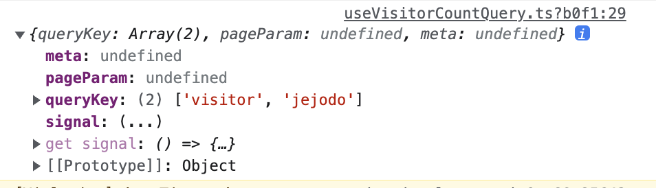

> update: 2024-05-24  
> 해당 글은 시간이 많이 흘렀습니다. 그만큼 많은 것들이 바뀌었다고 생각합니다.  
> 현재는 [이 글](https://geuni620.github.io/blog/2024/5/24/query-function-context/)에서 내용을 다시 정리했답니다! 🙇‍♂️

### QueryFunctionContext

```TSX
const useVisitorCountQuery = () => {
  const [selectedIsland, setSelectedIsland] = useState<string>('jejodo');

  const fallback: null[] = [];
  const { data: visitorTotalCount = fallback } = useQuery(
    [queryKeys.visitor, selectedIsland],
    (test) => {
      console.log(test);
      return getAccumulateVisitors({
        island: selectedIsland,
      });
    },
    {
      select: (data) => snakeCaseToCamelCaseObject(data),
    },
  );

  return { visitorTotalCount };
};

export default useVisitorCountQuery;
```

여기서 queryFn에 해당하는 value는 fetch 함수가 들어간다.  
근데 fetch 함수의 매개변수를 무엇일까 궁금해서 "test"라는 매개변수로 지정해주고 log를 찍어봤음.

<br>



위에서 볼 수 있듯 다양한 값들이 들어가는데, 해당 내용은 [공식문서](https://tanstack.com/query/v4/docs/react/guides/query-functions#query-function-variables) 확인할 수 있었다.

<br>

즉 다음과 같이 사용할 수 있을 것 같다.

```TSX
const getAccumulateVisitors = async ({ queryKey }: { queryKey: string[] }) => {
  const [, island] = queryKey;

  const { data } = await axiosClient.get(
    `/api/statistics/v1/${island}/visitor`,
    {
      params: {
        start_date: '2020-01-01',
        end_date: 'today',
        scope: 'total',
      },
    },
  );

  return data;
};
```

- 객체를 이용한 더 나은 방법도 있는데, 이게 오히려 더 복잡하다고 느껴져서, 현재 나의 환경에선 이렇게 작성할 예정이다.

<br>

### 참고자료

[공식문서 Query Functions](https://tanstack.com/query/v4/docs/react/guides/query-functions#query-function-variables)

[Leveraging the Query Function Context](https://tkdodo.eu/blog/leveraging-the-query-function-context)

- TkDodo's blog
