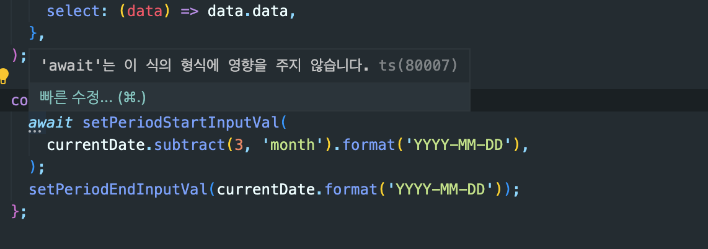

### setState + refetch

> 어드민페이지를 계속 작업하며, 최근 통계 페이지를 구현하며 고민했던 내용 기록

```TSX
  const onSelectedPeriodClick = () => {
    refetch();
  };
```

- "전체" 버튼을 클릭하면 오늘을 기준으로 이전 3개월치 데이터를 가져와 테이블 형태로 보여주는 기능을 구현하고 있다.
- 날짜를 선택하고, 선택된 날짜의 onChange를 적용해 state가 변경된다.
- 변경된 state를 useQuery의 queryKeys dependencies로 추가하면 원하는대로 **동작하지 않는다.**
  - 날짜를 선택하자마자 API가 fetch 되기 때문이다.
- "적용" 버튼을 클릭해야 비로소 API를 fetch 한다.

<br>

```TSX
  const onSelectedDateReset = () => {
    setPeriodStartInputVal(
      currentDate.subtract(3, 'month').format('YYYY-MM-DD'),
    );
    setPeriodEndInputVal(currentDate.format('YYYY-MM-DD'));

    refetch()
  };
```

- 위 코드의 의도는 setState 이후 → refetch 순으로 동기적으로 동작하는 함수를 만드려고 했다.
- 하지만 이건 원하는대로 동작하지 않는다.
- setState도 비동기고, refetch도 비동기인데, 이들의 순서가 동기적으로 보장되지 않는다.
- 그래서 async await으로 순서를 보장하게 해보려고 했으나, 이 역시 원하는대로 동작하지 않는다.
  - setState는 await의 영향을 받지 않기 때문이다. → await는 Promise를 반환할 때 적용되는걸로 알고 있다. 하지만, setState의 반환값은 void 다.

<br>

```TSX
  const onSelectedDateReset = async () => {
    await setPeriodStartInputVal(
      currentDate.subtract(3, 'month').format('YYYY-MM-DD'),
    );
    await setPeriodEndInputVal(currentDate.format('YYYY-MM-DD'));

    await refetch()
  };
```

- 위에서 언급했듯, 이렇게 적용하면 vscode 상에 await 밑줄이 생기고, 이를 클릭하면 아래와 같은 경고메시지가 뜬다.



- 하지만, 이상하게 이는 내가 원하는대로 동작한다. 단, 왜 이렇게 원하는대로 동작하는지는 아직 발견하지 못했다.

<br>

### 해결하려고 시도했던 방안들.

1. 클로저를 써서 setState 이후 return으로 refetch를 건다.

- 원하는대로 동작하지 않았다.

<br>

2. queryKey로 디팬던시 걸어주면 되지않을까요?

- 위에서 언급했지만 날짜를 변경하지마자 fetch 되어서 원하는대로 동작하지 않는다.

<br>

3. class형 setState 두 번째 인자로 callback을 받을 수 있음

- hooks 기반 useState에는 두 번째 인자를 넣을 수 없다.

<br>

4. return으로 Promise를 넣어서 await 걸어주면 되지 않을까?

- Promise를 넣어주었을 때 Promise의 callback 내에서 setState의 순서가 보장되지 못하는 듯 하다. (정확하지 않음)
- 단, custom hooks으로 만들어서 사용하는 블로그 글을 봤지만 시도해보진 않았음.

<br>

5. startTransition을 사용해서 isPending이 아닐 때 refetch하려 했음

- 원하는대로 동작하지 않았다.

<br>

6. 결국 useEffect를 사용했다.

```TSX
 const onSelectedDateReset = () => {
    setShouldRefetch((s) => !s);
    setPeriodStartInputVal(
      currentDate.subtract(3, 'month').format('YYYY-MM-DD'),
    );
    setPeriodEndInputVal(currentDate.format('YYYY-MM-DD'));
  };

  const onSelectedPeriodClick = () => {
    refetch();
  };

  useEffect(() => {
    onSelectedPeriodClick();
  }, [shouldRefetch]);
```

- shouldRefetch라는 boolean type의 state를 만들어서, setState 될때마다 useEffect가 실행되도록 만들었다.
- 원하는대로는 잘 동작하지만, 좋은 코드인지는 잘 모르겠다.
- 하지만 일단, 돌아가게는 만들어놓았으니, 차츰 리팩터링 해가며 찾아봐야한다.

<br>

- 정리해보자면
  - setState + refetch()가 동기적으로 순서가 보장되길 원함
  - await을 붙이면 이상하게 원하는대로 동작한다.
  - 하지만, await으로 만들진 않았다 (안티패턴이라고 생각, 의도한대로 동작하지 않아야하지만 동작하기 때문)
  - 그래서 useEffect를 사용했다.
