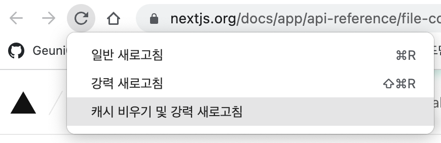

> 해당 내용은 사내 블로그를 app디렉토리로 개발하며 metadata를 적용했던 사례를 소개해보려 한다.

<br>

### OG tag / Twitter Card

- OG Tag와 Twitter Card가 meta data내에선 표준처럼 쓰이는 듯하다.
- 즉, OG Tag는 메타(전 페이스북), Twitter card는 말 그대로 twiiter이다.
- 현재 OG Tag와 Twitter Card를 적용한 상태에서 다음과 같은 서비스에 링크를 붙여넣었을 때 모두 잘 적용되었다.
  - 잔디, 카카오톡, 슬랙, 페이스북, 트위터, 노션

<br>

```TSX
// app/layout.tsx
export const metadata: Metadata = {
  metadataBase: new URL('https://deep.jejodo.life'),
  generator: 'Next.js 13.3.0',
  title: '제대로 된 조직문화 도큐먼트',
  description: '제조도의 조직문화를 소개합니다.',
  icons: {
    icon: {
      url: '/favicon.png',  // 해당 부분은 Favicon을 적용할 때 사용된다.
      type: 'image/png',
    },
  },

  openGraph: {
    title: '제대로 된 조직문화 도큐먼트',
    description: '제조도의 조직문화를 소개합니다.',
    url: 'https://deep.jejodo.life',
    siteName: '제대로 된 조직문화 도큐먼트',
    locale: 'ko-KR',
    type: 'website',
    images: [
      {
        url: 'https://deep.jejodo.life/ogImage.png', // 절대경로를 사용해야하지만 metadataBase를 적용했다면 상대경로로도 가능하다.
        width: 1200,
        height: 630,
        type: 'image/png',
      },
    ],
  },

  twitter: {
    card: 'summary', // summary와 summary_large_image가 존재한다. summary는 작은 이미지, summary_large_image는 큰 이미지를 사용한다.
    title: '제대로 된 조직문화 도큐먼트',
    description: '제조도의 조직문화를 소개합니다.',
    images: ['https://deep.jejodo.life/ogImage.png'],
  },
};

// 해당부분은 포스트를 링크로 공유할 경우 적용된다.
// app/[slug]/[pageId]/page.tsx
export async function generateMetadata({ params }: Props): Promise<Metadata> {
  const id = params.pageId;
  const posts = await getPosts();
  const post = findPostById(posts, id);

  const title = post?.title;
  const previousImages = post?.thumbnail || '';
  const author = post?.author?.[0]?.name || '';
  const createdTime = post?.createdTime || '';
  const category = post?.category?.[0] || '';

  return {
    title: title,
    description: title,
    openGraph: {
      images: previousImages,
      type: 'article',
      authors: author,
      publishedTime: createdTime,
      description: '제조도의 조직문화를 소개합니다.',
    },
    twitter: {
      card: 'summary',
      title: title,
      description: '제조도의 조직문화를 소개합니다.',
      images: previousImages,
    },
    alternates: {
      canonical: `https://deep.jejodo.life/${category}`,
    },
  };
}
```

- 참고로 nextJS 13.2버전부턴 Head 태그가 사라졌다. 불러올 순 있으나, 적용되진 않는다.
- 그래서 layout이나, page내에서 metadata를 정의해준다.
  - 정의하는 방법은 위와 같이 간단하다.(작성하면서 간단하다고 생각했지, 전혀 간단하진 않았다.)

<br>

위의 경우엔 root페이지("/")의 title과 블로그 포스트의 타이틀을 동일하게 구성했다. 하지만 이렇게도 사용이 가능하다.

```TSX
// app/layout.tsx
export const metadata: Metadata = {
  generator: 'Next.js 13.3.0',
  title: {
    default: '제대로 된 조직문화 도큐먼트',
    template: '%s | 제조도'
  },
};

// app/[slug]/[pageId]/page.tsx
export const metadata: Metadata = {
  title : "여기는 posts 페이지"
}
```

- 위와 같이 작성하면 main 페이지에선 크롬 탭의 title에 "제대로 된 조직문화 도큐먼트"가 출력된다.
- 포스트로 들어갔을 때엔 "여기는 posts 페이지 | 제대로 된 조직문화 도큐먼트"가 출력된다.
- 절대값을 지정해서 해당 포스트 페이지에선 title만 띄우는 것도 가능하다.
- 모든 것은 [공식문서](https://nextjs.org/docs/app/api-reference/functions/generate-metadata#metadata-fields) 내에 잘 기록되어있다.

<br>

- 그리고 가장 중요한 점,
  - 나는 OG Image, Twitter Card를 적용하면서 엄청 고생했다. 왜냐하면 변경을 했음에도 불구하고 적용이 되지 않았기 때문이다.
  - 하지만 적용은 잘 되어있다. Caching 된 데이터를 그대로 불러오기 때문에 적용되지 않은 것처럼 보일 뿐이다.
  - 그래서 대부분은 '캐시 비우기'를 해주면 잘 적용되어 있을 것이다.

```
https://deep.jejodo.life
https://deep.jejodo.life/
```

- 위 아래 og image가 달라서 엄청 고민했다.
- 결국 캐싱된 데이터를 그대로 불러와서 favicon 이미지를 계속 불러왔던 것 뿐, 캐시를 싹 비우고 다시 불러오니 원하는대로 잘 불러와졌다.



<br>

### Canonical URL

- Canonical URL에 대한 자세한 설명은 [중복 페이지 URL 표준화 및 표준 태그 사용](https://developers.google.com/search/docs/crawling-indexing/consolidate-duplicate-urls?hl=ko&visit_id=638199289246195899-2459427862&rd=1)를 참고하자.

```TSX
return(
// layout.tsx
  <html className={`${notoSansKR.className}`}>
    <link rel="canonical" href="https://deep.jejodo.life" />
    <body>
      <div>
        ...
      </div>
    </body>
  </html>
)
```

- 이 부분은 metadata로 적용하는 설명이 안나와있어, root segment의 layout.tsx의 html 태그 내에 넣어주었다.
  - deploy 후 확인해보니 link 태그가 잘 적용되어 있었다.

<br>

### Google analytics

- Google analytics(이하 GA)는 어디에, 어떻게 붙여줘야할까?

```TSX
// components/Analytics.tsx
'use client'; // client components

const GA_TRACKING_ID = process.env.GOOGLE_ANALYTICS_ID;

import useGtagEffect from 'hook/useGtagEffect';
import Script from 'next/script';

const Analytics = () => {
  useGtagEffect();

  return (
    <>
      <Script
        strategy="afterInteractive"
        src={`https://www.googletagmanager.com/gtag/js?id=${GA_TRACKING_ID}`}
      />
      <Script
        id="gtag"
        strategy="afterInteractive"
        dangerouslySetInnerHTML={{
          __html: `
            window.dataLayer = window.dataLayer || [];
            function gtag(){dataLayer.push(arguments);}
            gtag('js', new Date());
            gtag('config', '${GA_TRACKING_ID}', {
              page_path: window.location.pathname,
            });
          `,
        }}
      />
    </>
  );
};

export default Analytics;

// useGtagEffect.ts
import * as gtag from 'lib/gtag';
import { usePathname, useSearchParams } from 'next/navigation';
import { useEffect } from 'react';

const useGtagEffect = () => {
  const pathname = usePathname();
  const searchParams = useSearchParams();

  useEffect(() => {
    if (pathname) {
      gtag.pageview(pathname);
    }
  }, [pathname, searchParams]);

  return null;
};

export default useGtagEffect;


// app/layout.tsx
import Analytics from 'components/Analytics';

export default function RootLayout({ children }: RootLayoutProps) {
  return (
    <html className={`${notoSansKR.className}`}>
      <link rel="canonical" href="https://deep.jejodo.life" />
      <body>
        <Analytics />
        //...
      </body>
    </html>
  );
}
```

- 기존에 설명이 잘 되어있는 부분이라 크게 다른 것은 없다.
- 굳이 다른 점 하나를 뽑자면, useRouter를 사용하던 이전 버전에 비해 [usePathname](https://nextjs.org/docs/app/api-reference/functions/use-pathname)이라는 hook을 사용하여 편하게 적용할 수 있다.
- 참고로 이 [블로그](https://dev.to/valse/how-to-setup-google-tag-manager-in-a-next-13-app-router-website-248p)가 유용했다.

<br>

### 웹 마스터 등록하기

```TSX
export const metadata: Metadata = {
  verification: {
    google: 'something',
    other: {
      'naver-site-verification': 'something',
    },
  },
};
```

- 대표적으로 네이버와 구글을 등록해줬다. 즉, 구글에서 우리 웹사이트를, 네이버에서 우리 웹사이트를 검색했을 때 검색결과로 나오도록 추가해주었다.
- 구글은 이런 점에서 조금 불친절하다. 등록하고 나서 적용되는데 기간이 조금 걸리는 듯하다.
- 해당 부분은 공식문서 [verification](https://nextjs.org/docs/app/api-reference/functions/generate-metadata#verification)에 나와있다
- naver는 따로 구성된게 없어서 other에 직접 추가해주었다.

<br>

### GA를 이용해서 페이지별 조회수 추가해주기

> 조금 달라진 api 폴더를 사용했다.

```TSX
// api/google/views/route.ts
import { BetaAnalyticsDataClient } from '@google-analytics/data';
import { NextResponse } from 'next/server';

const analyticsDataClient = new BetaAnalyticsDataClient({
  credentials: JSON.parse(process.env.ANALYTICS_CREDENTIALS || '{}'),
});

export async function GET() { // 달라진 api 폴더내에선 함수명이 HTTP method명으로 바뀌었따.
  const [response] = await analyticsDataClient.runReport({
    property: `properties/${process.env.ANALYTICS_PROPERTY_ID || ''}`,
    dateRanges: [
      {
        startDate: '2023-05-01',
        endDate: 'today',
      },
    ],
    dimensions: [
      {
        name: 'pagePath',
      },
    ],
    metrics: [
      {
        name: 'screenPageViews',
      },
    ],
    dimensionFilter: {
      filter: {
        fieldName: 'pagePath',
        stringFilter: {
          matchType: 'BEGINS_WITH',
          value: `/do-comments/`,
        },
      },
    },
  });

  const data = response.rows?.map((row: any) => {
    return {
      // path와 조회수를 반환해준다.
      path: row.dimensionValues[0].value,
      views: row.metricValues[0].value,
    };
  });

  return new NextResponse(JSON.stringify(data), { status: 200 });
}
```

- 해당 코드는 이 [블로그](https://blog.yeppyshiba.com/article/adding-view-count-in-gatsby/)를 참고했다.
  - gatsby로 되어있지만, plugin 차이일 뿐 api 호출은 크게 다르지 않았다. (사실 거의 똑같았다.)
- 구글에선 다양한 방법으로 API를 제공해준다. 그래서 오히려 더 헷갈렸다.
- 단순 Node만을 이용해서 lib로 데이터를 가져올 수 있는 위 방법을 조금 더 일찍 발견했다면 큰 고민없이 바로 적용했을 것 같다.

<br>

- 한 가지 조금 우려되는 점은, 조회수 산정 기준이 무엇인지 잘 모르겠다. 하루 전 날에 tracking 한 후 다음 날 반영되는 듯 하다.
- 실시간으로 적용하려면 realTime method를 사용해야하는 것 같다.

<br>

### 참고자료

이 외에 참고자료가 많다. 모두 도움이 많이 되었다. 🙇‍♂️

<br>

[[Next.js] - v13.2 Feature: Metadata](https://velog.io/@henrynoowah/Next.js-v13.2-Feature-Metadata)

[How to Make Next.js 13 More SEO-Friendly](https://akoskm.com/how-to-make-nextjs-13-more-seo-friendly)

[Next.js 13 new Metadata API with SEO support | Next.js 13.2 Tutorial](https://youtu.be/CIb0OthD_sM)

[Twiiter Card tag](https://developer.twitter.com/en/docs/twitter-for-websites/cards/overview/markup)

[favicon.ico, apple-icon.jpg, and icon.jpg](https://nextjs.org/docs/app/api-reference/file-conventions/metadata/app-icons)
