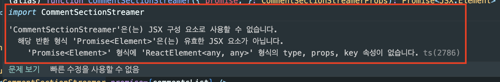

### Async 서버 컴포넌트 Promise Type Error

<br>

```TSX
return(
    <Suspense fallback={<Loading />}>
        <CommentSectionStreamer promise={commentsList} />
    </Suspense>
)
```

- 해당 부분은 아직 Typescript에 반영되지 않은 듯 하다.
  - 다음과 같은 에러가 뜬다.



<br>

공식문서에서도 다음과 같이 확인할 수 있다.

```
Async Server Component TypeScript Error

- An async Server Components will cause a 'Promise<Element>' is not a valid JSX element type error where it is used.
This is a known issue with TypeScript and is being worked on upstream.
- As a temporary workaround, you can add {/* @ts-expect-error Async Server Component */} above the component to disable type checking for it.
```

<br>

- 그래서 이렇게 주석을 추가해주었다.

```TSX
return(
    <Suspense fallback={<Loading />}>
        {/* @ts-expect-error Async Server Component */}
        <CommentSectionStreamer promise={commentsList} />
    </Suspense>
)
```

<br>

### 참고자료

[async and await in Server Components](https://nextjs.org/docs/app/building-your-application/data-fetching/fetching#async-and-await-in-server-components)

[# Async 서버 컴포넌트 Promise 반환 이슈](https://curryyou.tistory.com/529)
