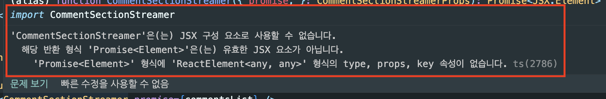
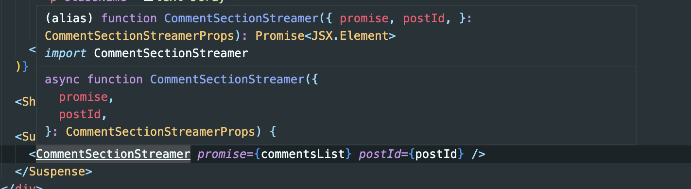

### Async 서버 컴포넌트 Promise Type Error

<br>

```TSX
return(
   <Suspense fallback={<Loading />}>
            <CommentSectionStreamer promise={commentsList} />
        </Suspense>
)
```

위와 같이 Suspense를 사용해서 Async Server Component를 사용하려고 했다.

<br>


해당 부분은 아직 Typescript에 반영되지 않은 듯 하다.

<br>

```
Async Server Component TypeScript Error

- An async Server Components will cause a 'Promise<Element>' is not a valid JSX element type error where it is used.
This is a known issue with TypeScript and is being worked on upstream.
- As a temporary workaround, you can add {/* @ts-expect-error Async Server Component */} above the component to disable type checking for it.
```

공식문서에서도 다음과 같이 확인할 수 있다.

<br>

```TSX
return(
<Suspense fallback={<Loading />}>
    {/* @ts-expect-error Async Server Component */}
    <CommentSectionStreamer promise={commentsList} />
</Suspense>
)
```

그래서 이렇게 주석을 추가해주었다.

<br>

---

### Typescript JSX 태그 타입 별도 구분

Typescript 5.1버전으로 업데이트 되면서 서버컴포넌트에서 [Promise를 반환하는 경우에 대한 타입을 별도로 추가되었다.](https://www.typescriptlang.org/docs/handbook/release-notes/typescript-5-1.html#decoupled-type-checking-between-jsx-elements-and-jsx-tag-types)

사용방법을 몰라 조금 헤맸는데, 아주 간단하다.  
next.js에서도 기존에 대안방법이라고 제시하던 위 링크의 내용이 수정되었다.  
[next.js 공식문서의 내용](https://www.typescriptlang.org/docs/handbook/release-notes/typescript-5-1.html#decoupled-type-checking-between-jsx-elements-and-jsx-tag-types)을 살펴보면,

1. Typescript의 버전을 5.1.3이상으로 올리기
2. @types/react의 버전을 18.2.8이상으로 올리기

<br>

```
npm install @types/react@latest typescript@latest
```

<br>



### 참고자료

[async and await in Server Components](https://nextjs.org/docs/app/building-your-application/data-fetching/fetching#async-and-await-in-server-components)

[# Async 서버 컴포넌트 Promise 반환 이슈](https://curryyou.tistory.com/529)

---

[TypeScript 5.1에서 변경된 점은 무엇일까요?](https://velog.io/@reum107/what-changes-in-typescript-5.1)

[Async Server Component TypeScript Error](https://nextjs.org/docs/app/building-your-application/configuring/typescript#async-server-component-typescript-error)
