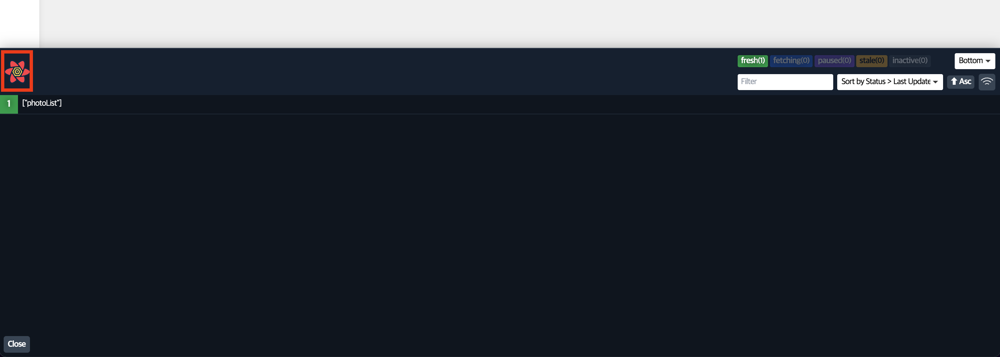
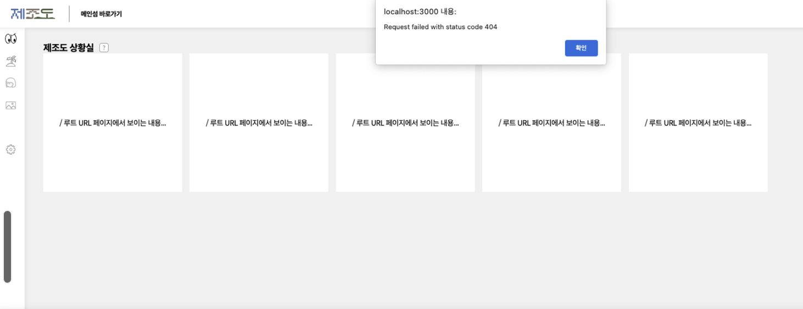
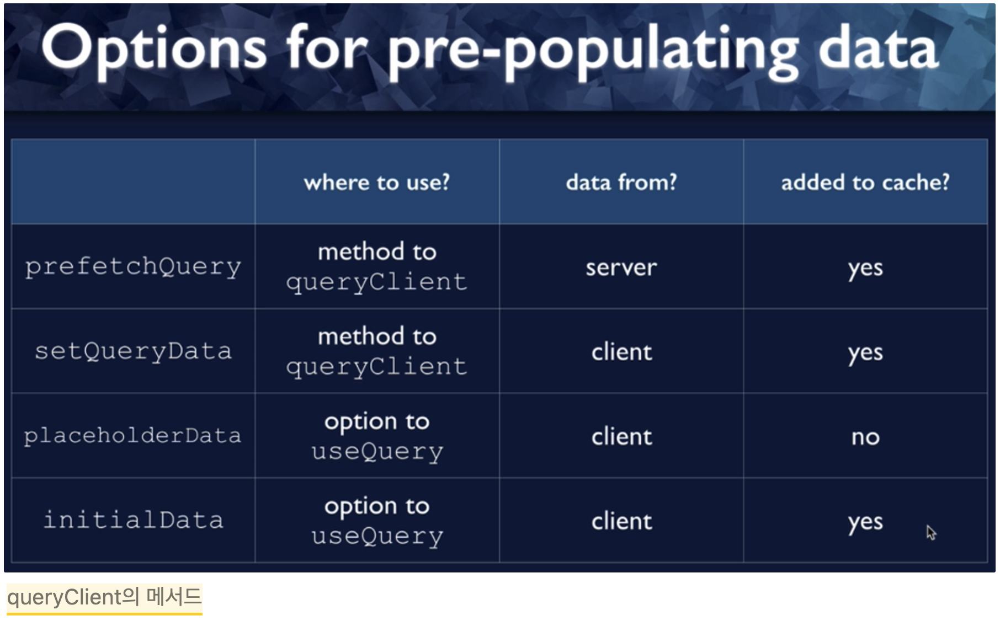
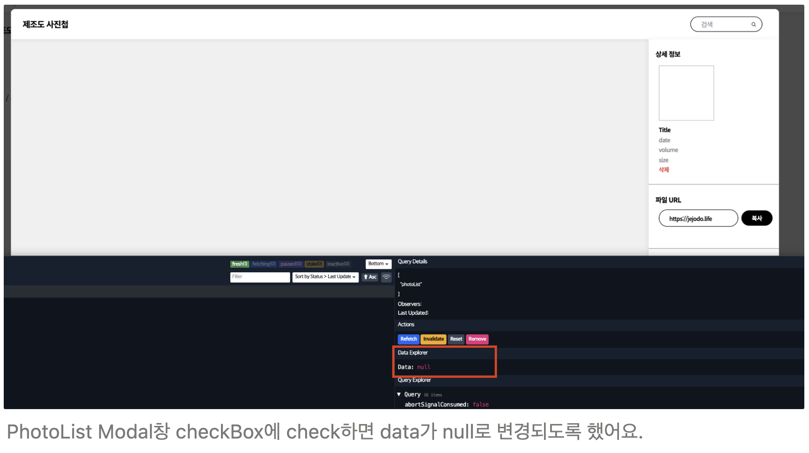
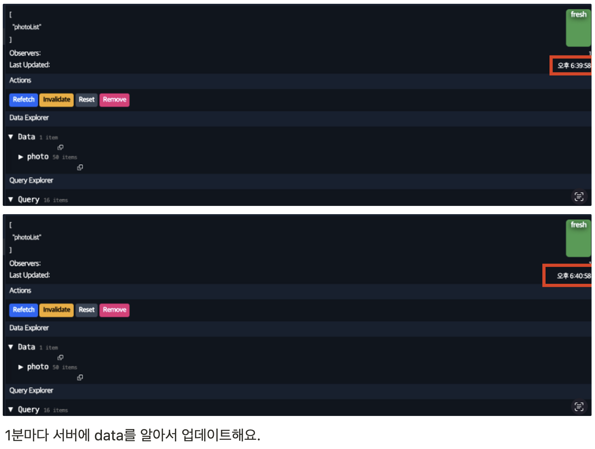

<br>

---

<br>

> 공부하고 학습한 내용을 토대로 작성해보겠습니다.  
> tanstack-query를 작성하며 query라고 편히 부르겠습니다.

> 그리고 useQuery는 get만 해당한다고 보시면 될 거 같아요. 나머진 모두 Mutate입니다.  
> useQuery & useMutation

<br>

## query Dev tools

```tsx
// _app.page.tsx
import { ReactQueryDevtools } from '@tanstack/react-query-devtools'

export default function App({ Component, pageProps }: AppProps) {
  const queryClient = new QueryClient()

  return (
    <>
      <Head>
        <meta
          name="viewport"
          content="width=device-width, initial-scale=1, maximum-scale=1"
        />
      </Head>
      <QueryClientProvider client={queryClient}>
        <ThemeProvider theme={theme}>
          <CurrentPageIdProvider>
            <GlobalStyle />
            <StaticPageLayout>
              <Componednt {...pageProps} />
            </StaticPageLayout>
          </CurrentPageIdProvider>
          <ReactQueryDevtools initialIsOpen />
        </ThemeProvider>
      </QueryClientProvider>
    </>
  )
}
```

왼쪽 아래에 보면 꽃 모양 누르면 껐다가 켤 수 있어요.(빨간박스)

- query에선 devtools를 사용할 수 있어요.
  - 옵션은 다양하게 있는데 default로 작성해뒀어요.
- dev tools는 `NODE_ENV`가 Production으로 설정되었을 때는 표시되지 않아요.



<br>

---

## folder

```tsx
├── queries
│   ├── constants.ts
│   └── useGetPhotoListQuery.ts
├── useAutoResizeTextarea.ts
├── useCustomDropzone.ts
└── useSideTabFixer.ts
```

- folder는 다양하게 사용할 수 있겠지만 components나 pages내에서 hook으로 차용하기보단
  hooks라는 폴더내 queries 폴더를 두고 여기서 분기시켜주는게 좋을 것 같아요.
- 예를들어 다음과 같습니다.

  `queries/login/useGetUserData.ts`  
  `queries/modal/useGetPhotoList.ts`

- 그리고 아래서 또 설명드리겠지만, queries폴더 내 constanst는 queryKeys를 관리하기 위함이에요.  
  → useQuery 또는 useMutation은 querykey를 매개변수로 받는데,  
  역할은 useEffect의 dependency array라고 생각하시면 될거 같아요.
- custom hooks를 사용하려고 해요.
  - 다수의 useQuery를 사용할 때 사용중인 queryKey의 종류가 헷갈렸어요.  
    → 그래서 queryKeys를 상수로 지정해놓은거에요
  - custom hooks를 사용하지 않고 useQuery로 사용한다면 상수로 지정해놓은 쿼리 키도 헷갈릴 거 같았어요.

```tsx
// hooks/queries/useGetPhotoListQuery.ts
export const useGetPhotoListQuery = () => {
  const [searchQuery, setSearchQuery] = useState('')
  const fallback: Photo[] = []

  const { data: photoList = fallback } = useQuery(
    [queryKeys.photoList],
    () => getPhotoList({ search: searchParams(searchQuery) }),
    {
      select: searchQuery
        ? data =>
            data.photo.filter((item: Photo) =>
              new RegExp(`.*${searchQuery}`, 'i').test(item?.name),
            )
        : data => data.photo,
      suspense: true,
      ...commonOptions,
    },
  )

  return { photoList, searchQuery, setSearchQuery }
}

// AlbumModal.tsx
import { useGetPhotoListQuery } from 'hooks/queries/useGetPhotoListQuery'
const { photoList, searchQuery, setSearchQuery } = useGetPhotoListQuery()

// hooks를 사용하지 않을 시
// AlbumModal.tsx 내에서 useQuery를 호출하여 사용하개 될 건데,
// 다른 파일(CardListContainer.tsx)에서 photoList를 get해오려고 한다면 똑같은 코드를 복붙 해줘야해요.
// 하지만 hooks를 사용하면 선언적으로 코딩할 수 있어요.
```

<br>

---

## fetching Error indicator 전역으로 관리

```tsx
├── queries
│   ├── constants.ts
│   ├── queryClient.ts
│   └── useGetPhotoListQuery.ts
├── useAutoResizeTextarea.ts
├── useCustomDropzone.ts
└── useSideTabFixer.ts
```

- queryClient 파일 내부에서 QueryClient를 생성하고 관리하려고 해요.
- 이렇게 했을 때 전역적으로 에러 핸들러를 관리할 수 있고, `isFetching`, `isLoading`의 indictor도 설정해줄 수 있어요.
- 즉, 사용하게 될 app 파일을 오염시키지 않고 독자적으로 관리하고 싶어서 만들었습니다.

```tsx
//queryClient.ts
import { QueryClient } from '@tanstack/react-query';

function queryErrorHandler(error: unknown): void {
  const title =
    error instanceof Error ? error.message : 'error connecting to server';

  alert(title);
}

export const queryClient = new QueryClient({
  defaultOptions: {
    queries: {
      onError: queryErrorHandler,
      // refetching과 staleTime, cacheTime은 모두 길게 주고 false로 줬어요.
      // default라서 길게 설정해두었어요. 실시간 업데이트가 필요한 경우라면 해당 hooks의 query에서 설정을 변경하면 되어요.
      staleTime: 600000, // 10 minutes
      cacheTime: 900000, // 15 minutes

      refetchOnMount: false, // mount 시 query를 재호출 하지 않음.
      refetchOnWindowFocus: false,  // data가 stale 되더라도, query를 재호출 하지 않음.
      refetchOnReconnect: false,  // network가 끊겼다가 다시 연결되더라도 query를 재호출하지 않음.
    },

    mutations: {
      onError: queryErrorHandler,
    },
  },
});

---

//_app.page.tsx
import { queryClient } from 'hooks/queries/queryClient';

export default function App({ Component, pageProps }: AppProps) {
  return (
    <>
      <QueryClientProvider client={queryClient}>
        <ThemeProvider theme={theme}>
          <CurrentPageIdProvider>
            <GlobalStyle />
            <StaticPageLayout>
              <Component {...pageProps} />
            </StaticPageLayout>
          </CurrentPageIdProvider>
          <ReactQueryDevtools initialIsOpen />
        </ThemeProvider>
      </QueryClientProvider>
    </>
  );
}

```



- 참고로 retry의 default는 3번이에요. 즉, 3번 재요청하고 3번 사이에 success가 없을 시 Error 띄웁니다.
- 이외에도 방법은 여러가지가 있는 거 같아요.  
  ([React Error Boundary](https://reactjs.org/docs/error-boundaries.html), [tanstack query hooks useErrorBoundary](https://tanstack.com/query/latest/docs/react/reference/useQuery?from=reactQueryV3&original=https%3A%2F%2Ftanstack.com%2Fquery%2Fv3%2Fdocs%2Freference%2FuseQuery))

<br>

---

## 그 외 짧은 지식.

### isLoading, isFetching

**isLoading**

- 가져오는 상태에 있음을 의미, isFetching이 참이면서, 쿼리에 대해 캐시된 데이터가 없는 상태.

**isFetching**

- cache의 여부에 상관없이 데이터를 가져온다면 항상 동작함.

<br>

---

### Why don’t refresh?

쿼리 키가 있을 때는 어떠한 트리거가 있어야만 데이터를 다시 가져옵니다.

- 컴포넌트를 다시 마운트 될 때
- 윈도우를 다시 포커스 할 때

- useQuery에서 반환되어 수동으로 리패칭을 실행할 때

- 지정된 간격으로 리패칭을 자동 실행할 때(=polling)

- Mutation을 생성한 뒤 쿼리를 무효화할 시, 클라이언트 데이터가 서버의 데이터와 불일치 할 때 리패칭 트리거

<br>

---

### Query로 데이터를 미리 채우는 방법들



사용자에게 보여주고 싶은 정보가 있을 때 캐시에 아직 데이터가 없을 경우, 미리 데이터를 채울 수 있어요.

데이터는 클라이언트 또는 서버에서 올 수 있겠죠. 간단히 말하면 **미리 채우기 ‘옵션’들**이라고 보시면 될 거 같아요.

<br>

**prefetchQuery**

만약, 우리 제조도 홈페이지에서 통계적으로 많이 접속하는 페이지가 ‘잉재 라이브러리’라고 가정 해볼게요.

제조도 첫 페이지에 접속하자마자, 잉재 라이브러리 데이터를 미리 prefetchQuery로 요청하고 받아온 데이터를 캐시에
저장해둬요. (default 시간은 5분이에요, 5분 내에 들어가지않으면 가비지컬렉터에 의해 제거되어요.)

5분이내, 사용자가 잉재라이브러리에 들어갔을 때 캐시되어 있는 데이터를 미리 띄워줘요.
(서버로부터 데이터 받아올 동안, 기다릴 필요 x)

만약, 캐시된 데이터와 서버의 데이터가 다를 경우엔, 캐시된 데이터를 먼저 띄워놓고 그 사이에 서버에 요청  
→ 데이터를 업데이트 시켜줘요.

```tsx
// useHooks.tsx
export function usePrefetchTreatments(): void {
  const queryClient = useQueryClient();
  queryClient.prefetchQuery(queryKeys.treatments, getTreatments, {
    staleTime: 600000,
    cacheTime: 900000,
  });

  /*
    prefetchQuery에 사용되는 key는 캐시에서 어느 useQuery가 이 데이터를 찾아야 하는지 알려주기 때문에 매우매우 중요.
    그리고 캐시에 있는 이 데이터가 이 useQuery 호출과 일치한다고 알려주는 것.
    이후엔 useQuery 호출과 같은 방법을 사용할 것
  */
}

// Home.tsx
import { usePrefetchTreatments } from '../treatments/hooks/useTreatments';

export function Home(): ReactElement {
  usePrefetchTreatments();
  return (
     //...
  );
}
```

<br>

**setQueryData / removeQueries**

→ useQuery를 실행하지 않고, 쿼리 데이터를 캐시에 추가하는 또 다른 방법이에요.

위 prefetchQuery와 다른 점은 서버에서 데이터를 가져오는데 반해, 이건 client에서 데이터를 가져와요.

즉, useMutation으로 서버의 데이터 변경이 이루어졌을 때, 그에 대한 응답으로 나온 데이터를 캐시에 넣을 수 있어요.

다르게는 쿼리 키와 값을 가져와서 쿼리 캐시에 해당 키에 대한 값을 설정해줄 수도 있는데요.

쿼리함수의 작동방식과 유사하지만, 쿼리 함수 없이 직접 설정도 가능합니다.

```tsx
export const useUpdatePhotoList = () => {
  const queryClient = useQueryClient()

  const updatePhotoList = (newData: null) => {
    queryClient.setQueriesData([queryKeys.photoList], newData)
  }

  return { updatePhotoList }
}
```

이렇게 설정해주면, newData라고 작성해뒀지만, null값을 넣어볼건데요.

넣고 나면, photoList의 Data가 null로 변경됩니다.



참고로 useQuery와 queryClient.setQueryData 실행 이후 onSuccess가 실행되어요.

<br>

**placeholderData**

이건 useQuery에 대한 옵션이에요.

useQuery를 실행할 때, 데이터를 제공하기 때문에 클라이언트에서 데이터를 가져오고, 캐시에는 추가하지 않습니다.

마치 고정값처럼 사용하면 좋을 것 같아요.

<br>

**initialData**

이것 또한 useQuery 옵션이에요.

placeholder와 유사하지만 차이점이라면 캐시에 추가해야하는 데이터입니다.

즉, 초기 데이터를 캐시에 추가하고 싶을 때 사용해요

placeholder나, fallback은 모두 캐시에 추가되지는 않습니다.

<br>

---

### select

useQuery 메서드 중에서 select라고 있어요. restAPI로 데이터를 받았을 때 오버페칭되었다면 그 오버페칭 내에서 필요한 데이터만 select할 수도 있습니다.

```tsx
export const useGetPhotoListQuery = () => {
  const [searchQuery, setSearchQuery] = useState('')
  const fallback: Photo[] = []

  const { data: photoList = fallback } = useQuery(
    [queryKeys.photoList],
    () => getPhotoList({ search: searchParams(searchQuery) }),
    {
      select: searchQuery
        ? data =>
            data.photo.filter((item: Photo) =>
              new RegExp(`.*${searchQuery}`, 'i').test(item?.name),
            )
        : data => data.photo,
      suspense: true,
    },
  )

  return { photoList, searchQuery, setSearchQuery }
}
```

여기서 select 옵션으로 searchQuery가 true일 땐 data.photo.filter로 검색 filter를 걸 수 있었어요.

또는 data의 photo만 빼올 수도 있고요.

하지만 이때, useCallback으로 감싸주는게 필요할 것 같아요.. filter 함수를 매 번 실행시켜줄 필요는 없으니까요.

```tsx
export const useGetPhotoListQuery = () => {
  const [searchQuery, setSearchQuery] = useState('')
  const fallback: Photo[] = []

  const filterByPhotoList = useCallback(
    data =>
      data.photo.filter((photo: Photo) =>
        new RegExp(`.*${searchQuery}`, 'i').test(photo?.name),
      ),
    [searchQuery],
  )

  const { data: photoList = fallback } = useQuery(
    [queryKeys.photoList],
    () => getPhotoList({ search: searchParams(searchQuery) }),
    {
      select: searchQuery ? filterByPhotoList : data => data.photo,
      suspense: true,
    },
  )

  return { photoList, searchQuery, setSearchQuery }
}
```

이렇게 수정해줘도 될 것 같아요. 참고로, select를 사용할 때마다 재요청이 가지 않습니다.

→ 캐시 해놓은 데이터를 이용해서 select해요.

<br>

---

### refetching

```tsx
// queryClient.ts
export const queryClient = new QueryClient({
  defaultOptions: {
    queries: {
      onError: queryErrorHandler,
      staleTime: 600000, // 10 minutes
      cacheTime: 900000, // 15 minutes

      refetchOnMount: false,
      refetchOnWindowFocus: false,
      refetchOnReconnect: false,
    },

    mutations: {
      onError: queryErrorHandler,
    },
  },
})
```

위와 같이 default로 refetch Option을 모두 끈 상태에 staleTime과 cacheTime 모두 길게 줬다면, PhotoData를 어떻게
실시간 데이터를 어떻게 받아올까요?

→ 아래 처럼 useQuery 내 option들을 객체로 받게 되는데, 수정해주면 됩니다.

```tsx
// useGetPhotoListQuery.ts
export const useGetPhotoListQuery = () => {
  const [searchQuery, setSearchQuery] = useState('')
  const fallback: Photo[] = []

  const filterByPhotoList = useCallback(
    (data: { photo: Photo[] }) =>
      data.photo.filter((photo: Photo) =>
        new RegExp(`.*${searchQuery}`, 'i').test(photo?.name),
      ),
    [searchQuery],
  )

  const { data: photoList = fallback } = useQuery(
    [queryKeys.photoList],
    () => getPhotoList({ search: searchParams(searchQuery) }),
    {
      select: searchQuery ? filterByPhotoList : data => data.photo,
      suspense: true,

      staleTime: 0,
      cacheTime: 300000, // 5분

      refetchOnMount: true,
      refetchOnWindowFocus: true,
      refetchOnReconnect: true,
    },
  )

  return { photoList, searchQuery, setSearchQuery }
}
```

<br>

---

### polling

useQuery의 옵션 중 `refetchOnInterval` 이 있는데요. 이건 boolean type이 아닌 time 즉, ms(밀리세컨)이에요.

```tsx
// queryClient의 default option으로 refetch 3가지 옵션을 모두 false로 주고, stale, cache Time을
// 각각 10분 15분 준 상태.

const { data: photoList = fallback } = useQuery(
    [queryKeys.photoList],
    () => getPhotoList({ search: searchParams(searchQuery) }),
    {
      select: searchQuery ? filterByPhotoList : (data) => data.photo,
      suspense: true,

      refetchInterval: 60000, // 1분 마다 서버로 data를 업데이트
    },
  );

  return { photoList, searchQuery, setSearchQuery };
};
```



<br>

---

### useQuery data

```tsx
export function useUser(): UseUser {
  const { data: user } = useQuery(queryKeys.user, () => getUser(user))
}
```

위와 같이 작성된 코드는 어떻게 돌아갈까요?

→ 순환적인 것처럼 보이지만, 기존 user의 값을 이용해서 user의 값을 업데이트하는 것입니다.

<br>

---

### Dependent query

```jsx
const { data: userAppointments = fallback } = useQuery(
  [queryKeys.appointments, queryKeys.user, user?.id],
  () => getUserAppointments(user),
  {
    enabled: !!user, // 참고로 user는 User type이기 때문에 !!를 붙여 boolean Type으로 변경.
  },
)
```

Dependent Query는 user가 true일 때, useQuery가 실행되도록 구현한 것이에요.

이 부분은 [공식문서](https://tanstack.com/query/latest/docs/react/guides/dependent-queries?from=reactQueryV3&original=https%3A%2F%2Ftanstack.com%2Fquery%2Fv3%2Fdocs%2Fguides%2Fdependent-queries) 내용에 잘 설명되어있어요.

<br>

---

### useMutation

useQuery와 유사하지만 몇 가지 차이점이 존재해요.

1. useQuery와 다르게, cache Data가 없습니다. 즉, useMutation은 일회성이에요. 재시도가 없습니다.

   useQuery는 fetching과 re-fetching이 있지만, mutation은 그렇지 않아요.

2. isLoading과 isFetching을 구분할 필요 없습니다.

   위에서 언급드렸듯, isFetching은 데이터를 불러오는 과정이고,
   isLoading은 isFetching이 true이면서 cacheData가 없을 때 true가 된다고 말씀드렸었습니다.

   하지만 mutation은 cache Data가 없으니, isLoading과 isFetching을 구분할 필요없습니다. only isFetching 입니다.

그리고 useMutation에서 typescript 하나만 설명드리려고 해요.

```tsx
UseMutateFunction<TData, TError, TVariables, TContext>
// 순서대로, 반환된 데이터 / 발생할 것으로 예상되는 에러 / mutate 함수가 예상하는 변수 유형(selectedPhotoIds)

// 마지막은 optimistic update의 경우에 해당하는건데, 추후 알아보고 다시 작성해놓겠습니다.
// 위 내용을 토대로 photoList를 삭제하는 useDeletePhotoListQuery.ts를 작성하면 다음과 같습니다.

// useDeletePhotoListQuery.ts
export const useDeletePhotoListQuery = (): UseMutateFunction<
  void,
  unknown,
  { selectedPhotoIds: string },
  unknown
> => {
  const { mutate } = useMutation(
    ({ selectedPhotoIds }: { selectedPhotoIds: string }) =>
      deletePhotoList({ selectedPhotoIds }),
  )

  return mutate
}
```

<br>

---

### invalidateQueries

위 useDeletePhotoListQuery.ts를 이용해서 photoList를 삭제하려고 하면, 서버쪽에 요청이 가지만 실제로 데이터는 ‘즉각 변경되지는 않습니다.’

관련된 쿼리를 무효화하여 데이터가 최신이 아님을 query에 알려줘야해요.

이때 사용하는 method가 invalidateQueries입니다.

-쿼리를 만료(stale)로 표시하고,

-쿼리가 현재 렌더링 중이면 re-fetch를 트리거 합니다.

일반적으로 mutate 내에 onSuccess 메서드 내에서 관련 쿼리를 무효화하고, 데이터 re-fetch를 트리거합니다.

```tsx
export const useDeletePhotoListQuery = (): UseMutateFunction<
  void,
  unknown,
  selectedPhotoIdsProps,
  unknown
> => {
  const queryClient = useQueryClient()
  const { mutate } = useMutation(
    ({ selectedPhotoIds }: selectedPhotoIdsProps) =>
      deletePhotoList({ selectedPhotoIds }),
    {
      onSuccess: () => {
        return queryClient.invalidateQueries([queryKeys.photoList])
      },
    },
  )

  return mutate
}
```

이 코드를 보면 photoList에서 체크박스에 체크를 하고 ‘삭제’ 버튼을 눌렀다고 가정해볼게요.

그럼 여기서 useMutation()가 실행되겠죠.

useMutation()은 selectedPhotoIds 인자로 넘겨주어요. 그리고 deletePhotoList로 api fetch를 보냅니다.
위 과정이 성공했으면 onSuccess가 발동해요.

queryClient.invalidateQueries([쿼리 키]), 여기서 쿼리 키에 해당하는 모든 쿼리를 무효화 시켜요.
그리고 업데이트 된 캐시를 다시 받아옵니다.

즉, delete → get 순으로 돌아가는거죠.
invalidateQueries 외에도 캐시를 직접건드리는 setQueryData가 있긴 합니다.

하지만, react-query 메인테이너는 이를 권장하지 않는다고 해요.
[웬만하면 invalidateQueries로 모두 해결가능하다고 이야기합니다.](https://tkdodo.eu/blog/mastering-mutations-in-react-query#direct-updates)

그리고 위 코드를 보면 return을 붙였는데요. 붙였을 때와 붙이지 않았을 때 차이가 존재합니다.

```tsx
// 메인테이너 @TkDodo의 블로그 예시 코드를 그대로 가져왔습니다.
// https://tkdodo.eu/blog/mastering-mutations-in-react-query#awaited-promises
{
  // 🎉 will wait for query invalidation to finish
  onSuccess: () => {
    return queryClient.invalidateQueries(['posts', id, 'comments'])
  }
}
{
  // 🚀 fire and forget - will not wait
  onSuccess: () => {
    queryClient.invalidateQueries(['posts', id, 'comments'])
  }
}
```

invalidateQueries는 Promise를 반환합니다.
관련 쿼리가 업데이트 되는 동안 변환을 loading 상태로 유지하려면 콜백에서 invalidateQueries 결과를 반환해야해요.

→ 즉 invalidateQueries로 캐시가 업데이트 되고 난 이후, 동작을 수행하려면 return을 붙여야한다고 이해했어요.

<br>

### 참고자료

[React Query / TanStack Query: React Server State Management](https://www.udemy.com/course/learn-react-query/)
