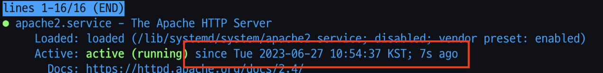

> 새로운 프로젝트를 시작하며, [react-deploy-with-docker](https://geuni620.github.io/blog/2023/6/6/react-deploy-with-docker/)에서 배포했던 방법에 한 단계 더 나아가서 실제 배포를 진행해봄.

- 이번 프로젝트에서 목표는 백엔드 / 프론트 / 인프라(간단한) 를 모두 경험해보는 것.
- 그래서 일단, next.js로 lint와 tsconfig, prettier 등을 설정한 후, 진행하였음.
- 해당 next.js 세팅은 [여기](https://github.com/Geuni620/next-boilerplate)에 있음.

<br>

### 서브 도메인 작성

- AWS Route53에서 서브 도메인을 작성해줌.
- 현재 프로덕션으로 돌아가고 있는 사이트의 도메인 `deep.jejodo.life`인데, version.2를 새롭게 기획하고 만들기로 했음.
- 그래서 dev.deep.jejodo.life로 서브도메인을 작성함.
  - **근데 이렇게 서브도메인을 만들면 안되었음. 아래에서 다시 설명할 예정**

<br>

먼저, `Route 53`에 들어감  
그리고, 여기서 오른쪽 상단에 `레코드 생성`을 클릭.


- 그래서 그 앞에 000.jejodo.life의 000에는 어떠한 단어가 들어가도 됨.
- 나는 deep.jejodo.life라는 서브도메인을 만들었기 때문에 이번엔 dev.deep.jejodo.life를 만듦

<br>

### Production Dockerfile

- dev dockerfile로 작성했었는데, 사실 dev를 작성해서 ec2환경에서 docker container를 띄우는 것보다, production으로 띄우는게 더 나을 것 같다고 생각했음.
- 왜냐하면, 같이 일하는 기획자 및 동료분들께 공유하기 위함이기 때문에, 사실 dev의 필요성을 못느낌.
  - 굳이 dev docker를 띄울 필요가 있을까? prod로 띄우면 되지 않을까? 하는 생각.

<br>

- 그래서 다음과 같이 작성해주었음
- 이건 같은 동료인 [주도님](https://github.com/dohyeon2)께서 작성해주신 파일인데, 그 당시엔 옆에서 `아??? 네???` 그러는데 모든게 지나가버림. 그래서 이번엔 하나씩 작성해보면서 시행착오를 겪어보고 싶었음

```DOCKER
# docker/production.dockerfile

FROM node:18.15.0 AS builder
WORKDIR /app
COPY package.json .
RUN npm i

# next.js에서 npm run build 후, 프로덕션을 start하기 위해 필요한 파일을 모두 docker에 복사함
FROM node
WORKDIR /app
COPY --from=builder /app/node_modules ./node_modules
COPY --from=builder /app/package.json ./package.json
COPY ./next.config.js /app/next.config.js
COPY ./.env.local /app/.env.local
COPY ./.next /app/.next
COPY ./public /app/public
CMD npm run start
```

<br>

```YML
# docker/production.yml
version: "3.1"

name: deep-jejodo-life

services:
  deep-jejodo-life:
    container_name: deep-jejodo-life
    build:
      context: .
      dockerfile: production.dockerfile
    restart: always
    ports:
      - 3040:3000 # docker port는 3040으로 열어주었음.
```

<br>

```SH
# docker/production.sh
BASEDIR=$(dirname $0);
cd ${BASEDIR} &&
docker compose -f production.yml up --force-recreate --build -d
```

- 여기서 초반에 실수를 했는데, `BASEDIR=${dirname $0}`으로 작성했다가 경로를 읽지 못하고 에러가 발생. 알고보니, 중괄호가 아닌 소괄호를 사용해야했음.

`BASEDIR=${dirname $0}` → `BASEDIR=$(dirname $0)`

 <br>

### EC2에 production

```SH
# deploy/package.sh, 다음과 같이 경로를 미리 지정해 준 뒤.
BASEDIR=$(dirname $0)
PROJECT_ROOT="${BASEDIR}/.."
DOCKER_DIR="${PROJECT_ROOT}/docker"
PACKAGE_DIR="${PROJECT_ROOT}/deploy/package"


# build된 파일을 rsync를 통해 EC2에 전송해줌.
npm run build &&
rsync -avz --delete ${PROJECT_ROOT}/.next ${PACKAGE_DIR}/
rsync -avz --delete ${PROJECT_ROOT}/package.json ${PACKAGE_DIR}/ &&
rsync -avz --delete ${PROJECT_ROOT}/package-lock.json ${PACKAGE_DIR}/ &&
rsync -avz --delete ${PROJECT_ROOT}/next.config.js ${PACKAGE_DIR}/ &&
rsync -avz --delete ${PROJECT_ROOT}/public ${PACKAGE_DIR}/ &&
rsync -avz --delete ${PROJECT_ROOT}/.env.local ${PACKAGE_DIR}/ &&

rsync -avz --delete ${DOCKER_DIR}/production.yml ${PACKAGE_DIR}/ &&
rsync -avz --delete ${DOCKER_DIR}/production.dockerfile ${PACKAGE_DIR}/ &&
rsync -avz --delete ${DOCKER_DIR}/production.sh ${PACKAGE_DIR}/ &&

echo "packaging done"
```

<br>

```SH
# deploy/deploy.sh, 여기선 내 pem파일을 통해 EC2에 접속한 뒤, 해당 경로로 이동하여 production.sh를 실행시켜줌.
rsync -e "ssh -i ~/.ssh/geuni.pem" -avz --delete deploy/package/ 경로지정(ex test@1.12.123.123:deep.jejodo.life) &&
ssh -i pem_key "cd deep-jejodo-life && sudo -S sh production.sh"

echo "deploy done"
```

- 이렇게 하면 EC2에 복사된 파일이 잘 정착하고, Docker를 통해 Production 파일이 컨테이너로 띄워진다.
- 위에서 작성해놓았듯,  
  브라우저 → `dev.deep.jejodo.life`로 접속  
  → 로드밸런싱을 통해 apache가 80번 포트로 해당 요청을 받는다.  
  → apache는 3040번 포트로 요청을 보내고  
  → docker는 3040번 포트로 요청을 받아서  
  → next.js가 3000번 포트로 요청을 받는다. 그리고 다시 역으로 돌아가서 → 브라우저로 응답을 보내준다.

<br>

### EC2에 Apache 세팅하기

<br>

- 우리 회사 기준으로 Apache config는 etc에 있었다
- etc/apache2/sites-enabled/000-geuni.conf

```APACHE
# 기존에 사용하던 deep.jejodo.life 도메인으로 연결됨
<VirtualHost *:80>
  ServerName deep.jejodo.life
  ServerAdmin joo@jaminlife.me

        ProxyRequests Off
        ProxyPreserveHost On
        ProxyVia Full

        <Proxy /*>
    Allow from all
                Require all granted
        </Proxy>

        ProxyPass / http://127.0.0.1:3020/
        ProxyPassReverse / http://127.0.0.1:3020/
</VirtualHost>

# devdeep.jejodo.life 도메인으로 접속시 연결됨
<VirtualHost *:80>
  ServerName devdeep.jejodo.life
  ServerAdmin lkh@jaminlife.me

        ProxyRequests Off
        ProxyPreserveHost On
        ProxyVia Full

        <Proxy /*>
    Allow from all
                Require all granted
        </Proxy>

        ProxyPass / http://127.0.0.1:3040/
        ProxyPassReverse / http://127.0.0.1:3040/
</VirtualHost>
```

- 아파치는 80번 포트로 요청을 받는데, 여기서 3040번 포트를 어떻게 바라 볼 수 있을까?
  - 이건 sub-domain의 이름으로 구분지을 수 있었다
  - 즉, dev.deep.jejodo.life로 domain을 지정해놓으면, 이 도메인으로 요청을 받아서 해당하는 3040번 포트에 파일을 다시 전달해주는 것.
  - 다르게는, deep.jejodo.life로 domain을 지정해놓으면, 이 도메인으로 요청을 받아서 해당하는 3020번 포트에 파일을 다시 전달해주는 것.
  - 이렇게해서 인스턴스 하나에 아파치를 통해 포트번호만 다르게 지정해주면 해당 파일을 전달해줄 수 있다.

<br>

- 이제 아파치를 재시작해 준다

```SH
# 아파치 서버 재시작
sudo service apache2 restart

# 아파치 서버 재시작 한지 status로 확인
sudo service apache2 status
```



<br>


- 위에서 언급했듯이, `dev.deep.jejodo.life`로 지정해둔 도메인을 `devdeep.jejodo.life`로 변경해주었다.
- 왜냐하면, dev.deep.jejodo.life로 지정해줬을 경우 https 인증서를 따로 발급해야했기 때문
- 하지만 devdeep.`jejodo.life`로 지정해줬을 경우 `jejodo.life 인증서` 는 발급받아놓았기 때문에 따로 다시 발급받을 필요는 없었음.
