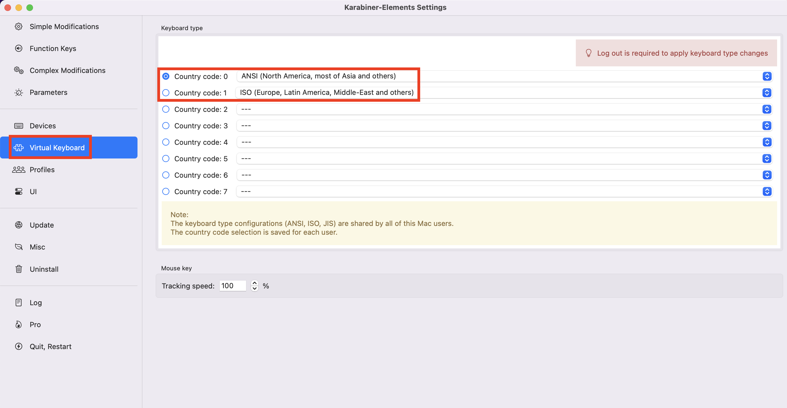

> 최근 생일선물로 해피해킹 키보드를 선물 받았다.  
> 맥이랑 연동시키는 과정에서 무엇이 잘못됐는지, `₩`는 `§`으로, `~`는 `±`으로 나오게 됐다.  
> 별 생각없던 찰나, 개발을 하다가 백틱(\`)을 사용해야할 때, 물결(~)을 사용해야 할 때가 은근히 많았다.  
> 결국 원인은 `karabiner`였다.

 

- karabiner에서 원래는 1번을 사용하고 있었는데, 해피해킹과 블루투스 연결과정에서 무언가를 잘못 건드려서 2번으로 바뀌게 됐다.
- 이후부터 백틱, 물결을 사용할 수 없게되는 악몽이 시작됐다.
- 다시 원인을 찾고보니, karabiner에서 변경할 수 있는 부분이였다.

 

- 해피해킹이라는 키보드를 선물받으면서 개발할 때 생산성을 더 높이고자 했는데, 결국엔 시간을 더 빼았기게 됐다.
- 하지만 이러면서 karabiner 속성에 대해서 더 잘 알게되어 긍정적이라고 생각이 든다. 어쨌든 해결했으니 말이다!
