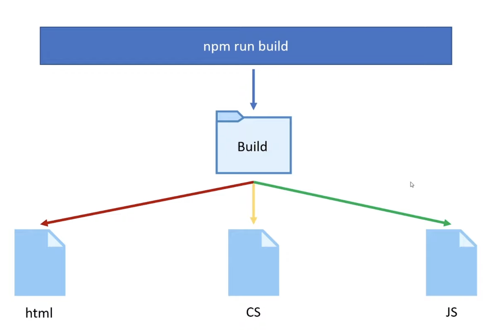
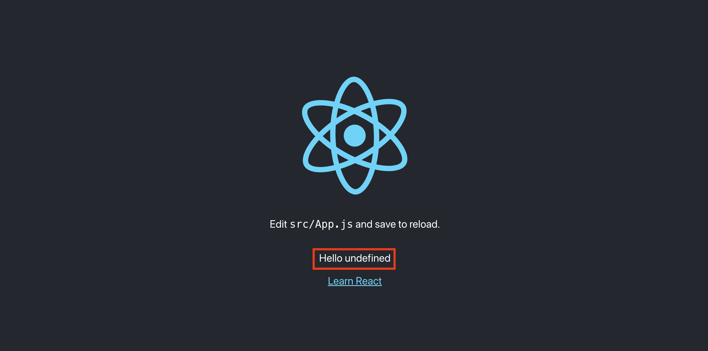

<br>

> [Docker + ReactJS tutorial: Development to Production workflow + multi-stage builds + docker compose](https://youtu.be/3xDAU5cvi5E) 영상을 보고 내용정리.

### 리액트 프로젝트 만들기

```
create-react-app react-docker-yt
```


<br>

### 도커 이미지 만들기

- Dockerfile을 root에 만들어주고 아래와 같이 입력한다.

```DOCKER
# 가져올 이미지 정의 및 버전
FROM node:18.15.0

# 작업할 디렉토리 설정
WORKDIR /app

# package.json을 WORKDIR에 복사
COPY package.json .

# 명령어 실행
RUN npm install

# 현재 디렉토리의 모든 파일을 WORKDIR에 복사
COPY . .

# npm start 스크립트 실행
CMD ["npm", "start"]

# . 찍으면 root를 기준으로 Dockerfile을 찾는다.
docker build .
```

- 빌드 됐는지 확인하기 위해선 다음과 같이 입력해서 확인해보자

```
# 둘은 똑같은 결과물을 보여줌.
docker image ls
docker images
```


<br>

- 위 빌드한 이미지에는 별칭 또는 이름이 없다.
- 위 빌드한 이미지를 삭제하고, 이름을 넣어서 다시 빌드해보자

```
# 방금 이름없이 생성된 이미지 삭제
docker image rm 35f840f6e74d

# react-image라는 이름으로 build
docker build -t react-image .
```

- 여기서 -t 옵션은 이름을 지정해주는 옵션이다.


<br>

### 도커 컨테이너 만들기

```
# docker run -d --name <컨테이너 이름> <이미지 이름>
docker run -d --name react-app react-image
```

- -d 옵션은 detached 모드이고, 이건 [여기](https://github.com/Geuni620/TIL/blob/main/Docker/%5BDocker%5D%20attached%20vs%20detached%20mode.md)서 확인할 수 있다.

<br>

```
# 실행 중인 컨테이너만 확인할 수 있음.
docker ps

# 모든 컨테이너를 확인하고 싶다면
docker ps -a
```

<br>

- 이제 컨테이너를 띄웠으니, localhost:3000으로 접속해보자
- 아무것도 뜨지 않을 것이다.

<br>

### 로컬포트와 도커 컨테이너 노출포트 동기화하기

```
# 아까 입력한 건 이거.
docker run -d --name  react-app react-image

# -p 옵션을 추가해주자, -p <호스트 포트>:<컨테이너 포트>
docker run -d --name  react-app -p 3307:3000 react-image
```

- 호스트 포트를 3307로 지정했음.
- localhost:3307 포트로 접근하는 모든 트래픽을 도커 컨테이너 3000으로 보낸다는 뜻
- 즉, 3307로 접근하면 됨 → 도커 컨테이너 내 3000으로 접속하는 것과 같음.


<br>

### docker container 터미널 환경으로 접속

```
# docker exec -it <컨테이너 이름> bash
docker exec -it react-app bash
```

- 접속한 후 ls를 눌러보면, 개발환경의 모든 파일이 복사되었는지 확인 할 수 있음
- 불필요한 것까지 복사되었음

  - node_modules
  - package-lock.json

<br>

### dockerignore 파일을 만들어서 불필요한 파일을 제외하기

```
# .dockerignore 파일을 만들어서 불필요한 파일들을 제외시킬 수 있음.
node_modules
Dockerfile
.git
.gitignore
.dockerignore
.env
```

- 기존 컨테이너 / 이미지를 모두 제거하고 다시 build하고 컨테이너 띄우기

```
docker rm react-app -f
docker image rm react-image -f
docker build -t react-image .
docker run -d --name react-app -p 3000:3000 react-image

# 이제 ls 찍어서 확인해보기
docker exec -it react-app bash
```


- 단 node_modules는 복사 되어있는데, 이건 컨테이너 내부에서 npm install 한 결과임

<br>

### Volume and Bind Mount

- 코드를 변경했을 때, 도커를 이용해서 띄워놓은 컨테이너의 코드도 변경되는가?
  - 변경되지 않음.
- 그럼 컨테이너 종료 → 다시 이미지 빌드 → 컨테이너 띄우기를 반복하기엔 너무 번거로움.

- **이럴 때 사용하는 것이 Volume과 Bind Mount**


- 우리는 로컬 환경에서 실시간으로 컨테이너에 수정사항을 반영해야함
- 그래서 Bind Mount 방식으로 컨테이너를 띄워보자.

```
# docker run -d --name <컨테이너 이름> -v <호스트 디렉토리>:<컨테이너 디렉토리> <이미지 이름>
docker run -d --name react-app -v $(pwd)/src:/app/src -d -p 3000:3000 --name react-app react-image
```

- local dir과 docker container로 띄운 app dir를 동기화시킴

<br>

```
docker exec -it react-app bash
cd src/
touch hello // 도커 컨테이너 내부에 파일을 만듦


exit

docker rm react-app -f # 그리고 hello 파일도 삭제할 것.
```

- 의도치 않게 컨테이너 환경에서 소스 코드를 수정하게 될 수도 있음
- 이 경우 도커 컨테이너에서 호스트를 수정하지 못하도록 읽기 전용 모드를 사용하면 양방향 Sync에서 호스트 → 컨테이너로 동기화 됨

```
# :ro를 추가해서 읽기전용으로 만듦
docker run -d --name react-app -v $(pwd)/src:/app/src:ro -d -p 3000:3000 --name react-app react-image

docker exec -it react-app bash
cd src
touch hello # 에러 발생, touch: cannot touch 'hello': Read-only file system
```


<br>

### Docker Environment Variables

```JSX
// App.jsx
function App() {
  return (
    <div className="App">
      <p>{`Hello ${process.env.REACT_APP_NAME}`}</p>
    </div>
  );
}

export default App;

//.env
REACT_APP_NAME="myName"
REACT_APP_TITLE="test"
```

```
docker run --env-file ./.env -d --name react-app -v $(pwd)/src:/app/src:ro -d -p 3000:3000 --name react-app react-image
```

<br>

### Docker Compose

- 지금까지 도커 명령어를 입력해보았다.
- 하나씩 추가하다보니, 도커 이미지를 Build하고, 컨테이너를 띄우는 명령어가 너무 길다는 생각이 들었다.
- 이럴 때 사용할 수 있는게 Docker Compose이다.

<br>

- Docker Compose는 여러 컨테이너를 하나의 서비스로 묶어서 관리할 수 있게 해주는 도구이다.

```
# docker-compose.yml

# docker 컨테이너 버전을 명시
version: "3"
# services는 컨테이너를 의미함.
services:
  react-app:
    build: .
    ports:
      - "3000:3000"
    volumes:
      # docker-compose를 사용하면 현재 디렉터리를 기준으로 다음 소스를 슬래시로 구분하여 작성할 수 있음
      # 원래는 $(pwd)/src:/app/src 와 같이 작성해야함.
      - ./src:/app/src
    env_file:
      - ./.env
```

- 위와 같이 docker-compose.yml 파일을 작성하고 난 후 command에 다음과 같이 입력

```
# docker-compose.yml 명시된 모든 서비스 컨테이너를 생성하고 실행시켜주는 명령어
docker-compose up -d
```

<br>


- 이미지[react-docker-yt_react-app] / 컨테이너[react-docker-yt-react-app-1]로 각각 생성되었다.

<br>

```
# 모든 서비스 컨테이너를 한 번에 정지시키고 삭제한다.
docker-compose down
```

- docker-compose down 명령어를 입력하면, 컨테이너가 정지되고 삭제된다.
- 단 이미지는 남아있다.

<br>

그럼 위에서 `-it` 옵션을 써야할 경우는 어떻게 하지?  
다른 말로 docker-compose를 사용해서 docker container 터미널 환경으로 접속하는 방법은?

```
version: "3"
services:
  react-app:
    # stdin_open / tty를 각각 true로 추가해주면 -it옵션을 사용할 수 있다.
    stdin_open: true
    tty: true
    build: .
    ports:
      - "3000:3000"
    volumes:
      - ./src:/app/src
    env_file:
      - ./.env
```

<br>

만약 Dockerfile을 수정했다고 가정해보자

```
FROM node:18.15.0
WORKDIR /app
COPY package.json .
RUN npm install
ENV KOREA_FOOD=good # 이 부분을 추가해주었음.
COPY . .
EXPOSE 3000
CMD ["npm", "start"]
```

그리고 `docker-compose up -d`를 실행했음.
**하지만 image를 다시 빌드하진 않는다.**


이럴 경우는 다음과 같이 docker-compose에게 re-build할 것을 알려주어야한다.

```
 docker-compose up -d --build
```

- 여기까지가 image build와 Container에 관한 내용이었다.
- 이제 Production 환경에 대해 배워보자.
- 지금까지는 develop 환경에서만 실습했다.

---

### 개발환경과 프로덕션 환경 각각 세팅하기


- 지금까진 개발환경에서만 Docker를 사용했음.
- 즉, 브라우저가 localhost:3000번으로 데이터를 달라고 요청을 보냈고, dev server에서 index.html 파일을 전송한 후, JS가 실행되어 웹페이지를 띄웠다.

<br>



- 프로덕션 환경에선, build된 파일(세 개의 정적파일)을 전송하는 것
- 즉, 브라우저가 우리 사이트 포트번호 3000번에 트래픽을 보낸다.
- 그럼 이에 수신하도록 구성된 특정 포트의 도커 컨테이너에 요청을 보낼 수 있음(NGINX가 브라우저에 요청을 받고, Docker의 특정 포트번호에 요청을 보냄)
- 그럼 build된 파일을 전송해줌

<br>


- 실제론 두 단계에 걸쳐서 진행해보자

<br>

- 먼저 Dockerfile을 dev용과 prod용으로 나누자.
- Dev는 `Dockerfile.dev`라고 이름을 변경해줌.

```
# 다시 build 시켜준다.
docker build -f ./Dockerfile.dev .
```

- 여기서 -f 옵션을 넣어서 Dockerfile.dev를 지정시켜준다.
- 원래는 `docker build .`만으로 Dockerfile이 한 개만 있어서 지정되었지만, 이제 prod, dev를 분리했기때문에 지정해주어야한다.

```
# docker-compose.yml
version: "3"
services:
  react-app:
    stdin_open: true
    tty: true
    <!-- 여기를 변경시켜줘야한다. -->
    # 여기서 build를 dev로 지정해준다.
    build:
      context: .
      dockerfile: Dockerfile.dev
    ports:
      - "3000:3000"
    volumes:
      - ./src:/app/src
    env_file:
      - ./.env
```

<br>

- 그리고 나서 Dockerfile.prod를 만들어준다

```
<!-- as를 통해 build라는 이름을 지정해줌 -->
FROM node:18.15.0 as build
WORKDIR /app
COPY package.json .
RUN npm install
COPY . .
<!-- CMD가 아닌 RUN으로 변경한 후 npm run build -->
RUN npm run build


<!-- nginx에 build된 파일을 복사해서 가져가야함 -->
<!-- --from=build local작업공간 nginx작업공간 -->
FROM nginx
COPY  --from=build /app/build /usr/share/nginx/html
```

[How to use this image](https://hub.docker.com/_/nginx)

- nginx작업 공간은 위 홈페이지에서 확인 가능하다.

<br>

- 그리고 command에 다음과 같이 입력

```
docker build -f Dockerfile.prod -t docker-image-prod .
```

<br>


- 그리고 command에 다음과 같이 입력(이전에 길게 적었지만, docker-compose.yml에 등록한 부분)

```
docker run --env-file ./.env -d --name react-app -v -d -p 8000:80 --name react-app-prod docker-image-prod
```

- 여기서 nginx의 포트번호는 80번이다.
- 그래서 8000번으로 접속하면 nginx가 80번 포트로 받게 될 것이다.
- 그리고 코드를 변경해도 아무것도 변경되지 않는다. 그 이유는 production이기 때문.


<br>

### production compose 작성하기

- 기존에 docker-compose.yml은 dev를 기준으로 작성되어 있다.
- 기존에 docker-compose.yml → docker-compose-backup.yml로 변경하고 `docker-compose-dev.yml`, `docker-compose-prod.yml`을 각각 생성하자.
- 그리고 새롭게 docker-compose.yml을 만들어주기.


<br>

- 그리고 docker-compose-backup.yml을 그대로 복사해서 docker-compose.yml에 붙여넣어주기

```
# docker-compose.yml
# docker 컨테이너 버전을 명시
version: "3"

# services는 컨테이너를 의미함.
services:
  react-app:
    stdin_open: true
    tty: true

<!-- 이 부분도 사실은 다르게 구성해야됨. 하지만 여기선 덮어쓰는 방법을 적용해보자. -->
    build:
      context: .
      dockerfile: Dockerfile.dev


<!-- 아래는 여기선 제거했다. 그 이유는 dev, prod 각각에서 재 작성해야하기 때문. -->
    env_file:
      - ./.env
    volumes:
      - ./src:/app/src
    ports:
      - "3000:3000"
```

```
# docker-compose.dev.yml
version: "3"
services:
  react-app:
    stdin_open: true
    tty: true
    build:
      context: .
      dockerfile: Dockerfile.dev
    ports:
      - "3000:3000"
    volumes:
      - ./src:/app/src
    environment:
    <!-- 여기를 각각 다르게 구성했다. dev or prod -->
      - REACT_APP_NAME=keunhwee-dev
```

```
# docker-compose.prod.yml
version: "3"
services:
  react-app:
    stdin_open: true
    tty: true
    build:
      context: .
      dockerfile: Dockerfile.prod
    ports:
      - "8000:80"
    environment:
    <!-- 여기를 각각 다르게 구성했다. dev or prod -->
      - REACT_APP_NAME=keunhwee-prod
```

- 그리고 dev, prod를 실행시키기 위해 다음과 같이 명령어를 입력해줘야함

```
# dev를 docker로 띄움
 docker-compose -f docker-compose.yml -f docker-compose-dev.yml up -d --build

 # dev를 down 시킴
 docker-compose -f docker-compose.yml -f docker-compose-dev.yml down

 # prod를 docker로 띄움
  docker-compose -f docker-compose.yml -f docker-compose-prod.yml up -d --build
```

- 순서를 꼭 지켜줘야한다!

<br>


- volume가 적용되어 있어, 코드를 변경해도 반영된다.

<br>



- env파일이 제대로 동작하지 않는다. 즉, undefined가 떴다.

<br>

- 그 이유는 여기에 있다.

```
# 기존 Dockerfile.prod
FROM node:18.15.0 as build
WORKDIR /app
COPY package.json .
RUN npm install
COPY . .
RUN npm run build

FROM nginx
COPY  --from=build /app/build /usr/share/nginx/html


# 다시 작성한 Dockerfile.prod
FROM node:18.15.0 as build
WORKDIR /app
COPY package.json .
RUN npm install
COPY . .
ARG REACT_APP_NAME
ENV REACT_APP_NAME=$REACT_APP_NAME
RUN npm run build

FROM nginx
COPY  --from=build /app/build /usr/share/nginx/html
```

- npm run build시 .env 환경 변수가 참조되지 못해 undefined로 떴던 것이었다.
- args를 통해 REACT_APP_NAME을 작성한 후, ENV에 달러표시로 REACT_APP_NAME을 변수로 참조하도록 하면, 정상적으로 동작한다.


<br>

### Target Build

- 특정, 일부 단계만 build하고 싶은 경우.

```
# stage.1
FROM node:18.15.0 as build
WORKDIR /app
COPY package.json .
RUN npm install
COPY . .
RUN npm run build

# stage.2
FROM nginx
COPY  --from=build /app/build /usr/share/nginx/html
```

```
docker build --target build -f Dockerfile.prod -t multi-stage-example .
```

- 이렇게 build를 하면 stage.1만 build 된다.


<br>


- target을 지정하지 않은 상태에서 build하면, 아래 nginx까지 함께 build된 것을 확인할 수 있다.

### 참고자료

[프론트엔드 개발자를 위한 Docker로 React 개발 및 배포하기](https://velog.io/@oneook/Docker%EB%A1%9C-React-%EA%B0%9C%EB%B0%9C-%EB%B0%8F-%EB%B0%B0%ED%8F%AC%ED%95%98%EA%B8%B0)

<br>

[Docker 컨테이너에 데이터 저장 (볼륨/바인드 마운트)](https://www.daleseo.com/docker-volumes-bind-mounts/)

<br>

[Docker Compose 커맨드 사용법](https://www.daleseo.com/docker-compose/)
