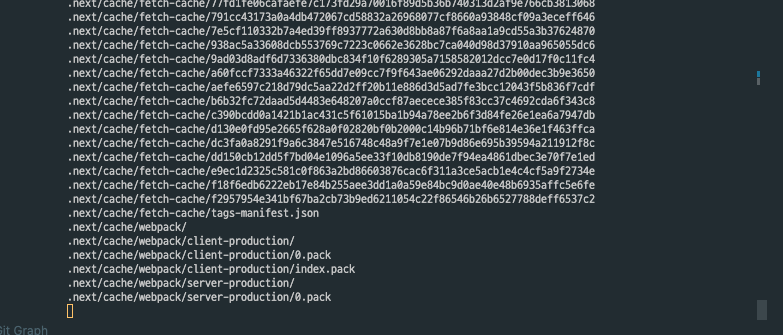

### 장애기록

[deep.jejodo.life](https://deep.jejodo.life/)는 next.js와 react-notion-x, 그리고 notion에서 지원하는 sdk를 이용해서 만든 웹사이트이다.  
처음엔 우리 회사의 콘텐츠를 쌓아둘 웹사이트 공간이 필요했고, 이건 외부에도 공개되었으면 한다는 기획자분의 요구사항을 충족하기 위해 만들기 시작했다.  
처음엔 vercel로 배포를 했었는데, AWS보다 훨씬 간편하기 때문이었다. 그저 env파일을 등록하고 push를 날리면, vercel에서 알아서 배포를 해주고, domain 등록 역시 엄청 편했기 때문에 다른 선택지를 고려하지 않았었다.

 

하지만 vercel에서 이미지 최적화를 해줬는데, 이 용량이 초과되어버리니, 웹사이트의 전환(페이지간의 이동)을 막아버렸다.

- 처음엔 reavalidate Time을 설정해 놓았는데, 데이터 업데이트가 안되었다.
- 그러다가 웹페이지 전환도 안되었다. 왜 안되는거지? 배포가 잘못됐나? app directory의 이상이 있는건가? 여러방면을 고민했다.
- 결국 [NextJS / vercel - 504 Error 'FUNCTION_INVOCATION_TIMEOUT'](https://stackoverflow.com/questions/68771480/nextjs-vercel-504-error-function-invocation-timeout) vercel에서 서버리스 API 경로가 5초를 초과하면 504 게이트웨이 시간초과 오류를 응답한다는 사실을 알게됐고, 요금제를 올려야했다.
- 회사에선 AWS에서 EC2를 통해 배포를 진행하고 있었고, 옆에 계신 동료분 덕분에 vercel에서 AWS로 잘 옮길 수 있었다.
- pro version으로 올리기 위해선 20달러를 내야했는데, 여기서 image 최적화 할당량을 초과할 경우 추가 요금이 부과되었고, youtube에서 vercel 배포 요금이 싸지 않다는 의견이 많이 보여서 AWS EC2를 선택했다.

 

그러다가 어제 deep.jejodo.life 프로젝트 에러가 발생해서 오후 4시부터 접속이 되지 않았다.  
local에선 잘 접속되고, 페이지 이동도 정상적으로 동작하는 반면, Deploy만 하면 에러가 발생했다.

먼저 Deploy를 하면 이후에 넘어가질 않았다. 10분이 지나도 동작하지 않아서 취소 → Deploy를 반복했다.
이전에는 cache를 지우고 다시 Deploy를 하니 잘 동작했는데, 이번엔 이 문제는 아닌 듯 했다.
도메인으로 접속을 했을 때 Server쪽 Proxy 에러 문구를 보고 아파치쪽에 문제가 있는지 동료개발자분께 부탁을 드렸다. 근데 서버쪽 에러는 아닐 것이라는 대답을 들었다. 애플리케이션 자체 문제 인 것 같다는 대답을 듣고 내 애플리케이션 내부를 하나하나 뜯어봤다.

 

하나하나 뜯어보고 주석처리도 해보면서 Deploy를 다시 해보기하고 npm run build → npm run start를 해보면서 확인했다.

 

하필 이렇게 장애가 난 날에 저녁에 약속이 잡혀있었다.
취소하기엔 중요한 약속이라서 사내 메신저에 공유를 하고 저녁약속을 잠깐 다녀온 후 다시 돌아와서 문제를 해결하고 집을 가려고 했다.(내 프로젝트에서 생긴 에러를 그냥 두고 가기가 너무너무 힘들었다.)

 

사내 메신저에 공유를 드리자, 위의 서버문제가 아닐거라고 말씀해주신 동료개발자분이 '혹시 변경사항 없는데도 불구하고 에러가 발생하냐'는 질문을 해주셨고, 그렇다고 말씀드리니, 잠깐 서버쪽을 보셨다.

 

결과적으로 서버쪽 문제가 맞았다. EC2 server 메모리 릭이 발생하고 있었고, 용량 때문에 발생한 문제였다.

 

서버쪽 용량을 reset하고 다시 Deploy 했을 때 정상적으로 웹페이지를 띄울 수 있었다.
결국 내 애플리케이션 문제는 아니었지만, 이를 통해 크게 배운게 있다.

 

1. 프론트는 프론트만 잘하면 되는게 아니라, 웹을 잘 알아야한다는 점.
2. 서버쪽 문제가 발생했다고 서버개발자 탓, 애플리케이션 문제라고 프론트개발자 탓이 아니라 이 문제가 발생했다는 것 자체가 문제고, 누구의 탓도 아니고, 다시 문제가 발생하지 않도록 조치를 취해야 한다는 점.

 

결과적으론 문제를 해결하고 약속장소로 잘 이동할 수 있었다. 이번 계기로 우리 사내의 인프라 아키텍처를 조금 잘 알게 됐다. (EC2, 아파치, 로드밸런싱...) 평소였다면 관심없었을 내용이었지만, 역시 문제를 접하고 해결하려고 하니 배움의 깊이가 다르다는 걸 실감했다.

 

왜 그토록 사람들이 에러를 많이 만나라고 했던건지, 알게됐다.
