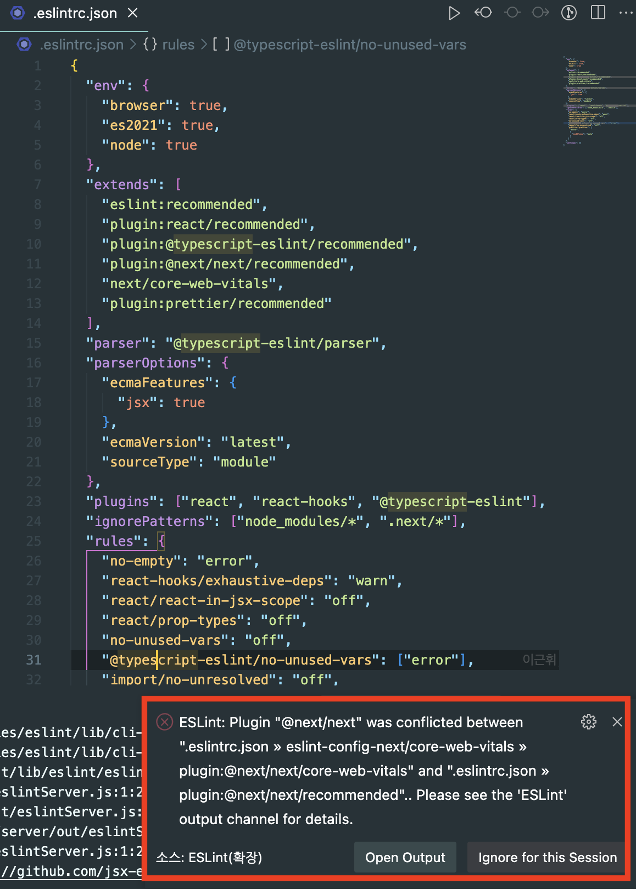

**[Update 2024.02.15]**

> 언젠가 한번쯤 정리하고 싶다는 생각을 했는데 오늘 날 잡았다!

<br>

최근 새롭게 프로젝트 시작하는게 많아서(회사 + 사이드) 프로젝트 세팅을 했다.  
TIL 정리된 내용이 흩어져있어서, 블로그에 정리하며 모아보려고 한다.

> 처음엔 vite와 react를 이용해서 작성했었는데, 결국 두 프로젝트 모두 next.js로 변경됐다.  
> 그래서 큰 제목별 세팅이 2개 포함되어 있는 경우가 있는데, 위는 react+vite 아래는 next.js이다.

<br>

# tsconfig.json

- Typescript로 짜여진 코드는 Javascript로 변환해 줄 트랜스파일러(컴파일러)가 필요.
- 컴파일 과정에서 사용자가 필요한 여러 옵션을 설정가능  
  → 이게 `tsconfig.js`
- `npx tsc --init` 커맨드를 통해 기본형태를 생성가능.

<br>

회사에 처음 프로젝트를 시작할 때도 next.js 12버전으로 세팅을 했었다.  
그때 했던 세팅이 내겐, 가장 잘 맞는 것 같아서 크게 수정하지 않고 사용하고 있다.

```JSON
tsconfig.json
// vite, react 세팅
{
  "compilerOptions": {
    "baseUrl": ".", // 절대경로 지정을 위한 path 설정
    "paths": {
      "@/*": ["src/*"] // 절대경로 지정을 위한 path 설정
    },

    "target": "ES2020", // ECMAScript 대상 버전 지정, 'ES3' (기본), 'ES5', 'ES2015', 'ES2016', 'ES2017', 'ES2018', 'ES2019', 'ES2020', 'ESNEXT'
    "useDefineForClassFields": true, // 클래스 필드에 대한 정의를 사용할지 여부
    "lib": ["ES2020", "DOM", "DOM.Iterable"], // 컴파일에 포함될 파일목록
    "module": "ESNext", // 모듈을 위한 코드 생성 설정: 'none', 'commonjs', 'amd', 'system', 'umd', 'es2015', 'es2020', or 'ESNext'
    "skipLibCheck": true, // 모든 선언 파일(*.d.ts)의 타입 검사를 건너뜁니다.

    /* Bundler mode */
    "moduleResolution": "bundler", // 모듈 해석 방법 결정. Node.js/io.js 스타일 해석의 경우, "Node" 또는 "Classic" 중 하나.
    "allowImportingTsExtensions": true, // .ts 파일을 import할 수 있게 해줌
    "resolveJsonModule": true, // .json 확장자로 import된 모듈을 포함합니다.
    "isolatedModules": true,  // 추가 검사를 수행하여 별도의 컴파일 (예를 들어 트랜스파일된 모듈 혹은 @babel/plugin-transform-typescript)이 안전한지 확인.
    "noEmit": true, // 결과 파일 내보낼지 여부
    "jsx": "react-jsx", // .tsx 파일에서 JSX 지원: "React", "Preserve", "react-native". JSX를 확인

    /* Linting */
    "strict": true, // 모든 엄격한 타입 검사 옵션을 활성화합니다.
    "noUnusedLocals": true, // 사용하지 않는 지역변수 에러보고 여부
    "noUnusedParameters": true, // 사용되지 않은 파라미터에 대한 에러보고 여부
    "noFallthroughCasesInSwitch": true, // switch문을 사용할 때 발생할 수 있는 휴먼에러를 typescript가 잡아줌

    /* Additional options */
    "allowJs": true, // JS파일의 컴파일을 허용
    "forceConsistentCasingInFileNames": true, // 프로젝트 내의 파일 이름이 대소문자를 일관되게 사용하도록 강제
    "incremental": true, // Typescript가 변경된 파일만 type 검사하고, 변경되지 않은 파일은 .tsbuildinfo에 저장해둠(재검사 x) → 컴파일 속도 ↑
    "esModuleInterop": true, /* 모든 imports에 대한 namespace 생성을 통해 CommonJS와 ES Modules 간의 상호 운용성이 생기게할 지 여부,  'allowSyntheticDefaultImports'를 암시적으로 승인합니다. */
    "noImplicitAny": true, // any 타입으로 암시한 표현식과 선언에 오류를 발생시킴
    "alwaysStrict": true, // strict mode에서 파싱하고 각 소스 파일에 대해 "use strict"를 내보냅니다.
    "downlevelIteration": true // es6를 지원하지 않는 환경에서 es6 열거형 객체를 열거하려고 할 때 오류가 나는데, 이 속성을 true로 주면 열거 가능. Set이나, Map이 이에 해당함.
  },
  "include": ["src"], // 원하는 파일 목록 지정
  "references": [{ "path": "./tsconfig.node.json" }], // https://www.typescriptlang.org/docs/handbook/project-references.html
  "exclude": ["node_modules"] // include에 지정한 파일이나 패턴 중 제외할 목록을 지정.
}

/*

"exclude": ["*.dev.ts"]
만약 exclude를 위와 같이 작성하면, 000.dev.ts파일은 타입스크립트가 모두 무시함.

*/


// next.js, 위의 세팅과 거의 유사하다.
{
  "compilerOptions": {
    "baseUrl": ".",
    "target": "es5",
    "lib": ["dom", "dom.iterable", "esnext"],
    "allowJs": true,
    "skipLibCheck": true,
    "strict": true, // react-beautiful-dnd를 사용할 땐 false를 줘야했으나, 예외케이스가 없다면 무조건 true로 두고 사용.
    "forceConsistentCasingInFileNames": true,
    "noEmit": true,
    "incremental": true,
    "esModuleInterop": true,
    "module": "esnext",
    "moduleResolution": "node",
    "resolveJsonModule": true,
    "isolatedModules": true,
    "jsx": "preserve",
    "noImplicitAny": true,
    "noUnusedParameters": true,
    "noUnusedLocals": true,
    "alwaysStrict": true,
    "downlevelIteration": true
  },
  "include": ["next-env.d.ts", "**/*.ts", "**/*.tsx", "next.config.js"],
  "exclude": ["node_modules"]
}
```

- 위 세팅을 하면서 가장 많이 참고했던 [tsconfig.json 컴파일 옵션 정리](https://geonlee.tistory.com/214)와 [컴파일옵션 (Compiler Options)](https://typescript-kr.github.io/pages/compiler-options.html)이다.
- 도저히 이것보다 잘 작성할 수 없어서 링크를 남긴다.

<br>

- 단, vite에선 절대경로 지정하기 위해, package를 하나 설치했다.
- `vite-tsconfig-paths`라는 package이고, 아래와 같이 적용할 수 있다.

```TS
import react from '@vitejs/plugin-react-swc';
import { defineConfig } from 'vite';
import tsconfigPaths from 'vite-tsconfig-paths';

// https://vitejs.dev/config/
export default defineConfig({
  plugins: [react(), tsconfigPaths()],
  server: {
    host: true,
    port: 3000,
  },
});
```

- 그리고 vite는 npm run dev로 dev 서버를 띄웠을 때, 포트번호가 5173으로 열리는 듯하다.
- 3000번으로 지정해주는게 편해서, 위와 같이 host를 3000번으로 설정했다.

<br>

# eslint

```JSON
// vite, react 세팅
{
  "env": { "browser": true, "es2020": true },
  "extends": [
    "eslint:recommended", // ESLint 공식문서에서 권장하는 규칙들이 적용된 옵션
    "plugin:react/recommended", // React 권장 설정 옵션(react-hooks 플러그인이 추가되었으므로 해당 확장 옵션을 통해 규칙을 적용해준다.
    "plugin:@typescript-eslint/recommended",
    "plugin:prettier/recommended",
    "plugin:react-hooks/recommended",
    "plugin:tailwindcss/recommended" // 만약 이걸 설치했다면, vscode extension 중 headwind는 제거해야한다. 충돌이 발생하기 때문.
  ],
  "parser": "@typescript-eslint/parser",
  "parserOptions": {
    "ecmaVersion": "latest",
    "sourceType": "module"
  },
  "plugins": [
    "react-refresh",
    "react",
    "react-hooks",
    "@typescript-eslint",
    "simple-import-sort" // import문의 순서를 lint로 잡아준다.
  ],
  "ignorePatterns": ["node_modules/*"],
  "rules": {
    "no-empty": "error", // 빈칸 있을 시 error
    "react-hooks/exhaustive-deps": "warn", // useEffect내에 사용하고 있는 state를 배열안에 추가시켜 달라는 의미
    "react/react-in-jsx-scope": "off", // 리액트 17 부터 import React from 'react'문을 쓰지 않아도 되는데 ESLint가 잔소리하는 문제
    "react/prop-types": "off",
    "no-unused-vars": "off",
    "@typescript-eslint/no-unused-vars": ["error"], // typescript를 사용하다보면 (value: string) => void 했을 때 value를 사용하지 않아서 에러가 나는 경우가 있음. 이를 방지하기 위해 사용.
    "import/no-unresolved": "off",
    "prettier/prettier": [
      "error",
      {
        "endOfLine": "auto"
      }
    ],
    "eqeqeq": ["error", "always"],
    "react/no-unknown-property": ["error", { "ignore": ["css"] }],
    "simple-import-sort/imports": "error",
    "simple-import-sort/exports": "error",
    "react-refresh/only-export-components": "warn"
  }
}
```

- 보통 next.js를 갓 세팅했을 땐 eslint에 `next/core-web-vitals`이 포함되어 있는데, 위 설정은 react라서 제외했다.
- next.js에서 `next/core-web-vitals`를 사용하지 않는데, 그 이유는 `plugin:@next/next/recommended`와 중복되기 때문이다.

<br>



```JSON
// eslintrc.json
{
  "extends": [
    "plugin:@next/next/recommended",
    "next/core-web-vitals", // 이 옵션은 Next.js에서 ESLint를 구성 시, 기본으로 제공되는 옵션이다.
    // 여기 이 내용이 겹친다고 error가 발생
  ],
}
```

<br>

- 그래서 next.js lint는 다음과 같이 사용한다.

```JSON
// next.js
{
  "env": {
    "browser": true,
    "es2021": true,
    "node": true,
    "jest": true
  },
  "extends": [
    "eslint:recommended", // ESLint 공식문서에서 권장하는 규칙들이 적용된 옵션
    "plugin:react/recommended", // React 권장 설정 옵션(react-hooks 플러그인이 추가되었으므로 해당 확장 옵션을 통해 규칙을 적용해준다.)
    "plugin:@typescript-eslint/recommended",
    "plugin:@next/next/recommended",
    "plugin:prettier/recommended",
    "react-app",
    "react-app/jest",
    "plugin:jest-dom/recommended", // 테스트 코드 관련 lint
    "plugin:testing-library/react" // 테스트 코드 관련 lint
  ],
  "parser": "@typescript-eslint/parser",
  "parserOptions": {
    "ecmaFeatures": {
      "jsx": true
    },
    "ecmaVersion": "latest",
    "sourceType": "module"
  },
  "plugins": [
    "react",
    "react-hooks",
    "@typescript-eslint",
    "jest-dom",
    "testing-library",
    "simple-import-sort"
  ],
  "ignorePatterns": ["node_modules/*", ".next/*"],
  "rules": {
    "no-empty": "error",
    "react-hooks/exhaustive-deps": "warn",
    "react/react-in-jsx-scope": "off", // import React from 'react'문을 작성하지 않아도 lint가 잔소리하지 않게 off
    "react/prop-types": "off",
    "no-unused-vars": "off",
    "@typescript-eslint/no-unused-vars": ["error"],
    "import/no-unresolved": "off",
    "prettier/prettier": [
      "error",
      {
        "endOfLine": "auto"
      }
    ],
    "eqeqeq": ["error", "always"],
    "react/no-unknown-property": ["error", { "ignore": ["css"] }],
    "simple-import-sort/imports": "error",
    "simple-import-sort/exports": "error"
  }
}
```

<br>

# prettier

- prettier은 프로젝트별 구분을 짓지 않고 아래와 같이 사용한다.

```JSON
{
  "singleQuote": true, // single 쿼테이션 사용 여부, 문자열 사용시 '를 사용
  "semi": true,     // 마지막에 ;(세미콜론) 여부
  "useTabs": false,  // 탭 사용 여부
  "tabWidth": 2,  // 탭간격
  "trailingComma": "all",  // 여러 줄을 사용할 때, 후행 콤마 사용 방식, object의 마지막 요소 ',' 여부
  "printWidth": 80, // 줄 바꿈 할 폭 길이
  "arrowParens": "always", // 화살표 함수 괄호 사용 방식
  "bracketSpacing": true, // 객체 리터럴에서 괄호에 공백 삽입 여부 { foo : 'bar' }
  "jsxBracketSameLine": false, // JSX의 마지막 `>`를 다음 줄로 내릴지 여부
  // Update 24.02.16 → 현 시점기준으로 해당 부분은 bracketSameLine으로 변경되었다.
  // https://prettier.io/docs/en/options.html#bracket-line
  "quoteProps": "as-needed" // 필요에 따라 객체 key값에 'a-a-a'와 같이 앞 뒤 콤마 붙여줌.
}
```

위와 같이 설정하고, 프로젝트 내에서 eslint를 다음과 같이 package.json에 설정해둔다.

- 만약 제외되어야하는 항목이 있다면 `.eslintignore`에 추가해준다. 예를 들면 `node_modules`.

```JSON
// package.json
"scripts": {
  "eslint": "eslint ./ --ext .ts,.tsx,.js,.jsx --fix"
},
```

- ts-config, eslint, prettier을 모두 세팅하고 난 후 `npm run eslint`를 실행시켜 전체 format을 일관되게 일치시킨다.
- `npm run eslint`로 eslint 중 package가 설치 안되어있는 것도 추가로 package에 포함시켜준다. 아래와 같이 말이다.
- 이 내용은 [이 블로그에 자세히 설명되어 있다.](https://cresumerjang.github.io/2022/05/03/eslint-prettier-2/)

<br>

### 참고자료

[tsconfig.json 컴파일 옵션 정리](https://geonlee.tistory.com/214)  
[컴파일러 옵션 (Compiler Options)](https://typescript-kr.github.io/pages/compiler-options.html)  
[ESLint 사용 시 React import문 생략하기](https://velog.io/@100pearlcent/ESLint-%EC%82%AC%EC%9A%A9-%EC%8B%9C-React-import%EB%AC%B8-%EC%83%9D%EB%9E%B5%ED%95%98%EA%B8%B0)  
[ESLint의 no-unused-vars 규칙과 typescript 인터페이스 충돌 해결!](https://blog.pumpkin-raccoon.com/79)  
[[Typescript & React & Eslint 환경설정 1편] tsconfig 설정을 해보자](https://velog.io/@xortm854/Typescript-React-Webpack-%ED%99%98%EA%B2%BD%EC%84%A4%EC%A0%95-2%ED%8E%B8-tsconfig-%EC%84%A4%EC%A0%95%EC%9D%84-%ED%95%B4%EB%B3%B4%EC%9E%90)
[ESLint, Prettier 프로젝트에 적용하기](https://cresumerjang.github.io/2022/05/03/eslint-prettier-2/)
