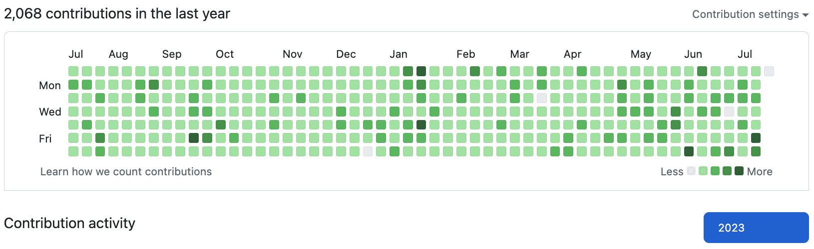
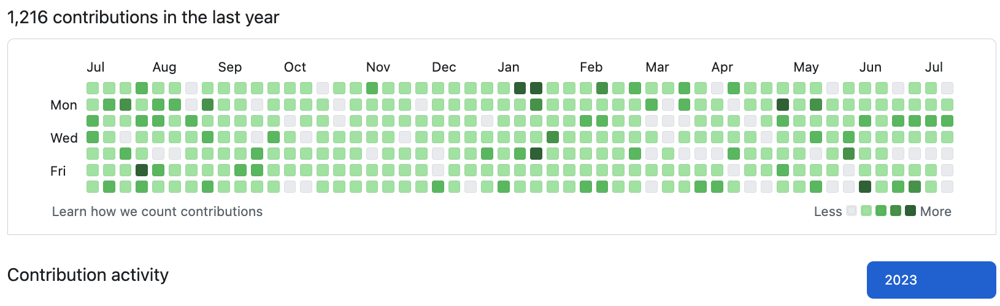

우리 회사는 git을 사용해서 프로젝트를 진행한다.  
다른 회사들과 크게 다른 점은, 각자의 프로덕트를 온전히 담당하는 개발자가 있다는 점이다.

현재는 총 3명의 개발자가 각각의 프로덕트를 개발 중이다. 그러다가, 의논해야할 점이 생기면 3명이서 서로 의논하고, 오너십을 가지고 있는 개발자가 판단해서 결정하게 된다.
그 오너십은 내가 될 수도 있고, 다른 한 명의 동료 개발자 일수도, 아니면 또 다른 한 명의 개발자 일수도 있다.

그래서 온전히 내가 맡고 있는 프로덕트를 개발하고 merge할 때가 많으니 잔디 심는 일은 크게 어렵지 않았다.

 

하지만, 회사의 커밋과 개인의 커밋은 분리해야겠다는 필요성을 느꼈다.
회사에서 일한 내용의 잔디가 심어지면 그건 회사에서 열심히 한 것이지, 회사 퇴근 후 내가 열심히 개발한 것은 아니지 않나.

회사의 커밋으로 인해 잔디를 심었으니, 집에와서 개발을 해야한다는 생각을 덜하게 되고, 자연스럽게 눕게 되는 나를 발견했다.
그래서 최근엔 TIL 정리도, 블로그 정리도 미루는 나를 자주 발견하곤 한다.

 

또 최근 나 스스로가 내가 보낸 하루에 만족하지 못했다. 더 열심히, 더 최선을 다해야한다는 생각을 했는데 집에 돌아오면 생각 뿐이었다.
나는 생각만하고 행동으로 옮기지 않는 걸 너무너무 싫어하는데, 자연스럽게 개발은 뒷전으로 하고 웹서핑하는 나를 발견할 땐 그리고 자려고 누었을 땐 나 스스로에게 실망에 실망을 거듭했다.

 

변화가 필요했다. 그래서 잔디 Private를 모두 숨김처리했다.  
그러니 빼곡히 채워져있던 잔디가 듬성듬성 구멍이 드러나기 시작했다.

  

이렇게 드러내고 나니, 확실히 보이는 것 같다. 이제 다시 시작이다.
