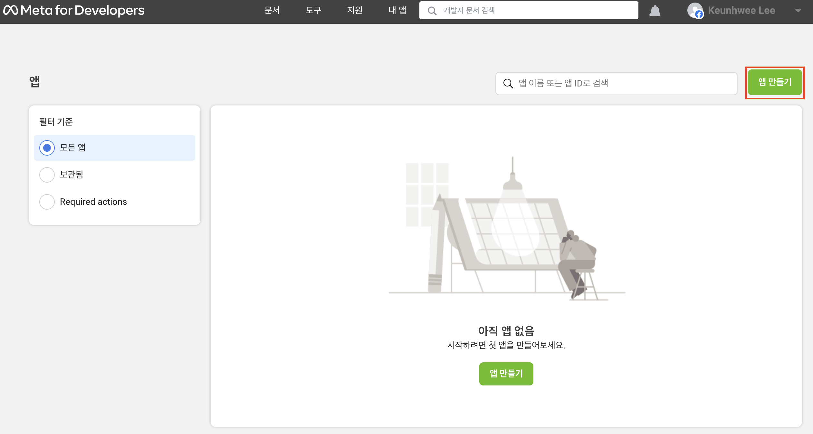
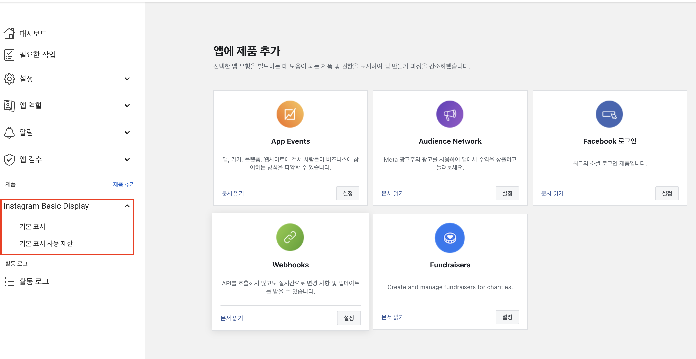
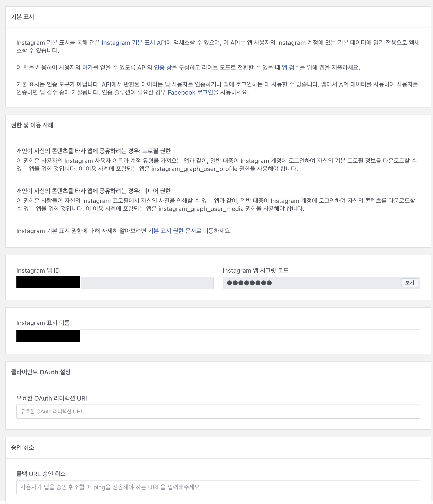
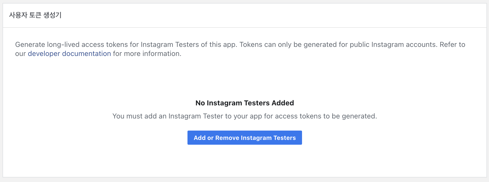
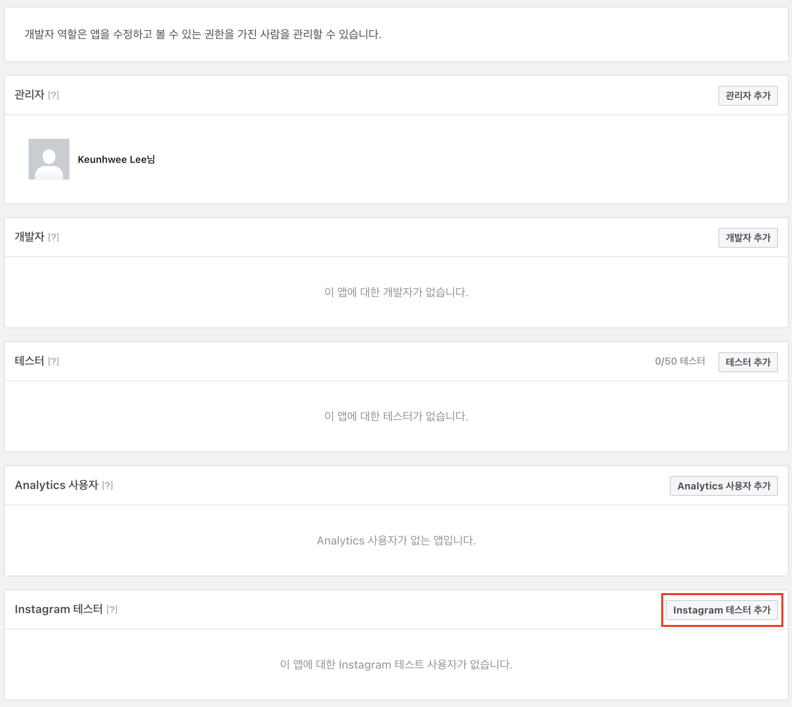
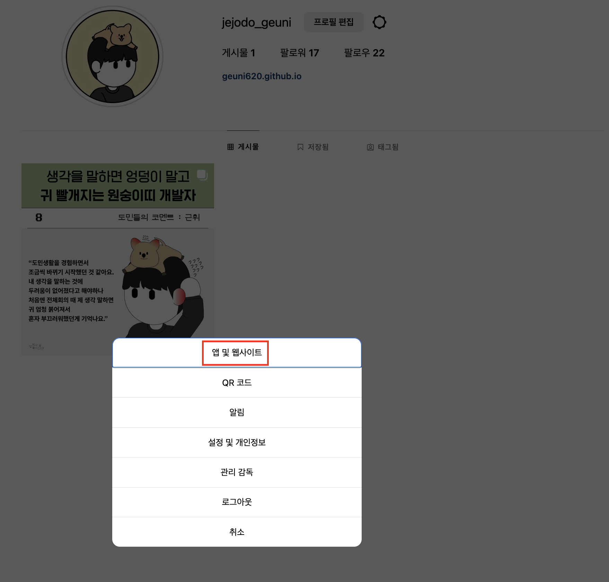
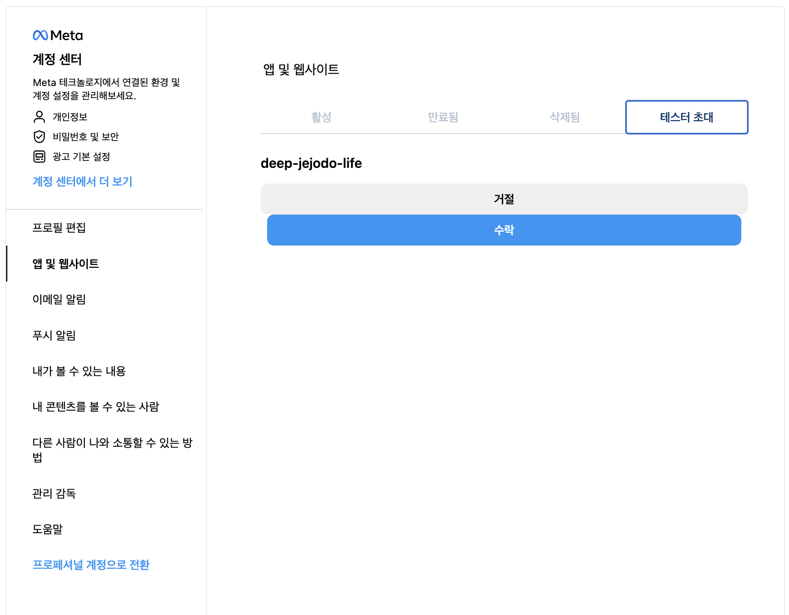
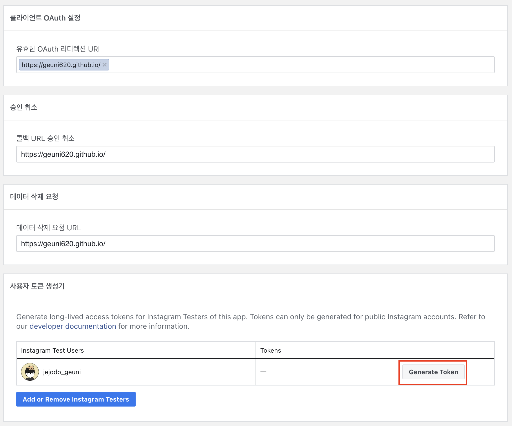
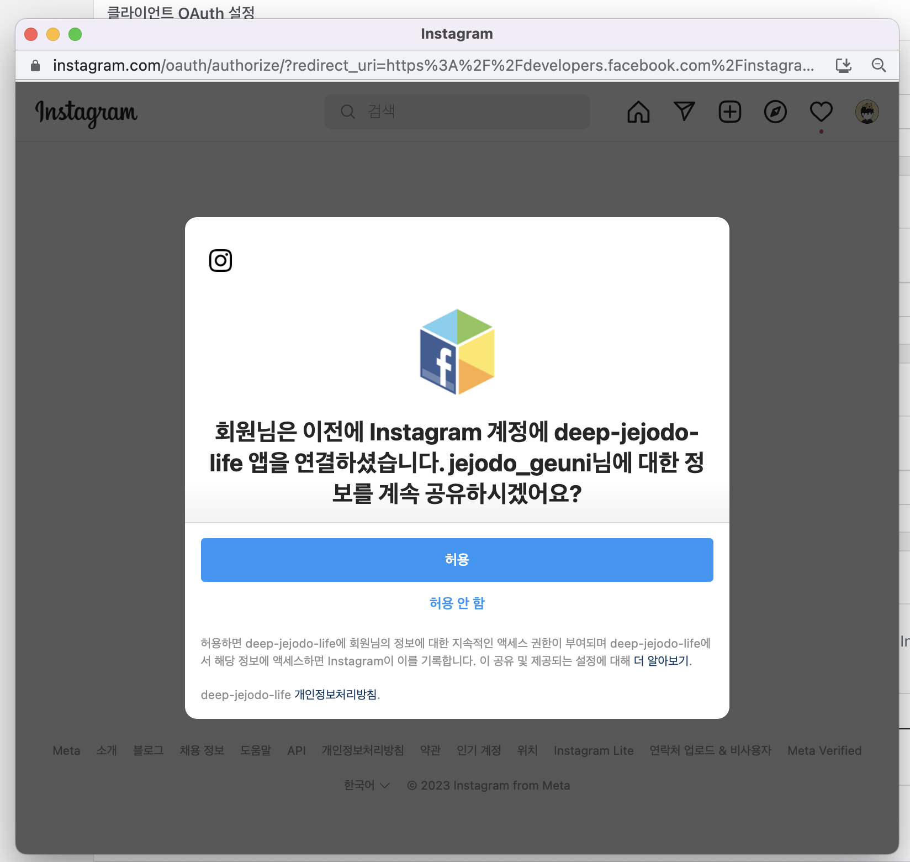

> 얼마 전부터 deep.jejodo.life의 인스타 피드를 가져오지 못했다.  
> 메타에선 인스타그램의 API 할당량을 걸어놓았기 떄문에 할당량이 초과해서 가져오지 못하는 것이라고 생각했다(ISG를 적용했기 떄문)  
> 하지만 다음 날도 인스타 피드를 가져오지 못하는 걸 발견하고 log를 찍어봤다.  
> 결과적으론 API를 사용하기 위한 Token의 기한이 초과됐다.  
> 60일 이전에 재발급을 받아 다시 적용시켜야 했는데, 이를 놓쳐서 이번에 새롭게 일반 토큰과 장기토큰 모두 재발급 받았다.

<br>

### 1. 앱 생성하기

[Meta developer](https://developers.facebook.com/)

- 위 사이트에 접속해서 로그인을 한 후(페이스북 아이디로), 위 상단에서 `내 앱` 탭을 눌러 `앱 만들기`를 눌러준다



- 이 후엔 `앱에 필요한 기능 선택` 페이지가 나오는데, 크게 고민할 필요없다.  
  나는 `기타` → `소비자` → 앱 이름 `deep-jejodo-life` → `앱 만들기 완료`로 앱을 생성했다.

<br>

### 2. Instagram Basic Display

- 앱 만들기를 한 후, 앱에 제품 추가 탭이 나오는데, 여기서 `Instagram Basic Display`를 선택해준다.



- 빨간 네모 박스에 있는 `기본 표시`를 클릭해주자.

<br>

### 3. Tester 추가해주기



- 하단으로 내려보면, `사용자 토큰 생성기` 탭이 있다. 여기서 `Add or Remove Instagram Testers`를 클릭해준다.



<br>



- 그리고 인스타 계정아이디를 닉네임을 눌러서 해당 테스터를 추가해준다.
- 나는 jejodo_geuni 계정을 사용했다.

<br>

- 이제 테스터로 추가해준 인스타그램 아이디에 접속해보자
- 그리고 설정창에 들어가주자(설정창은 프로필 → 프로필편집 옆에 톱니바퀴 버튼)



<br>



- 그리고, 다시 웹사이트로 돌아가자

<br>

### 4. generate token

- 아래 이미지를 보면 generate token을 클릭하면, 로그인 창이 뜨는데, 아까 테스터로 입력했던 아이디로 로그인 해주자.



<br>



- 위 이미지에 동의를 누르면 generate token을 발급받을 수 있다.

<br>


- 그럼 위와 같이 generate token을 발급받을 수 있고, 이를 활용해서 API를 요청보내면 된다.

<br>

```TSX
const getFilteredInstagramFeeds = async (): Promise<Feed[]> => {
  try {
    const feedIds = await getInstagramFeedIds();
    const feedsData = await Promise.all(
      feedIds.map(async (feedId) => {
        const feedData = await getInstagramFeeds(feedId.id);

        if (feedData.media_type === 'VIDEO') {
          return null;
        }

        let base64 = '';
        if (feedData.media_url) {
          const plaiceholderData = await getPlaiceholder(feedData.media_url);
          base64 = plaiceholderData.base64;
        }

        return {
          ...feedData,
          base64,
        };
      }),
    );

    const nonNullFeedsData = feedsData.filter((feedData) => feedData !== null);
    const filteredFeedsData = nonNullFeedsData.filter((feedData) => {
      return dayjs(feedData.timestamp).isAfter('2023-04-01');
    });

    return filteredFeedsData;
  } catch (error) {
    console.error('Error fetching Instagram feeds:', error);
    return [];
  }
};
```

- 위와 같이 요청을 보내서 사용하고 있다.
