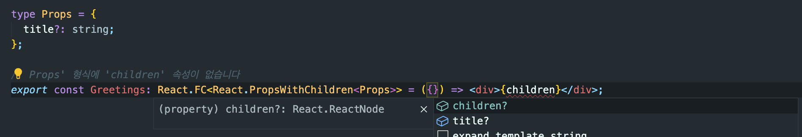
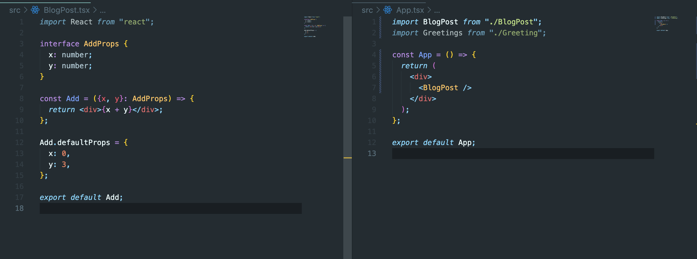
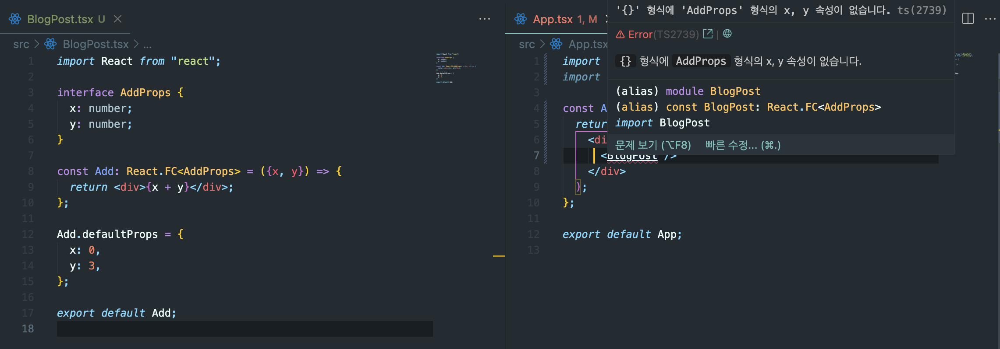

> 코드리뷰를 받는데, 멘토님께서 React.FC타입을 사용하셨다.  
> 이전 한 블로그 글에서 React.FC에 대한 부정적인 사례를 설명해서 궁금증에 질문을 올리려했다.  
> 무턱대고 질문을 올리는 습관은 좋지 못하다. 그 전에 먼저 찾아보고 찾아본 결과를 토대로 질문을 올렸다.  
> 질문 올리기 전, 해당 내용에 대한 정리를 해보았다. TIL에 정리해놓은 내용을 다시 다듬어 블로그에 포스팅해본다.

> 먼저 왜 React.FC타입을 사용하지 않는 건지 찾아보았다.

<br>

## React.FC children



children이 옵셔널 형태로 들어가 있었는데, **React 18 version이 되면서 수정**되었다.

```TSX
type Props = {
  children: React.ReactNode;
};

const Greetings: React.FC<Props> = ({children}) => <div>Hello, {name}</div>;
```

이 컴포넌트는 자식 컴포넌트가 꼭 필요하다는 의도를 타입으로 정의했다. 하지만, 원래는 children이 암묵적 옵셔널 형태로 들어가있었다.

<br>

즉, 수정 전에는 children을 Props 타입으로 명확히 드러내지 않아도 children을 매개변수로 선언했을 때 에러가 나지 않았던 것이다.

<br>

## 기명함수에 적용하기

<br>

자바스크립트에는 함수를 정의하는 대표적인 4가지 방식이 존재한다.

```JS
// 함수 선언문
function add (x, y) {
  return x + y;
}

// 함수 표현식
const add = function (x, y) {
  return x + y;
}

// 화살표 함수
const add = (x, y) => {
  return x + y;
}

// 생성자 함수
const add = new Function('x', 'y', 'return x + y');


console.log(add(1, 2)); // 3
```

<br>

위 코드는 js기준인데, ts기준으로 다시 작성해보자

```TS
// 익명 함수를 변수에 할당하여 타이핑
const add: React.FC<{x: number; y: number}> = function ({x, y}) {
  return x + y;
};

// 또는 화살표함수로 작성할 수 있다
const add: React.FC<{x: number; y: number}> = ({x, y}) => {
  return x + y;
};

// 하지만 기명함수 선언문으로 작성할 수 없다
function add({x, y}) {
  return x + y;
}
```

지극히 개인적인 의견인데, 나는 리액트를 처음 배울 때 `화살표`함수를 사용하는 방법부터 배웠다.  
그래서 함수선언문 표현방식을 잘 사용하지 않는다.

<br>

최근엔 사용하려고 시도했던 것을 생각해보니, next.js app directory내에서 [공식문서](https://nextjs.org/docs/pages/building-your-application/routing/api-routes)를 보고 사용하려고 했던게 기억난다. next.js에서 예시문은 함수선언문으로 작성되어있다.  
그래서 함수선언문으로 타이핑한 후 타입을 적용할 때 React.FC 타입을 매기려고 했는데, 적용되지 않았다.  
결국 화살표함수로 변경해주었다.

<br>

## React.FC defaultProps

```TSX
interface AddProps {
  x: number;
  y: number;
}

const Add = ({x, y}: AddProps) => {
  return <div>{x + y}</div>;
};

Add.defaultProps = {
  x: 0,
  y: 3,
};

export default Add;
```




위 캡처본에서 볼 수 있듯이, React.FC 타입으로 default props를 지정해주면 에러가 난다.

하지만, 과연 default props를 사용하는 경우가 많을까?  
default props를 사용하는 경우는 오히려 가독성이 더 떨어지지 않을까?  
props로 내려주는 값을 상위 컴포넌트에서 확인할 수 없으니 말이다.

최근 가독성 좋은 코드에 대해서 생각해봤을 때, 하위(자식)컴포넌트를 눌러보지 않고, 부모컴포넌트에서 어떤 props가 어떻게 내려가는지 알 수 있는 코드가 가독성 좋은 코드라는 생각이 들었다.

```TSX
const App = () => {
  return (
    <div>
      <BlogPost x={1} y={1} />
    </div>
  );
};


```

위 코드를 그대로 가져와서 사용했을 때 default props를 사용하면 BlogPost에 어떤 prop을 받는지 부모입장에선 알 수 없다.
이 말은 즉, BlogPost를 열거나, 드래그 해봐야 알 수 있다.

<br>

---

적고나니 들었던 생각인데, 내가 불편하게 생각하는 요소는 존재하지 않는 듯하다.  
현재 나의 프로젝트에서는 `React.FC타입`을 적극적으로 사용하고 있고, 지금까진 크게 문제되지 않았다.

<br>

[개발자 커리어에 정해진 방향이 없듯이](https://geuni620.github.io/blog/2023/5/20/%EA%B0%9C%EB%B0%9C%EC%9E%90%EC%9D%98_%EC%BB%A4%EB%A6%AC%EC%96%B4/) 개발의 세계에서도 정답이 존재하지 않는다.

위에 적은 내용 역시 온전히 **'나의'** 기준일 뿐, 다른 분들은 이렇게 생각하지 않을 수도 있다.  
실제, 단톡방에서 React.FC타입보단, JSX.element가 자동추론되는 것이 더 나은 방법이라고 권하시는 분들도 계셨다.

결국, 정답이 없으니, 맞춰가면 되는게 아닐까?  
팀원과 소통하고, 충분한 의견 교환 이후 방향을 결정하면 되는 듯 하다.
고집을 부릴 필요 없고, 팀원이 JSX.element를 쓰자고 하면, 그에 맞게 FC 타입을 권해본 뒤, 타협점을 찾을 것 같다.

<br>

최근에 소프트 스킬, 특히 커뮤니케이션이 갈 수록 중요해질 것이라는 이야기를 들었다.  
완전 공감하는 요즘이다.

<br>

### 참고자료

[2. 리액트 컴포넌트 타입스크립트로 작성하기](https://react.vlpt.us/using-typescript/02-ts-react-basic.html)

[React.FC를 사용하지 않는 이유](https://yceffort.kr/2022/03/dont-use-react-fc)

[타입스크립트 : React.FC는 그만! children 타이핑 올바르게 하기](https://itchallenger.tistory.com/641)
