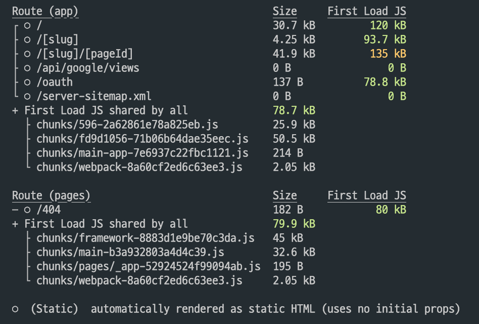
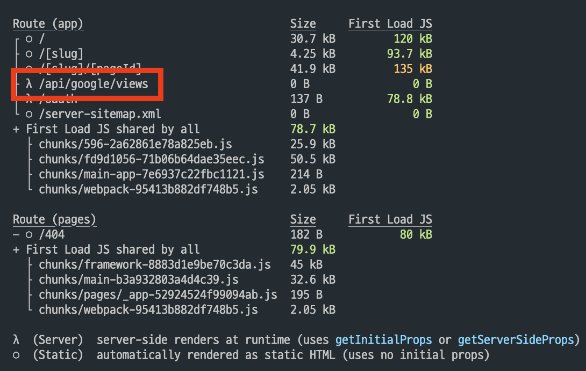

> 요번 주에 [제조도 블로그](https://deep.jejodo.life/)를 만들면서 오랫동안 해결하지 못했던 문제를 해결했다.  
> 제조도 블로그의 사용자 데이터는 google analytics로 쌓고 있는데, 시리님께서 조회수기능이 필요하다고 말씀해주셨고, 기록을 보니 5월 4일이었다.  
> 제조도 블로그는 5월 1일부터 시작했는데, 4일 회의 때 조회수기능이 필요하다는 말씀을 하셨고, PR을 확인해보니 16일에 기능을 merge 했다.  
> 그리고 현재 8월 11일, 그 동안 여러 이슈들이 존재했는데, 조회수 기능이 revalidate time을 적용시켜놓아도 적용되지 않는 이슈가 있었다.  
> Notion / Youtube / Insta까지 revalidate Time이 모두 잘 적용되는데도 불구하고, google analytics의 조회수 기능만 적용되지 않았다.
> 그래서 매번 re-deploy를 해주어야했다. 오늘 명확히 이 문제를 해결할 수 있었다.

<br>

사실 다른 크리티컬한 이슈들이 많이 존재하기도 했고 version.2를 준비하고 있어서 신경쓰지 못했던 것도 있다. 당시엔 어드민 페이지도 작업하고 있었기데, 더 늦어지게 됐다. 그래도 기다려준 시리님께 정-말 감사하다.

어떻게 접근했는지 하나하나 기록으로 남겨보려 한다.

### revalidate time이 적용되지 않는다.

현재 제조도 블로그는 app 디렉토리를 사용했다. app 디렉토리에선 fetch함수 내 revalidate 타입을 지정해 줄 수 있는데, 이 revalidate time을 지정해주면 일정 시간 후 re-generate 하게 된다. 근데, re-generate 하게 되면, 당연히 데이터로 refresh 되어야하는데, 이게 적용되지 않았다.  
그래서 조회수를 업데이트하기 위해선 re-deploy 해주어야했다.

<br>

### next.js의 자체 오류인걸까?

이 생각을 했던 이유가, app 디렉토리를 사용해서 개발할 당시엔 stable 단계가 아니었다. 그래서 사실 stable 단계가 되었을 때도 무슨 이슈가 발생하면 next.js github issue 탭부터 확인했다. 우연히 유튜브 알고리즘을 통해 [이 영상](https://youtu.be/25yjSzl6PsQ)을 확인하게 되었는데, 더욱 의심을 가지게 되었다.

또한 Delete route handler가 적용되지 않는 [이슈](https://github.com/vercel/next.js/issues/48096)도 확인했던 터라 의심의 의심을 불러일으켰다.
잘못 선택한 걸까... 그냥 page 디렉토리로 갔어야했나, 하는 생각도 들었다.

<br>

### 그래도 해결해야한다.

손놓고 있을 순 없지않나, 해결방법을 고민했다. revalidate-time이 적용되지 않는다면, 그냥 client로 넘겨버리면 되지 않을까? 하는 생각이 들었다.
그래서 구글 애널리틱스 코드를 서버컴포넌트에서 클라이언트 컴포넌트로 변경했다. `react-query`까지 설정하고, 보일러플레이트 작성하기 보단, `useEffect`를 통해서 구현했다.(후엔 변경하게 되었지만.)
[주도님](https://github.com/dohyeon2)께서 리뷰를 남겨주셨는데, useEffect로 fetch하는 코드를 보시곤, useQuery쓰는게 더 낫지 않냐는 말씀을 하셨는데, 당시엔 version.2를 만들생각을 하고 있었고, '그 정도 품을 들일 필요 있나 다시 만들게 될텐데..' 하는 **안일한 생각을 했다.**

- 이때 하나 크게 배우게 되었는데, 프로덕트 중 특히, 내가 맡고 있는 주인의식을 가지고 있는 프로덕트에 품이 든다는 생각으로 안일하게 대처하면 **오히려 더 큰 문제가 생기거나 시간이 걸린다는 사실을 알게되었다.**
- 그래도 당시엔, react-query의 보일러플레이트 작성하는 것보다, useEffect로 빠르게 조회수기능만 정상화 시킨 상태에서 version.2에 더 시간을 쓰려고 했던 마음도 있었다.
- 이러나 저라나 나에겐 모두 깨달음을 얻게 해주었다. **결국 상황을 읽고 옳은 판단을 해야 리소스도 줄일 수 있고, 줄인 리소스를 더 나은 곳에 쓸 수 있다는 것이다.** 왜냐하면 시간은 항상 한정되어 있으니.

<br>

```TSX
  const [isClient, setIsClient] = useState(false);
  const [filteredView, setFilteredView] = useState<ViewProps[]>([]);

  useEffect(() => {
    setIsClient(true);

    (async () => {
      try {
        const res = await fetch(
          `${process.env.NEXT_PUBLIC_ORIGIN}/api/google/views`,
        );
        const data = await res.json();
        const postView = data.filter((view: ViewProps) => view.title === title);

        setFilteredView(postView);
      } catch (error) {
        console.log(
          '포스트의 조회수를 가져오는 과정에서 에러가 발생했어요.',
          error,
        );
      }
    })();
  }, []);
```

<br>

역시 위 코드는 적용되지 않았다. 그래서 이상하다는 생각을 했는데, refresh 자체가 되지 않는 것 같았다.  
당시엔 ISG / SSR / SSG / CSR의 개념에 대해 명확히 이해하고 있지 못했다. 특히 데이터 fetch 해오는 과정을 말이다.
그래서 테스트를 해봐야겠다는 생각이 들어 4개의 보일러플레이트를 각각 만들고, build를 각각 해보았다. 서버는 간단히 express로 구현했다.
해당 내용은 [여기](https://geuni620.github.io/blog/2023/8/3/next-build-type/)서 확인할 수 있다.

<br>

테스트를 통해 명확히 알게 되었다. 데이터를 가져올 때 SSG는 refresh 되지 않는다는 사실을. 하지만, 이때까지만 해도 근본적인 원인은 모르고 있었다.
그러다가, 잘 돌아가던 댓글기능이 한번 오류가 발생한 적이 있었는데, 이 과정에서 npm run build로 로컬에서 build후 dev로 띄워보았다.
이때 이걸 보게 되었다.



> ○ (Static) automatically rendered as static HTML (uses no initial props)

○ 이 표시는 Static하게 build 되었다는 의미인데, api 폴더 내에 google/views까지 static하게 build 되어있었다.  
그래서, 이것만 동적으로 풀어주면 되지 않을까? 하는 생각이 들어, 다음과 같이 수정해주었다.



> λ (Server) server-side renders at runtime (uses getInitialProps or getServerSideProps)

λ으로 변경해주고 나니, 정상적으로 조회수가 업데이트 되었다.
물론 중간 과정에 useEffect로 작성했던 fetch코드는 react-query로 변경해준 상태였다.

```TSX
import { useQuery } from '@tanstack/react-query';
import { ViewProps } from 'lib/google';

const getGoogleViews = async () => {
  const res = await fetch(`${process.env.NEXT_PUBLIC_ORIGIN}/api/google/views`);

  if (!res.ok) {
    throw new Error('Network response was not ok');
  }

  return res.json();
};

export const useGoogleViewsGetQuery = (title: string | undefined) => {
  const { data: post } = useQuery(['googleViews', title], getGoogleViews, {
    select: (data) => {
      return data.filter((post: ViewProps) => post.title === title);
    },
  });

  return {
    post,
  };
};
```

위와 같이 변경을 해주니 google analytics의 조회수가 업데이트 될 때마다 refresh한 데이터를 가져온다.

그래서 시행착오를 다음과 같이 겪었다.

1. server-components에서 client-components로 변경
2. useEffect → react-query로 변경 cache를 stale하게 만들면 되지 않을까 했다.
3. cronTab을 적용해서 일정 시간마다 re-deploy하려고 했다. (시도하진 않았다.)
4. 결국 dynamic속성을 변경해주었다.

<br>

그럼 여기서 의문이 드는게, 왜 처음 revalidate time은 적용되지 않았던 걸까?
내 생각엔, 이유는 api폴더에 있다.

```TS
export const dynamic = 'force-static'; // 이건 이해를 위해 추가해준 것.
export const dynamic = 'force-dynamic'; // 이렇게 변경해주어야한다.


const analyticsDataClient = new BetaAnalyticsDataClient({
  credentials: JSON.parse(process.env.ANALYTICS_CREDENTIALS || '{}'),
});

export async function GET() {
  const [response] = await analyticsDataClient.runReport({
    property: `properties/${process.env.ANALYTICS_PROPERTY_ID || ''}`,
    dateRanges: [
      {
        startDate: '2023-05-01',
        endDate: 'today',
      },
    ],
    dimensions: [
      {
        name: 'pageTitle',
      },
    ],
    metrics: [
      {
        name: 'screenPageViews',
      },
    ],
  });

  const data = response.rows?.map((row: any) => {
    return {
      title: row.dimensionValues[0].value,
      views: row.metricValues[0].value,
    };
  });

  return new NextResponse(JSON.stringify(data), { status: 200 });
}
```

이와 같이 사용하고 있는데, 이게 static으로 묶여버리니, 아무리 api를 요청하는 코드를 revalidate time을 걸거나, cache 타임을 조정하거나, 심지어 useEffect로 요청해봤자, api폴더 자체가 refetch 하지 않으면 소용이 없다.

<br>

지금 생각해보니 굳이굳이 api 폴더를 사용할 필요가 있었나 하는 생각도 든다. 그냥 Notion이나, Insta, Youtube처럼 해당 API로 바로 요청을 보내면 되었을 것 같은데, 왜 하필 api폴더를 만들었던 걸까 ㅠㅠ...

<br>

어찌됐건 결국 문제를 해결할 수 있었다. 블로그 내 다른 이슈들도 몇 가지 존재하고, docker내 에러들도 뜨는게 있는데, 차근차근 이슈를 줄여나가야겠다.

<br>

### 번외

[TIL 내용 중 230725 기록](https://github.com/Geuni620/TIL/blob/main/BreadCrumbs/230725.md#server-component--client-component)

- 이때 거의 다 힌트를 적어놓고서 왜 api 폴더가 static이라는 생각을 못했을까..ㅠㅠ
