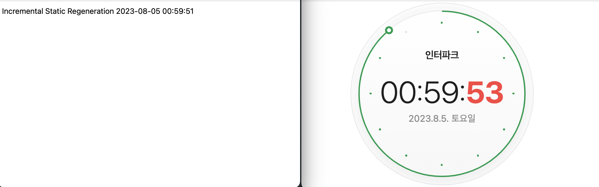
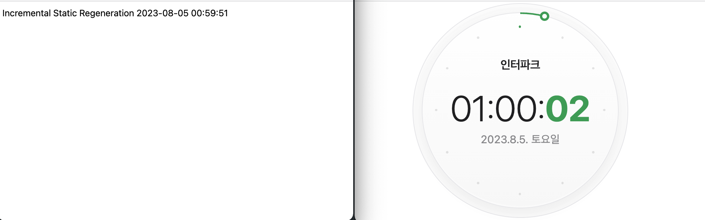
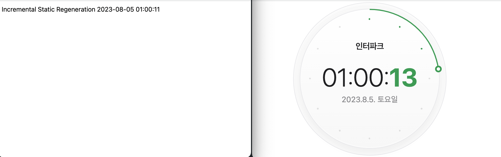
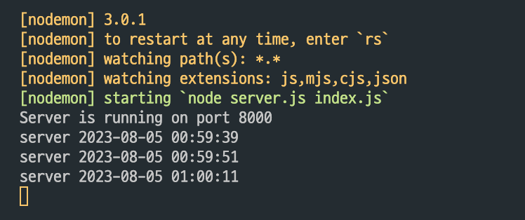

> next.js의 build type은 SSG / SSR / ISG가 있고, react는 CSR이다.
> 그럼 build 했을 때 api로 데이터 fetching을 할텐데, 이건 항상 최신 데이터일까?

<br>

[build type에 따른 데이터 fetcing 실험은 이 github repo에서 확인할 수 있다.](https://github.com/Geuni620/csr-ssr-ssg-isg-fetching.git)

이 실험에선, server를 express를 통해서 간단히 구현했다.

```JS
// server
app.get("/api/time", (req, res) => {
  const date = new Date();
  const YYYY = date.getFullYear();
  const MM = String(date.getMonth() + 1).padStart(2, "0");
  const DD = String(date.getDate()).padStart(2, "0");
  const HH = String(date.getHours()).padStart(2, "0");
  const mm = String(date.getMinutes()).padStart(2, "0");
  const ss = String(date.getSeconds()).padStart(2, "0");

  const data = `${YYYY}-${MM}-${DD} ${HH}:${mm}:${ss}`;
  console.log("server", data);

  res.status(200).json(data);
});

// client
// SSR / SSG
const getTime = async () => {
  const res = await fetch(`http://127.0.0.1:8000/api/time`, {
    cache: "",
    //cache는 SSR과 SSG일 때 각각 다르게 적용해야한다.
    // SSR - no-cache
    // SSG - force-cache
  });

  return res.json();
};

// ISG
const getTime = async () => {
  const res = await fetch(`http://127.0.0.1:8000/api/time`, {
    next: {
      revalidate: 10,
      // ISG의 경우 revalidate Time을 10s로 적용했다. (ms가 아니다!)
    },
  });

  return res.json();
};

export default async function Home() {
  const data = await getTime();

  return <div className="m-2">{`Server Side Render ${data}`}</div>;
}

// CSR, next.js가 아닌 react + vite를 사용했다
function App() {
  const [time, setTime] = useState(null);
  const [loading, setLoading] = useState(true);

  useEffect(() => {
    fetch("http://127.0.0.1:8000/api/time")
      .then((response) => response.json())
      .then((data) => {
        setTime(data);
        setLoading(false);
      })
      .catch((error) => {
        console.error("An error occurred while fetching data:", error);
        setLoading(false);
      });
  }, []);

  return (
    <>
      <div className="card">
        <p>Current time from server: {time}</p>
      </div>
    </>
  );
}

export default App;
```

<br>

api로 요청을 보내면 현재 시간을 반환한다. 정확한 비교를 위해 ms까지 반환한다.
모든 build type은 `npm run build` 이후, `npm start`하여 테스트했다.
결과는 다음과 같다.

CSR - 항상 최신데이터를 반환한다.
SSR - 항상 최신데이터를 반환한다.

<br>

SSG는 build 될 때, 데이터 fetching을 하고, 이때 api통해 반환된 시간에서 **10분 후에 새로고침을 해도 시간이 변경되지 않았다.**

<br>

ISG는 build 될 때 데이터를 fetching하고, revalidate time을 적용하면, 그 time마다 re-generate하게 되는데, 이떄 데이터 fetching을 다시한다.
조금 특이한 점이 있는데 이는 실험한 순서대로 적어보겠다.

1. npm start 후 찍힌 시간()
   

2. 10초 후 새로고침(2023-08-05 00:59:51)
   

3. 새로고침 후 Build 시간이 변경된 시간
   

4. server log
   

<br>

즉 ISG는 다음과 같이 동작한다.

1. build 되었을 때 시간 00:59:51
2. 10초 후 새로고침을 하면 기존에 build 되었을 때 시간을 반환한다 00:59:51

   - 이때 re-generate 되기 시작

3. 새로고침을 계속해도 00:59:51을 반환한다

   - 그러다가 시간이 변경되는데, (01:00:11) 이건 re-generate가 된 후 build 된 시간이다.
   - 즉 re-generate가 끝나는시간은 항상 10초를 보장하지 않는다.
   - re-generate가 1초만에 끝났을 수도 있고, 10초가 넘어가서 끝났을 수도 있다.
   - 즉, re-generate가 끝난 후 요청이 들어오면 re-generate 된 파일을 전달한다.

<br>

### 참고자료

[[Next.js] Incremental Static Regeneration의 revalidate (re-generation)테스트](https://velog.io/@dldngus5/nextjs-revalidate)
