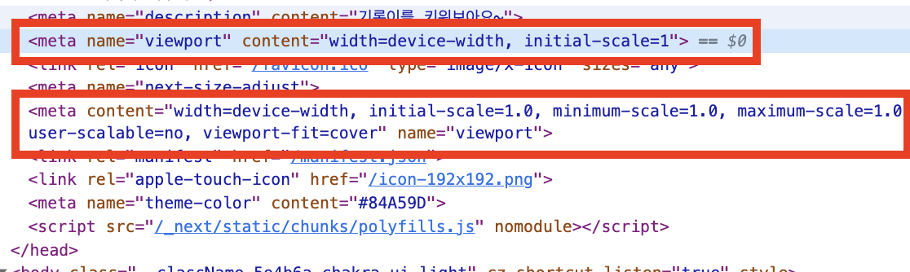

> PWA로 모바일용 애플리케이션을 만들고 있다.  
> 점심을 먹다가, 동료 직원분께 "기록이 서비스 이렇게 사용해보고 있어요."라고 공유드렸는데, "아이폰 아랫부분 Footer가 왜 겹치죠?"라는 질문에 찾아보기 시작했다.  
> 이게 모바일 기준 UI를 잡을 때 노치(notch)라는 걸 알게됐고, 노치대응을 해야한다는 것도 알게 됐다.  
> 하지만 문제는, notch 대응을 했음에도 불구하고, 로그인 후 dashboard → record 페이지로 이동하면, 아래 Footer의 노치대응이 풀려버리고, 다시 dashboard로 돌아오니 노치대응이 되지 않았다.

### Meta tag

노치대응을 위해서 meta tag를 하나 심어줘야하는데, 다음과 같다.

```HTML
// layout.tsx
<head>
  <meta
    content="viewport-fit=cover"
    name="viewport"
  />
</head>
```

- 위와 같은 meta tag를 심어줘야 css notch 속성이 온전히 동작하는 듯 하다.
- 나의 경우엔 다음과 같이 적용했다.

```HTML
// layout.tsx
<head>
  <meta
    content="width=device-width, initial-scale=1.0, minimum-scale=1.0, maximum-scale=1.0, user-scalable=no, viewport-fit=cover"
    name="viewport"
  />
</head>
```

근데, 이상하다. 배포 후 head tag를 찾아보는데, viewport 속성이 `중복`되게 들어가있었다.



viewport 속성을 중복되는 부분을 제거한 상태로 배포를 해보았다.  
그러자, name이 viewport 2개 들어가 있으면, **가장 마지막에 읽힌 viewport만 적용되는 것 같았다.**

<br>

이상했다. 그럼 next.js app directory에선 viewport가 자동으로 심어지는건가? 자동으로 심어지는 건 제거하고, 내가 head tag내에 심은 viewport가 적용되길 바랐다.
next.js github issue 탭을 확인하고, 공식문서에서 meta-tag 적용방법을 확인해보다가 알게됐다.

next.js내에서는 [meta tag 중 viewport](https://nextjs.org/docs/app/api-reference/functions/generate-metadata#viewport)를 링크에서 처럼 적용하도록 되어있었고,
default로 설정되어 있는 상태에서 layout 내에서 head태그를 넣고, 적용하니 **중복**이 발생하는 것이었다.

결국 아래와 같이 수정해주었다.

```TSX
//layout
export const metadata = {
  // ...
  viewport: {
    width: 'device-width',
    initialScale: 1.0,
    minimumScale: 1.0,
    maximumScale: 1.0,
    userScalable: 'no',
    viewportFit: 'cover',
  },
  manifest: {
    href: '/manifest.json',
  },
  icons: {
    apple: '/icon-192x192.png',
  },
  themeColor: '#84A59D',
};
```

- 위와 같이 수정 후, 배포를 하니 **viewport는 1개만 적용**되어있고, 배포 후 페이지를 자유롭게 이동해도 노치 대응한게 풀리지 않는다!
