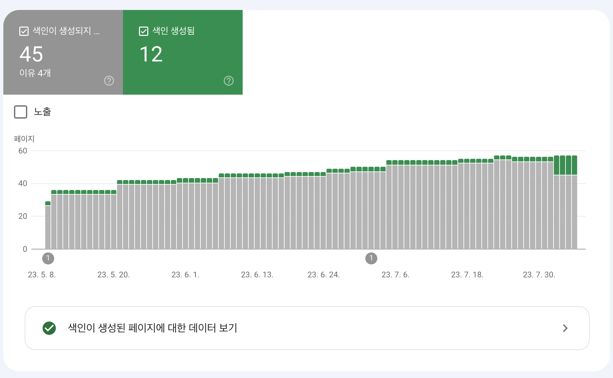

> 사내 블로그와 개인 블로그를 google search console과 네이버 서치어드바이저에 모두 등록시켰다.  
> 하지만, 검색을 해도, 결과로 사내블로그, 개인블로그 모두 나오지 않았다.
> 이유를 확인해보자.

먼저 google search console에서 sitemap을 확인해보자

처음엔 이렇게만 하면 알아서 검색엔진이 나의 글을 잘 긁어가줄 것이라고 생각했다.

 

하지만 색인 생성됨 (12개)의 비해 색인 생성되지 않음(45개)가 훨씬 많았다.  
참고로 색인이 생성되어야 구글에서 검색을 했을 때 나의 블로그가 나온다.  
(참고로 3일 전까진 3개만 생성되어 있었다.)

 

위 사진에서 빨간테두리 박스에 `발견됨 - 현재 색인이 생성되지 않음`을 클릭해보자.

 

`세부정보 보기`를 확인해보아도, 정확한 원인을 파악할 수 없다.

[구글 search console 고객센터 중 '색인이 생성되지 않은 페이지']()를 확인해보면 다음과 같이 적혀있다.

처음엔 `아 그런갑다. 시간 지나면 해결해주겠지.`했지만, 몇 달이 지나도 해결되지 않았다. 결국 다른 방법을 찾아보게 됐다.

 

### 수동으로 색인 등록 요청하기

말그대로 수동으로 색인 등록을 요청했다.
위 `현재 색인이 생성되지 않음` 이미지를 보면 하단에 URL이 보인다.
이 URL을 복사해서 왼쪽 탭에 `URL 검사`를 클릭하고, 복사한 URL을 붙여넣기 한다.

 

그러면 다음과 같은 이미지의 창이 뜨게 되는데,

`색인 생성 요청`을 클릭해주었다.
일일 할당량이 존재하며 하루에 10개까지 등록가능하다.

 

필자는 4일(금요일)에 10개정도를 등록시켰고, 5일(토요일)에도 10개정도를 등록시킨 듯하다. 그리고 오늘 6일 확인 결과 `색인 생성됨`이 3개 → 12개로 늘어았다.

 

같은 방법으로 사내 블로그도 등록시켰고, 현재 검색결과 구글에서 `제대로 된 조직문화 도큐먼트`를 검색하면 사내 블로그가 가장 먼저 뜬다.

 

### 참고자료

[페이지 색인 생성 보고서](https://support.google.com/webmasters/answer/7440203#discovered__unclear_status&zippy=%2C%EB%B9%84%EC%A0%84%EB%AC%B8%EA%B0%80-%EC%82%AC%EC%9A%A9-%EA%B0%80%EC%9D%B4%EB%93%9C)
