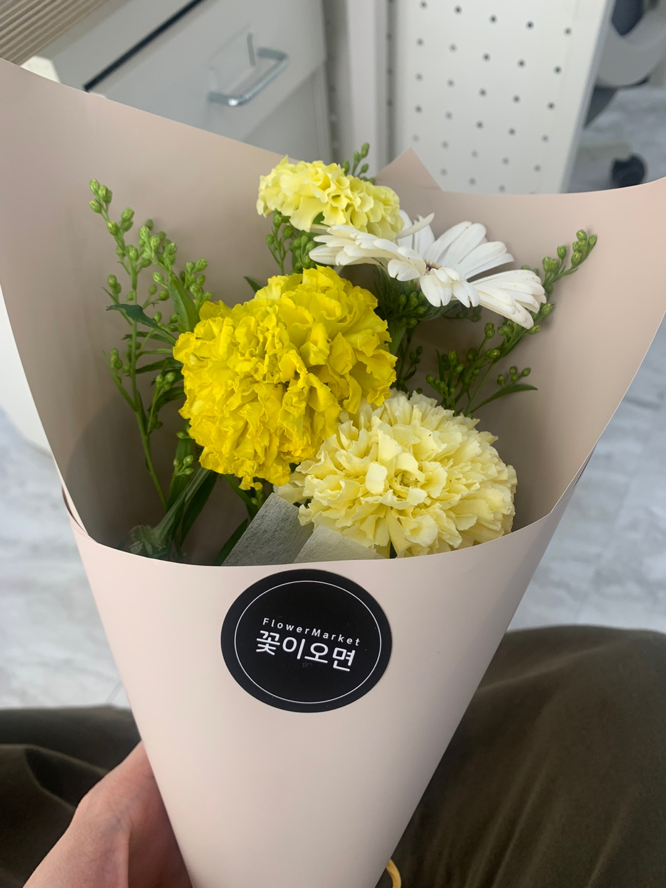

 

2022년 9월 5일 새벽 일기 중

무슨 말을 써야 할지 잘 모르겠다.  
누군가에게 나의 마음을 고백하는 설렘은 아닌 듯하고,
그렇다고 지금의 기분이 슬프다거나, 절망적이지도 않다.
그냥... 단지... '다행이다'는 생각이 가장 먼저 들었다.

 

입사예정인 회사는 사수도 없고, 프론트 신입 개발자 두 명이 다시 들어오는 환경이다. 그리고 현재는 백엔드 신입/경력 공고가 올라와 있는 상태다.
하지만 야생에서 성장할 수 있는 기회라는 생각이 들었다. 하나부터 열까지 나와 새롭게 들어올 동료분과 그리고 추후에 들어오게 될 백엔드 개발자분과 화합을 맞춰가며 서비스를 개발해 볼 수 있는 기회라는 생각이 가장 먼저 들었다.

두려운 마음도 잠시, 새롭게 같이 들어올 동료가 누군지, 앞으로 들어오게 될 백엔드 개발자는 어떤 분일지 하는 생각에 머리아픈 것도 잠시,  
나의 성장 및 다른 분들과의 화합을 잘 이끌어 나갈 수 있도록, 나부터 노력해야겠다는 생각으로 결론을 내렸다.

내일, 나는 첫 출근을 한다.

---

2023년 9월 17일 새벽 일기 중

정신차려보니, 벌써 1년이라는 시간이 지났다.  
위 글에서 같이 들어온 프론트 신입 두 명 중 한 명은 10개월차에 퇴사를 하셨다.  
같이 들어왔던 동료이었던 만큼 정이 많이 들었는데, 본인의 목표 또한 뚜렷하셨기에, 그 앞길을 응원할 뿐이다.

 

그리고 나는 2년차가 되었다.  
프론트라는 포지션에서 일하고 있지만, 사실 우리 개발팀은 조금 특이하다.
각 자가 맡고 있는 프로덕트가 있고, 이 프로덕트의 개발자는 오직 나 하나이다.
그래서 백엔드도, 프론트도 존재하지 않는다. 오직 개발자 라는 포지션만 존재한다.  
최근 봤던 [개발바닥](https://www.youtube.com/live/wn6WHxvdBws?si=1WF6ZXkhIW7a5qWb)영상에선 풀스택 개발자를 뽑는 공고에 많은 비난이 달린다고 한다.
음... 글쎄... 모르겠다. 나는 그저, 프론트이던, 백엔드이던, 이런 건 잘 모르겠고, 그저 프로덕트를 온전히 잘 만들고 싶다.
이 프로덕트를 만들다가 필요하다면, 서버도, 프론트도, 때론 AWS도 만지게 되는 것 같다.

 

성향상으론 사실 프론트를 많이 좋아하는 것 같다. 내가 처음으로 서버도 다루기 시작한 지금 프로젝트엔, 백엔드 코드보다 프론트 코드가 월등히 많다.  
하지만, 위에서 언급했듯 그저, 사용자가 좋아할 만한 프로덕트를 만들고 싶을 뿐이다.

 

1년을 이 회사에서 일하며, 항상 고민이 있다. '이게 맞을까?' 라는 고민이다.  
상대적으로 다른 분들에 비해 개발속도가 느린 나를 보며, '이게 맞나?'  
프로덕트를 만들며 모르는게 너무 많아, 회사에서 개발을 하는게 아니라 공부를 하는 것 같은 나를 보며, '이게 맞나?'  
프론트 코드를 작성하다가, 베스트한 방법이 존재하지 않는 것 같다고 생각을 하게 되었을 때, '이게 맞나'  
등등 수많은 '이게 맞나'를 되뇌이고 고민했다.

 

아직 온전히 내가 만든 프로덕트라고 할 것이 완성되진 않았지만, 내가 무엇을 좋아하고, 어떤 것에 흥미가 있는지. 그리고 어떤 곳으로 나아가고 싶은지 방향을 정하고 있다.
때론, 자신감 없는 모습에 한 없이 절망하기도 하고,  
때론, 나는 만족하지 못하는데, 주위에선 너무 좋아해주실 땐 쑥스럽기 그지없다.

 

앞으로의 1년은 어떨지 궁금하다. 이 뒤에도 무엇이 있을지, 나는 어떻게 변해있을지 궁금하다.  
하지만 지금 놓치고 싶지 않은 생각을 하나 적어놓자면, 지금까지 해왔듯 개발을 즐기며, 성장에 항상 목말라하는 개발자이었으면 좋겠다.  
모르는게 생기면 그냥 넘어가지 않고, 항상 기록을 해놓고 언젠가 그와 같은 문제가 생겼을 땐 깊게 공부해보는 그런 개발자이고 싶다.

 

우연히 유투브에서 [Seasons of Love](https://youtu.be/PgBjMZ4IeKY?si=Dgl_ZkpCyaRyib9S) 영상을 보게 됐고, 이 글을 쓰게 됐다.
시간이 참 빠르다. 돌아보면 많은 것을 하지 못해서 조급해 하곤 했는데, 많은 것들을 벌리고 주워담고 수습못해 다시 흩뿌려놓았다.
그래도 하고자 하는 일을 계속 할 수 있어서 행복하다.
