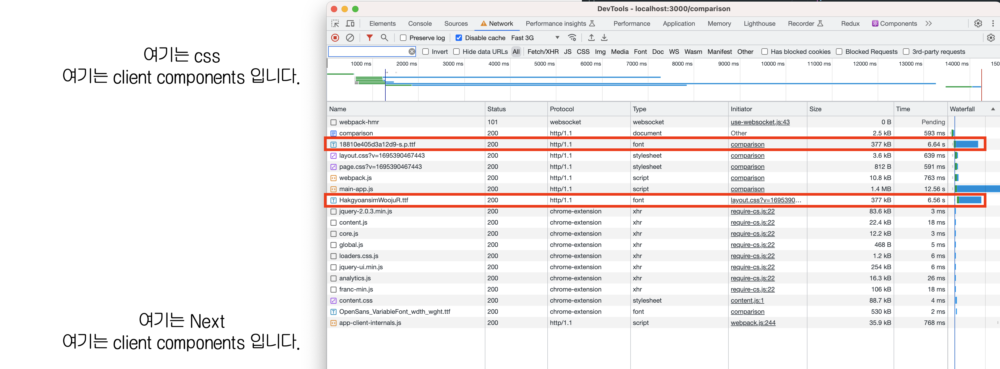

[실험 레포](https://github.com/Geuni620/next-font-test)

<br>

> sign-up 페이지를 작업하다가 font 설정에 대해서 고민하게 됐다.  
> 적용하려는 font는 google font의 항목 중에 존재하지 않는 font였다.  
> 그래서 local에 다운받아놓고 사용하게 된다.

### 적용하기

적용하는 방법은 크게 두 가지가 생각났다.

1. global.css에 다음과 같이 작성한다.

```CSS
// global.css
@tailwind base;
@tailwind components;
@tailwind utilities;

@font-face {
  font-family: 'hakgyoansim';
  src: url('/fonts/HakgyoansimWoojuR.ttf');
}

.fontApply {
  font-family: 'hakgyoansim';
}
```

<br>

2. next/font를 사용한다.

```TS
// utils/fonts.ts
import localFont from 'next/font/local';

export const hakgyoansim = localFont({
  src: './HakgyoansimWoojuR.ttf',
});
```

<br>



```
둘 다 Fast 3G로 테스트했다.

next/font → 6.56s
global.css → 6.64s
```

<br>

테스트하고 보니, 깜빡임현상(font가 다운로드되고 변경되는)이 **layout shift**라고 생각하고 있었다.  
하지만, [이 글에서](https://blog.mathpresso.com/how-next-font-works-8bb72c2bae39) layout shift 현상이 next.js 13version에선 나타나지 않는 것을 확인할 수 있다.

<br>

UI에서 새로고침을 했을 때 font가 fallback 상태일 때, 제공되는 font와 font 다운로드가 완료되고 적용되었을 때 font의 차이가 있으면 왜 신경쓰이는 걸까...  
그래서 조금이라도 더 빨리 적용되는 next/font로 적용해서 사용하고 있다.

<br>

### 참고자료

[Using Fonts in Next.js (Google Fonts, Local Fonts, Tailwind CSS)](https://youtu.be/L8_98i_bMMA?si=ou80EcPUz9HGnx3L)

[Font Optimization](https://nextjs.org/docs/app/building-your-application/optimizing/fonts)

[How @next/font works](https://blog.mathpresso.com/how-next-font-works-8bb72c2bae39)
