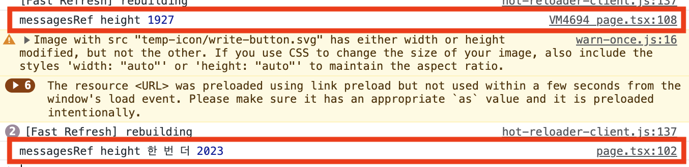
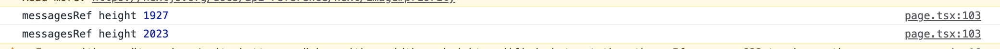
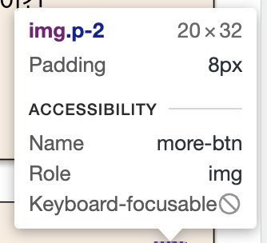

> 현재 만들고 있는 '기록' 앱은, 카카오톡의 '나와의 채팅하기'와 유사하다.  
> 채팅창에 메시지를 남기면, '나와의 채팅하기'처럼 기록을 남길 수 있다.  
> 처음 '나와의 채팅하기'에 들어왔을 때, 또는 기록을 남긴 후 가장 최근에 남긴 기록을 먼저보고 싶을때 등..
> 스크롤을 이용해서 가장 하단에 위치시키는 방법을 알아보자.

<br>

### scrollIntoView

- scrollIntoView 메서드를 사용하면, 사용자가 해당 페이지에 접속했을 때 원하는 위치로 이동시켜줄 수 있다.
- 나의 경우엔 **가장 하단**으로 이동시키기 위해 다음과 같이 코드를 작성했다.

```TSX
// record.tsx
'use client';

const Record: React.FC = () => {
  const messageEndRef = useRef<HTMLDivElement>(null);

  useEffect(() => {
    if (messageEndRef.current) {
      messageEndRef.current?.scrollIntoView({
        behavior: 'smooth',
        block: 'end',
      });
    }
  }, [messages.data]);

  return (
    <section ref={messageEndRef} className="relative mt-[100px] h-full">
      // ... 생략
      <MemoizedMessageList
        messageList={messages.data}
        userEmail={userEmail}
        token={token}
      />
    </section>
  );
};

export default Record;
```

- 위와 같이 작성하면, 최하단으로 scroll을 smooth하게 내려준다.
- 하지만 이상하게, 최하단에 input tag가 존재하는데, 끝까지 내려주지 않는다.
- 그래서 input tag를 클릭하기 위해 사용자가 스크롤을 한 번정도 더 내려줘야 가장 하단으로 이동한다.

<br>

```TSX
  useEffect(() => {
    if (messageEndRef.current) {
      console.log('messagesRef height', messageEndRef.current.scrollHeight); // log로 높이를 한번 확인해보자
      messageEndRef.current?.scrollIntoView({
        behavior: 'smooth',
        block: 'end',
      });
    }
  }, [messages.data]);
```



- 진행도중 여러 방면으로 (네트워크, style, layout shift 등) 찾아봤지만 원인을 발견하지 못했었다.

<br>

### resizeObserver

- 방안을 모색해보다가, `resizeObserver`를 알게됐다.
- 요소의 크기 변화를 관찰하고, 변화가 있을 때마다 어떤 동작을 실행시켜주는 함수다.

```TSX
  useEffect(() => {
    if (messageEndRef.current) {
      const resizeObserver = new ResizeObserver(() => {
        messageEndRef.current?.scrollIntoView({
          behavior: 'smooth',
          block: 'end',
        });
      });

      resizeObserver.observe(messageEndRef.current);

      return () => {
        if (messageEndRef.current) {
          resizeObserver.unobserve(messageEndRef.current);
        }
      };
    }
  }, [messages.data]);
```

- 그래서 위와 같이 적용해주었다. messages.data는 useQuery를 통해 가져오는 데이터인데, 이 데이터가 변화할 때마다 scrollIntoView를 실행시켜주는 것이다.



- resizeObserver가 적용되면, 1927로 log가 찍히고 바로 뒤에 2023으로 찍혀 최하단으로 스크롤을 이동시킬 수 있었다.
- 그래서 처음 채팅방에 들어오면 scrollIntoView만 적용했을 때와 달리 최하단으로 이동시킬 수 있다.

<br>

하지만 이것 역시 문제가 있다.

- next.js [next/image](https://nextjs.org/docs/app/api-reference/components/image)를 사용하면 lazy loading이 되는데, 스크롤을 올리며 이전 기록들을 보며 이미지를 확인하려고 할 때, image가 불러와지니 resizeObserver가 동작한다.
- 그러면 스크롤을 올리고 싶은 사용자의 마음과 반대로 최하단으로 스크롤이 내려가버린다.

<br>

### Image의 priority

- next/image의 `priority`는 lazy loading을 끄는 동작이다.
- 이로인해 처음 record 페이지에 들어가자마자, 이미지는 모두 불러와진 상태일 것이다.

**- 이 부분은 지금 작업 중인 이미지 최적화가 끝나면 다시 작성하려고 한다.**

<br>

### 원인 발견

- 이 글을 작성하며 스크롤이 최하단으로 이동하지 않는 원인을 발견했다.

```TSX
// Record.tsx
'use client';

const Record: React.FC = () => {
  const messageEndRef = useRef<HTMLDivElement>(null);

  useEffect(() => {
    if (messageEndRef.current) {
      messageEndRef.current?.scrollIntoView({
        behavior: 'smooth',
        block: 'end',
      });
    }
  }, [messages.data]);

  return (
    <section ref={messageEndRef} className="relative mt-[100px] h-full">
      // ... 생략
      <MemoizedMessageList
        messageList={messages.data}
        userEmail={userEmail}
        token={token}
      />
    </section>
  );
};

export default Record;
```

<br>

```TSX
// MoreButton.tsx
import Image from 'next/image';
import Dot from 'public/temp-icon/more-nobg.svg';

const MoreButton: React.FC<MoreButtonProps> = ({
  // ...
}) => {

  return (
    <>
      // 원인의 Image
      <Image
        src={Dot}
        alt="more-btn"
        width={20}
        height={20}
        className="p-2"
        onClick={onDropdownClick}
      />

      // 이와 같이 수정하면 해결
      <div className="relative h-5 w-5 p-2">
        <Image src={Dot} alt="more-btn" fill />
      </div>
    </>
  );
};

export default MoreButton;
```

- 위 Dot은 svg파일의 아이콘인데, 다음과 같은 크기를 가지고 있다.

```
// more-nobg.svg

<svg width="3" height="12"></svg>
```

- 여기서 width와 height값이 지정되어 있는데, 이는 figma에서 svg를 그대로 복붙한 값이다.
- 위에서 resizeObserver를 사용하면 log가 두 개 찍히는데, 그 차이는 **60**이었다.
- **message를 6개 남겼을 때 60이 찍힌 것이다.**
- 맨 위의 메시지는 default라서 제외하면 **딱 5개, 즉 12의 차가 계속 누적으로 발생하는 것 같았다.**

<br>

- MoreButton 컴포넌트 내에서도 어떤게 문제인지 확인해보다가,  
  Image의 Dot svg를 확인하니, **height가 20보다 12만큼 더 큰 32로 적용되어 있는 것을 발견했다.**



<br>

- 그래서 div태그로 감싼 후 fill속성을 사용해서 해결하는 방법이 있고,

```TSX
  <div className="relative h-5 w-5 p-2">
    <Image src={Dot} alt="more-btn" fill />
  </div>
```

<br>

- more-nobg.svg의 width와 height값을 다음과 같이 수정할 수 있다.

```
<svg width="5" height="5" viewBox="0 0 3 12" fill="none" xmlns="http://www.w3.org/2000/svg">

</svg>
```

<br>

### 느낀 점

- 회사에서 개발을 진행하다보면, 너무너무 궁금해서 넘어가지 못하는 상황들을 많이 접하게 된다. 원인이 어찌됐건, 일정에 맞게 개발을 진행하고 싶은데, 이게 너무 궁금해서 넘어가지 못하는 상황.
- 그러다보면 자연스럽게 일을 더하게 되고, 집에와서도 찾아보게 된다.
- 개발이 재밌고 즐겁지만, 문제를 해결하지 못해서 앞으로 나아가지 못할 때의 기분은 답답하다. 그래서 온전히 문제에 집중하게 된다.

<br>

- 하지만 일단 원인이 무엇인지 모르더라도, 그냥 쭉 밀고 가보는 것이다.
- 책을 읽을 때의 경험과 비슷하다. 앞의 내용이 기억나지 않더라도 일단 쭉 읽어본 후, 다시 돌아와서 읽어보는 것이다.
- 그러다보면 문제 해결을 위해 글을 쓰는 이 순간처럼 원인이 무엇인지 발견해서 수정할 수 있는 날도 오게 된다.

<br>

- 처음부터 완벽하게 만들 순 없다. 코드도 그렇고 프로덕트도 그렇다.

<br>

### 참고자료

[MDN scrollIntoView() method](https://developer.mozilla.org/en-US/docs/Web/API/Element/scrollIntoView)

[MDN ResizeObserver](https://developer.mozilla.org/en-US/docs/Web/API/ResizeObserver)

[이벤트 발생시 스크롤 맨 밑으로 내리기](https://kyounghwan01.github.io/blog/React/event-scroll-bottom/#ref-%E1%84%82%E1%85%A5%E1%87%82%E1%84%8B%E1%85%B3%E1%86%AF-%E1%84%90%E1%85%A1%E1%84%80%E1%85%A6%E1%86%BA-%E1%84%89%E1%85%A5%E1%86%AF%E1%84%8C%E1%85%A5%E1%86%BC)

[JavaScript - scrollIntoView() 이란](https://devbirdfeet.tistory.com/261)
