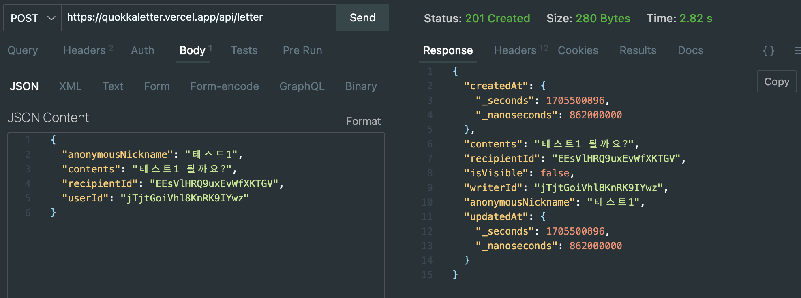
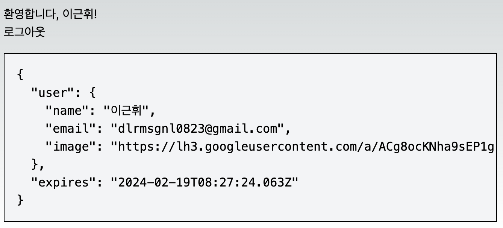
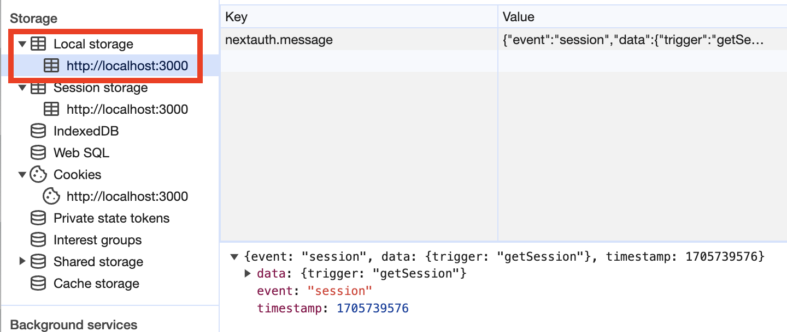
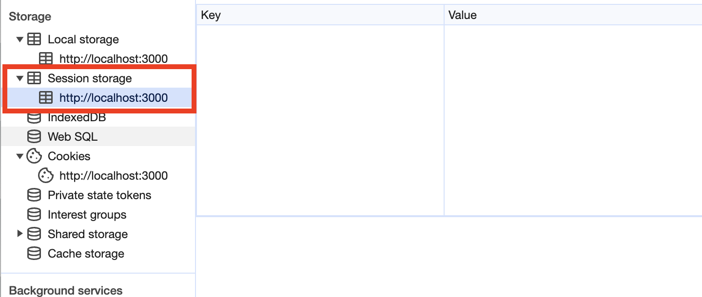
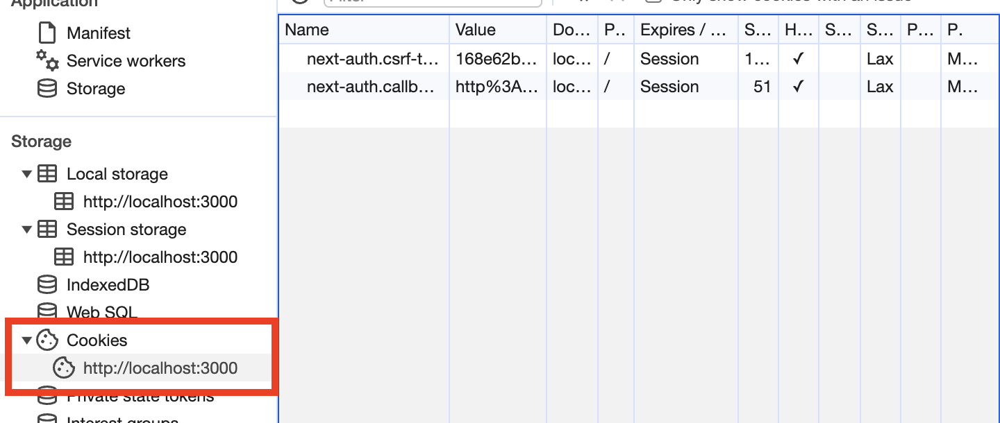
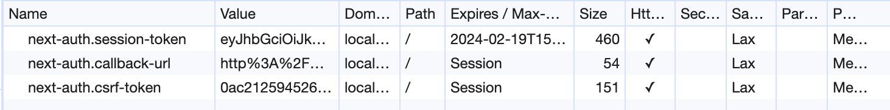
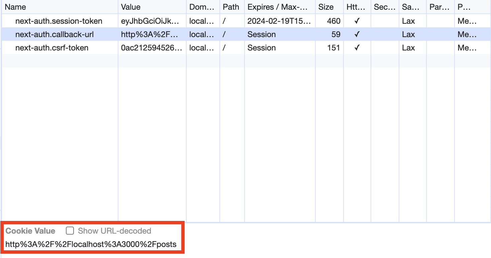
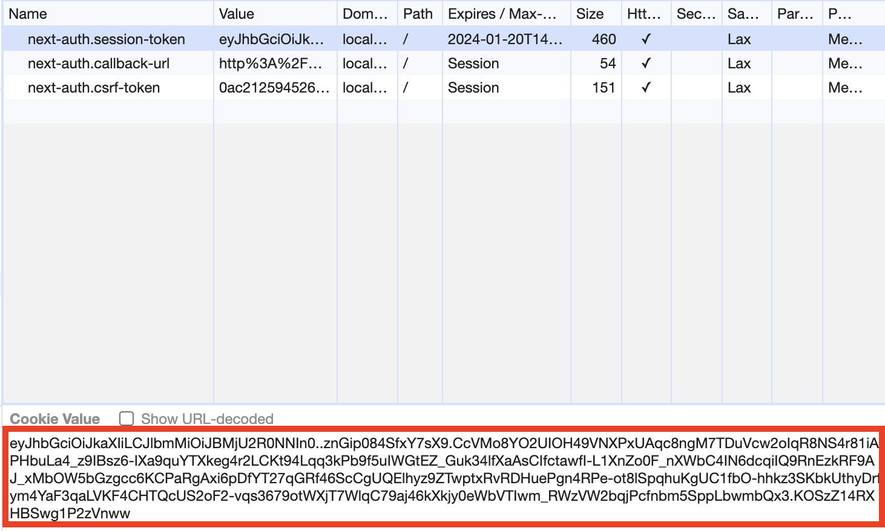
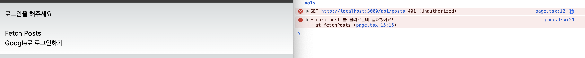
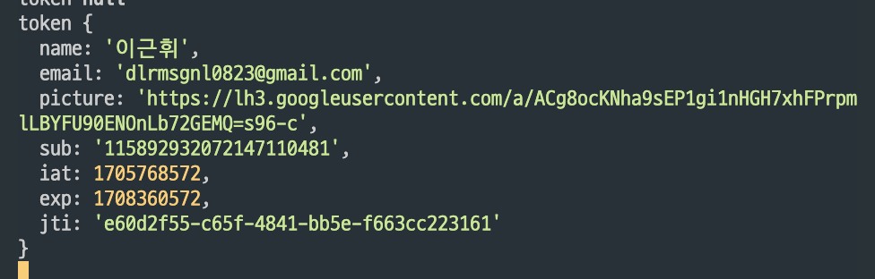

- 작성했던 관련 글  
  [next-auth token 관리하기-1](https://geuni620.github.io/blog/2023/8/18/next-auth/)  
  [next-auth token 관리하기-2](https://geuni620.github.io/blog/2023/8/24/next-auth/)  
  [next-auth token 관리하기-3](https://geuni620.github.io/blog/2023/8/28/next-auth/)  
  [next-auth token 관리하기-4](https://geuni620.github.io/blog/2023/9/10/next-auth/)

<br/>

# 1. Token의 필요성

사이드프로젝트를 진행하다가 의문점이 하나 생겼다.  
next-auth를 사용해 로그인을 했는데(=인증),  
**API요청시 Token을 header에 포함시켜서 요청을 보내지 않는다.**(=인가)

요청을 보낼 때 유저를 구분하는 기준이 `userId`이다.  
**즉, Token을 전혀 사용하고 있지 않다.**

<br/>

머리속에 의문점이 떠올랐다.

> 💬 userId를 다른 사용자가 알고 있다면, postman이나, thunder-client로 DB 데이터를 꺼내오거나,  
> 수정할 수 있는 거 아닌가? 심지어 삭제까지.

그래서 확인해보고 싶어졌다. 과연, userId를 알고 있다면 DB에 데이터를 보낼 수 있을까?



위 이미지처럼 vercel로 임시 배포한 상태로 thunder-client에 데이터를 요청해봤다.  
`userId`와 `recipientId`는 사용자가 다른사람에게 공유하기 위해, 노출되는 부분이다.  
즉, 누구나 쉽게 확인 가능하다.

그렇다면 `userId`나, `recipientId`만 알고 있다면 누구나 DB 데이터를 요청할 수 있고, 삭제도 가능하다는 것이다. 만약 DB의 데이터를 보호해야한다면, `userId`만으로 서버 데이터를 반환하기엔 무리가 있다고 생각되었다.

**이때 Token이 필요하다.**

> 참고로 기획 특성상, 사이드프로젝트에선 Token이 필요하지 않다. 익명으로 누구나 글을 쓸 수 있도록 했고, Delete API는 존재하지 않기 때문이다.

<br/>

# 2. next-auth Token 관리 방법

next-auth의 token을 관리하는 방법에 대해서 알아보자.  
next-auth에선 크게 Token을 관리하는 방법을 [2가지](https://next-auth.js.org/getting-started/upgrade-v4#session-strategy) 소개한다.  
첫번째는, **JWT로 관리하는 방법**이고, 두 번째는 **DB에서 관리하는 방법**이다.

이전 글을 쓸 당시엔, **DB에 token 정보를 담고 싶지 않았다.**  
(당시엔 임시로그인 성향이 강했다. 변경될 여지가 많았기 때문에, DB에서 관리하고 싶지 않았다.)

그래서 JWT를 사용했다.  
JWT가 아닌, DB에서 Token을 관리하려면 next-auth에선 편하게 [adapter](https://next-auth.js.org/adapters)를 제공해준다.

JWT로 Token을 관리할 때 크게 session, access, refresh token을 사용했다.  
여기서 session은 인증을, access와 refresh는 인가에 사용했다.

<br/>

## 2-1. 인증(Authentication)과 인가(Authorization)가 뭘까?

초반에는 둘의 개념이 너무 헷갈렸다.
이를 가장 잘 설명해준 [영상](https://youtu.be/y0xMXlOAfss?si=6oSS8O34KMrJhaS3&t=62)을 찾았다.

해당 영상의 설명을 조금 빌려서 이야기해보자면,  
(나는.. 이상하게 군대밖에 생각나지 않는다.)

휴가를 다녀온 21살의 나, 첫 휴가 복귀할 때 위병소에서 휴가증을 보여주며 복귀를 알린다.
이때 나의 신원을 조회하는 헌병들, 휴가복귀자임을 확인한 후 위병소를 통과시켜준다.
이게 인증이라고 이해했다.

<br/>

복귀하고 일 주일 후, 훈련에 참여하게 된 나.  
내일 있을 사격훈련을 위해 미리 연습한다는 선임  
나에게 총기를 가져오라고 시킨다. 나는, 총기보관함에 뚜벅뚜벅 걸어가지만, 그 앞에 서있는 경계병들.  
그들은 나에게 신원을 확인하지만, 총기보관함에서 총기를 가져갈 권한이 없는 나는 그대로 돌아오게 된다.  
이게 인가라고 이해했다.

<br/>

즉 다시 정리해보면 다음과 같다.

> 인증(Authentication): 서비스에 등록된 유저의 신원을 입증하는 과정 (=로그인)  
> 인가(Authorization): 인증된 사용자에 대한 자원 접근 권한 확인 (=API 요청에 따른 해당 유저의 데이터 반환)

<br/>

# 3. next-auth는 인증을 어떻게 유지할까?

next-auth로 간단히 login을 구현해보자.  
이번에도 DB에 Token을 저장하지 않고, **JWT를 사용했다.**  
그리고 이를 위해, google oauth를 사용했다.

```TSX
// app/api/auth/[...nextauth].ts
import NextAuth from 'next-auth/next';
import GoogleProvider from 'next-auth/providers/google';

const handler = NextAuth({
  secret: process.env.NEXTAUTH_SECRET,
  providers: [
    GoogleProvider({
      clientId: process.env.GOOGLE_CLIENT_ID || '',
      clientSecret: process.env.GOOGLE_CLIENT_SECRET || '',
    }),
  ],
  session: {
    strategy: 'jwt',
    // Seconds - How long until an idle ses
    maxAge: 60 * 60 * 24 * 30, // 30 days
  },
});

export { handler as GET, handler as POST };
```

인증과정을 거쳐서 로그인이 됐다!



하지만 next-auth는 이 로그인을 어떻게 유지하는걸까?  
페이지를 닫았다가, 열어도 로그인이 유지된다.

단, 다른 브라우저로 열거나 크롬의 시크릿모드로 열었을 땐, 로그인이 유지되지 않는다.  
즉, 브라우저 어딘가에서 유저 정보를 저장하고 있는 것 같다.

<br/>

## 3-1. 로그인 했을 때 브라우저에 저장되는 정보

크게 로그인 정보는 `localStorage`나 `SessionStorage`, 또는 `cookie`에 저장할 수 있다.  
구글 시크릿모드로 열어서, **로그인 하기전에** localStorage와 SessionStorage, cookie를 확인해보자.

  
  


Session Storage에는 아무것도 존재하지 않는다.  
하지만 Local Storage와 Cookie에는 next-auth의 정보가 저장된다.

### Local Storage에 저장되는 정보

먼저, LocalStorage에는 정보가 저장될거라 예상못했는데, 확인해보자.  
자세히 보니, `getSession`이라는 단어가 가장 먼저 눈에 띄었다.  
next-auth에서 [getSession](https://next-auth.js.org/getting-started/client#getsession)이라는 API를 제공하는데 그 역할이 무엇인지 확인해봤다.

```
When called, getSession() will send a request to /api/auth/session
and returns a promise with a session object, or null if no session exists.

호출되면 getSession()은 /api/auth/session으로 요청을 보내고
세션 객체가 있는 프로미스를 반환하거나 세션이 존재하지 않는 경우 null을 반환합니다.
```

세션정보를 요청하고, 세션객체가 있다면 세션에 담긴 정보를, 세션이 없다면 null을 반환하는 걸로 보인다.

<br/>

그 다음엔 어떻게 했을 때, localStorage에 이 정보가 저장되는지 확인해봤다.  
next-auth를 사용하기 위해선, 다음과 같이 SessionProvider를 감싸줘야한다.

```TSX
'use client';

import { SessionProvider } from 'next-auth/react';

type Props = {
  children: React.ReactNode;
};

export const AuthContext: React.FC<Props> = ({ children }) => {
  return <SessionProvider>{children}</SessionProvider>;
};
```

SessionProvider로 감싸줘야, useSession hook을 클라이언트 환경에서 사용할 수 있기 때문이다.  
(참고로, 서버에서 사용하려면, [getServerSession](https://next-auth.js.org/configuration/nextjs#getserversession)을 사용한다.)

<br/>

근데 이 provider를 감싸지 않으니, localStorage에 더 이상 정보가 저장되지 않았다.  
그래서 [SessionProvider 내부](https://github.com/nextauthjs/next-auth/blob/a595ca72595b2bd350b23068f9e437726cef9a9d/packages/next-auth/src/react.tsx#L337)를 한 번 확인해봤다.

```TSX
export async function getSession(params?: GetSessionParams) {
  const session = await fetchData<Session>(
    "session",
    __NEXTAUTH,
    logger,
    params
  )
  if (params?.broadcast ?? true) {
    broadcast().postMessage({ // broadcast???
      event: "session",
      data: { trigger: "getSession" },
    })
  }
  return session
}
```

SessionProvider 내부에 getSession이 존재하고, getSession에서 broadcast가 존재한다.  
이 broadcast를 찾아보니, localStorage에 저장하는 로직을 발견했다.

```TSX
// node_modules/next-auth/src/client/_utils.ts
export function BroadcastChannel(name = "nextauth.message") {
  return {
    /** Get notified by other tabs/windows. */
    receive(onReceive: (message: BroadcastMessage) => void) {
      const handler = (event: StorageEvent) => {
        if (event.key !== name) return
        const message: BroadcastMessage = JSON.parse(event.newValue ?? "{}")
        if (message?.event !== "session" || !message?.data) return

        onReceive(message)
      }
      window.addEventListener("storage", handler)
      return () => window.removeEventListener("storage", handler)
    },
    /** Notify other tabs/windows. */
    post(message: Record<string, unknown>) {
      if (typeof window === "undefined") return
      try {
        localStorage.setItem( // 이 부분
          name,
          JSON.stringify({ ...message, timestamp: now() })
        )
      } catch {
        /**
         * The localStorage API isn't always available.
         * It won't work in private mode prior to Safari 11 for example.
         * Notifications are simply dropped if an error is encountered.
         */
      }
    },
  }
}
```

즉, 정리해보면

> localStorage에 저장되는 정보는, session의 상태가 변경될 때마다, broadcast를 통해 localStorage에 저장한다.  
> 그리고 다른 탭이나, 윈도우에서도 localStorage에 저장된 정보를 받아서, 세션 정보를 업데이트한다.

<br/>

### Cookie에 저장되는 정보

다음으로, Cookie에 저장되는 정보를 확인해보자.  
이번엔 **로그인을 한 후에** 확인해보자.



**💬 `next-auth.callback-url`은 인증을 완료한 뒤, 리다이렉트할 url이다.**  
예를들어, 로그인을 하고, `/posts`로 리다이렉트하고 싶다면, 다음과 같이 설정하면 된다.

```TSX
// app/page.tsx
export default function Home() {
  //...

  return (
    <div className="p-4">
      {session ? (
        <>
          <h1>환영합니다, {session.user?.name}!</h1>
          //...
        </>
      ) : (
        <>
          <h1>로그인을 해주세요.</h1>
          <button
            onClick={() =>
              signIn('google', {
                callbackUrl: 'http://localhost:3000/posts', // callbackUrl 설정
              })
            }
          >
            Google로 로그인하기
          </button>
        </>
      )}
    </div>
  );
}
```

callbackUrl을 지정하고 로그인이 완료되면, 쿠키에 다음과 같이 저장된다.



<br/>

**💬 그럼, `next-auth.csrf-token`는 무엇일까?**  
이 부분은 설명이 너무 길어질 것 같아서, [다른 영상](https://youtu.be/cUmIB2sjjdw?si=btICVO6EFSewEf5M)로 대체하려 한다.  
간략히, 보안을 강화하기 위해 하나의 검증수단으로 token을 더 두는 것이다.

참고로, 나는 따로 설정을 해주진 않았다.  
`4-1. 주의할 점`에서도 설명하겠지만, 이 예시에선 서버와 클라이언트 도메인이 일치하기에 sameSite로 인해  
CSRF를 방지할 수 있다고 판단했다.

<br/>

**💬 그럼 마지막으로 `next-auth.session-token`은 무엇일까?**  
next-auth로 로그인을 하면, JWT을 사용하여 세션을 만들 수 있다.  
즉, 사용자가 로그인하면 HttpOnly 쿠키에 JWT가 생성된다.



이 쿠키는 HttpOnly로 만들어져 클라이언트에서 JS로 접근할 수 없다.  
또한, 이 JWT는 Secret키로 암호화되어있다.

```TS
// app/api/auth/[...nextauth].ts
const handler = NextAuth({
  secret: process.env.NEXTAUTH_SECRET, // 여기 Secret Key
  providers: [
    GoogleProvider({
      clientId: process.env.GOOGLE_CLIENT_ID || '',
      clientSecret: process.env.GOOGLE_CLIENT_SECRET || '',
    }),
  ],
  session: {
    strategy: 'jwt',
    maxAge: 60 * 60 * 24 * 30, // 30 days
  },
});
```

사용자가 로그아웃하면 쿠키에서 JWT가 삭제되고, 세션을 없애준다.

<br/>

**💬 근데, 아까부터 나오던 session이란건 뭘까?**  
next-auth에서 제시하는 session이란 한 문장으로 다음과 같다.

> '사용자가 애플리케이션에 로그인하면 일정시간동안 로그인할 필요가 없도록 사용자 정보 저장방법'  
> next-auth에선 세션으로 크게 [두 가지 전략](https://authjs.dev/concepts/session-strategies)을 제시하고 있다.  
> (위에서 언급했던 JWT, Database)

<br/>

## 3-2. next-auth 인증을 유지하는 방법

정리해보면, next-auth에서 인증을 유지하는 방법은, 두 가지가 있다. (JWT, DB)  
이 중, JWT로 인증을 유지하는 방법은, cookie에 저장된 정보(=`next-auth.session-token`)를 통해 유지한다.

그리고 secret key로 암호화되어있기 때문에, 클라이언트에서는 접근할 수 없다.  
만약 만료시간이 끝났을 경우, 다시 로그인을 해야한다.

```TSX
const handler = NextAuth({
  secret: process.env.NEXTAUTH_SECRET,
  providers: [
    GoogleProvider({
      clientId: process.env.GOOGLE_CLIENT_ID || '',
      clientSecret: process.env.GOOGLE_CLIENT_SECRET || '',
    }),
  ],
  session: {
    strategy: 'jwt',
    maxAge: 10, // default 30일 -> 10초로 변경
  },
});
```

위와 같이, JWT maxAge를 10초로 변경했을 경우, 로그인 이후 10초 뒤 로그아웃되고,  
cookie에 `next-auth.session-token`는 삭제된다.

<br/>

# 4. next-auth의 인가는 어떻게 이루어질까?

이제 인가에 대해서 알아보자.
간단하게, api를 하나 만들어보자

```TS
// app/api/posts.ts
import { NextRequest, NextResponse } from 'next/server';
import { getToken } from 'next-auth/jwt';

const posts = [
  //mocking...
];

export async function GET(request: NextRequest) {
  const token = await getToken({ req: request, secret: process.env.SECRET });
  console.log('token', token); // log를 확인

  if (token) {
    return NextResponse.json(posts);
  }

  return NextResponse.json(
    { message: 'Token을 확인해주세요.' },
    { status: 401 },
  );
}
```

로그인을 해서 cookie에 정보가 잘 저장됐다면,  
next-auth에서 제공하는 [getToken](https://next-auth.js.org/tutorials/securing-pages-and-api-routes#using-gettoken) API를 사용해, 암호화된 쿠키 내 유저정보를 복호화할 수 있다.

<br/>

```TSX
// app/pages.tsx
'use client';

import { signIn, signOut, useSession } from 'next-auth/react';
import { useState } from 'react';

export default function Home() {
  const { data: session } = useSession();
  const [posts, setPosts] = useState(null);

  const fetchPosts = async () => {
    try {
      const res = await fetch('/api/posts');

      if (!res.ok) {
        throw new Error('posts를 불러오는데 실패했어요!');
      }

      const data = await res.json();
      setPosts(data);
    } catch (err) {
      console.error(err);
    }
  };

  const renderSessionInfo = () => {
    return (
      <pre className="overflow-auto bg-gray-100 p-4">
        {JSON.stringify(session, null, 2)}
      </pre>
    );
  };

  return (
    <div className="p-4">
      {session ? (
        <>
          <h1>환영합니다, {session.user?.name}!</h1>
          <button onClick={() => signOut()}>로그아웃</button>
          <div className="mt-4 border border-black">{renderSessionInfo()}</div>

          <button onClick={fetchPosts}>Fetch Posts</button> // 로그인 했을 때, posts를 불러오면?
          {posts && <div>{JSON.stringify(posts, null, 2)}</div>}
        </>
      ) : (
        <>
          <h1>로그인을 해주세요.</h1>
          <button onClick={() => signIn('google')}>Google로 로그인하기</button>

          <button onClick={fetchPosts}>Fetch Posts</button> // 로그인 안했을 때, posts를 불러오면?
        </>
      )}
    </div>
  );
}
```

  
cookie에 저장된 token이 없으니, 요청을 보내도 데이터를 반환하지 않고 Error를 던진다.

<br/>



```TSX
  const token = await getToken({ req: request, secret: process.env.SECRET });
  console.log('token', token); // log를 확인
```

getToken에 인자로 포함된 secret와 cookie를 통해 유저 정보를 복호화할 수 있다.

<br/>

### 4-1. 주의할 점

> 몇 달전, 위와 같이 잘 되는걸 확인하고 즐거운 마음으로 퇴근했었다.  
> 하지만, 다음 날 절망했다.. 😩

만약 클라이언트와 서버가 도메인이 각각 다르다면 추가적인 설정이 필요하다.  
관련 내용은 [이 글](https://seob.dev/posts/%EB%B8%8C%EB%9D%BC%EC%9A%B0%EC%A0%80-%EC%BF%A0%ED%82%A4%EC%99%80-SameSite-%EC%86%8D%EC%84%B1/)에서 잘 설명해주신다.

간략히 정리해보자면,

> 쿠키로 인증을 하는 경우, csrf 공격에 취약하다.  
> 그래서 이를 방지하기 위해 [SameSite](https://seob.dev/posts/%EB%B8%8C%EB%9D%BC%EC%9A%B0%EC%A0%80-%EC%BF%A0%ED%82%A4%EC%99%80-SameSite-%EC%86%8D%EC%84%B1/#samesite-%EC%BF%A0%ED%82%A4)가 만들어졌다.
>
> next-auth를 사용하는데, 클라이언트와 서버의 도메인이 각각 다르다면,  
> [추가적인 설정](https://next-auth.js.org/configuration/options#cookies)이 필요하다.

이번의 예시에선, next-auth를 next.js에서만 사용했고,  
배포를 해도 동일한 도메인이기에 문제없이 잘 동작했다. 🍀

<br/>

### 참고자료

- next-auth  
  [Broadcast Channel API](https://developer.mozilla.org/en-US/docs/Web/API/Broadcast_Channel_API)  
  [next-auth Session strategies](https://authjs.dev/concepts/session-strategies)

- cookie  
  [브라우저 쿠키와 SameSite 속성](https://seob.dev/posts/%EB%B8%8C%EB%9D%BC%EC%9A%B0%EC%A0%80-%EC%BF%A0%ED%82%A4%EC%99%80-SameSite-%EC%86%8D%EC%84%B1/)

- csrf  
  [Protecting Next.js apps from CSRF attacks](https://blog.logrocket.com/protecting-next-js-apps-csrf-attacks/)  
  [링크만 클릭했는데 이게 된다고? | 웹 해킹 CSRF 공격 | CSRF 공격 이렇게 한다!](https://www.youtube.com/watch?v=cUmIB2sjjdw)
