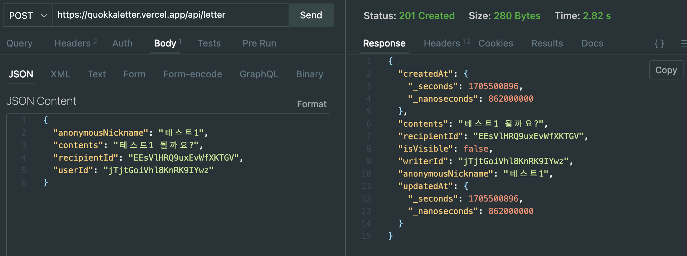
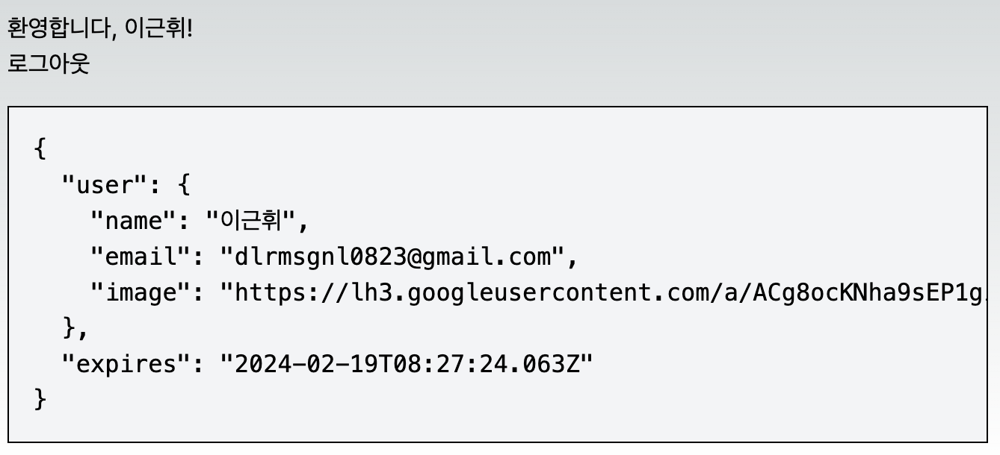
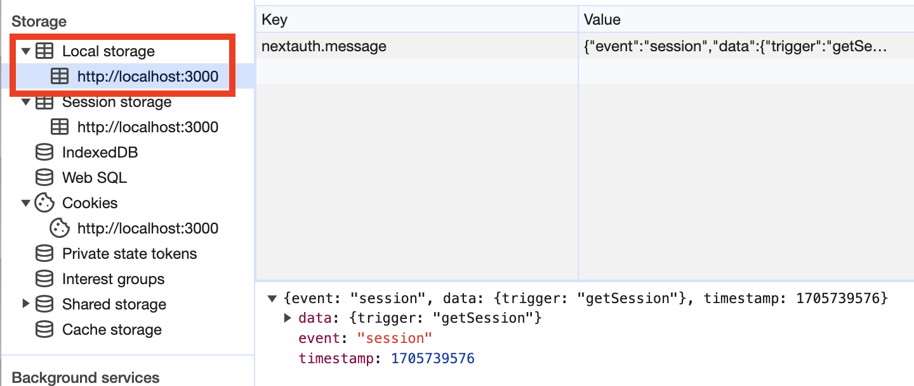

> 이전 `next-auth`를 사용해서 구글 로그인 기능을 추가했었다.

- 당시 작성했던 관련 글  
  [next-auth token 관리하기-1](https://geuni620.github.io/blog/2023/8/18/next-auth/)  
  [next-auth token 관리하기-2](https://geuni620.github.io/blog/2023/8/24/next-auth/)  
  [next-auth token 관리하기-3](https://geuni620.github.io/blog/2023/8/28/next-auth/)  
  [next-auth token 관리하기-4](https://geuni620.github.io/blog/2023/9/10/next-auth/)

<br/>

# 1. 글을 쓰게 된 배경

현재 사이드프로젝트를 진행하고 있다.  
여기서 조금 의아한게 있는데, next-auth를 통해 로그인을 했는데(=인증했는데), **API요청시 Token을 Header에 포함시켜서 요청을 보내지 않는다.**(=인가)
조금 더 풀어서 설명해보면, 요청을 보낼 때 유저를 구분하는 기준이 **userId**이다. 즉, Token을 전혀 사용하고 있지 않다.

<br/>

머릿속에 의문점이 떠올랐다.  
💬 `userId를 다른 사용자가 알고 있다면, postman이나, thunder-client로 DB 데이터를 꺼내오거나, 수정할 수 있는 거 아닌가? 심지어 삭제까지.`  
그래서 확인해보고 싶어졌다. 과연, userId를 알고 있다면 DB에 데이터를 보낼 수 있을까?



위 이미지처럼 vercel로 임시 배포한 상태로 thunder-client에 데이터를 요청해봤다.
여기서 userId와 recipientId는 사용자가 다른사람에게 공유하기 위해선 노출되는 부분이기 때문에 누구나 쉽게 확인할 수 있다.

즉, **userId나, recipientId만 알고 있다면 누구나 DB에 데이터를 요청할 수 있다.**

<br/>

# 2. Token의 필요성

근데 문득 궁금해졌다.  
우리가 만들고 있는 프로젝트에서 Token이 진짜 필요할까?

프로젝트 컨셉은 아래와 같다.  
'나의 공간을 만들고, 지인에게 덕담을 써달라고 웹사이트를 공유한다.'

삭제기능이 존재하지 않고, 비즈니스 컨셉상 DB에 데이터 역시 치명적으로 개인정보를 가지고 있지 않다고 생각됐다.

삭제기능이 존재하지 않고, 비즈니스 컨셉상 '나의 공간을 만들고 지인에게 덕담을 써달라고 공유하는 간단한 컨셉이다.'

# 2. next-auth Token의 종류

next-auth의 token 종류를 알아보기 전, next-auth의 token을 관리하는 방법에 대해서 알아보자.  
next-auth에선 크게 Token을 관리하는 방법을 2가지 소개한다.  
첫번째는, **jwt로 관리하는 방법**이고, 두 번째는 **DB에서 관리하는 방법**이다.

이전 글을 쓸 당시엔, **DB에 token 정보를 담고 싶지 않았다.** 그래서 jwt를 사용했다.
jwt가 아닌, DB에서 Token을 관리하려면 next-auth에선 편하게 [adapter](https://next-auth.js.org/adapters)를 제공해준다.

jwt로 Token을 관리할 때 크게 session, access, refresh token을 사용했다.
여기서 session은 인증을, access와 refresh는 인가에 사용했다.

## 2-1. 인증과 인가가 뭘까?

초반엔 둘의 개념이 너무 헷갈렸다.
이를 가장 잘 설명해준 [영상](https://youtu.be/y0xMXlOAfss?si=6oSS8O34KMrJhaS3&t=62)을 찾았다.

해당 영상의 설명을 조금 빌려서 이야기해보자면,  
(나는... 이상하게 군대밖에 생각나지 않는다.)

휴가를 다녀온 21살의 나, 첫 휴가 복귀할 때 위병소에서 휴가증을 보여주며 복귀를 알린다.
이때 나의 신원을 조회하는 헌병들, 휴가복귀자임을 확인한 후 위병소를 통과시켜준다.
이게 인증이라고 이해했다.

<br/>

복귀하고 일 주일 후, 훈련에 참여하게 된 나, 내일 있을 사격훈련을 위해 미리 연습한다는 선임;
나에게 총기를 가져오라고 시킨다. 나는, 총기소지함에 뚜벅뚜벅 걸어가지만, 그 앞에 서있는 경계병들.
그 들은 나에게 신원을 확인하지만, 총기소지함에 들어갈 권한이 없는 나는 그대로 돌아오게 된다.
이게 인가라고 이해했다.

<br/>

즉 다시 정리해보면  
`인증: 서비스에 등록된 유저의 신원을 입증하는 과정(=로그인)`
`인가: 인증된 사용자에 대한 자원 접근 권한 확인(=API 요청에 따른 해당 유저의 데이터 반환)` 이다.

<br/>

# 3. next-auth는 인증을 어떻게 유지할까?

자, next-auth로 간단히 login을 구현해보자
(이번에도) DB에 token을 저장하지 않고, jwt를 사용했다.
그리고 이를 위해, google oauth를 사용했다.

```TSX
// app/api/auth/[...nextauth].ts
import NextAuth from 'next-auth/next';
import GoogleProvider from 'next-auth/providers/google';

const handler = NextAuth({
  secret: process.env.NEXTAUTH_SECRET,
  providers: [
    GoogleProvider({
      clientId: process.env.GOOGLE_CLIENT_ID || '',
      clientSecret: process.env.GOOGLE_CLIENT_SECRET || '',
    }),
  ],
  session: {
    strategy: 'jwt',
    // Seconds - How long until an idle ses
    maxAge: 30, // 30 days
  },
});

export { handler as GET, handler as POST };
```

인증과정을 거쳐서 로그인이 됐다!



하지만 next-auth는 이 로그인을 어떻게 유지하는걸까?
페이지를 닫았다가, 열어도 로그인이 유지된다.
단, 다른 브라우저로 열거나 크롬의 시크릿모드로 열었을 땐, 로그인이 유지되지 않는다.
즉, 브라우저 어딘가에서 유저 정보를 저장하고 있을 것 이다.

<br/>

크게 로그인 정보는 localStorage나 SessionStorage, 또는 cookie에 저장할 수 있다.
한번 확인해보자.

구글 시크릿모드로 열어서, 로그인 하기전에 localStorage와 SessionStorage, cookie를 확인해보자.

  
  


Session Storage에는 아무것도 존재하지 않는다. 하지만 Local Storage와 Cookie에는 next-auth의 정보가 저장된다.
먼저, LocalStorage에는 정보가 저장될거라 예상못했는데, 확인해보자

먼저 next-auth에서 [getSession](https://next-auth.js.org/getting-started/client#getsession)이라는 API를 제공하는데 그 역할이 무엇인지 확인해봤다.

# 4. next-auth의 인가는 어떻게 이루어질까?
