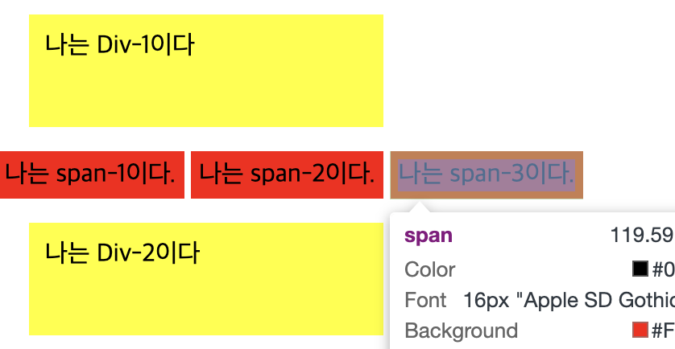
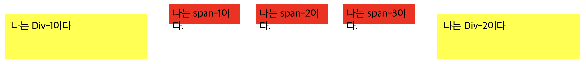

> 작년 12월부터 개발을 할 때, 시간이 오래걸리는 내 모습을 보면서 '어떤 부분이 부족한 걸까' 고민하기 시작했다.  
> 모든 부분에서 한 없이 부족하지만, 현실적으로 개발을 하는 '실무'에선 **Typescript**와 **CSS**가 가장 부족하다는 생각이 들었다.  
> Typescript는 이펙티브 타입스크립트를 구입해서 공부하고 있다.  
> CSS는 사이드프로젝트를 하면서 알게 된 부분을 정리해보려고 한다.

# 1. aspect-radio

- 원본 이미지 비율을 유지하면서, 크기를 조절하고 싶을 때 aspect-radio를 사용하면 된다.

```CSS
// 실제 편지지 이미지를 모달창으로 구현할 때 모바일 width / height를 고려해서 aspect-ratio를 사용했다.
.letter-bg {
  width: 100%;
  height: auto;
  aspect-ratio: 598 / 708;
  background-color: white;
  background-image: url('/images/letter-bg.png');
  background-repeat: no-repeat;
  background-size: contain;
  background-position: center bottom;
}
```

- 특히 모바일 뷰를 개발할 때 모바일의 크기가 모두 제각각이다. 이를 모두 대응하려면 aspect-radio를 사용하는 것이 좋다.

# 1-1. 예외상황

- aspect-radio가 적용되지 않는 3가지 예외상황이 있다.
- 특히, CSS는 예외상황을 알지 못할 경우 에러를 발생시키지 않는다. 그래서 예외상황을 알아야 한다.

1. width, height가 고정으로 지정되었을 경우.
2. 마찬가지고 min-height, min-width와 같이 고정으로 지정되었을 경우.
3. 내용이 element의 크기를 넘어갈 경우.

<br/>

# 2. inline-block, inline, inline-flex

> 이건 진짜 매번 헷갈린다. inline-flex는 사실 처음 알았다;  
> 이전에 정리해놓은 내용이 있다. 인용해서 다시 정리해보려고 한다.

## 2-1. inline

```HTML
 <div>나는 Div-1이다</div>
 <span>나는 span-1이다.</span>
 <span>나는 span-2이다.</span>
 <span>나는 span-3이다.</span>
 <div>나는 Div-2이다</div>
```

```CSS
div {
  background: yellow;
  width: 200px;
  height: 50px;
  margin: 20px;
  padding: 10px;
}

span {
  background: red;
  width: 100px;
  height: 20px;
  margin: 10px;
  padding: 5px;
}
```

> in the same line 이라는 뜻 (같은 줄에 위치할 수 있음)

<br/>

- 하나의 요소(inline) 옆에 다른 요소(inline)이 올 수 있음  
   

<br/>

- inline는 **너비와 높이가 없음**
  

  - background-color하면 **색이 안칠해짐.**
  - 하지만 문자, 또는 어떤 내용이 들어 있을 경우 색이 보임

<br/>

- inline는 margin과 padding을 줄 수 있음

  - span(inline)는 margin을 사방으로 주더라도 좌/우만 적용되는 것을 확인가능  
    (명확히 하기 위해 padding은 잠깐 주석처리했었음)  
     
  - padding은 전 방향 모두 줄 수 있음  
      
    단, [이 블로그](https://hoya-kim.github.io/2021/08/25/padding-on-inline-element/)에서 제시하듯이, inline은 height값이 없기 때문에, position이 block인 element와 수직으로 놓을 경우, 겹치는 부분이 생긴다. **이를 해결하기 위해선 inline-block을 사용해야 한다.**

<br/>

- inline의 종류는 `span`, `a`, `img`가 있음 (나머진 대부분 Block)

<br/>

## 2-2. inline-block

- inline-block은 inline과 block의 특징을 모두 가지고 있음
  - 즉, inline처럼 같은 줄에 위치할 수 있고, block처럼 너비와 높이를 가질 수 있음

```CSS
// 위에 제시했던 코드에서 다음의 CSS만 변경햇음
div {
  display: inline-block; // inline-block으로 변경
  background: yellow;
  width: 200px;
  height: 50px;
  margin: 20px;
  padding: 10px;
}

span {
  display: inline-block; // inline-block으로 변경
  background: red;
  width: 100px;
  height: 20px;
  margin: 10px;
  padding: 5px;
}
```

- 위에서 언급했듯이, span은 inline이 default이고, div는 block가 default이다. 이를 inline-block로 변경했다



- 먼저 위 이미지를 보고, block은 inline-block으로 변경되면서 inline처럼 같은 줄에 위치할 수 있게 되었다는 것을 알 수 있다.
- 그리고 inline이었던 span은 너비와 높이를 가질 수 있게 되었다는 것을 알 수 있다.
- 즉 내부는 block 속성을, 외부는 inline 속성을 가지게 된 하이브리드 형태이다.
- inline-block는 대표적으로 `button`, `input`, `select`가 있다.

<br/>

## 2-4. inline-flex

- 다음과 같은 코드가 있다.

```HTML
<div class="flex">
    <div class="div-box">1</div>
    <div class="div-box">2</div>
    <div class="div-box">3</div>
</div>
<div class="flex">
    <div class="div-box">4</div>
    <div class="div-box">5</div>
    <div class="div-box">6</div>
</div>
```

```CSS
.flex {
  display: flex;
}

.div-box {
  width: 100px;
  height: 100px;
  background-color: white;
  border: 1px solid black;
  border-radius: 5px;
  margin: 10px;

  display: flex;
  justify-content: center;
  align-items: center;
}
```

- 위 코드는 다음과 같은 이미지로 나타난다.


<br/>

```CSS
.flex {
  display: inline-flex; // inline-flex로 변경
}

.div-box {
  width: 100px;
  height: 100px;
  background-color: white;
  border: 1px solid black;
  border-radius: 5px;
  margin: 10px;

  display: flex;
  justify-content: center;
  align-items: center;
}
```

- flex에서 inline-flex로 변경해주었다. 그 결과는 다음과 같다.


- 즉 이를 정리해보면 다음과 같다.


- flex 컨테이너가 inline-flex로 변경되면, 수직으로 쌓이던 flex-item들이 수평으로 쌓이게 된다.

<br/>

# 3. relative와 absolute의 차이는?

> 매번 헷갈리는 absolute와 relative, 더 나아가 position...

## 3-1. position: relative

```HTML
<body>
  <div>
    <div class="green"></div>
  </div>
</body>
```

```CSS
div {
  width: 300px;
  height: 300px;
  color: white;
  background-color: wheat;
}

.green {
  background-color: teal;
  width: 100px;
  height: 100px;
}
```


<br/>

```CSS
.green {
  background-color: teal;
  width: 100px;
  height: 100px;
  position: relative; // relative를 주었을 때
  right: 20px; // right를 주었을 때
  left: 30px; // left를 주었을 때
}
```

- 모두 동일하게 유지한 상태에서 position | right | left를 주었을 떄 다음과 같은 결과를 보인다.


- 즉 relative는 elemnt가 처음 위치한 곳을 기준으로 움직인다는 것을 알 수 있다.
- right로 20px을 주면, 왼쪽으로 움직이는데, **반대방향으로 움직인다고 생각하지말자**
  - `top` | `bottom` | `left` | `right`는 웹페이지 상에서 element의 오프셋(offset)을 지정하기 위해 사용된다.
  - 즉, `top`은 위에서 얼마나, `left`는 좌측에서 얼마나, `bottom`은 아래에서 얼마나, `right`는 우측에서 얼마나 떨어져야하는지를 결정한다.
  - [해당 내용은 여기를 참고해서 작성했다. 지금까지 내가 헷갈렸던 내용을 명확히 이해할 수 있게 해주었다.](https://www.daleseo.com/css-position-absolute/#html-%EC%9A%94%EC%86%8C-%EB%B0%B0%EC%B9%98-%EA%B4%80%EB%A0%A8-css-%EC%86%8D%EC%84%B1)

<br/>

## 3-2. position: absolute

```CSS
.green {
  background-color: teal;
  width: 100px;
  height: 100px;
  position: absolute; // absolute를 주었을 때
  right: 0px; // left를 주었을 때
}
```

- relative와 모든 게 동일한 환경에서 position과 right만 변경해주었다.


- 현재의 absolute는 부모인 div를 벗어나, body를 기준으로 움직인다.
- default인 body를 div로 변경해보자.

```CSS
div {
  width: 300px;
  height: 300px;
  color: white;
  background-color: wheat;
  position: relative;  // div에 relative를 주었다.
}

.green {
  background-color: teal;
  width: 100px;
  height: 100px;
  position: absolute;
  right: 0px;
}
```


- 이렇게 이동할 수 있는 기준이 무엇일까? 다음을 확인해보자

```HTML
<div>
  <div class="sibling"></div>
  <div class="green"></div>
</div>
```

```CSS
div {
  width: 300px;
  height: 300px;
  color: white;
  background-color: wheat;
}

.sibling {
  width: 100px;
  height: 100px;
  background-color: red;
  position: relative; // sibling에 relative를 주었다.
}

.green {
  background-color: teal;
  width: 100px;
  height: 100px;
  position: absolute;
  right: 0px;
}

```

- class가 green인 div박스에 형제 div인 sibling class를 추가해주었다.
- 그리고 sibling에 css로 position relative를 추가해주었다.


- 즉, 부모 요소 중에서 position 속성이 relative인 요소가 있다면 이 부모를 기준으로, absolute를 줬던 자식요소를 자유롭게 배치할 수 있다.

<br/>

### 같은 형제 구조에서 absolute를 강제할 수 있는 방법은 없을까?

### user-select, pointer-events 차이가 뭘까?

<br/>

### 참고자료

- 2. inline-block, inline, inline-flex 참고  
     [CSS의 display 속성: inline, block, inline-block](https://www.daleseo.com/css-display-inline-block/)  
     [CSS Flex 완벽 가이드](https://www.heropy.dev/p/Ha29GI)

- 3. relative와 absolute 참고  
     [CSS의 absolute position 작동 메커니즘 이해](https://www.daleseo.com/css-position-absolute/)
