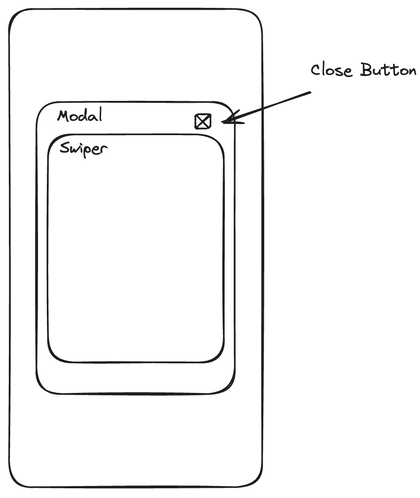
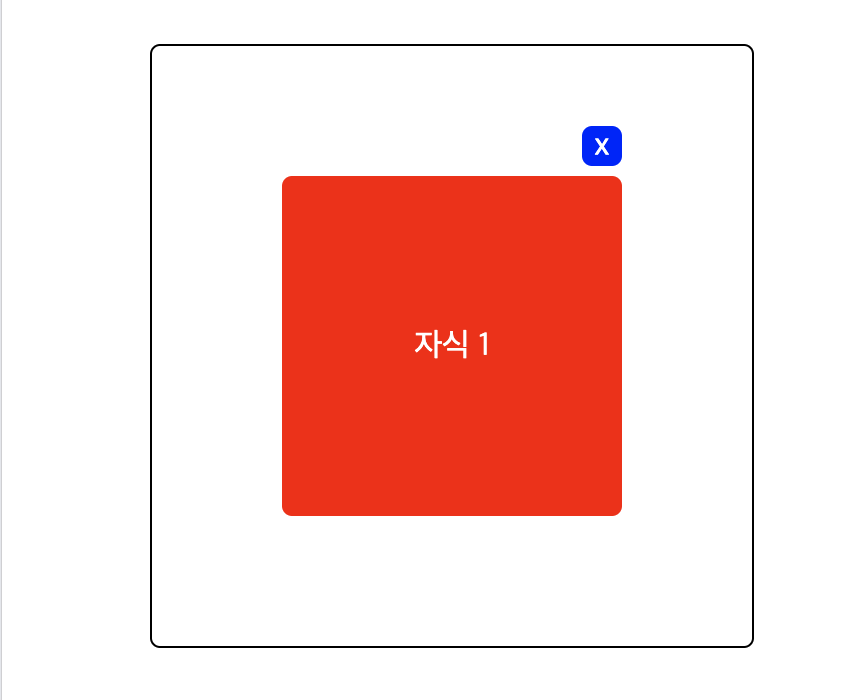
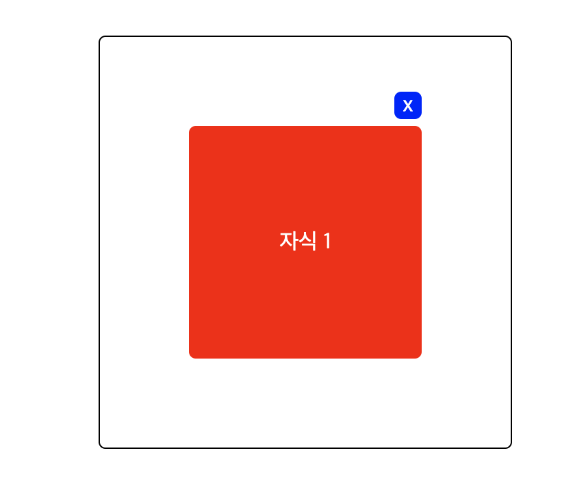

> 개발을 할 때 시간이 오래걸리는 내 모습을 보면서 '어떤 부분이 부족한 걸까' 고민하기 시작했다.  
> 모든 부분에서 한 없이 부족하지만, 가장 부족한건 **Typescript**와 **CSS**였다.  
> 이번에 사이드프로젝트를 진행하며, CSS에 대해 복습하고 새롭게 내용을 정리해보자

# 1. aspect-radio

- 원본 이미지 비율을 유지하면서, 크기를 조절하고 싶을 때 [aspect-ratio](https://developer.mozilla.org/en-US/docs/Web/CSS/aspect-ratio)를 사용하면 된다.
- 특히 모바일 뷰를 개발할 때 모바일의 크기가 모두 제각각이다.  
  이를 대응하려면 `aspect-radio`를 사용하는 것이 좋다.

```CSS
// 실제 이미지를 모달창으로 구현할 때 모바일 width / height를 고려해서 aspect-ratio를 사용했다.
.letter-bg {
  width: 100%;
  height: auto;
  aspect-ratio: 598 / 708;
  background-color: white;
  background-image: url('/images/letter-bg.png');
  background-repeat: no-repeat;
  background-size: contain;
  background-position: center bottom;
}
```

## 1-1. 예외상황

- aspect-radio가 적용되지 않는 3가지 예외상황이 있다.
- 특히, CSS는 예외상황을 알지 못할 경우에도 에러로 알려주지 않으니 주의해야한다.

1. width, height가 고정으로 지정되었을 경우.
2. 마찬가지로 min-height, min-width와 같이 고정으로 지정되었을 경우.
3. 내용이 element의 크기를 넘어갈 경우.

<br/>

# 2. inline-block, inline, inline-flex

> 진짜진짜 매번 헷갈린다. `inline-flex`는 사실 처음 알았다;  
> 다른 요소는 이전에 정리해놓은 내용이 있다. 인용해서 다시 복습해보자

<br/>

## 2-1. inline

참고로 inline은 in the same line이라고 이해했다.  
즉, 같은 줄에 위치할 수 있다.

```HTML
 <div>나는 Div-1이다</div>
 <span>나는 span-1이다.</span>
 <span>나는 span-2이다.</span>
 <span>나는 span-3이다.</span>
 <div>나는 Div-2이다</div>
```

```CSS
div {
  background: yellow;
  width: 200px;
  height: 50px;
  margin: 20px;
  padding: 10px;
}

span {
  background: red;
  width: 100px;
  height: 20px;
  margin: 10px;
  padding: 5px;
}
```

<small>구분이 명확하지 않아, 키워드별 경계선을 추가했습니다. 🙇‍♂️</small>

---

- 하나의 요소(inline) 옆에 다른 요소(inline)이 올 수 있음  
   

---

- inline는 **너비와 높이가 없음**
  

  - background-color하면 **색이 적용되지 않음.**
  - 하지만 문자, 또는 어떤 내용이 들어 있을 경우 색이 적용된다.

---

- inline는 margin과 padding을 줄 수 있음

  - span(inline)는 margin을 사방으로 주더라도 좌/우만 적용되는 것을 확인가능  
    (명확히 하기 위해 padding은 잠깐 주석처리했었음)  
     
  - padding은 전 방향 모두 줄 수 있음  
      
    단, [이 블로그](https://hoya-kim.github.io/2021/08/25/padding-on-inline-element/)에서 제시하듯이, inline은 height값이 없기 때문에, position이 block인 element와 수직으로 놓을 경우, 겹치는 부분이 생긴다. **이를 해결하기 위해선 inline-block을 사용해야 한다.**

- inline의 종류는 `span`, `a`, `img`가 있음 (나머진 대부분 Block)

---

<br/>

## 2-2. inline-block

- inline-block은 inline과 block의 특징을 모두 가지고 있음
  - 즉, inline처럼 같은 줄에 위치할 수 있고, block처럼 너비와 높이를 가질 수 있음

```CSS
// 위에 제시했던 코드에서 다음의 CSS만 변경햇음
div {
  display: inline-block; // inline-block으로 변경
  background: yellow;
  width: 200px;
  height: 50px;
  margin: 20px;
  padding: 10px;
}

span {
  display: inline-block; // inline-block으로 변경
  background: red;
  width: 100px;
  height: 20px;
  margin: 10px;
  padding: 5px;
}
```

- 위에서 언급했듯이, span은 inline이 default이고, div는 block가 default이다. 이를 inline-block로 변경했다.


1. 먼저 위 이미지를 보고, block은 inline-block으로 변경되면서 inline처럼 같은 줄에 위치할 수 있게 되었다는 것을 알 수 있다.
2. 그리고 inline이었던 span은 너비와 높이를 가질 수 있게 되었다는 것을 알 수 있다.
3. 즉 내부는 block 속성을, 외부는 inline 속성을 가지게 된 하이브리드 형태이다.
4. inline-block는 대표적으로 `button`, `input`, `select`가 있다.

<br/>

## 2-3. inline-flex

- 다음과 같은 코드가 있다.

```HTML
<div class="flex">
    <div class="div-box">1</div>
    <div class="div-box">2</div>
    <div class="div-box">3</div>
</div>
<div class="flex">
    <div class="div-box">4</div>
    <div class="div-box">5</div>
    <div class="div-box">6</div>
</div>
```

```CSS
.flex {
  display: flex;
}

.div-box {
  width: 100px;
  height: 100px;
  background-color: white;
  border: 1px solid black;
  border-radius: 5px;
  margin: 10px;

  display: flex;
  justify-content: center;
  align-items: center;
}
```

- 위 코드는 다음과 같은 이미지로 나타난다.


<br/>

```CSS
.flex {
  display: inline-flex; // inline-flex로 변경
}

.div-box {
  width: 100px;
  height: 100px;
  background-color: white;
  border: 1px solid black;
  border-radius: 5px;
  margin: 10px;

  display: flex;
  justify-content: center;
  align-items: center;
}
```

- flex에서 inline-flex로 변경해주었다. 그 결과는 다음과 같다.


- 즉 이를 정리해보면 다음과 같다.


- flex 컨테이너가 inline-flex로 변경되면, 수직으로 쌓이던 flex-item들이 수평으로 쌓이게 된다.

<br/>

# 3. relative와 absolute

> 매번 헷갈리는 absolute와 relative, 더 나아가 position..

## 3-1. position: relative

```HTML
<body>
  <div>
    <div class="green"></div>
  </div>
</body>
```

```CSS
div {
  width: 300px;
  height: 300px;
  color: white;
  background-color: wheat;
}

.green {
  background-color: teal;
  width: 100px;
  height: 100px;
}
```


<br/>

```CSS
.green {
  background-color: teal;
  width: 100px;
  height: 100px;
  position: relative; // relative를 주었을 때
  right: 20px; // right를 주었을 때
  left: 30px; // left를 주었을 때
}
```

- 모두 동일하게 유지한 상태에서 `position` | `right` | `left`를 주었을 때 다음과 같은 결과를 보인다.


- 즉 relative는 elemnt가 처음 위치한 곳을 기준으로 움직인다는 것을 알 수 있다.
- right로 20px을 주면, 왼쪽으로 움직이는데, **반대방향으로 움직인다고 생각하지말자**

  - `top` | `bottom` | `left` | `right`는 웹페이지 상에서 element의 오프셋(offset)을 지정하기 위해 사용된다.
  - 즉, `top`은 위에서 얼마나, `left`는 좌측에서 얼마나, `bottom`은 아래에서 얼마나, `right`는 우측에서 얼마나 떨어져야하는지를 결정한다.
  - [해당 내용은 여기를 참고해서 작성했다. 지금까지 내가 헷갈렸던 내용을 명확히 이해할 수 있게 해주었다.](https://www.daleseo.com/css-position-absolute/#html-%EC%9A%94%EC%86%8C-%EB%B0%B0%EC%B9%98-%EA%B4%80%EB%A0%A8-css-%EC%86%8D%EC%84%B1)

<br/>

## 3-2. position: absolute

```CSS
.green {
  background-color: teal;
  width: 100px;
  height: 100px;
  position: absolute; // absolute를 주었을 때
  right: 0px; // left를 주었을 때
}
```

- relative와 모든 게 동일한 환경에서 position과 right만 변경해주었다.


- 현재의 absolute는 부모인 div를 벗어나, body를 기준으로 움직인다.
- default인 body를 div로 변경해보자.

```CSS
div {
  width: 300px;
  height: 300px;
  color: white;
  background-color: wheat;
  position: relative;  // div에 relative를 주었다.
}

.green {
  background-color: teal;
  width: 100px;
  height: 100px;
  position: absolute;
  right: 0px;
}
```


- 이렇게 이동할 수 있는 기준이 무엇일까? 다음을 확인해보자

```HTML
<div>
  <div class="sibling"></div>
  <div class="green"></div>
</div>
```

```CSS
div {
  width: 300px;
  height: 300px;
  color: white;
  background-color: wheat;
}

.sibling {
  width: 100px;
  height: 100px;
  background-color: red;
  position: relative; // sibling에 relative를 주었다.
}

.green {
  background-color: teal;
  width: 100px;
  height: 100px;
  position: absolute;
  right: 0px;
}

```

- class가 green인 div박스에 형제 div인 sibling class를 추가해주었다.
- 그리고 sibling에 css로 position relative를 추가해주었다.


- 즉, 부모 요소 중에서 position 속성이 relative인 요소가 있다면  
  이 부모를 기준으로, absolute를 줬던 자식요소를 자유롭게 배치할 수 있다.

<br/>

# 4. user-select, pointer-events

## 4-1. user-select


- 위와 같은 상황이라고 가정해보자
- 이럴 경우 이미지나 요소들이 선택되지 않도록 막아주는 방법은 없을까..?

> 모바일에서 웹뷰로 제작할 시, 유저가 이미지를 드래그하면 이미지가 선택되어버린다.

- 이를 해결하기 위해선 다음과 같은 방법이 있다.

```HTML
// 위 이미지는 다음과 같은 HTML로 구성되어 있다.
<section>
  <div
    style="
      //...
      user-select: none;   /* user-select: none을 주었다. */
    "
  >
    
    <input
      style="
        //...
      "
      readonly
      value="귀여운 강아지"
    />
  </div>
</section>
```

- 이렇게 하면 더 이상 이미지가 선택되지 않는다.
- user-select 속성은 유저가 텍스트를 선택할 수 있는지를 지정해주는 속성이다.
- 위와 같이 div에 user-select: none을 주면, div 내부의 모든 텍스트가 선택되지 않는다.
- 하지만 **input의 readOnly로 준 value는 여전히 선택이 가능하다.**


<br/>

## 4-2. pointer-events

- 위와 같은 현상을 막아주기 위해, pointer-events를 사용할 수 있다.

```HTML
// 위와 같은 HTML로 구성되어 있다.
<input
  style="
    //...
    pointer-events: none; /* pointer-events: none을 주었다. */
  "
  readonly
  value="귀여운 강아지"
/>
```

- pointer-events는 사실 클릭 이벤트를 막아주는 속성이다. 즉, 위와 같이 선택을 막아주는 요소는 아니다.
- 그래서, 만약 readOnly가 아니라면, 사용해선 안된다. input 박스를 클릭했는데, value를 변경할 수 없게 되니 말이다.

> 나의 경우엔, input / textarea가 readOnly인 경우에만 pointer-events를 사용했다.

<br/>

# 5. 같은 형제 구조에서 absolute를 강제할 수 있는 방법은 없을까?

> absolute를 형제 구조를 기준으로 위치를 다시 잡을 순 없을까?

- 다음과 같은 코드가 있다.
- 요구사항은 다음과 같았다.
  1. 자식 1의 북동쪽 꼭지점을 기준으로 5px 위에 자식 2를 위치시킨다.



- 아래와 같이 간략한 코드를 구성해봤다.

```HTML
  <section id="modal" class="layout">
    <div id="swiper" class="parent">
      <div id="contents" class="child-1">자식 1</div>
      <div id="close-button" class="child-2">x</div>
    </div>
  </section>
```

- 여기서 이제 `close-button`을 어떻게 contents의 위에 놓을 수 있을까?

<br/>

## 5-1. layer 층을 하나 더 두기

- 가장 먼저 생각난 건, relative와 absolute를 사용하는 것인데, 이를 위해 layer층을 하나 더 두는 것이다.

```HTML
  <section id="modal" class="layout">
    <div id="swiper" class="parent">
      <div id="add-layer" class="add-layer">  <!-- layer를 추가햇다. -->
        <div id="contents" class="child-1">자식 1</div>
        <div id="close-button" class="child-2">x</div>
      </div>
    </div>
  </section>
```

```CSS
//..

.add-layer {
  position: relative;
}

.child-1 {
  //...
  width: 150px;
  height: 150px;
}

.child-2 {
  // ...
  width: 20px;
  height: 20px;
  position: absolute;
  right: 0;
  bottom: calc(150px + 20px + 5px);
}
```

- 결국 add-layer를 기준으로 두기 위해 relative를 주고, child-2에 absolute를 주었다.
- 그리고 오른쪽 가장 끝에 위치시키기 위해 right: 0을 주었다.
- 마지막으로 bottom을 주었는데, 이는 child-1의 높이 + child-2의 높이 + 5px를 주었다.



<br/>

완성은 했지만, 꼭 layer를 하나 더 추가해줘야하는걸까.. 다른 방법은 없을까?  
그렇다고, Javascript를 쓰고 싶지도 않았다.  
개인적으로 스타일은 최대한 CSS로만 처리하고 싶다.

<br/>

## 5-2. anchor를 사용하기

> anchor는 현재 정식 반영된 기능이 아니라, 실험적인 기능이다.

먼저 chrome에서 `chrome://flags`로 들어가서 `#enable-experimental-web-platform-features`를 활성화해주자.  
<small>💬 크롬을 열고 `chrome://flags/#enable-experimental-web-platform-features`를 url에 붙여넣으면 됩니다!</small>

<br/>

그 후엔 아래와 같이 polyfill과 class를 추가해주자.

```HTML
  <head>
    //...
    <!-- polyfill을 추가해주었다. -->
    <!-- https://github.com/oddbird/css-anchor-positioning?tab=readme-ov-file -->
    <script type="module">
      if (!("anchorName" in document.documentElement.style)) {
        import("https://unpkg.com/@oddbird/css-anchor-positioning");
      }
    </script>
  </head>
  <body>
    <section id="modal" class="layout">
      <div id="swiper" class="parent">
        <div id="contents" class="child-1 anchor">자식 1</div> <!--class에 anchor를 추가했다. -->
        <div anchor="my-anchor" id="close-button" class="child-2 mover">x</div> <!--  anchor="my-anchor"와 class에 boat를 추가했다. -->
      </div>
    </section>
  </body>
```

```CSS
  //...
    .child-1 {
      //...
    }

    .child-2 {
      //...
    }

    .anchor {
      anchor-name: --my-anchor;
    }

    .mover {
      anchor-default: --my-anchor;
      bottom: calc(anchor(top) + 5px);
      left: calc(anchor(right) - 20px);
    }
```

- 기존의 absolute, relative는 모두 제거했다!
- 그리고 anchor를 사용하기 위해선, anchor-name을 사용해야한다.
- 이제 자식 1을 기준으로, 자식 2를 움직이기 위해 class mover를 추가했다.
  - 이렇게 했을 때, anchor-default(자식1)을 기준으로 자식2를 움직일 수 있다.

<br/>



<br/>

정리해보면, anchor를 이용하면, javascript를 사용하지 않아도 되고, 래퍼요소를 추가할 필요도 없다.  
얼른.. 정식으로 반영되었으면 좋겠다. 🥲

<br/>

### 참고자료

- 2. inline-block, inline, inline-flex 참고  
     [CSS의 display 속성: inline, block, inline-block](https://www.daleseo.com/css-display-inline-block/)  
     [CSS Flex 완벽 가이드](https://www.heropy.dev/p/Ha29GI)

- 3. relative와 absolute 참고  
     [CSS의 absolute position 작동 메커니즘 이해](https://www.daleseo.com/css-position-absolute/)

- 4. user-select, pointer-events 참고  
     [MDN user-select](https://developer.mozilla.org/ko/docs/Web/CSS/user-select)  
     [MDN pointer-select](https://developer.mozilla.org/en-US/docs/Web/CSS/pointer-events)

- 5. 같은 형제 구조에서 absolute를 강제할 수 있는 방법은 없을까?
     [CSS Anchor Is The Best New CSS Feature Since Flexbox](https://youtu.be/B4Y9Ed4lLAI?si=wEWOnlDbSZhMOiLN)  
     [css-anchor-positioning](https://github.com/oddbird/css-anchor-positioning?tab=readme-ov-file)  
     [CSS 앵커 배치로 요소를 서로 테더링 ](https://developer.chrome.com/blog/tether-elements-to-each-other-with-css-anchor-positioning?hl=ko)
