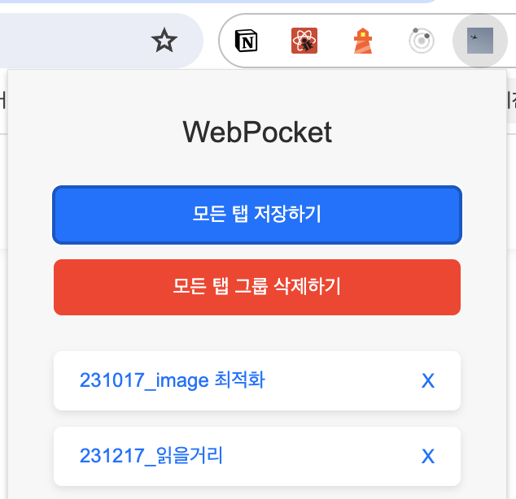

> 마음껏 일을 벌여보고, 수습은 제대로 못한 한 해

 

# 1. 내 나이만큼 책 읽기

작년에 이어 올해도 내 나이만큼 책 읽기를 도전했다.  
결론부터 말하자면, 이번 연도 역시 **목표를 달성하지 못했다.**  
총 8권을 읽었는데, 내 나이가 8살보다 훨씬 많다는 걸 감안했을 때 공개하기 부끄러운 수준이다.  
8권의 책은 다음과 같다

1. 유난한 도전
2. UX/UI의 10가지 심리학 법칙
3. 개발자의 원칙
4. 실리콘밸리에선 어떻게 일하나요
5. 일놀놀일
6. 만들면서 배우는 클린 아키텍처
7. 코끼리와 벼룩
8. 계속 가봅시다 남는 게 체력인데

 

### 1-1 크리에이터, 메이커

올해 읽은 책 중 가장 인상 깊었던 책은 [코끼리와 벼룩](https://geuni620.github.io/%EC%BD%94%EB%81%BC%EB%A6%AC%EC%99%80%20%EB%B2%BC%EB%A3%A9/)이다.

이 책을 읽고 나서, 다시 한번 나는 **'크리에이터', '메이커'가 되어야겠다고 다짐했다.**  
제품을 만드는 메이커, 콘텐츠를 창작하는 크리에이터가 되고 싶어졌다.

책을 읽기 전 나는, 그저 회사에서 잘 쓰일 수 있는 도구가 되길 희망했던 것 같다.  
누구나 선망하는 이름 있는 대기업에 취직해서, 그 조직 꼭대기에 나의 이름 적힌 깃발하나 꽂아보는 게 꿈이었다.

책을 읽으며 나라는 사람에 대해 돌아보니 회사에서 시키는 일을 하는 것보다, 내가 하고 싶고 재밌어하는 일을 하는 삶을 더 갈망한다는 것을 알게 됐다.
또한, 이런 삶을 꿈꾸며 달려오다 보니, 현재 개발자라는 직업을 가지게 된 것 같기도 하다.

책을 읽을 당시에, 자연스럽게 내가 선망하는 삶을 사는 사람들을 많이 찾아보게 됐다.
용기가 없어 커피챗을 신청하진 못했지만, 깃헙을 팔로우하고, 그분들의 블로그에 써진 글을 읽어보며, 내가 꿈꿔왔던 삶을 사는 사람을 간접적으로나마 경험할 수 있었다.  
[언섹시 비즈니스](https://maily.so/unsexybusinesskr)나, [사이드 허슬러 스토리](https://www.sidehustlerstory.com/) 역시, 나의 생각에 힘을 실어주는 고마운 자극제다.

개발자는 위에서 언급한 '크리에이터', '메이커'가 되기 정말 좋은 직종이라는 생각이 들었다.  
작게 만들어보고, 링크를 공유하며 내가 만든 것을 다른 분들에게 권할 수 있으니 말이다.

커리어로 전환하기 전 개발자는 그저 직업 자체가 멋있어 보였고, 개발자가 되어 일을 시작하길 바랐다면,  
현재는 크리에이터가 되고 싶고, 되기 위한 도구로 개발을 사용하려고 한다.

 

# 2. 사이드프로젝트

2023년의 중반이 지나갈 무렵부터, 기술스택을 공부하기 위해 `react`, `Next.js` 등의 공식문서를 **미리** 읽는 것보단, **필요할 때** 찾아보는 게 더 효율적이라는 것을 체감했다.

물론 머리로는 이해하고 있었으나, 미리 대비하고 싶던 마음에 당시 내게 필요하지 않은 지식의 글을 읽고, 이해하지 못했던 글은 시간 들여 공부하곤 했었다.
이 모든 게 나에게 하나도 도움 되지 않았다고 말할 순 없겠지만, 돌아보니 **가장 빠른 성장은 무언가를 만들 때**라는 것을 깨달았다.

마침 올해부터 `ChatGPT`, `Copilot`를 알게 되면서 사이드프로젝트를 시작하기 훨씬 쉬워졌다.
무엇을 만들까 고민하던 찰나, **'지금 현재 내게 가장 불편을 주는 것이 무엇일까'** 생각해 보게 됐다.

 

### 2-1. Web Pocket 만들기

올해 6월부터 3D 웹사이트에 관심이 생겼다. 기획회의에 참여할 기회가 있을 때면, 만들어야 하는 페이지를 3D를 활용해보고 싶다고 어필했다.
어필한 내용이 반려(?)되긴 했지만, 잔잔한 시냇물에 돌멩이를 하나 던진 것으로 만족하고 있었다.
그러던 찰나, 한 동료 디자이너분께서 3D에 관심 있다며 메신저를 주셨다. 같이 강의를 들어보자며 강의도 추천해주셨다.
그렇게 모 기업의 `Three.js` 온라인 강의를 듣게 되었다.

여기서부터 불편함이 시작되었는데, 이 강의를 크롬으로 듣게 되면, **녹화감지** 기능이 동작해서 영상이 실행되지 않았다.
원인이 무엇인지 모르겠지만`(아마 크롬익스텐션 때문인 것 같기도 함)`, 크롬으로 들었을 때만 녹화가 감지된다는 경고문구가 뜨고 영상이 닫혀버렸다.  
결국 다른 브라우저를 통해서 들어야 했고, 열려있던 크롬은 온전히 종료시켜야 했다.

나의 경우엔 크롬 탭별로 여러 글을 띄워놓는다. 이 탭들은 기능을 개발하기 위한 글들을 모아놓은 탭일 수도 있고, 관심 있던 기술스택에 관한 유익한 글들의 탭, 커리어 성장에 관한 탭 등등
주제별로 탭을 여러 개 열어놓는 편이다. (글을 쓰는 현재도 6개의 탭이 열려있다.)

이 탭을 영상을 보기 위해 모두 종료시킨 뒤, 영상 시청 후 다시 여는 것은 당시 내겐 너무 불편했다.  
크롬에서 방문기록을 잘 저장해주긴 하지만, 까딱하다가 영상 시청 후 바로 탭을 복원하지 않으면 최신 기록으로 덮혀 버린 방문기록을 뒤져서 찾아야 했다.  
사실 바로 복원하는 것도 깜빡하고 노트북 덮고 잠들었다가 날려버린 적도 많았다.. 🤦‍♂️

 

몇 번의 탭을 날려버린 뒤, **'탭들을 크롬익스텐션으로 저장할 순 없나'** 하는 생각이 들었다. 만들어진 크롬익스텐션을 검색해보기도 했다.
물론 내가 원하는 기능을 제공하는 익스텐션이 있긴 했었지만, 한편으로 만들어보고 싶다는 생각이 들어 GPT를 열어서 만들어보기 시작했다.

 

사실 만드는 과정에서 온전히 코드를 이해했다고 볼 수도 없었다. 생각한 기능을 GPT에게 계속 요구했고, 그 기능이 잘 동작하는지, 오류가 발생하면 무엇이 오류인지만 GPT에게 알려준 뒤 다시 고쳐주길 바랐다. 그렇게 며칠 동안 GPT와 티키타카를 한 뒤, 프로젝트를 완성할 수 있었다.

덕분에 탭이 너무 많거나, 지저분하다 싶을 때만 Pocket에 저장해 두는 편이다.  
한 가지 치명적인 이슈가 존재하긴 하지만, 수정방법을 찾지 못해 그냥 사용하는 중이다. 🥲  
하지만 내가 예측할 수 있는 이슈라서, 큰 불편함 없이 나만 잘 쓰고 있다. 😎  
([Arc 브라우저](https://arc.net/)에선 원했던 기능이 오류 없이 온전히 잘 동작한다는 말을 들어서 써보려고 생각도 하고 있다.)

 

# 3. 운동

2018년 허리에 디스크가 파열되어서 한 달 정도 병원에 입원했었다. 그 뒤부턴 허리는 내 몸의 가장 큰 약점이 되었다.
당시 재미를 붙였던 웨이트도 겁이 나서 하지 않게 됐고, 허리에 무리가 간다는 생각이 들면 무조건 하지 않고 피하기 일쑤였다.

그러다가, 2021년 [정선근 선생님](https://www.youtube.com/@dr.chung.spinejoint)의 백년허리, 백년 목을 읽고 나서 조금씩 스스로 재활을 시작했었다.  
가장 먼저 했던 것은 걷기였는데, 걷기를 시작으로 맨몸운동을 섞어서 했다.  
(맨몸운동이라고 말할 것도 없는 게, 그냥 꾸준히 팔굽혀펴기만 했다.)

2023년 2월부턴, 맨몸운동보단, 웨이트를 다시 시작해보려고 했다. 지하 헬스장을 등록하고, 아침 7시에 운동을 갔다가 올라와서 샤워 후 출근했다.
그렇게 주 4일은 꼭 운동을 하려고 했다.

하지만 예전처럼 웨이트에 흥미를 가지지 못했다. 아무래도 허리에 무리가 간다고 생각되면, 포기해버렸다.  
하나 더 당길 때, 끝까지 당길 때 그 맛(?)으로 웨이트를 했었는데, 무리하지 않다보니 하나, 둘 더 당길 수 있음에도 쉽게 놓아버렸기 때문이다.

5월부턴 결국 조깅을 하기로 했다. 퇴근 후 30분~1시간 정도 꾸준히 조깅을 했다.  
조깅의 매력은 남을 이길 필요가 없다는 것이다. 그저 나와의 경쟁이다.  
뛰다 보면 컨디션에 따라 어제보다 못 뛸 때도 있다. 하지만 몇 달의 기록을 돌아보면 이전의 나보다 훨씬 기록이 좋은 나를 발견한다.
이게 조깅의 매력이라고 생각한다.

또한, 2022년 인프콘에서 김영한님의 [어느 날 고민 많은 주니어 개발자가 찾아왔다](https://youtu.be/QHlyr8soUDM?si=0O6tkS8wMHB3Ydkf&t=2164) 발표 중 시스템에 관련된 내용을 설명해주시는데, 회사의 고민을 집에도 가져오지 않기 위해 운동을 하신다는 말이 인상 깊었다.

> "저는 퇴근하면 30분 정도 운동을 해요.  
> (중략)  
> 운동을 하면 저는 가비지 컬렉터가 작동해서 이걸(회사의 고민) 싹 비우더라고요."

나 역시 회사의 고민을 집으로 가져오고 싶지 않았다. 그래서 회사에서 많은 스트레스를 받은 날이면, 퇴근 후엔 집에와서 저녁 먹기도 전에 조깅을 하러 갔다.
그리고 집에 돌아와서 샤워를 하면, 퇴근 후 저녁시간을 어떻게 보낼지 머릿속에 하나 둘 아이디어가 샘솟았다.
이렇게 육체적 건강은 물론, 정신적 건강도 챙기고 싶었다.

아쉬운 점은 10월 이후부턴 운동이 끊겨버렸다. 이래저래, 개인적인 일로 스트레스를 엄청나게 받았다. 현재는 10월에 비해 5kg가 빠졌다.
그렇게 살 빼려고 운동을 했는데, 살은 빠지지 않더니, 육체보다 정신적 스트레스로 인해 빠지는 살이 더 두드러지게 보였다. 나 스스로에게 미안하다.  
하지만 후회하지 않고 온전히 나의 선택이었다. 이는 아직 공개할 수 없기에 이쯤에서 마무리.

 

# 4. 블로그에 글 쓰기

지금 쓰고 있는 개인블로그는 내가 개발을 시작한 지 얼마 안 되었을 때 [인프런에 올라온 강의](https://www.inflearn.com/course/gatsby-%EA%B8%B0%EC%88%A0%EB%B8%94%EB%A1%9C%EA%B7%B8)를 보며 개발했었다. 하지만 블로그에 글을 남기기보단, [TIL 저장소](https://github.com/Geuni620/TIL)에 하루하루 배운 것들을 `빵부스러기(BreadCrumbs)`라는 표현으로 남겼고, 시간이 될 때 키워드에 따라 정리하곤 했었다.

이는 점점 더 큰 고민들로 번져갔다. 남긴 글을 다시 찾아보려고 했을 때, 손이 가지 않았다.

- 다른 사람에게 내가 공부한 내용을 공유하고 싶어도, 일자별로 기록한 내용을 여러 링크를 통해 공유 해야했다. (깔끔하지 못하다.)
- 이걸 받는 사람도 여러 링크를 탭으로 띄워야했고, 키워드에 맞게 분류하였지만 한눈에 볼 수 있는 목차 역시 부재했다.
- 훗날 기록한 내용을 내가 다시 찾아보려고 해도, TIL레포를 클론 받아서 검색을 통해 찾아봐야했다.
- 심지어 검색 역시 정보가 흩뿌려져 있어 여러 파일을 열어보고 모두 읽어본 뒤 조합해서 사용해야했다.

**즉, 정리가 되지않고, 정보가 여기저기 흩뿌려져 있었다.**

흩뿌려진 내용을 모아, 중복된 내용을 제거 한 뒤 블로그에 기재해 봐야겠다는 생각을 했다.  
사실 몇 번 블로그 글을 작성하려고 시도하였지만, **두려움**이 컸던 것 같다.  
'틀리면 어떡하지?', '잘못된 내용을 전파하면 어떡하지?' 등등

무엇보다 개발을 하다보면 당시의 내가 알고 있는 지식으로 가장 최적의 판단을 내릴 때가 있는데, 이 판단은 주관이 들어가게 되는 것 같다. 개발에는 정답이 없다고 생각하기 때문이다.  
즉, 나의 생각을 글로 쓸 때가 있는데, 나라는 사람은 내 생각을 다른사람에게 공유하는게 많이 어렵다. 🥲

그래도 올해는, 꼭 블로그를 기재해보고 싶었다.  
돌아보니, 가장 처음 개발에 관련된 블로그 글을 기재한게 5월이다.  
올해 개발에 관련된 글을 총 42개 업로드했다.

초반엔 단지 많은 글을 쓰고 싶다는 생각을 했었으나 시간이 갈수록,  
**나도 이해할 수 있고, 다른 사람도 이해할 수 있게** 적어보려고 노력했다.(=노력하고있다).

 

### 4-1 글또시작

글을 쓰다보니 또 한 번 갈증이 생겼다.
초반엔 그저 내가 기록한 것을 잘 정제해서 이쁘게 정돈하고 싶었다면, 이젠 이 글을 누군가 읽어줬으면 하는 바람이 커진 것이다.

그러던 찰나 과거의 내가, 미래의 나를 위해 '글또' 모집을 시작할 때 알림을 걸어둔 것이다.  
평소와 다를 것 없던 하루, 출근하고 메일을 확인 했을 때 글또 9기 모집 메일이 와있었다.

주변 개발자 지인에게 공유하고 나 역시 신청할 것을 알렸다. 이렇게 하지 않으면 또 흐지부지 될 것 같다.
현재까진 신청하길 `(정말정말x100)` 잘했다는 생각이 든다. 처음 글또를 신청할 때 다음과 같이 글을 썼었다.

> 이 글또를 시작하는 가장 큰 이유는 사실, 저 혼자만의 글을 쓰고 끝나는게 아니라
> ‘누군가가 내 글을 읽어줬으면 하는 바람’이 가장 큰 것 같아요.
>
> ’조회수가 잘 나오던 나오지 않던, 꾸준히 제 글을 찾아주는 사람이 있으면 좋겠다.’는 바람이요.
> 그러기 위해선 글쓰기를 배운 적 없는 제가, 많은 사람의 글을 읽을 수 있어야 할 것 같고,
> 그 글이 아는 사람들의 글이라면 더 좋겠다는 생각을 했어요.
>
> 그래서 글 쓰는 사람들이, 이왕이면 개발자 글쓰기 러버들이 가장 많이 모여있는 집단으로 나를 던져야겠다는 생각으로 글또를 신청해요.
>
> 긴 활동이지만, 남들의 글을 읽으면서 ‘나는 왜 이런 글을 쓰지 못할까’ 고민도 해보고,
> ‘이 사람의 문구가 좋네’ 하며 따라 써보기도 하고, ‘글을 참, 정갈하게 쓰시네’ 하며 그 사람의 목차를 가져오기도하고,
> 썸네일이 예쁘면 어디서 만드셨는지, 이목을 끄는게 있다면 이건 무엇인지 등을 자유롭게 이야기하고 공유하고 싶어요.

많은 분들의 글을 읽으며, 자극받고 나의 색깔로 만들어봐야겠다.

 

# 5. 2024년

2024년이 되기전에 회고를 쓰고 싶었는데, 작년도 올해도 회고는 12월이 아닌 1월에 쓰는 나라는 사람, **참 게으르다.**
사실 12월은 어떻게 보냈는지 잘 모르겠다. 개인적인 일로 스트레스를 너무 많이 받았고, 정신도 없었다.
책을 읽을 때도, 개발을 할 때도, 몸은 이 곳에 있지만 정신은 다른 그 무언가를 향해있었다.

그래도 잘 일단락 된 것 같다.

2024년, 단어를 들었을 때 가장 먼저 머리에 떠오른 문구는 **'어떻게 살 것인가?'** 이다.
올해는 작년보단 조금 더 꾸준했으면 하는 바람이다. 해오고 있는 것들을 꾸준히 더 잘 실천했으면 한다.
책을 읽는 것, 운동을 하는 것, 개발을 하는 것과 같은 활동들 말이다.

아, 하나 더 추가하자면 크리에이터가 되기위해서 나 혼자서 서비스를 만들어보는 것이다.
이런 다짐을 하면 꼭 생각나는 영상이 있다. [유튜버 코딩몬스터TV의 인터뷰 영상](https://youtu.be/mAoGddEJxnQ?si=r8HboKVQ1biSVwkP)이다.
총 3편까지 있는데, 2편에서 인터뷰어께서 이런 말씀을 하신게 인상깊었다.

> 자기가 진득하게 만들어 본 프로그램 하나 있으면 좋긴해요.

돌이켜보니, 지금까지는 모든게 **포트폴리오용**이었던 것 같다. 나의 이력서에 한 줄이라도 더 적기 위한 활동들 말이다.

올해는 이걸 깨트리고 싶다. 진득하게 만들어볼만한 주제를 찾아, 이 프로그램을 고도화 시켜가고 싶다.
어떠한 부정적 단어들`(트래픽이 안나오는데 등등)`은 다 뒤로하고, 한 명이라도 쓰는 사람이 있다면 꾸준히 만들어보고 개발해보는게 올해 가장 큰 목표다.

 

1월인 현재 이 프로젝트를 시작되었다 🍀
