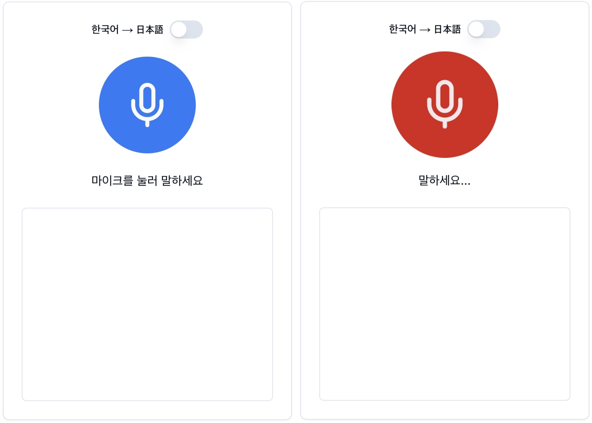
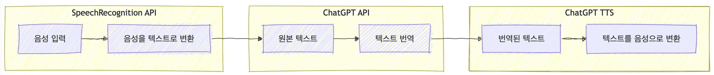
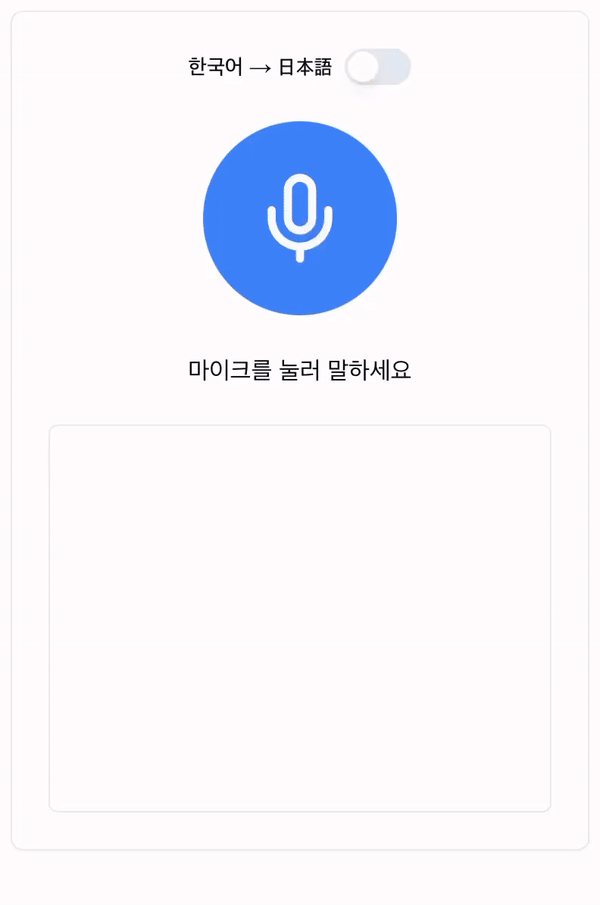
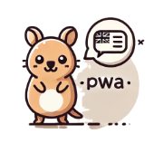

### Quokka-Talk를 개발한 이유

<small>\* Quokka-Talk(이하 쿼카톡)</small>

올해 1월, [후쿠오카](https://geuni620.github.io/blog/2024/1/31/daily/)에 다녀왔다.  
후쿠오카에서 조금 떨어진 유후인으로 이동해 온천을 즐길 목적이었다.  
당시 눈이 정말 많이 왔는데, 눈을 보며 온천을 즐기니 '이렇게 행복해도 되는걸까..?'하는 생각을 했다.

잠깐의 행복이었던걸까.. 다음 날 눈이 너무 많이 내려서, 숙소 배수관이 얼어버렸다.  
온천을 즐길 수도, 심지어 씻을 수도 없었다.

결국 료칸주인은 우리를 유후인에서 가장 오래된 공중목욕탕으로 안내해줬다.

 

씻고 나온 뒤 함께온 여자친구를 기다리는데, 나이 지긋이 드신 주인 할머니께서 다가오시더니 일본어로 말씀을 건네셨다.  
내가 알아들은 단어는 '간코쿠' 정도인데, 당시 부끄럽게도 '간코쿠'라는 단어가 한국인지 알지 못했다.

chatGPT를 켜서 음성으로 번역해달라고 말했으나, 현 시점보다 훨씬 미숙했던 GPT는 깔끔하게 일본어를 번역해주기 보단, 자기 이야기를 하기 바빴다.  
(네 알겠습니다. 어떻게 도와드릴까요..? 어쩌고저쩌고..)

결국 여자친구에게 물어본 뒤, 번역기를 켜서 '한국인 맞아요!'라고 번역된 글을 보여드린 뒤, 웃으며 인사하고 돌아왔다.

 

### 다시 찾아온 기회.

여름휴가를 찾아보던 중, 여러 이유로 여름시즌의 휴가는 힘들었다.  
결국 10월쯤으로 날짜를 잡고 어디를 갈까 고민하던 찰나, 다시 한번 일본을 다녀오기로 했다.

그리고 머릿속에 [이 영상](https://youtu.be/7YGM5jx0C3o?si=cz8sAmZrnknPPc-k)이 스쳐갔다.  
1월에 일본을 다녀온 뒤 봤던 영상인데, AI를 이용하면 쉽게 만들 수 있을 것 같았다.

 

### 아이디어만 전달, 코딩은 모두 AI에게

허락된 시간이 충분하지 않았다.
그래서 최대한 AI를 활용했다.  
먼저 막연히 [Cursor Editor](https://www.cursor.com/)를 열고, Composer창을 열어서, 핵심기능에 대해 설명했다.

> 1. 한국어로 이야기하면 일본어로 번역한 뒤, 이를 읽어줘야한다.
> 2. 반대로 일본어로 이야기하면, 이를 한국어로 말해줘야한다.
> 3. Next.js 14를 사용하고 PWA로 만든다.
> 4. open AI의 API로 번역한다.

 

코드를 잘 짜주긴 했지만, 원하는대로 잘 동작하지 않았다.  
무엇이 문제일까 곰곰이 생각해보니, 내가 원하는게 구체적이지 않았다.

즉 기능자체가 잘 정의되지 않았다. 어떻게 동작해야하는지 관심없었다.  
내가 AI에게 던지고 있던 메시지는, '한국어로 말하면 일본어로 번역해주고, 일본어로 말하면 한국어로 들리게 해줘'였다.

그래서 먼저 눈에 보이는 UI부터 잡아야겠다고 생각했다.  
UI는 [vercel이 만든 v0](https://v0.dev/)를 적극 사용했다.

예쁜 디자인은 현 단계에서 필요하지 않다고 생각했다.  
가장 단순하고 직관적이길 원했다.  
그래서 v0와 대화하며 이런저런 디자인들을 살펴보다가 모두 제거하고 위 디자인으로 선택했다.

 

그리고 기존에 작성해준 코드를 모두 지우고, 위 UI를 기반으로 기능에 대해 다시 정의했다.

> 1~4까지 동일  
> Toggle 버튼을 눌러서 한국어 → 일본어, 일본어 → 한국어로 변경할 수 있어야한다.  
> Toggle 버튼으로 변경된 상태는 번역에도 반영되어야한다.  
> 버튼을 터치 후 음성이 들리면, 실시간으로 음성이 반영되어야한다.  
> 다시 한번 버튼을 터치하면, 번역이 시작되어야한다.

 

추가로, 위 영상의 구조와 동일하게 가져갔다.  
위 영상에서는 SST(Speech-to-Text)는 whisper를 이용했고, TTS(Text-to-Speech)는 구글 클라우드를 이용했다.
하지만, 나는 구글 클라우드는 사용하고 싶지 않았고, 오직 openAI로 모든 일을 처리하길 바랐다.  
whisper도 사용하지 않았다. 대신 웹 API인 `SpeechRecognition`를 사용했다.

 

AI와 몇 번의 티키타카를 진행하면서 완성된 앱은 다음과 같이 동작한다.

텍스트와 함께 해당 문구를 ChatGPT TTS가 음성으로 읽어준다.  
그리고 이를 PWA로 배포했다.  
배포는 vercel을 이용했다.

 

PWA에 사용될 아이콘도 AI를 사용해서 만들어달라고 요청했다.  
ChatGPT의 앱들 중 DALL·E를 사용해서 만들었다.

개인적으로 동물 중 쿼카를 가장 좋아하는데, 항상 쿼카로 컨셉을 잡으면 실패는 없는 것 같다.  
(진행했었던 [사이드프로젝트](https://geuni620.github.io/blog/2024/2/18/retrospect/)도 쿼카로 컨셉을 잡았었다.)

 

이렇게 모두 만드는데, 하루면 충분했다.  
점심먹고 시작해서 저녁 먹을 때즈음 완료할 수 있었다.  
다시 생각해봐도, AI가 만들어주는 세상이 놀라우면서도 기대가 된다.

 

### 일본에서 사용해본 결과

결론부터 말하자면, **대실패**였다.

 

**[에피소드 I]**  
일본에 도착해 공항에서 숙소까지 우버를 타고 이동했다.  
이동하는 도중, 도착지를 숙소 근처 다른 곳으로 찍은 걸 알게 됐다.

쿼카톡을 써서 한국어로 말하고 일본어로 번역한 뒤, 소리를 키워 전달했다.  
하지만, 차는 이동 중이었고, 마음이 급하다보니,  
앱을 통해 의미가 전달되었다기 보단, 간단한 일본단어들의 조합으로 더 명확히 알아들으신 것 같았다.

번역을 진행하는 과정에서 조금의 딜레이가 있는데, (약 2\~4초)  
말이라는게 휘발성이 강해서 몇 초의 정적이라도 엄청 긴 시간으로 느껴졌다.

이에 비해 파파고의 번역은 딜레이가 거의 없다. 😭

 

**[에피소드 II]**  
2박 3일 일정 중, 첫째 날과 둘째 날 저녁 이후 모두 후식으로 타코야끼를 먹었다.  
외관은 크게 다르지 않았다. 편의점 옆에 작은 트럭에서 타코야끼를 만들어 팔고 계셨다.  
하지만 맛은 달랐다. (진짜 너무 맛있었다.)

사장님은 나이가 좀 있으신 것 같았다. 안경도 쓰고 계셨다.  
쿼카앱을 열어서 "어제 먹어보고 진짜 맛있어서 오늘 또 왔어요."라고 말한 뒤, 소리를 키워 전달했다.

하지만 주변 소음으로 인해 듣지 못하신 것 같았다.  
그래서 화면을 보여드렸는데, 폰트크기가 작아서 잘 안보인다는 말씀을 하셨다.

맛있었다고 제스처로 의미를 전달한 뒤, 풀이 죽어 숙소로 돌아왔다. 😭

 

**[에피소드 III]**  
후쿠오카 오호리 공원에 있는 스타벅스는 사람이 정-말 많았다.  
하필 일본의 쉬는 날과 겹쳐서 이곳은 사람들이 북적였다.

커피를 주문한 뒤, 줄을 서서 기다리는데(이곳은 사이렌 오더가 없는 듯했다.) 커피 두 잔 중 한 잔이 먼저 나왔다.  
나머지 한 잔도 만들고 있으니 조금 기다려달라는 말씀을 하셨는데, 카톡으로 자리를 잡아준 여자친구가 물티슈도 받아와달라고 요청했다.

쿼카앱을 열어서 "물티슈 두 장만 주세요." 라고 소리내어 말했다. 그때 몇몇 사람들이 날 쳐다보는 것 같았다.  
물론 말소리를 냈으니 쳐다보는 것이었겠지만 음성으로만 전달할게 아니라,  
텍스트입력을 통해 번역된 메시지를 전달할 수 있는 Input을 만들어뒀더라면 더 좋았겠다는 생각이 들었다.

물론 파파고는 있다. 😓

 

**[에피소드 IV]**  
생각보다 음성으로 말한 뒤 번역된 음성을 상대방에게 들려줄 일이 잘 없다.  
일본에서 보낸 2박 3일동안 언어의 번역이 필요한 경우는 크게 세 가지였다.

- 파파고 이미지로 사진을 찍어 텍스트를 번역하는 경우
- 번역된 메시지를 일본발음 텍스트로 확인한 뒤, 그대로 읽어서 전달하는 경우
- 번역된 메시지가 너무 길 경우, 화면을 자체를 보여주는 경우

특히 후쿠오카 애플스토어에 갔는데, 애플비전을 착용해볼 수 있었다.  
물론 예약을 통해 가능했고, 일본 애플 홈페이지에 접속해서 진행해야했다.  
과정이 복잡해보여서 직원에게 도움을 요청했는데, 이때도 쿼카톡을 사용했다.  
하지만 음성을 들려주기보다 번역된 메시지 화면을 보여줬다.

그리고 그 일본인 직원 역시 구글 번역기를 열어서 메시지를 작성한 뒤 나에게 보여주는 것이다.  
생각보다 말을 할 일이 잘 없었다. 문자를 통해 의사소통하는 경우가 더 많았다.  
<small>애플비전은 30분 대기해야했는데, 다음일정상 착용해보지 못했다. 😭😭😭</small>

 

### 느낀 점

**[기획이 중요해지는 세상]**  
최근 MBTI이야기가 나오면 항상 N의 사고를 가진 사람들을 부러워한다는 이야기를 자주하게 된다.  
그들의 창의력, 상상력은 S인 내가 해내지 못하는 영역인 것만 같다.

그래서 모방을 하기위해 더 많은 자료를 찾아보고, 비교해보게 되는 것 같다.  
이런 세상이 오고 있다는 생각이 든다.  
지금까진 어떻게 만들지를 고민했다면 이젠 앞에 '무엇을'이 붙어야할 것 같다.

 

**[AI도 번역은 어렵다.]**  
Chat GPT가 처음 나왔을 때, 이제 AI로 해결하지 못할 문제는 없다고 생각했다.  
어려운 난제들이 많지만 AI라면 가능할 것 같은 기대감이 있었다.

이번에 번역앱을 만들어보며, 우리가 생각하는 것보다 문제는 단순하지 않다는 걸 크게 경험했다.

실제 내가 만든 쿼카앱은 한 가지 큰 부분을 놓쳤는데, 바로 **높임말**이다.  
일본사람들의 말을 들어보면 항상 '오네가이시마스'가 들어가는 것 같았다.

내가 쿼카앱을 사용해 음성을 전달한 뒤 번역된 문구를 보는 것과,  
파파고를 통해 음성을 전달한 뒤 번역된 문구를 보면 조금 다른 점이 있다.  
공손함이 빠져있다는 것이다.

이걸 놓친 후, 파파고를 계속 사용해서 공손한 표현의 문구를 작성한 뒤, 메시지를 보여줬다.  
즉 쿼카앱은 번역이 아닌 직역을 했던 것이다.

 

**[계속 꾸준히 만들어보기]**  
'AI가 쉽게 대체하지 못하는 것은 무엇일까?'

이 질문에 대한 답을 찾다 보면, 우리가 일상에서 직접 겪은 불편함과 마주하게 된다.  
이는 실제 경험을 통해서만 깨달을 수 있는 소중한 통찰인 것이다.

앞으로도 계속 불편함을 해소해주는 무언가를 만들며 부단히 만들고(AI와 함께),  
이번처럼 깨지면서 많은 불량품을 만들 것이다.  
물론 이러한 불량품(=실패)들이 새로운 발견으로 이어질 것이라는 기대를 가지고 있다. 👊
