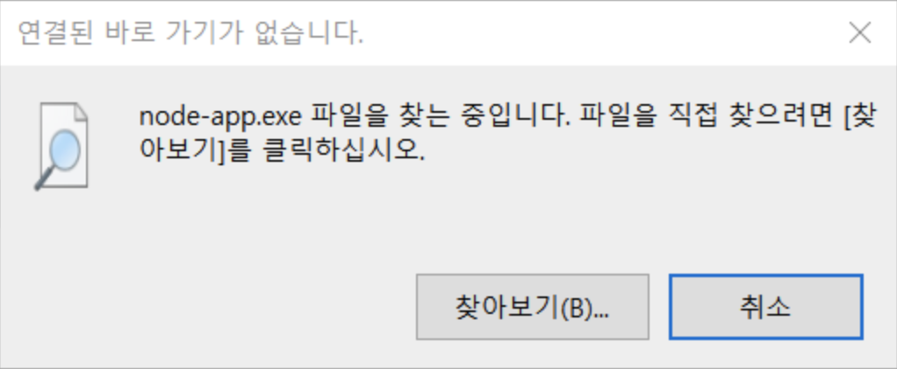
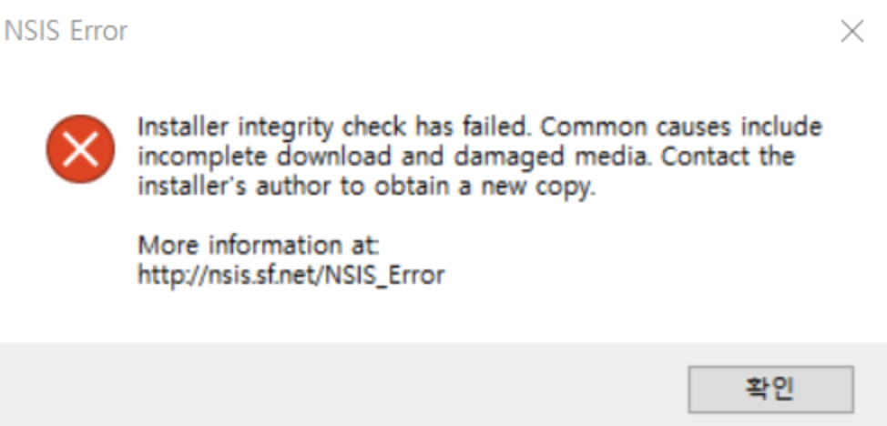
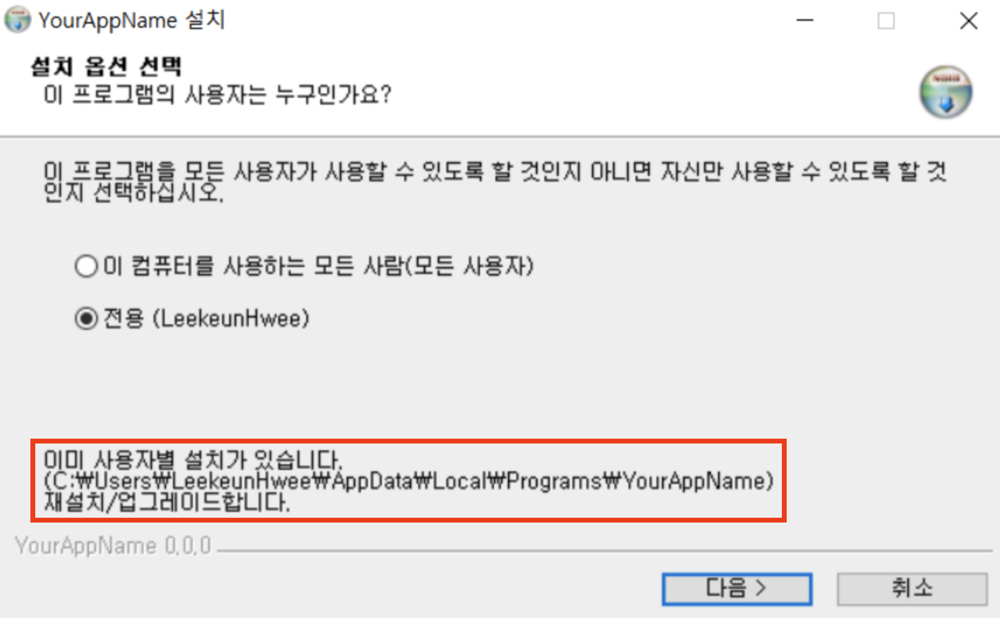
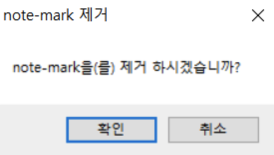

> 최근 로컬영역에 접근해야하는 일이 있어서, electron을 사용하게 됐다.  
> 우리회사의 사용자는 mac os를 사용하지 않기 때문에, window만 배포하면 되었다.  
> 하지만, 호락호락 하지않았다. 😭

<br/>

먼저, 실제 경험했던 환경과 동일하게 세팅하기 위해 일렉트론 앱이 필요했는데,  
[해당 유튜브 영상](https://youtu.be/t8ane4BDyC8?si=pW_uUZ2474b7rFk7)을 참고해서 동일한 앱을 만들어봤다.

<br/>

위 영상을 따라 앱을 만들었다면, window 기준으로 build 파일을 생성해주면 된다.

```
npm run build:win
```

영상에선, [electron-vite](https://electron-vite.org/)를 사용했는데,  
보일러플레이트를 잡아줘서 동일하게 명령어를 입력하면 된다.

<br/>

### Error: windows is not working on installation

생성된 설치파일을 윈도우 컴퓨터로 옮겨준 뒤, 설치 후 실행하면 다음과 같은 메시지를 보게 된다.



분명 설치는 되었고 바탕화면에 아이콘도 생겼지만, 파일을 찾을 수 없다는 메시지가 표시된다.

<br/>

---

[Electron Application Built on macOS for windows is not working on installation](https://stackoverflow.com/questions/74060787/electron-application-built-on-macos-for-windows-is-not-working-on-installation)

target을 지정해주지 않았기 때문이었다.  
electron-vite의 보일러플레이트 파일 중, `electron-builder.yml`은 build가 진행될 때,  
[electron-builder](https://www.electron.build/index.html)를 통해 설치파일을 구성해준다.

```YAML
# electron-builder.yml
win:
  executableName: node-app
  target:
    - target: nsis
      arch:
        - x64
```

해당 파일에서, target을 지정해주면 된다.  
이후엔 앱이 잘 실행되는 것을 확인할 수 있었다.

<br/>

---

### Error: Installer integrity check has failed

이 앱은 mac을 통해 개발했기 때문에, 윈도우에서 잘 실행되는지 확인을 하기위해선 테스트를 요청드려야했다.  
설치파일을 전달드리고 설치 후 테스트가 끝나서 삭제하려고 하는데, 다음과 같은 에러메시지를 접했다.



이 메시지가 뜨고 나면, 설치도 안되고 삭제도 안된다.  
즉, 해당 파일을 삭제할 방법이 없다.

유튜브 및 인터넷에서 알려주는 여러 방법을 시도해봤지만 결국 모두 실패했다.

<br/>



방법을 고민하다가, 우연히 누른 설치파일에 '설치파일이 존재한다는 경로'를 들어가보니 앱의 구성 파일이 존재했다.  
해당 구성파일을 모두 강제삭제 한 뒤, 다시 제어판을 통해 삭제를 시도하니 삭제가 가능했다.

정상적으로 깔끔하게 삭제되는 건 아니지만,  
삭제 후 다시 앱을 클릭하면 파일을 찾을 수 없고, 해당 파일 아이콘도 사라진다. 😓

<br/>

삭제도 가능하게 됐지만, 정상적인 방법이 아니기에 사용자에게 해당 앱을 배포하긴 어렵다.  
어떻게 하면 설치도, 삭제도 매끄럽게 할 수 있을까?

---

해결 방법은 의외로 간단했다.  
해당 파일에 아이콘을 심어주면 되었다. 🤔  
실제 앱을 테스트할 때도 수정한 것 없이 icon만 추가해줬는데, 정상적으로 동작한다.

```YAML
win:
  executableName: node-app
  target:
    - target: nsis
      arch:
        - x64
  icon: ./icon.png  #here!
```

해당 아이콘을 추가하고, 동일하게 window에서 제어판으로 들어가서 삭제를 누르면, 파일이 깔끔하게 삭제된다.



아이콘을 추가하지 않은 채, 삭제를 시도하면 위와 같은 메시지가 뜨지 않는다.  
글 상단에 존재하는, `installer integrity check has failed`와 같은 에러메시지를 접하게 된다.

<br/>

---

### 참고자료

[Electron Application Built on macOS for windows is not working on installation](https://stackoverflow.com/questions/74060787/electron-application-built-on-macos-for-windows-is-not-working-on-installation)  
[Windows NSIS uninstall fails when built from MacOS Catalina](https://github.com/electron-userland/electron-builder/issues/4875)  
[Missing shortcut when installing built app for Windows](https://github.com/alex8088/electron-vite/issues/592)
