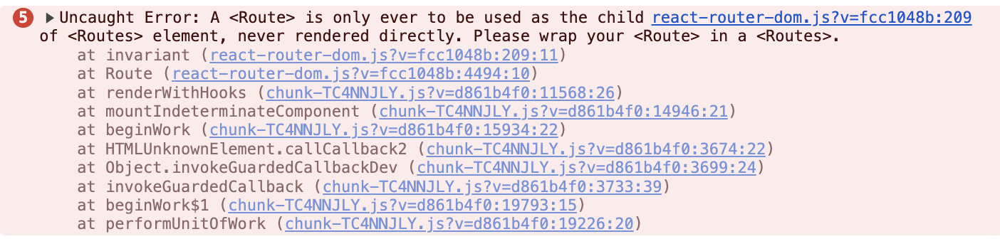

> 8월즈음, react-router-dom v5에서 v5-compat 버전으로 업데이트를 했고,  
> 최근 노드버전을 올리면서, 드디어 v6까지 업데이트 했다.

<br/>

## 예시를 만들어보며.

예시를 만들어보다가 routing을 적용했는데 URL만 바뀌고 페이지 이동이 이루어지지 않는 현상이 발생했다.  
무엇이 문제일까 고민하던 찰나, main.tsx에서 **React.StrictMode가 BrowserRouter보다 상위에 존재하면, 페이지 이동이 이루어지지 않는 것**이다.

[react-router #7870](https://github.com/remix-run/react-router/issues/7870#issuecomment-1099884642)

위 이슈를 확인해보면, 관련된 답변이 적혀있다.  
결국 해답은 BrowserRouter를 React.strictMode 바깥에서 감싸주는 것이다.

```TSX
// main.tsx
async function enableMocking() {
  //...
}

enableMocking().then(() => {
  ReactDOM.createRoot(document.getElementById('root') as HTMLElement).render(
    // BrowserRouter가 React.StrictMode의 내부에 래핑되어있을 경우 url만 변경되고 페이지 이동이 이뤄지지 않는다.
    <BrowserRouter>
      <React.StrictMode>
        // ...
      </React.StrictMode>
    </BrowserRouter>,
  );
});

```

<br/>

<small>그럼 다시 본론으로..</small>

## 왜 올려야했을까?

> 굳이 올릴 필요 있었을까?

**먼저 기존 소스코드는 일관된 포맷을 제공하고 있지 않았다.**  
즉, 어떤 페이지는 hooks를 통해 useHistory나 useLocation으로 반영되어있고,  
다른 일부 페이지는 withRouter를 감싸서 props를 통해 받는 형태로 routing을 사용하고 있었다.

<br/>

나는 routing이 일관된 포맷으로 반영되길 원했다.  
현 프로덕트는 리액트 `v16`을 사용하고 있기에 hooks 패턴으로 변경을 시도했다.

에디터에서 관련 키워드를 검색해 변경사항을 대략적으로 파악하던 중, 생각보다 많은 부분을 변경해야함을 알았다.  
대체로 withRouter 형태라서 v5의 useHistory와 같은 hooks 패턴으로 변경하는 것과 v6의 useNavigate로 변경하는 것의 큰 공수 차이가 없어보였다.  
그래서 v6를 고려하게 됐다.

<br/>

**현재 검색을 할 땐, URL의 사용없이 모두 state로 관리한다.**  
즉, 뒤로가기나 새로고침을 통해 state를 리프레시 시키면, 이전 검색기록은 모두 날아가버린다.  
내가 입사하기 전부터 오랫동안 사용자의 개선요청이 있었다고 들었다.

여러가지 방법이 있겠지만, 나는 v6의 useSearchParams를 적극적으로 사용해야겠다고 생각했다.  
참고로 이는 고민하던 시기에, 우연히 발견한 [Matt Pocock의 트윗을 확인하고 든 생각이다.](https://x.com/mattpocockuk/status/1819026288071352666)

<br/>

**갑작스러운 변화의 적용(v5 → v6)으로 모든 서비스의 안정성이 무너질수도 있다.**  
모든 테스트를 일일이 수행하기엔, 스쿼드 내 프론트엔드 담당이 나 혼자인 상태에서 무리라고 생각했다.  
하지만, react-router팀은 [잘 작성된 문서와 함께](https://github.com/remix-run/react-router/discussions/8753), 안정적으로 프로덕트의 마이그레이션을 돕는 react-router-dom-v5-compat을 제공해주었다.

이를 통해 **안정적인 마이그레이션이 가능하다고 판단했다.**  
참고로 react-router-dom-v5-compat은 v5와 v6를 모두 제공한다.

<br/>

이외에도, 현재 PAGES라고 작성된 **변수파일에는 router에 관련된 정보가 뭉쳐져 있는데, [createBrowserRouter](https://reactrouter.com/6.28.0/routers/create-browser-router#createbrowserrouter)와 유사하게 구성되어있어서,** 그대로 반영해도 좋겠다는 생각이 들었다.  
물론 createBrowserRouter함수를 씀으로써, loader와 같은 기능을 제공해주는 것도 매력적으로 느껴졌다.

---

## compat v5 → v6

8월즈음, react-router-dom v5에서 v5-compat 버전으로 업데이트를 했고,  
최근 노드버전을 올리면서, 드디어 v6까지 업데이트 했다.

마이그레이션 과정에서 헤맸던 몇 가지만 적어보려고 한다.

<br/>

### 페이지별 권한설정

**로그인시 서버에 저장된 auth와 페이지별 auth가 일치할 경우에만** 페이지를 보여줘야한다.  
만약 권한이 없는 사람이 페이지에 접속하려 할 경우, 403페이지로 페이지를 전환시켜줘야했다.

v5에선 다음과 같이 구성되어있었다.

```TSX
// router.ts
export const PAGES = [
  {
    path: '/home',
    auth: 'USER',
    component: Home,
  },
  {
    path: '/home/edit/:tab',
    auth: 'USER',
    component: Edit,
  },
  {
    path: '/dashboard',
    auth: 'ADMIN',
    component: Dashboard,
  },
  //...
] as const;

// App.tsx
export const App = () => {
  return (
    <AppLayout>
      {PAGES.map(({ path, component, auth }) => (
        <AuthRoute
          key={path}
          exact
          {...({ path, component, auth } as (typeof PAGES)[number])}
        />
      ))}
    </AppLayout>
  );
};


// AuthRoute.tsx
import { Redirect, Route, RouteComponentProps } from 'react-router-dom';

type AuthRouteProps = (typeof PAGES)[number] & {
  component: React.ComponentType<RouteComponentProps>;
  exact: boolean;
};

export const AuthRoute: React.FC<AuthRouteProps> = ({
  component: Component,
  auth,
  ...rest
}) => {
  const isAuth = auth === 'USER';

  return (
    <Route
      {...rest}
      render={(routeProps: RouteComponentProps) => {
        return isAuth ? <Component {...routeProps} /> : <Error403 />;
      }}
    />
  );
};
```

<br/>

먼저, Route의 render는 v6로 올라오면서 없어졌다.  
그리고 as로 타입을 매겨주고 있는데, 사실 이는 타입체킹을 무시하는 방식이라 마음에 들지 않았다.  
AuthRoute를 통해서 auth만 검증하고, Components를 열어주면 되지 않을까 싶었다.

```TSX
// AuthRoute.tsx
type AuthRouteProps = {
  auth: 'USER' | 'ADMIN';
  children: JSX.Element;
};

export const AuthRoute: React.FC<AuthRouteProps> = ({ auth, children }) => {
  const isAuth = auth === 'USER';

  if (!isAuth) {
    return <Error403 />;
  }

  return children;
};

// App.tsx
export const App = () => {
  return (
    <AppLayout>
        {PAGES.map(({ path, auth, component: Component }) => (
          <Route
            key={path}
            path={path}
            element={
              <AuthRoute auth={auth}>
                <Component />
              </AuthRoute>
            }
          />
        ))}
    </AppLayout>
  );
};
```

하지만 변경 후, 페이지가 노출되지 않는다. v5에선 잘 노출되었는데 말이다.



원인은 [Routes의 직속자식은 Route이어야하기 때문](https://youtu.be/CHHXeHVK-8U?si=DxZsadRA6Jo1azsD)이다.  
즉 AppLayout으로 인해 막힌 Route는 Routes의 직속자식이 아닌 상태이다.

```TSX
// App.tsx
export const App = () => {
  return (
    <Routes> // 1. Routes를 추가
      {PAGES.map(({ path, auth, component: Component }) => (
        <Route
          key={path}
          path={path}
          element={
            <AppLayout> // 2. AppLayout을 element 내부로
              <AuthRoute auth={auth}>
                <Component />
              </AuthRoute>
            </AppLayout>
          }
        />
      ))}
    </Routes>
  );
};

// main.tsx
enableMocking().then(() => {
  ReactDOM.createRoot(document.getElementById('root') as HTMLElement).render(
    <BrowserRouter>
        <Route path="/*" element={<App />} /> // 여기서도 꼭 /* 으로 반영해주어야한다.
    </BrowserRouter>,
  );
});
```

v6에서는 상대경로를 제공한다.  
즉, \*를 표시하면 직접 자식이 없더라도, [더 깊은 URL과 일치하도록 설정](https://reactrouter.com/6.28.0/start/faq#how-do-i-nest-routes-deep-in-the-tree)해줄 수 있다.

<br/>

### Outlet + createBrowserRouter

현재, 회사에서 반영된 코드를 확인한 뒤 글을 쓰는데도 헷갈린다.  
그래서 복잡도를 낮추기 위해 영역을 명확히 구분지어주는게 좋을 것 같다.

이 작업을 위해, [Outlet](https://reactrouter.com/6.28.0/components/outlet)과 createBrowserRouter를 사용했다.

<br/>

```TSX
// App.tsx
export const App = () => {
  const location = useLocation();
  const isAuth = PAGES.find((page) => location.pathname === page.path);

  if (!isAuth) {
    return <Navigate to="/error/error403" replace />;
  }

  return (
    <AppLayout>
      <AuthRoute auth={isAuth.auth} />
    </AppLayout>
  );
};

// main.tsx
import { PAGES } from 'src/routes';

const routes = [
  {
    path: '/login',
    element: <Login />,
  },
  {
    path: '/error/error403',
    element: <Error403 />,
  },
  {
    path: '/error/error404',
    element: <Error404 />,
  },
  {
    // private routes
    path: '/',
    element: <App />,
    children: PAGES.map(({ path, auth, component: Component }) => ({
      path: path,
      element: <Component />,
      auth,
    })),
  },
];

const router = createBrowserRouter(routes);

enableMocking().then(() => {
  ReactDOM.createRoot(document.getElementById('root') as HTMLElement).render(
    <React.StrictMode>
        <RouterProvider router={router} /> // here
    </React.StrictMode>,
  );
});
```

router.ts에는 PAGES에 대한 정의를 적어두었다.  
서버에서 받아오는 auth를 비교해야하기 때문이다.

사실 createBrowserRouter를 사용해서 loader를 통해 auth를 체크할 수 있는 것 같다.  
하지만 마이그레이션 과정에 loader를 적용하기보단, 만들어진 PAGES를 최대한 사용하고 싶었다.

<br/>

### 마무리

자료를 찾아보면서 react-router-dom v6가 나온지도 꽤 오랜 시간이 흘렀다는 생각이 들었다.  
심지어 어제(22일) [react-router v7](https://remix.run/blog/react-router-v7)이 나왔다.

<br/>

나 역시, 비교적 최근에 나온 기술에 더 눈이 가는게 사실이다.  
하지만, 현재 회사에 존재하는 레거시 코드는, 현재의 나를 과거 당시로 돌려놓아준다. (약 2~3년 전)

항상 글로만 보던, 또는 다른 경험많은 개발자의 '그땐 그랬지'를 직접 체험해볼 수 있는 체험기회를 제공해준다.  
물론 과거, 그 당시의 사람들보다 훨-씬 많은 해결방법이 존재하지만 말이다.

처음 나는 레거시코드에 [투덜거리곤 했다.](https://geuni620.github.io/blog/2024/5/3/boomerang/)  
하지만 요즘은 이 모든게 축복받은 경험이라는 생각을 한다.

하나씩 퀘스트를 깨는기분이다.  
낡은 코드를 정리하고, 불필요한 부분을 제거하며, 마치 내 캐릭터에게 현재 시대에 어울리는 세련된 옷을 입혀주는 기분이다.

<br/>

### 참고자료

[React Router v6 튜토리얼](https://velog.io/@velopert/react-router-v6-tutorial)  
[[Docs]: Protected routes example using createBrowserRouter #10637](https://github.com/remix-run/react-router/issues/10637#issuecomment-1802180978)  
[How to create a protected route with react-router-dom?](https://stackoverflow.com/questions/66289122/how-to-create-a-protected-route-with-react-router-dom/66289280#66289280)
