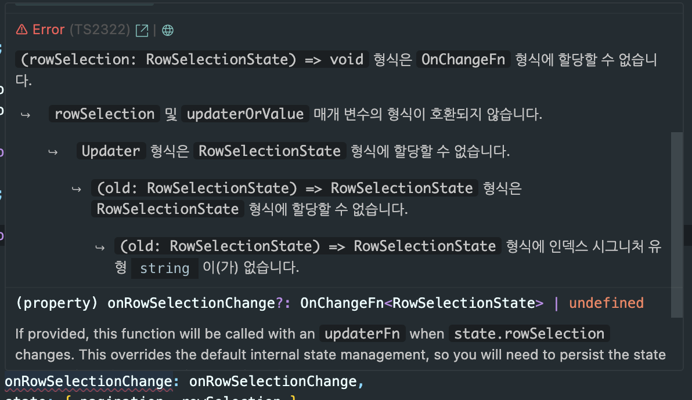

[이전 글](https://geuni620.github.io/blog/2024/9/28/tanstack-table-row-selection/)을 살펴보다가, 추가로 궁금한 점이 생겼다.  
tanstack-table에선 체크박스의 상태를 관리하기 위해 rowSelection이라는 상태를 만들고 적용하는데, 일반적으로 다음과 같다.

```TSX
  const [rowSelection, setRowSelection] = useState<RowSelectionState>({})

  const table = useReactTable({
    data,
    columns,
    getCoreRowModel: getCoreRowModel(),

    // 여기에 onChange와 state를 저장해주면 된다.
    onRowSelectionChange: setRowSelection,
    state: {
      rowSelection,
    },
  });
```

setRowSelection은 setState인데, 이를 함수로 받아서 사용해야하는 경우도 있다.  
예를들면, 이전 글에서 예시로 들었던, [onRowSelectionChangeHandler](https://geuni620.github.io/blog/2024/9/28/tanstack-table-row-selection/#1-onrowselectionchange)를 만들어서, setRowSelection을 업데이트하는 것이다.

<br/>

나의 경우 최초엔, 다음과 같이 반영하려했다.  
단순 rowSelection을 넘겨받아서, setState에 담아주겠거니 생각했다.

```TSX
  const onRowSelectionChange = (rowSelection: RowSelectionState) => {
    setRowSelection(rowSelection);
  };

  const table = useReactTable({
    data,
    columns,
    getCoreRowModel: getCoreRowModel(),


    onRowSelectionChange: onRowSelectionChange, // here 🙋‍♂️!!!
    state: {
      rowSelection
    },
  });
```

하지만 이렇게 했을 땐, onRowSelectionChange에서 타입에러가 발생한다.



그럼 onRowSelectionChange를 통해 인자로 받는건 뭘까?

```TSX
  const onRowSelectionChange = (rowSelection: RowSelectionState) => {
    console.log('rowSelection', rowSelection);
    setRowSelection(rowSelection);
  };

  // rowSelection log
  rowSelection (old) => {
      var _opts$selectChildren;
      value = typeof value !== "undefined" ? value : !isSelected;
      if (row.getCanSelect() && isSelected === value) {
        return old;
    // ...
  }}
```

rowSelection에 관한 어떤 로그가 찍히는데 아직은 이게 무엇을 의미하는지 잘 모르겠다. 😭

<br/>

[onRowSelectionChange](https://tanstack.com/table/v8/docs/api/features/row-selection#onrowselectionchange)에 관해 공식문서에선 다음과 같이 설명되어있다.

```TSX
onRowSelectionChange?: OnChangeFn<RowSelectionState>

// If provided, this function will be called with an updaterFn when state.rowSelection changes.
// 이 함수가 제공되면 state.rowSelection이 변경될 때 updaterFn과 함께 호출됩니다.

// This overrides the default internal state management, so you will need to persist the state change either fully or partially outside of the table.
// 이 함수는 기본 내부 상태 관리를 재정의하므로 테이블 외부에서 상태 변경을 완전히 또는 부분적으로 유지해야 합니다.
```

현재 이해하기론, onChangeFn이라는 함수가 존재하고, 이를 통해 Tanstack table 내부에서 상태를 업데이트한 뒤, 외부에서 주입받는 setState(=setRowSelection)도 업데이트 시키는 것 같다.  
그럼 내부코드에서 onChangeFn부터 찾아보면 될 것 같았다.

<br/>

---

### useReactTable

> 사전에 내가 이해하고 있는 부분은,  
> Tanstack-table은 여러 라이브러리를 지원하는데(react, vue, angular, svelte 등등) core를 주입하는 방식으로 이를 가능하게 한다는 점이다.
>
> 예를들어 core를 구현해놓은 상태에서, 이를 react에 주입하는 것이다.  
> 그럼 React에서 사용할 수 있는 react-table이 된다.

<br/>

가장 먼저, Tanstack-table의 useReactTable이 어떻게 만들어지는지부터 살펴봤다.

```TSX
// https://github.com/TanStack/table/blob/6b4d616dd7c8917616eb4fecaf09dda7030fd115/packages/react-table/src/index.tsx#L57C1-L94C2
export function useReactTable<TData extends RowData>(
  options: TableOptions<TData>
) {
  // Compose in the generic options to the user options
  const resolvedOptions: TableOptionsResolved<TData> = {
    state: {}, // Dummy state
    onStateChange: () => {}, // noop
    renderFallbackValue: null,
    ...options,
  }

  // Create a new table and store it in state
  const [tableRef] = React.useState(() => ({
    current: createTable<TData>(resolvedOptions),
  }))

  // By default, manage table state here using the table's initial state
  const [state, setState] = React.useState(() => tableRef.current.initialState)

  // Compose the default state above with any user state. This will allow the user
  // to only control a subset of the state if desired.
  tableRef.current.setOptions(prev => ({
    ...prev,
    ...options,
    state: {
      ...state,
      ...options.state,
    },
    // Similarly, we'll maintain both our internal state and any user-provided
    // state.
    onStateChange: updater => {
      setState(updater)
      options.onStateChange?.(updater)
    },
  }))

  return tableRef.current
}
```

위에서 언급했듯이 table-core를 만들어서 useReactTable에 주입하는 과정이다.  
그래서 폴더구조도 이게 끝이다.

```
react-table/
├── src/
│   └── index.tsx // here 🙋‍♂️!!!
├── tests/
├── package.json
├── rollup.config.mjs
├── tsconfig.json
└── vitest.config.ts
```

<br/>

소스코드를 확인해보면, 총 2개의 useState가 보인다.
하나는 `tableRef`, 다른 하나는 `state`이다.

tableRef는 상태명 그대로, table의 인스턴스를 관리하는 것이다.  
이 부분이 table-core를 통해 만들어진 core가 react로 주입되는 부분으로 보인다.

<br/>

```TSX
  const table = useReactTable({
    data,
    columns,
    getCoreRowModel: getCoreRowModel(),

    // 여기에 onChange와 state를 저장해주면 된다.
    onRowSelectionChange: setRowSelection,
    state: {
      rowSelection,
    },
  });
```

다른 하나는 state인데, tanstack-table의 초기값을 지정하고 싶으면, useReactTable 내 [initialState](https://tanstack.com/table/latest/docs/api/core/table#initialstate)를 등록할 수 있다. 즉 **초기값의 지정**과, **table 인스턴스 내부에서 관리하는 state**로 보인다.

그리고, options.state도 보이는데, 이게 rowSelection과 같은 외부에서 주입받은 state를 관리하는 것으로 보인다.  
onStateChange를 살펴보면, updater를 인자로 받아서, setState, options.onStateChange?.(updater)로 넘겨주는데, 각각 **table 내부에서 관리하는 state**와 **사용자에 의해 주입된 외부 state**이다.

table 인스턴스의 state 덕분에 `table.getState().rowSelection`을 확인하면 state를 확인할 수 있었던 것이다.  
cc. [Access Row Selection State](https://tanstack.com/table/v8/docs/guide/row-selection#access-row-selection-state)

<br/>

---

### table-core

나는 계속 rowSelection의 업데이트를 위해 onRowSelectionChange를 살펴보는 중이다.  
눈에 띄는게, createTable함수이다. 이는 table-core에 정의되어있다.

<br/>

```
table-core/
├── src/
│   ├── core/
│   │   ├── cell.ts
│   │   ├── column.ts
│   │   ├── headers.ts
│   │   ├── row.ts
│   │   └── table.ts // here 🙋‍♂️!!!
│   ├── features/ ...
│   ├── utils/ ...
├── tests/ ...
├── package.json
├── rollup.config.mjs
├── tsconfig.json
└── vitest.config.ts
```

core의 table을 살펴보면, createTable을 만날 수 있다.  
소스코드를 내리다가, builtInFeatures 변수가 보인다.  
그리고 그 내부에 RowSelection 기능이 추가되어있는 것을 확인했다.

```TSX
// https://github.com/TanStack/table/blob/6b4d616dd7c8917616eb4fecaf09dda7030fd115/packages/table-core/src/core/table.ts#L41C1-L57C11
const builtInFeatures = [
  Headers,
  ColumnVisibility,
  ColumnOrdering,
  ColumnPinning,
  ColumnFaceting,
  ColumnFiltering,
  GlobalFaceting, //depends on ColumnFaceting
  GlobalFiltering, //depends on ColumnFiltering
  RowSorting,
  ColumnGrouping, //depends on RowSorting
  RowExpanding,
  RowPagination,
  RowPinning,
  RowSelection, // here 🙋‍♂️!!!
  ColumnSizing,
] as const
```

나의 목표는 onRowSelectionChange가 인자로 받는 onChnageFn이 궁금하기 때문에, 이 부분부터 살펴봤다.

<br/>

```TSX
// https://github.com/TanStack/table/blob/6b4d616dd7c8917616eb4fecaf09dda7030fd115/packages/table-core/src/features/RowSelection.ts#L199-L219
export const RowSelection: TableFeature = {
  getInitialState: (state): RowSelectionTableState => {
    return {
      rowSelection: {},
      ...state,
    }
  },


  getDefaultOptions: <TData extends RowData>(
    table: Table<TData>
  ): RowSelectionOptions<TData> => {
    return {
      // makeStateUpdater는 여기 링크를 참고하면 된다.
      // https://github.com/TanStack/table/blob/6b4d616dd7c8917616eb4fecaf09dda7030fd115/packages/table-core/src/utils.ts#L91C1-L103C2
      onRowSelectionChange: makeStateUpdater('rowSelection', table),
      enableRowSelection: true,
      enableMultiRowSelection: true,
      enableSubRowSelection: true,
      // enableGroupingRowSelection: false,
      // isAdditiveSelectEvent: (e: unknown) => !!e.metaKey,
      // isInclusiveSelectEvent: (e: unknown) => !!e.shiftKey,
    }
  },

  createTable: <TData extends RowData>(table: Table<TData>): void => {
    table.setRowSelection = updater =>
      table.options.onRowSelectionChange?.(updater)
    table.resetRowSelection = defaultState =>
      table.setRowSelection(
        defaultState ? {} : table.initialState.rowSelection ?? {}
      )
  }

  //...
}
```

`onRowSelectionChange`함수가 사용된 3개의 메서드만 추려봤다.  
(`getInitialState`, `getDefaultOptions`, `createTable`)

먼저 getDefaultOptions가 보이는데, onRowSelectionChange에 `makeStateUpdater`가 보인다.

```TSX
// https://github.com/TanStack/table/blob/6b4d616dd7c8917616eb4fecaf09dda7030fd115/packages/table-core/src/utils.ts#L81C1-L85C2
export function functionalUpdate<T>(updater: Updater<T>, input: T): T {
  return typeof updater === 'function'
    ? (updater as (input: T) => T)(input)
    : updater;
}

// https://github.com/TanStack/table/blob/6b4d616dd7c8917616eb4fecaf09dda7030fd115/packages/table-core/src/utils.ts#L91C1-L103C2
export function makeStateUpdater<K extends keyof TableState>(
  key: K,
  instance: unknown
) {
  return (updater: Updater<TableState[K]>) => {
    (instance as any).setState(<TTableState>(old: TTableState) => {
      return {
        ...old,
        [key]: functionalUpdate(updater, (old as any)[key]),
      };
    });
  };
}
```

처음엔 이 부분이 내가 위에서 접한 useReactTable의 onRowSelectionChange라고 생각했다.  
하지만, 위에서 확인했던, log를 대조해보니, 확실히 다르다는 것을 알 수 있었다..

```TSX
  // 다시 확인
  const onRowSelectionChange = (rowSelection: RowSelectionState) => {
    console.log('rowSelection', rowSelection); // log!!!
    setRowSelection(rowSelection);
  };

  // rowSelection
  rowSelection (old) => {
      var _opts$selectChildren;
      value = typeof value !== "undefined" ? value : !isSelected;
      if (row.getCanSelect() && isSelected === value) {
        return old;
    // ...
  }}
```

<br/>

---

로그에 찍힌 부분을 다시 찾아봤다.  
아래에 조금 내리니, 브라우저 로그에서 확인했던 코드와 유사한 코드를 발견했다.

```TSX
// https://github.com/TanStack/table/blob/6b4d616dd7c8917616eb4fecaf09dda7030fd115/packages/table-core/src/features/RowSelection.ts#L473
export const RowSelection: TableFeature = {
  createRow: <TData extends RowData>(
    row: Row<TData>,
    table: Table<TData>
  ): void => {
    row.toggleSelected = (value, opts) => {
      const isSelected = row.getIsSelected()

      table.setRowSelection(old => {
        value = typeof value !== 'undefined' ? value : !isSelected

        if (row.getCanSelect() && isSelected === value) {
          return old
        }

        const selectedRowIds = { ...old }

        mutateRowIsSelected(
          selectedRowIds,
          row.id,
          value,
          opts?.selectChildren ?? true,
          table
        )

        return selectedRowIds
      })
    }
  },
}
```

createRow 메서드 중, `old => {}`부분이 위에서 log로 확인했던 인자값과 유사해보인다.  
즉, **onChangeFn은 table의 setRowSelection이었던 것**이다.

```TSX
// https://github.com/TanStack/table/blob/6b4d616dd7c8917616eb4fecaf09dda7030fd115/packages/table-core/src/features/RowSelection.ts#L547
const mutateRowIsSelected = <TData extends RowData>(
    selectedRowIds: Record<string, boolean>,
    id: string,
    value: boolean,
    includeChildren: boolean,
    table: Table<TData>
  ) => {
    const row = table.getRow(id, true)

    //...

    if (value) {
      if (!row.getCanMultiSelect()) {
        Object.keys(selectedRowIds).forEach(key => delete selectedRowIds[key])
      }
      if (row.getCanSelect()) {
        selectedRowIds[id] = true
      }
    } else {
      delete selectedRowIds[id]
    }
  //...
  }
```

먼저 row가 몇 번째 행인지 id로 찾는다. (사용자가 체크박스 체크했을 때 id로 행을 찾는다.)

value는 boolean타입인데, rowSelection id에 해당하는 체크상태인 것 같다.  
value가 존재하는 상태에서 각 분기별로, multiSelect가 가능한지, select가능한지, 만약 value가 없다면 제거하는 것이다.  
(실제 rowSelection에는 선택된 체크박스 ID만 담긴다.)

<br/>

그리고 한 가지 특이점이라면, mutateRowIsSelected는 반환값이 없다는 점이다.
그 이유는 참조값으로 전달된 객체를 직접 변경하기 때문이다. mutateRowIsSelected 함수가 호출될 때, `const selectedRowIds = {...old}`로 얕은 복사가 이뤄지며,
이로 인해 selectedRowIds는 새로운 객체지만 그 내부 구조는 여전히 참조로 연결되어있다.

mutateRowIsSelected는 이 selectedRowIds 객체를 직접 변경하여, 함수 외부에서도 동일한 객체의 변경이 반영되도록 한다.
결과적으로, mutateRowIsSelected가 selectedRowIds를 변경하면, 이 변경된 상태가 table.setRowSelection 함수에서 반환되어 최종적으로 새로운 상태가 반영된다.  
이렇게 복사된 후 직접 변경된 객체가 반환됨으로써 테이블의 선택상태가 업데이트 되는 것이다.

<br/>

---

### table.setRowSelection

궁금증은 해결되었다. onRowSelectionChange는 table의 setRowSelection이었다.  
그럼, table의 setRowSelection은 어디서 만들어질까?

```TSX
export function createTable<TData extends RowData>(
  options: TableOptionsResolved<TData>
): Table<TData> {
  //...

  // builtInFeatures에 RowSelection이 포함되어있다.
  const _features = [...builtInFeatures, ...(options._features ?? [])]

  let table = { _features } as unknown as Table<TData>

  //...

  Object.assign(table, coreInstance)

  // for문을 돌면서, 해당하는 builtInFeatures에 포함된 인스턴스 중 createTable이 있다면 이를 호출하여 테이블 인스턴스에 포함한다.
  for (let index = 0; index < table._features.length; index++) {
    const feature = table._features[index]
    feature?.createTable?.(table)
  }

  return table
}
```

creatTable을 다시 살펴보면, 함수가 끝나는 마지막쯤 for문이 보인다.  
table.\_features에 RowSelection도 포함되어있는데, for문을 돌면서, 해당 feature를 꺼내오고, createTable 메서드를 실행시킨다.  
이때 RowSelection의 createTable도 존재한다면, 실행될 것이다.

확인해보니, RowSelection도 createTable이 존재하며 다음과 같다.

```TSX
// https://github.com/TanStack/table/blob/6b4d616dd7c8917616eb4fecaf09dda7030fd115/packages/table-core/src/features/RowSelection.ts#L221
export const RowSelection: TableFeature = {
  //...
  createTable: <TData extends RowData>(table: Table<TData>): void => {
    table.setRowSelection = updater =>
      table.options.onRowSelectionChange?.(updater)

    //...
  },
}
```

위 코드에서, createTable이 생성되면서 table의 setRowselection이 정의되어 있는 것을 볼 수 있다.  
createTable의 매개변수인 updater는 위에서 확인했던 콜백함수와 동일할 것으로 생각된다. `old => {}`

```TSX
  // 위에서 언급했던 이 부분, old => {}가 위 setRowSelection의 인자로 들어간다.
  table.setRowSelection(old => {
    value = typeof value !== 'undefined' ? value : !isSelected

    if (row.getCanSelect() && isSelected === value) {
      return old
    }

    const selectedRowIds = { ...old }

    mutateRowIsSelected(
      selectedRowIds,
      row.id,
      value,
      opts?.selectChildren ?? true,
      table
    )

    return selectedRowIds
  })
```

<br/>

### 정리

정리해보면 다음과 같다.

- Tanstack-table의 onRowSelectionChange는 결국 table이 생성될 때 만들어진, setRowSelection이었다.  
  그리고 이는 tanstack-table core에 정의된 createTable의 호출에 의해 만들어 진 것이다.

- 생성된 table 인스턴스는 useReactTable의 tableRef를 통해 주입된다.

정리해보니 많지 않은 내용인데, 내부코드를 모르는 상태에서 하나씩 살펴보다보니 오래 걸린 것 같다.

정리하다가, 너무 길어지는 것 같아서, 조금 맥을 끊고 싶기도 했다.  
사실 한 가지 남은 의문이 더 있다.

**createRow는 어디서 실행되는가**인데, 어디서 실행되었기 때문에 row.toggleSelected이 생성되었을 것이다.  
그리고 이를 통해 사용자가 체크박스를 체크 or 해지 할 수 있으며, row.toggleSelected이 호출되는 것이다.

이후엔 오늘 살펴본 내용과 같다.  
(setRowSelection을 통해 state가 업데이트되고, table내부 state, rowSelection이 업데이트 됨.)

한 가지 알게 된 내용은, createTable이 실행될 땐 createRow가 생성되지 않았다.  
이 부분은 다음 글에서 찾아봐야할 것 같다.
