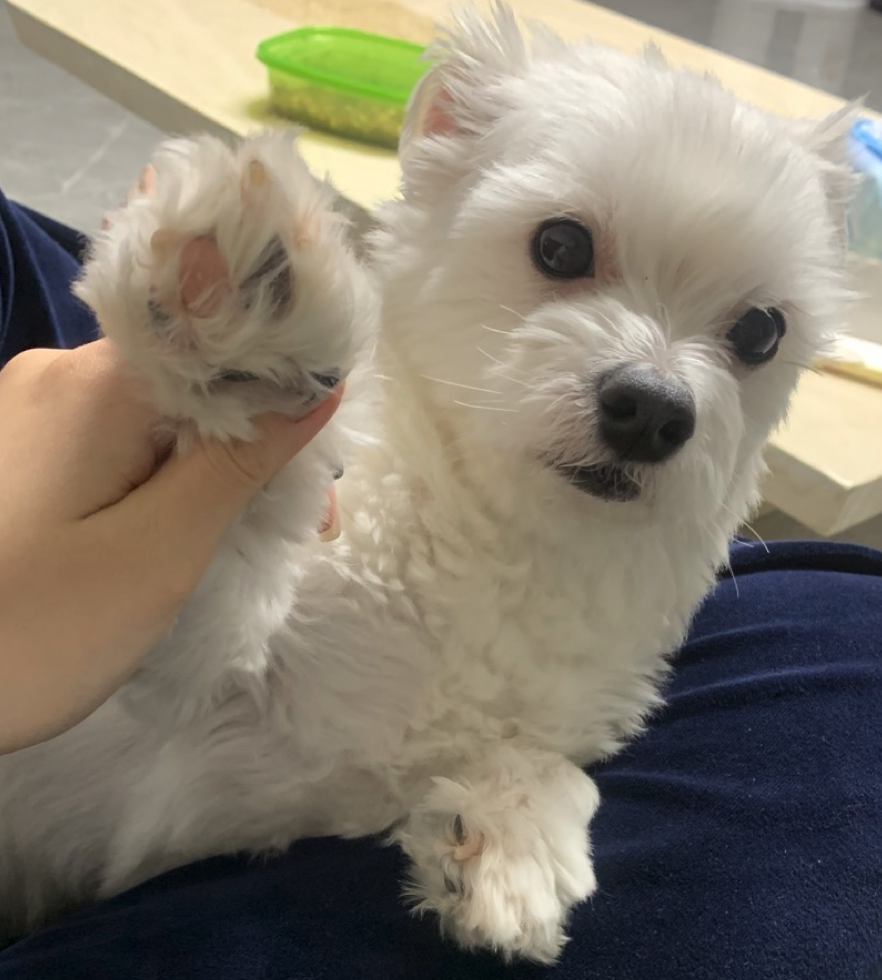
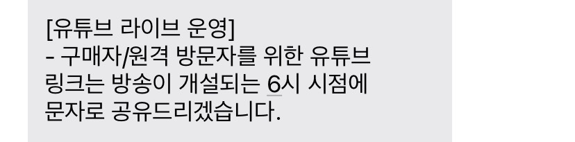
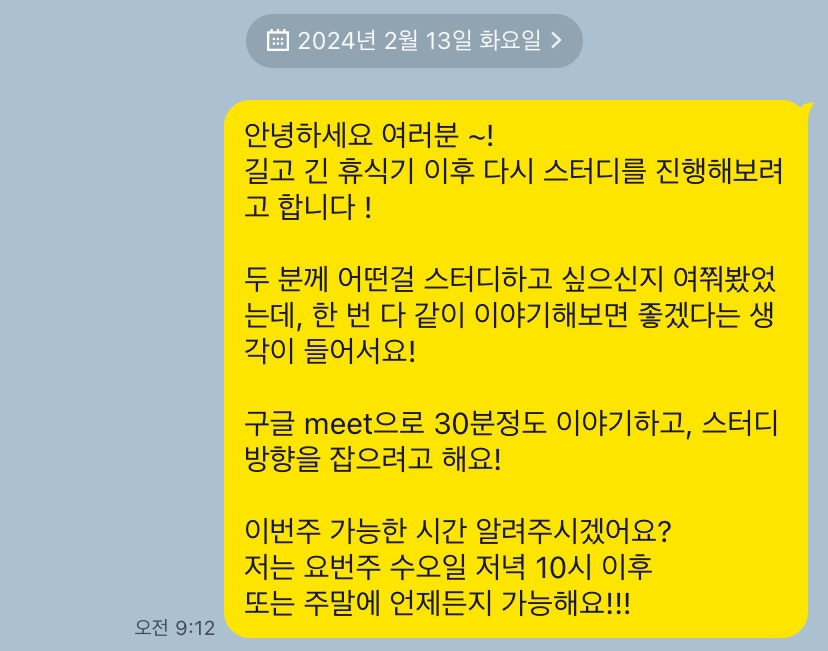
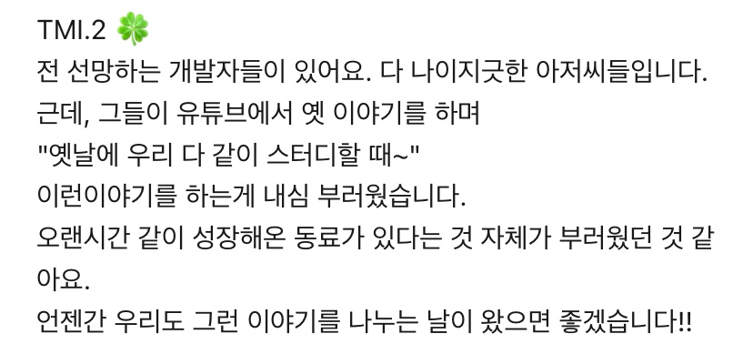

> [2022년 회고](https://geuni620.github.io/blog/2023/1/12/2022%20%ED%9A%8C%EA%B3%A0/)  
> [2023년 회고](https://geuni620.github.io/blog/2024/1/7/retrospect/)  
> 올해도 어김없이.

# 1. 이직

[작년 회고](https://geuni620.github.io/blog/2024/1/7/retrospect/)를 작성할 때, 이미 이전 회사를 퇴사한 이후였지만,  
이직에 대한 내용은 하나도 담지 않았다.

2월부터 이직한 회사에 출근을 했다.  
이직을 할 당시 두 가지를 고민했었다.

**'팀이 있었으면 좋겠다.'**

이전 회사에서는 온전히 한 프로덕트를 나 혼자 담당해야했다.  
물론 동료가 있었지만, 해당 프로덕트에 대한 오너십은 온전히 나에게 존재했다.

좋은 환경에서 많은 개발을 전척으로 믿어준게 감사하기도 했지만, 한편으론 동료와 함께 프로덕트를 발전시켜가고 싶다는 니즈가 커졌다.  
내가 고민하는 내용을 다른 그 누군가와 함께 나누고 싶었던 것 같다.

**'상용화되고 있는 프로덕트가 있었으면 좋겠다.'**

이전 회사에서는 프로덕트를 출시하기 위해 처음부터 만들어보는 경험을 할 수 있었다.  
하지만 여러사정으로 출시날짜가 계속 연기되면서, 이직을 고민하게 되었다.  
사용자의 피드백을 받으면서 프로덕트를 발전시켜나가고 싶었다.

 

### 1-1. 조직개편

12월 초 합격통보를 받고, [한 달 정도의 휴식을 가진 뒤](https://geuni620.github.io/blog/2024/1/31/daily/) 2월 1일에 첫 출근을 했다.  
첫 출근을 하고 난 뒤, 갑작스러운 조직개편이 진행되었다.

과정에서 기능조직이었던 프론트엔드 팀(이하 FD팀)이 목적조직으로 흩어지게 되었다.  
처음 이직의 동기가 되었던 '팀이 있었으면 좋겠다.'의 의미는 같은 직군의 개발자가 있길 바랐던 건데, 목적조직으로 흩어지게 된 것이다.😭

또한, 속하게 될 스쿼드도 미정이었다.  
물류회사의 여러 프로덕트 중, TMS와 WMS 중 한 곳에 속하게 될 것이라고만 전달받았다.

 

돌이켜 회상해보면, 당시의 나는 크게 고민되거나 걱정하지 않았던 것 같다.  
어떤 스쿼드에 속하던, 무엇을 맡게되던, 내가 가진 능력과 실력에 자신있었다.

이 자신감이 '내가 엄청 뛰어난 개발자라는 자화자찬의 의미가 절-대 아니다.'  
그저, 좋아하는 개발을 즐겁게 하다보면, 그리고 회사가 가지고 있던 문제를 하나씩 차근차근 물어가며 풀어가다보면, 어떤 일이던 잘 할 수 있을 것 같다.

무엇보다, 내가 만들게 될 프로덕트를 누군가 접속하고, 들어와서 사용한다는 것 자체가 기분 좋았다.  
당시 팀장과 리더가 많은 노력을 해준 덕분에, **WMS 스쿼드**에 잘 안착할 수 있었다.

 

### 1-2. 유일한 프론트엔드 개발자

스쿼드에 속하게 된 지 얼마 지나지 않아, 조직개편으로 같이 WMS스쿼드에 속하게 된 FD팀 리더였던 분이 퇴사하신다는 소식을 들었다.  
갑작스러운 소식이라 당황했었지만, 퇴사를 결심하기까지 본인이 얼마나 많은 고민을 했을지 당시의 나는 너무 잘 알고 있었다.

["퇴사하겠습니다."](https://velog.io/@geuni620/%ED%87%B4%EC%82%AC%ED%95%98%EA%B2%A0%EC%8A%B5%EB%8B%88%EB%8B%A4)  
한 마디 내뱉기까지 얼마나 많은 고민이 묻어있는지, 본인이 되어보지 못하면 이해하지 못한다.  
난 그저 그 사람의 선택을 조용히 응원할 뿐이다. 앞으로도 계속 그럴 것이다.

 

### 1-3. 목적조직

곧 입사한 지 1년이 다 되어가는데, 목적조직으로 일해볼 수 있었던 게 행운인 것 같다.  
참고로 우리팀은 기획자, 백엔드, 프론트엔드로 구성된 팀이다.

디자이너가 없지만, 기획자가 피그마로 디자인 시안을 만들어주고,  
QA가 없지만, 기획자, 프론트엔드 개발자가 배포 후 회귀테스트를 지원한다.

서버개발자는 상시 운영의 오류 발생 여부를 모니터링한다.  
즉, 각자가 맡은 역할 이상으로 스쿼드를 위해 도움을 주고 받는다.

 

사실 생각해보면, 나는 도움을 주는 역할보다 받는 입장이었던 적이 많았다.  
서버에서 프론트를 지원해주고, 최대한 맞춰주려고 하시는 모습에 항상 감사했다.  
<small>감사해요 🙏</small>

프론트 리소스를 생각해서, 최대한 프론트를 가볍게 가져가고, 서버에 의존적이게 만드려고 했다.  
그래서 client state인 redux를 제거하고, 점진적으로 server state로 변경했던 것이다.

이 외에도 스웨거를 적극적으로 써보고 싶다며 항상 최신상태로 업데이트 요청드리기도 하고,  
목업데이터를 만들어주시면 API 테스트에 용이할 것 같다고 요청드리기도 했다.  
하나같이 서버에 도움되는 내용보단 프론트에 도움되는 내용이었는데 모든 요구사항을 들어주심에 (정말) 감사했다.

[역시 난 인복이 많은 게 확실하다.](https://geuni620.github.io/blog/2023/1/12/2022%20%ED%9A%8C%EA%B3%A0/#%EC%B7%A8%EC%A4%80-%EC%8B%9C%EC%9E%91)

 

### 1-5. 첫 장애를 내다.

올해 6월에 큰 장애를 냈다.  
기획자와 소통 누락으로 송장개발이 완료되지 않은 개발건이 당장 필요하게 된 것이다.

기획자도 많은 송장을 테스트하다보니, 송장 개발이 완료되지 않은 A택배사와, 최근 리뉴얼한 B택배사를 착각한 것이다.  
기획자는 착각했고, 나는 '기획자가 잘 체크해주겠지' 생각하며 간과하고 넘어갔다.  
결국 이는 큰 장애라는 부메랑이 되어 내게 다시 돌아왔다.

당시 나는 오후반차였고, 기차타고 대구에서 서울로 올라오는 중이었는데, 장애가 발생한 것을 슬랙을 통해 확인했다. 결국 기차안에서 맥북열어서 송장을 빠르게 개발했다.

기차가 도착한 광명역에서 개발한 송장을 테스트 요청드리고, 확인 후 운영에 배포했다.  
기획자도, 나도 그 날은 계속 슬랙을 상시체크하면서 이슈가 발생하는지 체크한 날이다.

그리고 처음으로 오류보고서를 작성했다.

 

장애는 얼마든지 발생할 수 있고, 누구나 장애를 낼 수 있다.  
이후에도 우리 스쿼드에선 크고 작은 장애가 많이 발생했다.

그때마다 항상 드는 생각은 누군가에게 책임을 묻기보단, 동일한 상황이 다시 발생하지 않도록 만드는게 중요하다는 점이다.

 

나는 이 회사에 처음 입사했을 때, 나의 성장 포인트를 총 3가지로 잡았었다.

- 타입스크립트
- 테스트코드
- 린트

위 장애를 계기로, 더 확고해졌다.  
아름다운 UI, 편리한 사용성보다, **장애 없이 매끄럽게 운영될 수 있는 안정성**이 우리 프로덕트에선 더 중요했다.

 

위 3가지 성장 포인트를 중점으로, 프로덕트 개발에 나의 성장을 덧붙여가며 개발했다.  
일정산정 시 테스트코드, 타입스크립트, 린트를 설정할 수 있는 시간적 여력은 하나도 고려하지 않았다.

백로그, 프로젝트를 개발하면서, 필요하다면 만들고 → 수정하고 → 지우기를 반복했다.  
모든걸 완벽하게 완료하진 못했지만, 새롭게 만든 컴포넌트의 타입을 붙이고, 어떻게든 유닛테스트라도 작성하려고 했으며, 린트로 포맷을 일관화시키려고 노력했던 한 해였다.

---

# 2. 내 나이만큼 책 읽기

올해도 어김없이 내 나이만큼 책을 읽진 못했다. 😭  
심지어 작년보다 훨씬 적게 읽은 느낌이다. 확인해보니 총 3권을 읽었다.  
<small>할말이 없다 그니야..</small>

1. 도둑맞은 집중력
2. 역행자
3. 나는 4시간만 일한다.

회고를 적고 있는 현재 부끄럽다는 생각이 들면서도, 말하고 싶은게 생각났다.

[역시 트리거가 있어야한다는 점이다.](https://geuni620.github.io/%EC%BD%94%EB%81%BC%EB%A6%AC%EC%99%80%20%EB%B2%BC%EB%A3%A9/#1-%ED%8A%B8%EB%A6%AC%EA%B1%B0%EA%B0%80-%EC%9E%88%EC%96%B4%EC%95%BC%ED%95%9C%EB%8B%A4)  
책을 읽을 당시, 출근 10분전 또는 점심시간이라는 트리거가 명확히 존재했지만 이직을 한 현재는 트리거를 찾지 못했다. 그렇다고 불규칙적으로 산 건 아니다. 정말 단지 트리거를 찾지 못했을 뿐이다.

사실 출근 10분전에 책을 읽는 습관을, 11월 즈음부터 다시 잡아보고 있다.  
하지만 이직한 현 회사는, 주에 목요일 하루만 출근하다는게 흠이다.  
다른 트리거를 찾아봐야겠다. 현재 읽고 있는 책은 '빠르게 실패하기'이다.

내년에도 도전할거다!

 

---

# 3. 사이드프로젝트

## 3-1. Traffic Hub

[Traffic-Hub](https://traffic-hub.vercel.app/)

아는 사람이 많겠지만, <small>~~내가 하도 말하고 다녀서..~~</small> 나는 '교통공학'을 전공했다.  
첫 회사 커리어에선, 민간투자사업의 교통수요를 분석하는 업무를 주로 했었다.

간단히 말하면 우리나라와 동일한 가상 모델을 만들고, 도로가 없는 곳에 도로를 만들어봤을 때, 해당 도로의 수요가 얼마나 나오는지 분석하는 업무였다.  
이 업무를 할 때부터 불편했던 점이 있었는데, **데이터의 관리처가 흩어져있다는 점**이다.

예를 들어, 우리의 사업모델 영향권이 서울이라면, 서울시 교통량만 참고하면 될까..?  
아니다. 위에서 언급했듯이, 우리나라와 동일한 모델을 구성해야한다.

그래서 각 지자체별 교통량이 모두 필요하다.  
근데 도로가, 서울시에서 관리하는 도로만 있을까?

아니다 고속도로도 있고, 민간고속도로는 또 따로 관리한다. 정부의 것이 아니기 때문이다.  
또한, 수요분석을 위해선 연평균교통량이 필요한데, 이를 제공해주는 곳이 있는 반면, 시간대별로 교통량을 제공해줘서 연평균일교통량으로 만들어야하는 경우도 있다.

연단위 교통량의 패턴을 분석하기 위해선, 엑셀로 데이터를 내려받아 모두 표로 만드는 작업 등등.. 동일한 작업을 반복해야하는 경우가 많다.
이런 불편함을 해소하고 싶어 만들었다.

교통량 데이터의 가공은 현재도 이 업무를 하고 있는 이전 회사 사수였던 분이 도와주셨다.  
<small>매번 고마워요 지욱씨 🙏</small>

공공데이터 open api를 사용하고 싶었지만, 일부 데이터 관리처에서 API를 제공하지 않았다.😭  
<small>없을리 없다는 생각으로, 전화까지 해봤다. 없더라..</small>

 

아직 갈 길이 멀고 만들어야하는 기능도 많은데, 이직한 회사에 업무가 바빠지고, 도움을 주시던 이전 회사 사수도 업무량이 많아지면서 자연스럽게 업데이트는 미뤄지고 있다.  
하지만, 괜찮다. 나는 포기하지 않고 계속 만들 것이다.

빠르게 만들고, 출시하고 실패하면 다른 걸 만드는게 더 좋을 수도 있다.  
하지만, 이 프로젝트로 수입을 얻고자 하는게 아니다.  
단지, 내가 개발자가 아니던 시절부터 겪어오던 불편함을 다른 그 누군가에겐 해결해주고 싶다.

 

## 3-2. Quokka-Letter

[사이드프로젝트, Quokka Letter 회고](https://geuni620.github.io/blog/2024/2/18/retrospect/)

글을 쓴게 있어서 링크를 첨부해둔다.  
작지만, 처음으로 트래픽을 받아봐서 정말 황홀했다. 🌸

 

## 3-3. Quokka-Talk

[나만의 서비스, Quokka-Talk 실패기 기록](https://geuni620.github.io/blog/2024/10/16/quokka-talk/)

이것도 글을 쓴게 있어서 링크를 첨부해둔다.  
제목에서도 짐작할 수 있지만, ~~완전 망했다.~~ ⚡️

 

## 3-4. 솔로프러너

이 외에도,  
만들어 놓은 뒤, 다듬는 중인 것도 있고,  
만들다가 난이도가 너무 높아서 포기한 것도 있고,  
아이디어만 적어도 놓고 실천으로 옮기지 못한 것들도 있다.  
[2023 회고 중 크리에이터, 메이커가 되고 싶다고](https://geuni620.github.io/blog/2024/1/7/retrospect/#1-1-%ED%81%AC%EB%A6%AC%EC%97%90%EC%9D%B4%ED%84%B0-%EB%A9%94%EC%9D%B4%EC%BB%A4) 언급했는데, 마음 뿐이었던 것 같아 개인적으로 아쉽다.

 

그럼에도 한 꼭지를 구성했는 이유는, 올해 참석했던 [솔로프러너 컨퍼런스](https://solpcon.framer.website/)를 기록해두고 싶어서이다.  
1인 개발자로 활동하시는 총 세 분의 이야기를 들을 수 있는 시간이었는데, 처음 발견했을 땐 표가 **매진**이었다.

아쉬운 마음을 달래고 있던 찰나, 컨퍼런스측에서 컨퍼런스 장소를 더 넓은 곳으로 바꿔서 **추가예매를 가능**하게 해주는게 아닌가..! 😭😭😭  
바로 구매해서, 갈 날만 기다리고 있었다. 그런데 하필.. 그 주에 바쁜 일정이 겹쳤다.  
당일이 되어서 못 가겠다 체념 후 출근해서 일하고 있는데, 문자가 도착했다.

원격방문자를 위해 '유튜브'로 링크를 제공해주는게 아닌가..! 😭  
덕분에 퇴근 후 집에서, 집중해서 봤다.

개인적으로 존경하는 분들의 이야기를 멀리서나마 들을 수 있어서 정말 유익했다.  
언젠가 나도, 내가 만든 서비스로 수입을 벌고 자유롭게 살고 싶다는 의지가 더 강해졌다.

 

---

# 4. 스터디

같이 개발공부를 시작했던, 민주님, 효정님과 2024년 다시 스터디를 시작하게 되었다.  
날짜를 찾아보니, 2023년 1월까지 스터디를 진행했었고 모두 취업한 상태에서 학습에 대한 방향을 잃은 상태였는데, 회사에 적응기간과 겹쳐서 스터디 진행이 어려웠던 시기였던 걸로 기억한다.

긴 휴식을 가진 뒤 (약 1년), 다시 스터디를 시작하게 되었다. 🍀  
<small>민주님, 효정님 정말 감사해요 🙇‍♂️</small>

 

현재는 약 1년정도 꾸준히 진행 중이다.  
이 스터디 덕분에 처음으로 [리액트 공식문서](https://react.dev/learn)를 읽어봤고,  
공식 리액트 한국어 번역사이트에 [작은 기여](https://github.com/reactjs/ko.react.dev/pull/876)도 할 수 있었다.

[클린코드 리액트](https://www.udemy.com/course/clean-code-react/)강의를 보며, 리액트를 사용하면서 클린한 코드란 무엇인지 대해 다 같이 고민해보기도 했으며,  
[type-challenges](https://github.com/type-challenges/type-challenges)에 도전했다가 너무 어려워서 easy도 못 끝내고 포기하기도 했다..

 

현재는 [리액트 까보기](https://youtu.be/JadWu4Ygnyc?si=l84C2Y5QxH68mOht), [리액트 톺아보기](https://goidle.github.io/react/in-depth-react-preview/)를 공부하는 중이다.
너무너무 어렵고, 모두가 이해못하는 내용도 많지만, 꾸준히 인풋을 머릿속에 넣고 있다는 것만으로 정-말 만족스럽다.

스터디하기 전, 리액트의 렌더링과 브라우저 렌더링은 내가 항상 어려워하던 대목이었다.  
~~뭐지..? 리액트 렌더링과 브라우저 렌더링은 동시에 일어나나..?~~

스터디 후 조금이나마 머릿속에 그려지기 시작했다는 것도 만족스러운 이유 중 하나다.  
아마 혼자였다면 못했을 것이다. 🙇‍♂️

 

스터디가 끝날 때, 다음 스터디 날짜와 스터디 내용에 대해서 카톡으로 공유드리는데, 한 날은 이런 이야기를 적었다.

지금 보니 무슨 생각으로 적은 건지, 부담스럽게 만든 건 아닌지.. 걱정되기도 하지만,  
나는 그저 좋은 사람들과 계속 즐겁게 개발하고 싶다는 마음이었다.

 

---

# 5. 그 외

## 5-1. 운동

작년엔 [조깅](https://geuni620.github.io/blog/2024/1/7/retrospect/#3-%EC%9A%B4%EB%8F%99) 꾸준히 했었다.  
체중관리가 잘 되어서 좋긴 했지만, 한편으로 몸은 점점 더 외소해지는 것 같았다.

덩치를 더 키워보고 싶었다. 그래서 2월에 PT샵에 PT를 등록했다.  
감사하게도 대화가 잘 통하는 PT선생님을 만나서, 주 2회 꾸준히 지도를 받았다.  
<small>최근 주 1회로 변경했다.</small>

벌크업에 도전해보았지만, 드라마틱하게 커지지 않았다..  
다시 한번 벌크업에 도전하고 싶지만, 올해는 조금 힘들 것 같다.  
<small>큰 이벤트가 있어서..</small>

운동을 하다보니 보디빌딩에 관한 영상을 더 자주 접하게 된다.  
운동가기 싫을 땐, 누워서 헬스유튜버의 영상을 본다. 그럼 가게되더라.

웨이트를 시작하면서, 좁았던 내 관심사가 좀 더 넓어진 한해였다.

 

## 5-2. 이사

7월엔 이사를 왔다.  
현재 지역에서 벗어나고 싶었는데, 그러지 못했다.  
전세에서 월세로 옮겼고, 달달이 나가는 지출은 더 커졌다.

 

2018년 처음 서울에 올라왔을 때, 원룸 방 한칸에서 월세로 살았었다.  
집 컨디션이 만족스럽지 않아서, 매일 네이버 부동산 앱으로 주위에 컨디션 좋은 집들을 보곤했다.

언젠간 이런 원룸에서 살아봐야지 했는데, 마침 기회가 되어서 비싼 월세를 주고 집을 옮겼다.  
18년 당시보단 낙후되기도 해서 그나마 저렴해진 덕에 옮길 수 있는 것이었지만, 그래도 결혼 전 여기서 살아볼 수 있어서 행복하다.

막상 살아보니, 층간소음, 담배냄새 등 오피스텔 원룸은 대체로 다 고질적인 문제가 있음을 알게 되었다.  
살아보기 전엔 몰랐지만 살아보니 빛 좋은 개살구였던 것이다.  
이 모든게 경험이라는 생각으로 자기 합리화 하는 중이다..

 

## 5-3. 블로그 글

올해는 개발에 관련된 글을 총 22편 기재했다.  
[작년에 42편](https://geuni620.github.io/blog/2024/1/7/retrospect/#4-%EB%B8%94%EB%A1%9C%EA%B7%B8%EC%97%90-%EA%B8%80-%EC%93%B0%EA%B8%B0)의 글을 썼던 것에 비해, 많이 줄었다.

곰곰이 생각해보니, 23년도엔 쓰고 싶은 글이 있으면 쭉 쓰고 기재했다.  
24년엔 쓰고 싶은 글이 있으면, 해당 내용의 기능을 다시 한번 만들어봤다.  
그리고 알게된 점을 정리해서 기재했다.

무엇이 더 좋은 방법인지 잘 모르겠다.  
하지만, 한 가지 바꿔봐야겠다고 생각하는 **액션 포인트**가 있다.

24년엔 글을 너무 '잘'쓰려고 했다.  
마음에 들지 않으면 폐기하고, 브랜치를 삭제해버렸다.  
또, 해당 주제에 대한 글을 쓰다가 오랜 기간이 지나서 기억이 나지 않으면 폐기했다.

한 날은, 일일커밋으로 유명한 인프런 CTO 이동욱님의 Github을 들어가보게 되었다.  
빼곡히 채워진 잔디의 커밋 내용을 확인해보다가, 블로그 글 기재를 위한 커밋들을 발견했다.

인상깊었던 점이 있는데, 바로 조금씩이라도 꾸준히 해당 글을 적어가는 것이다.  
많은 내용을 적는 날도 있고, 적게 적는 날도 있었다.

난 글을 쓰려고 하면, 하루 또는 2~3일 정도 날을 잡고 몰두해서 글을 썼다.  
여러상황에 의해 글을 쓰지 못하게 되면 텀이 길어지게 되었고, 쓰고자 했던 내용도 기록해두지 않아서 글이 폐기되었던 것이다.

또, 글을 쓰고 내 글을 잘 읽어보지 못했던 해였다.  
날 잡고 썼으니 잘 썼겠거니 생각했는데, 우연히 다시 읽어본 날 오타를 발견하고 수정하는 커밋을 올리기도 했다.

Tanstack-query의 메인테이너인 [Tkdodo의 블로그 글](https://tkdodo.eu/blog/practical-react-query)을 보면, 글 상단에 Last update을 기재해놓는다. 글을 작성할 당시와 달라진 [변경된 내용](https://tkdodo.eu/blog/practical-react-query#the-defaults-explained)을 꾸준히 관리하는 것이다.

내 글도 소중한 나의 자산이다.  
꾸준히 관리하고 내가 발행한 글에 책임을 다해야한다. 👊

 

---

# 6. 2025년

**"시간이 참 빠르네."**

24년 매일 입에 달고 살았던 말이었다.  
그 만큼 나이가 들어간다는 의미일 것이고, 시간에 무뎌지는 것 같다.

2025년은 내가 두려워 하는 일에 **조금 더 마주서보는 내가 되려고 한다.**  
업무를 진행하며 못할 것 같아 피했던 일들, 두려움에 지레 겁먹고 포기했던 일들, 주위의 시선을 지나치게 의식하다 스스로를 갉아먹었던 경험들—이 모든 것들이 떠오른다.

이 모든 두려움은 결국 익숙하지 않음의 차이에서 비롯된 것일 뿐이다. 내가 지금 잘하지 못하는 것은 내 능력이 부족해서가 아니라 단지 익숙하지 않았기 때문이다.
그래서 올해는 "못하는 것들에 익숙해지는 한 해"가 되기를 바란다.

익숙하지 않은 것들에 맞서보자 🙌
