[이전 글](https://geuni620.github.io/blog/2024/12/9/dom-event/)에서 한 가지 문제가 더 존재했다.  
바로 focus에 관련된 이벤트처리이다.

물류센터의 사용자들은 키보드와 마우스를 사용하지 않는다고 했다.  
대신, 바코드 스캐너에 의존한다.

나의 역할은 최대한 사용자들이 바코드스캐너로만 필요한 모든 동작을 할 수 있도록 지원하는 일이다.  
대표적인 것 중 하나가 Input에 focus 되어있는 상태를 유지하는 것이다.

<br/>

### 1. useEffect와 Ref를 이용한 focus 관리

처음 회사업무를 진행할 당시엔, 회사에서 이와 같은 코드를 사용하고 있어서 그대로 차용했었다.

```TSX
// App.tsx
export const App = () => {
   //...
  useEffect(() => {
    // 모달이 닫힐 때 focus 유지
    if (!isModalOpen) {
      inputRef.current?.focus();
    }
  }, [isModalOpen]);

  return (
    //...
  );
};

// Modal.tsx
export const ModalComponent: React.FC<ModalComponentProps> = ({
  toggle,
  onConfirm,
  onReset,
  totalCount,
}) => {
  const inputRef = useRef<HTMLInputElement>(null);

  useEffect(() => {
    inputRef.current?.focus();
  }, []);

  return (
    //...
  );
};

```

useEffect의 dependency array로 isModalOpen을 추가한 뒤, 모달이 닫혔을 때도 focus가 유지되도록 적용했다.

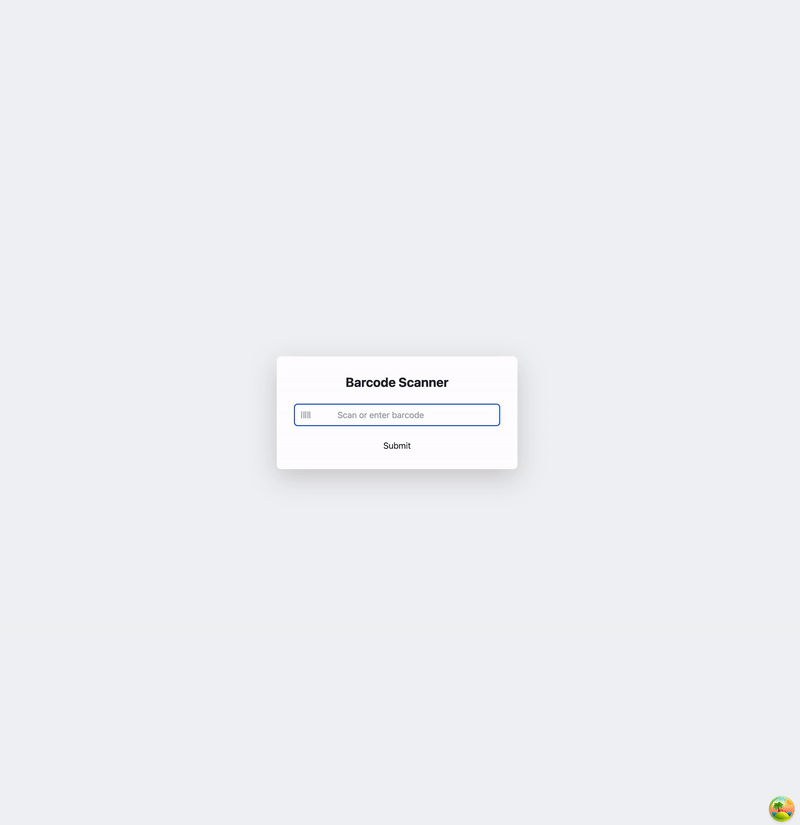

원하는대로 잘 동작하는 듯하다.

<br/>

하지만 회사에선 모달창을 [reactstrap](https://reactstrap.github.io/?path=/story/home-installation--page)이라는 부트스트랩 기반의 컴포넌트를 사용한다.  
만약 reactstrap 모달 컴포넌트를 적용하면 어떻게 될까?

```TSX
// applying reactstrap
import { Modal, ModalBody, ModalFooter, ModalHeader } from 'reactstrap';

export const ModalComponent: React.FC<ModalComponentProps> = ({
  //...
}) => {
  //..

  useEffect(() => {
    inputRef.current?.focus();
  }, []);

  return (
    <Modal isOpen={isOpen} toggle={toggle}>
      <form onSubmit={handleSubmit}>
        <ModalBody>
          <div>
            <span>총 주문 수량: {totalCount}</span>
          </div>
          <input
            ref={inputRef}
            onChange={onScannedValueChange}
            value={scannedValue}
            className="mt-2 w-full rounded border border-gray-300 p-2"
          />
        </ModalBody>
        <ModalFooter>
          <Button type="submit">확인</Button>
          <Button type="button" onClick={handleCancel}>
            취소
          </Button>
        </ModalFooter>
      </form>
    </Modal>
  );
};
```

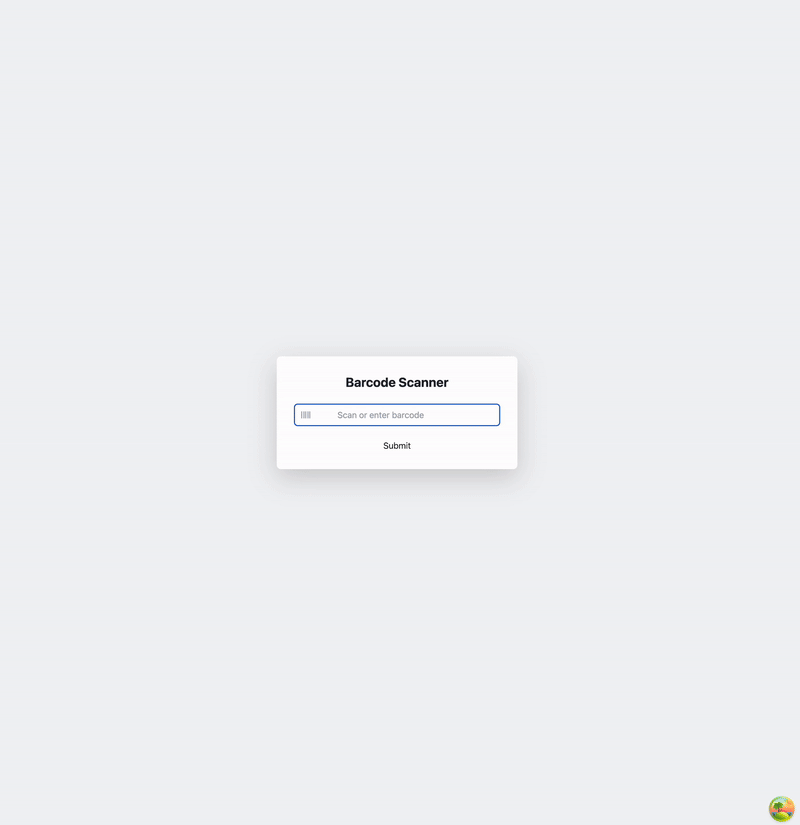

모달창에서 focus가 잡히지 않는다. 😭

<br/>

### 2. ReactStrap 모달에서의 focus 이슈와 requestAnimationFrame 활용

이전 글에서도 언급했지만, 회사에서 급하게 일정이 잡힌 백로그라 원인을 파악하고 하나씩 개선하기보단, 일단 동작하도록 만드는게 우선되었다.  
그래서 여러 방법을 찾아보다가, chatGPT에서 언급해준 [requestAnimationFrame](https://developer.mozilla.org/ko/docs/Web/API/Window/requestAnimationFrame)을 적용하니 원하는대로 동작했다.

현재 회사코드는 아래와 동일하게 작성되어있다.

```TSX
import { Modal, ModalBody, ModalFooter, ModalHeader } from 'reactstrap';

export const ModalComponent: React.FC<ModalComponentProps> = ({
  isOpen,
  toggle,
  onConfirm,
  onReset,
  totalCount,
}) => {

  useEffect(() => {
    // requestAnimationFrame 🙋‍♂️
    requestAnimationFrame(() => {
      inputRef.current?.focus();
    });
  }, []);

  return (
    <Modal isOpen={isOpen} toggle={toggle}>
      <form onSubmit={handleSubmit}>
        <ModalBody>
          <div>
            <span>총 주문 수량: {totalCount}</span>
          </div>
          <input
            ref={inputRef}
            onChange={onScannedValueChange}
            value={scannedValue}
            className="mt-2 w-full rounded border border-gray-300 p-2"
          />
        </ModalBody>
        <ModalFooter>
          <Button type="submit">확인</Button>
          <Button type="button" onClick={handleCancel}>
            취소
          </Button>
        </ModalFooter>
      </form>
    </Modal>
  );
};
```

하지만 궁금하다.  
왜 requestAnimationFrame을 적용해야하는걸까..? 🤔

<br/>

사실 requestAnimationFrame만 가능한 것은 아니다.  
setTimeout도 가능하고, Promise.then를 사용해도 가능하다.

```TSX
// # promise → ✅
useEffect(() => {
  Promise.resolve().then(() => {
    inputRef.current?.focus();
  });
}, []);

// # setTimeout → ✅
useEffect(() => {
  setTimeout(() => {
    inputRef.current?.focus();
  }, 0);
}, []);
```

눈치빠른 사람들은 알겠지만, useEffect 실행 시, 사용된 함수들은 **모두 Web API이다.**  
즉, 이 모든 함수는 자바스크립트 런타임 중, **Call Stack(이하 콜 스택)에서 즉시 처리할 수 없는 동작**이다.

Task Queue, Microtask Queue, Animation Queue를 통해 콜 스택이 비었는지 이벤트루프가 확인한 후, 해당 Queue에서 사용 가능한 첫 번째 작업들을 콜 스택으로 이동해서 실행하는 것이다. 핵심은 콜 스택이 비워져야 Queue에 있는 스택들이 콜 스택으로 이동하는 것이다.

- Promise: Microtaks Queue
- setTimeout: Task Queue
- requestAnimationFrame: Animation Frame Queue

<br/>

### 3. ReactStrap focus 문제의 원인 분석

사실 reactstrap에서는 useEffect를 통한 focus를 적용하는 방법이 아닌, 권장하는 방법이 존재한다.  
바로 **onOpened 메서드를 사용하는 것**이다.

```TSX
<Modal
  isOpen={isOpen}
  toggle={toggle}
  onOpened={() => {
    // Function to be triggered on open
    inputRef.current?.focus();
  }}
>
 //...
</Modal>
```

Modal이 모두 렌더링 된 이후에 focus를 적용하면 되는 것이다.  
아래는 reactstrap 모달컴포넌트 소스코드 일부이다.

```JS
// https://github.com/reactstrap/reactstrap/blob/090bc1eeb19bcc269970151d330c6bc03f731635/src/Modal.js#L113
class Modal extends React.Component {
  constructor(props) {
    //..
  }


 //...
  render() {
    const { unmountOnClose } = this.props;

    if (!!this._element && (this.state.isOpen || !unmountOnClose)) {
      //...

      return (
        <Portal node={this._element}>
          <div className={mapToCssModules(wrapClassName)}>
            <Fade
              {...modalAttributes}
              {...modalTransition}
              in={isOpen}
              onEntered={this.onOpened}
              onExited={this.onClosed}
              cssModule={cssModule}
              className={mapToCssModules(
                classNames(
                  'modal',
                  modalClassName,
                  this.state.showStaticBackdropAnimation && 'modal-static',
                ),
                cssModule,
              )}
              innerRef={innerRef}
            >
              {external}
              {this.renderModalDialog()}
            </Fade>
            {Backdrop}
          </div>
        </Portal>
      );
    }

    return null;
  }
}
```

reactstrap은 [Portal](https://github.com/reactstrap/reactstrap/blob/090bc1eeb19bcc269970151d330c6bc03f731635/src/Portal.js#L11)을 사용하여 모달을 DOM 트리의 다른 부분에 렌더링함으로써, 부모 요소의 스타일이나 레이아웃에 영향을 받지 않도록 분리할 수 있다.

[Fade](https://github.com/reactstrap/reactstrap/blob/090bc1eeb19bcc269970151d330c6bc03f731635/src/Fade.js#L42) 컴포넌트가 눈에 띄는데, 모달의 애니메이션 효과를 담당한다.

즉, useEffect를 통해 focus가 동작하지 않은 이유는, Portal나 Fade로 인해 렌더링 지연이 발생하여 useEffect가 실행될 때 input 요소가 아직 완전히 렌더링 되지 않았기 때문이라고 추측된다.

<br/>

### 4. focus 이벤트 반영 시점

지금까지 내용을 확인하고 난 뒤, 여전히 몇 가지 '찝찝함'이 남았다.  
조금 더 명확하게 확인해보고 싶은데, 추측이 아닌 직접 눈으로 검증할 수 있는 방법은 없을까..?

<br/>

> 크롬 DevTools 중, performance을 이용해서 각 focus 이벤트 반영시점을 알 수 있는 방법이 없을까?

이와 같은 고민을 하던 중, `console.time`을 활용하여 시작 시점과 종료 시점을 기록하면,  
performance 탭의 Timings 섹션에서 해당 로그를 확인할 수 있다는 사실을 알게 되었다.

먼저 위에서 예시로 사용했던 코드를 그대로 가져와서 console.time을 반영했다.

```TSX
export const ReactStrapModal: React.FC<ModalComponentProps> = ({
  isOpen,
  toggle,
  onConfirm,
  onReset,
  totalCount,
}) => {
  //...

  useEffect(() => {
    if (isOpen) {
      // # useEffect → ❌
      console.time('useEffect');
      inputRef.current?.focus();
      console.timeEnd('useEffect');
    }
  }, [isOpen]);

  useEffect(() => {
    if (isOpen) {
      // # useEffect + requestAnimation → ✅
      requestAnimationFrame(() => {
        console.time('animationFrame');
        inputRef.current?.focus();
        console.timeEnd('animationFrame');
      });
    }
  }, [isOpen]);

  return (
    <Modal
      isOpen={isOpen}
      toggle={toggle}
      onOpened={() => {
        // # onOpened → ✅
        console.time('opened');
        inputRef.current?.focus();
        console.timeEnd('opened');
      }}
    >
      <div className="min-w-[300px] rounded-lg bg-white p-6">
        <form onSubmit={handleSubmit}>
          <div className="mb-4">
            //..
            <input
              ref={(node) => {
                if (node) {

                  inputRef.current = node;

                  // # callback ref → ❌
                  console.time('callback-ref-focus');
                  node.focus();
                  console.timeEnd('callback-ref-focus');
                }
              }}
              onChange={onScannedValueChange}
              value={scannedValue}
              className="mt-2 w-full rounded border border-gray-300 p-2"
            />
          </div>
          //..
        </form>
      </div>
    </Modal>
  );
};
```

총 4 곳에 반영했다.

- useEffect → focus ❌
- callback ref → focus ❌
- useEffect + requestAnimation → focus ✅
- onOpened → focus ✅

단독으로 적용했을 때, useEffect + requestAnimationFrame와 onOpened는 focus가 잘 반영되고,  
나머지 useEffect만 사용했을 때와, callback ref는 focus가 반영되지 않았다.

<br/>

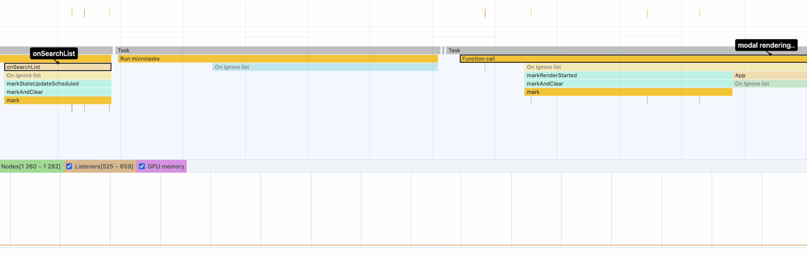

해당 부분은 onSearchList 함수를 호출하고 난 뒤, modal 렌더링이 시작되는 부분이다.

<br/>

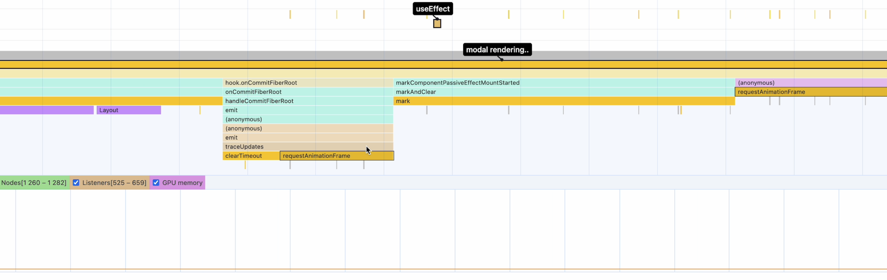

useEffect를 통한 focus를 시도했지만, Modal이 아직 렌더링 중이라, ref는 null이었을 것이다. → ❌

<br/>

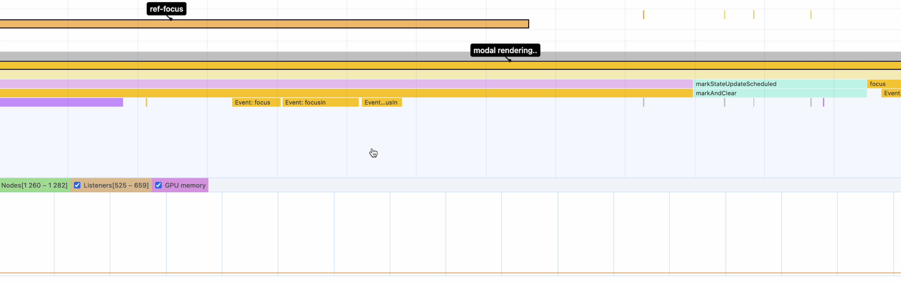

callback ref가 실행되었지만, Modal은 여전히 렌더링 중이다.

<br/>

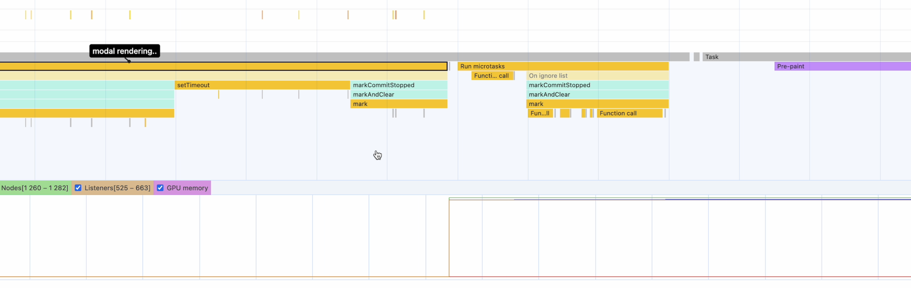

드디어 모달이 모두 그려졌다.

<br/>

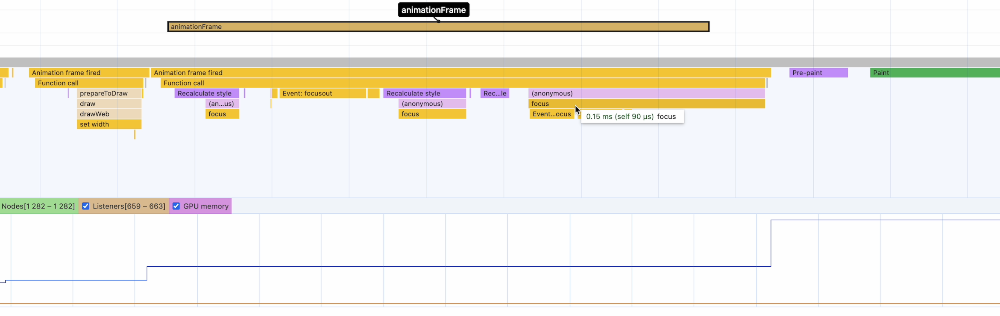

콜 스택이 빈 뒤에 이벤트 루프가 requstAnimationFrame을 콜 스택에 반영했을 것이다.

<br/>

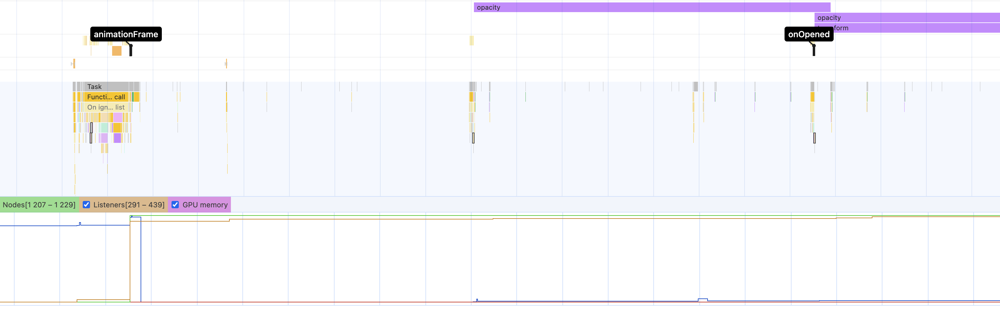

참고로 onOpened는 가장 마지막에 실행되었다.

<br/>

### 5. 잘못된 전제를 수정하기

위 **4. performance + console.time**에서 한 가지 잘못된 전제를 수정해야한다.  
이 내용은 [Avoiding useEffect with callback refs](https://tkdodo.eu/blog/avoiding-use-effect-with-callback-refs) 글을 읽고 깨닫게 된 사실이다.

<br/>

먼저 나는 console.time을 총 4곳에 반영했었고, focus가 적용된 여부에 대해 기록해두었다.

- useEffect → focus ❌
- callback ref → focus ❌
- useEffect + requestAnimation → focus ✅
- onOpened → focus ✅

<br/>

곰곰이 생각해보면, Modal Rendering이라고 표기했던 것은 onSearchList 함수가 호출된 이후 실행되는 일련의 동작들을 의미하며, 이를 통칭하여 Modal Rendering이라고 명명하였던 것이다.

그럼, **Modal 렌더링 도중에 focus를 DOM에 반영하는 로직이 포함되면 무조건 반영되지 않을 것일까?**

focus를 반영하려는 ref가 input DOM 요소를 참조하게 될 때, 즉 요소가 생성되고 DOM에 삽입된 시점을 정확히 파악하여 focus를 설정해야한다.

**위 예시에서 "callback ref"인 경우**이다.

- callback ref → focus ❌

하지만 callback ref의 경우 focus가 반영되지 않았다. 왜 일까..? 🤔  
고민하던 찰나, **내부코드에서 autoFocus가 default true로 되어있는 것을 확인**했다.

<br/>

```TSX
// https://github.com/reactstrap/reactstrap/blob/090bc1eeb19bcc269970151d330c6bc03f731635/src/Modal.js#L139
componentDidMount() {
  if (isOpen) {
    this.init();
    this.setState({ isOpen: true });
    if (autoFocus) {
      this.setFocus();
    }
  }
  // ...
}
```

reactstrap의 모달은 컴포넌트 마운트 시, autoFocus가 true일 경우 setFocus 메서드를 호출해서 focus를 설정한다.

```TSX
// https://github.com/reactstrap/reactstrap/blob/090bc1eeb19bcc269970151d330c6bc03f731635/src/Modal.js#L295
setFocus() {
  if (
    this._dialog &&
    this._dialog.parentNode &&
    typeof this._dialog.parentNode.focus === 'function'
  ) {
    this._dialog.parentNode.focus();
  }
}
```

setFocus 모달 다이얼로그의 부모 요소에 focus를 설정한다.  
참고로 dialog는 Modal 대화상자 컨테이너와 같다.

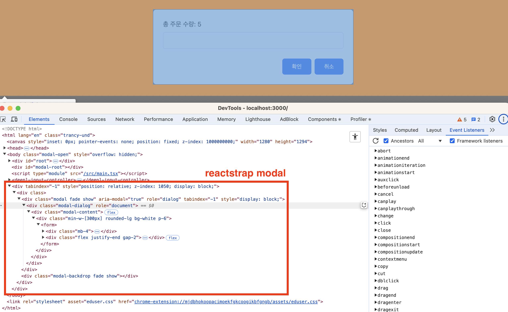

this.\_dialog.parentNode의 focus를 맞추니, 이미지에서 확인할 수 있는 modal 자체를 focus로 잡는다.  
즉 **modal-dialog의 부모를 focus로 잡는 것**이다.

```TSX
<div class="modal fade show" ...>
```

혹시 그럼 **autoFocus 때문에 input의 callback ref focus가 잡히지 않는걸까..?** 🤔

autoFocus를 false로 둔 상태에서 동일하게 동작시켜보았다.  
**아..!☝️ focus가 잡힌다.**

- autoFocus = false + callback ref → focus ✅

<br/>

### 6. callback ref와 autoFocus 간 focus 우선순위 확인

autoFocus를 false로 둔 상태에서, callback ref를 사용하면 focus가 잡힌다는 사실을 알았다.  
그럼 autoFocus 때문에 callback ref의 focus가 덮혔던걸까? 무시된건가? 또, 이를 어떻게 확인할 수 있을까?

조금 무모한 방법이지만, **reactstrap modal에 필요한 컴포넌트를 그대로 복사해서 동일하게 구성**했다.  
이후 내부에 필요한 요소에 console.time을 추가했다.

즉 node_modules의 파일에 존재하는 소스코드가 아닌, 내 로컬에 내려받은 reactstrap 모달로 테스트해보았다.

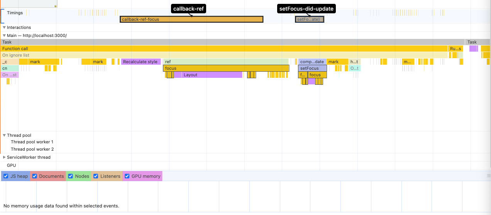

callback-ref가 실행되고 난 뒤, setFocus가 잡힌다.  
즉, callback-ref가 setFocus에 의해 무시 & 덮혀버리는게 맞았다.

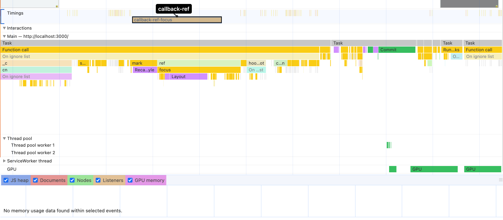

당연한 이야기겠지만, autoFocus false로 지정한 뒤, performance 탭을 이용해 확인해보면, setFocus는 잡히지 않는다.

<br/>

### 7. 마무리

리액트는 여전히 어렵다.  
리액트에서 브라우저로 이어지는 렌더링 전체 과정을 이해하고 있다고 생각했는데, 조금만 복잡해져도 헤매기 일쑤다. 🤦‍♂️

다시 처음으로 돌아가서, reactstrap에서 useEffect만으로 focus가 제대로 동작하지 않았던 이유는 **useEffect가 실행되는 시점에 reactstrap의 Modal이 아직 생성되지 않았기 때문이다. 그 결과 inputRef.current가 null 상태이며, focus를 설정할 수 없다.**  
일반 엘리멘트(element)일 경우 useEffect를 통해서 focus가 잡히지만, reactstrap에서 잡히지 않는 이유는, **Portal, Transition에 의한 지연 때문인 것으로 추측**된다. (블로그 글에 추가하진 못했지만, 부모에서 useEffect가 실행되고 이후, Modal의 Portal, Transition이 실행되는 것을 확인했다.)

**그럼 DOM이 정확히 렌더링된 직후에 focus를 적용하려면 어떻게 해야할까?**  
callback-ref를 통해 반영하면 된다. 하지만 reactstrap은 autoFocus 속성(true)으로 인해 내부적으로 실행되는 setFocus가 callback-ref의 focus를 덮어버리는 현상이 발생했었다. 그래서 autoFocus를 false로 설정해주면 잘 반영된다.

**requestAnimation이나 onOpened를 통해 input에 focus가 설정될 수 있었던 이유는, reactstrap의 setFocus가 실행된 이후에 해당 로직이 실행되어 focus를 다시 input으로 되돌렸기 때문**이었다.

<br/>

이 모든 문제의 근원은 autoFocus가 아니었나 싶다.  
결국 **callback ref를 통해 처리하는게 명확한 방법**이었던 것 같다.  
DOM이 반영될 때의 여부를 명확히 파악할 수 있으니 말이다.

<br/>

**[번외 I]**

번외로 하나 더 알아봤던 내용을 기록차 남겨둔다.  
정확한 원인은 파악하지 못했고, 어디까지나 추측이다.

[4. focus 이벤트 반영 시점](https://geuni620.github.io/blog/2024/12/25/focus-event/#4-focus-%EC%9D%B4%EB%B2%A4%ED%8A%B8-%EB%B0%98%EC%98%81-%EC%8B%9C%EC%A0%90)을 살펴보면, useEffect → callback-ref 순으로 실행되는 것을 볼 수 있다. 생각해보면, callback-ref가 실행되고 난 뒤, useEffect가 실행되어야할 것 같은데, 왜 이렇게 동작하는걸까?

reactstrap의 모달 컴포넌트 때문이다.  
모달 컴포넌트를 주석처리한 뒤 확인해본 결과, callback-ref → useEffect 순으로 동작한다.  
그럼 Modal 내부에서 어떠한 영향에 의해 다음과 같이 동작하는 것 같은데, 명확한 원인은 잘 모르겠다. 😭

추측 정도만 가는데, Portal, Transition 등이 영향을 받을 것 같고, Modal이나 Portal, Transition에서 리액트의 라이프사이클을 깨트리는, DOM을 직접 생성하거나, 추가하는 로직이 존재한다. 이 때문에 확인이 어려웠다.  
대략적으로 다음과 같은 순서로 동작했다.

Modal init > useEffect > Portal > callback-ref  
추후 기회가 된다면 다시 살펴봐야겠다.

<br/>

**[번외 II]**

사실 동작만 가능하게 하려면, requestAnimation이나, setTimeout으로 잘 동작하고, onOpened 메서드를 사용해도 문제없이 잘 동작한다. 하지만 당시 내 주된 관심사는 **잘 동작하는 코드보다, 동작하지 않는 코드가 왜 동작하지 않는지 모르는 상황이 답답해서 이렇게까지 확인해보고 싶었다.**

또, 이를 눈으로 볼 수 없는 상황이 답답했다.  
테스트코드를 통해 focus의 반영여부를 DOM에서 확인할 수 있겠지만, 난 항상 순서가 궁금하다.  
그 시점이 눈으로 보이지 않는 상황이 답답했던 것 같다.

개발자도구를 열어서 이것저것 눌러보다가, performance 탭으로 렌더링을 순서에 맞게 시각적으로 보여주는 것을 확인한 뒤, performance Main의 각 Task를 하나씩 살펴보기도 했다. 하지만 이 많은 것을 모두 하나씩 확인하며 시점을 비교하고 체크하기에는 시간이 너무 오래걸렸다..

신기하게 모르면 모를수록, 고민이 깊어지면 깊어질수록, 이 주제로 글을 쓰는 빈도가 줄어들었다.  
'시간이 허락하면..' '더 많은 시간이 주어진다면..'과 같은 핑계로 멀리하게 되더라.  
사실은 복잡한 문제를 머리를 굴려가며 부딪혀보기 겁났던 것 같기도하다.

머리가 못따라가니 물어보기 급급했다.  
이 글을 쓰며 chatGPT, claude, gemini 그리고 최근 떠오르는 deepseek까지 모두 사용했다.  
이 중에 가장 도움이 되었던 건, chatGPT의 o1 모델이 아니었나 싶다.  
console.time을 제안해준 것도 chatGPT이다.  
<small>claude와 함께 reactstrap을 벤치마킹해서 같이 구현해보던 중, 원인을 파악했다고 생각했는데 claude가 말을 바꾼 적도 있다. 👊</small>

이러나 저러나, **겉으로 보이는 현상 너머의 본질을 파악하는 것의 중요성을 깨달았다.**  
단순히 문제를 해결하는 것에 그치지 않고 '왜'라는 질문을 끊임없이 던져봤던 시간이었다.

앞으로 useEffect에 대한 시점을 분석할 일이 있다면 performance를 적극 사용해볼 것 같다.  
또한, 이번 계기로 '디버깅'이라는 키워드에 관심이 생겼다. 원인 모를 다양한 이슈를, 명확하고 쉽게 해주는 디버깅 툴의 매력에 빠진 듯하다. 🤔

<br/>

### 참고자료

[JavaScript Visualized - Event Loop, Web APIs, (Micro)task Queue](https://youtu.be/eiC58R16hb8?si=uhK2Cn4Tya5sFyhE)  
[웹 애니메이션 최적화 requestAnimationFrame 가이드](https://inpa.tistory.com/entry/%F0%9F%8C%90-requestAnimationFrame-%EA%B0%80%EC%9D%B4%EB%93%9C)  
[리액트의 리렌더링 조건을 더 쉽게 이해해보기](https://velog.io/@mogulist/understanding-react-rerender-easily)  
[Timeline of a React Component With Hooks](https://julesblom.com/writing/react-hook-component-timeline)
