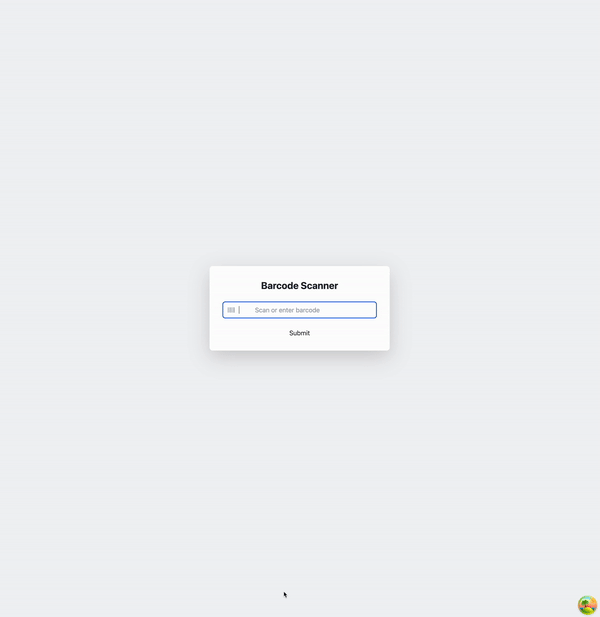
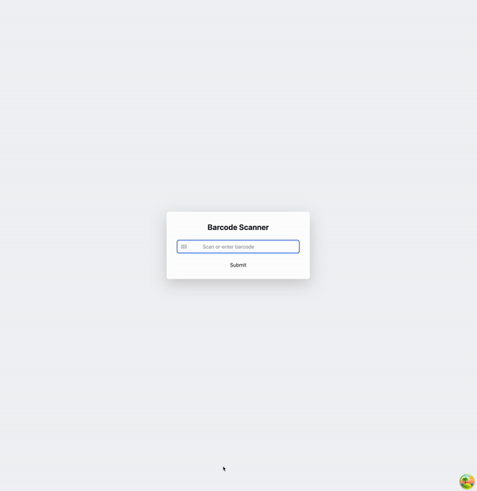

> 회사에서 급하게 일정이 잡힌 백로그를 개발하게 되었다.  
> 이 과정에서 얻은 인사이트를 기록해둔다.

급하게 들어오는 백로그를 선호하지 않는데, 이번에는 불가피했다.  
결국 일정이 잡혔고, 팀장의 빠른 공유 덕분에 바로 개발에 착수할 수 있었다.  
요구사항은 간단해보였다.

백로그 요청사항은, 검수페이지로 진입 전, 해당 주문건에 대한 총수량을 모달창으로 띄워달라는 것이었다.  
검수자가 총수량을 인지할 수 있도록 단계를 하나 더 추가하고자 했던 것 같다.

<br/>

즉,  
검수페이지에 진입하기 위해선, 송장에 노출되어있는 바코드를 스캔해야한다.  
스캔 후, 인식된 송장번호를 Input창에 입력하고, 확인을 누르면 API가 호출되고 페이지 전환이 이루어진다.

1. 검수스캔페이지 진입
2. Input창에 Auto Focus
3. 바코드 스캐너로 송장번호가 기입된 바코드 스캔
4. Input창에 리더기로 인식한 송장번호가 입력되고 Enter 동작
   - 바코드스캐너로 송장번호가 기입된 바코드를 스캔하면, Input창에 송장번호가 입력되고, onSubmit 또는 keyboard event가 순차적으로 동작한다.
5. 페이지 전환

<br/>

요청사항은,  
4~5번 사이에 모달창을 하나 더 추가하고, 추가된 모달창에 총수량을 확인한 뒤, ENTER 바코드를 스캔하면 페이지의 전환이 이뤄지도록 하는 것이다.  
(여기서 ENTER는 바코드로 만들어서 보통 검수하는 모니터에 붙여놓곤한다.)

---

### 예시만들기

```TSX
// App.tsx
export const App = () => {
  const navigate = useNavigate();
  const inputRef = useRef<HTMLInputElement>(null);
  const [isModalOpen, setIsModalOpen] = useState(false);
  const [invoiceNumber, setInvoiceNumber] = useState('');
  const [response, setResponse] = useState<Response | null>(null);

  const toggleModal = () => {
    setIsModalOpen(!isModalOpen);
  };

  const onInvoiceNumberReset = () => {
    setInvoiceNumber('');
  };

  const onSearchList = async (invoiceNumber: string) => {
    if (invoiceNumber.trim() === '') {
      toast.error('운송장 번호를 입력해주세요.');
      return;
    }

    try {
      const res = await ReleaseService.getInvoiceInfo(invoiceNumber);

      if (res.result_code === '200') {
        setResponse(res);
        toggleModal();
        return;
      }

      onInvoiceNumberReset();
      setResponse(null);
      toast.error('Event has not been created');
      return;
    } catch (error) {
      toast.error('Failed to fetch invoice info');
      onInvoiceNumberReset();
      return;
    }
  };

  const onConfirm = () => {
    navigate('/release/check', {
      state: {
        invoiceNumber,
      },
    });
  };

  useEffect(() => {
    inputRef.current?.focus();
  }, [isModalOpen]);

  return (
    <div className="flex h-screen items-center justify-center bg-gray-100">
      <div className="w-full max-w-md rounded-lg bg-white p-8 shadow-lg">
        <h1 className="mb-6 text-center text-2xl font-bold text-gray-800">
          Barcode Scanner
        </h1>
        <div className="relative">
          <input
            ref={inputRef}
            className="w-full rounded-md border border-gray-300 py-2 pl-10 pr-2 placeholder:pl-10"
            value={invoiceNumber}
            onChange={(e) => setInvoiceNumber(e.target.value)}
            onKeyUp={(e) => {
              if (e.key === 'Enter') {
                onSearchList(invoiceNumber);
              }
            }}
            placeholder="Scan or enter barcode"
          />
          <Barcode
            className="absolute left-3 top-1/2 -translate-y-1/2 text-gray-400"
            size={20}
          />
        </div>
        <button
          className="mt-4 w-full"
          onClick={() => onSearchList(invoiceNumber)}
        >
          Submit
        </button>
      </div>

      {isModalOpen && (
        <ModalComponent
          toggle={toggleModal}
          onConfirm={onConfirm}
          onReset={onInvoiceNumberReset}
          totalCount={response?.result.goodsList[0].orderCount || 0}
        />
      )}
    </div>
  );
};

// ModalComponnet.tsx
export const ModalComponent: React.FC<ModalComponentProps> = ({
  toggle,
  onConfirm,
  onReset,
  totalCount,
}) => {
  const inputRef = useRef<HTMLInputElement>(null);
  const [scannedValue, setScannedValue] = useState('');

  const onScannedValueChange = (e: React.ChangeEvent<HTMLInputElement>) => {
    setScannedValue(e.target.value);
  };

  const handleSubmit = (event: React.FormEvent<HTMLFormElement>) => {
    event.preventDefault();

    if (isEnterCommand(scannedValue)) {
      onConfirm();
      return;
    }

    handleCancel();
  };

  const handleCancel = () => {
    toggle();
    onReset();
  };

  useEffect(() => {
    requestAnimationFrame(() => {
      inputRef.current?.focus();
    });
  }, []);

  return (
    <div className="fixed inset-0 z-50 flex items-center justify-center bg-black">
      <div className="min-w-[300px] rounded-lg bg-white p-6">
        <form onSubmit={handleSubmit}>
          <div className="mb-4">
            <div>
              <span>총 주문 수량: {totalCount}</span>
            </div>
            <input
              ref={inputRef}
              onChange={onScannedValueChange}
              value={scannedValue}
              className="mt-2 w-full rounded border border-gray-300 p-2"
            />
          </div>
          <div className="flex justify-end gap-2">
            <Button type="submit">확인</Button>
            <Button type="button" onClick={handleCancel}>
              취소
            </Button>
          </div>
        </form>
      </div>
    </div>
  );
};
```

회사코드를 가져올 수 없어서, 최대한 유사하게 만들었다.  
해당코드를 살펴보면, 특이점이 보이는데, onKeyup을 사용한다는 점이다.

이것 때문에 내가 예상했던 것과 다른 동작으로 고생했다.  
살펴보자.

<br/>

### onSubmit, onKeyup, onKeyDown

개인적으로 나는, onKeyup이나 onKeydown보다 onSubmit을 선호한다.  
뭐가 더 좋은지 사실 잘 모르겠다. 단지, onSubmit 이벤트가 이벤트 동작이 명확하다고 생각하기 때문이다.

해당 코드는 기존에 작성된 코드에 모달창을 추가하는 구조였다.  
즉, 기존 소스코드를 조금 수정한 상태에서, `ModalComponent`만 내가 추가로 만든 것이다.

기존의 App.tsx는 onKeyup으로 onSearchList를 호출하고 있었던 것이다.  
이때 문제가 발생했는데, 다음과 같다.



해당 동작은 다음과 같다.

1. 해당 페이지 진입 시, Input에 focusing
2. 송장번호가 기입된 바코드 스캔
3. 모달창 노출  
   3-1. 총 수량과 현재 상품수량이 일치한다면 Enter 바코드 스캔  
   3-2. 총 수량과 현재 상품수량이 일치하지 않는다면, Close 바코드 스캔

<br/>

Close 바코드를 스캔했다면, 모달창이 닫히고, Input에 focusing 된다.  
하지만, 해당 GIF파일을 참고하면, onSearchList 함수를 한번 더 호출하는 것으로 보인다.

```TSX
  if (invoiceNumber.trim() === '') {
    toast.error('운송장 번호를 입력해주세요.');
    return;
  }
```

해당 소스코드로 인해 toast.error이 노출되기 때문이다. 🤦‍♂️

<br/>

가장 먼저 생각한 원인은, 이벤트 전파 때문이라고 생각했다.  
onSubmit이벤트로 인해, 발생한 이벤트 전파가 onKeyup에도 영향을 미칠 것이라고 판단했다.  
그래서 다음과 같은 이벤트 전파 코드를 막아주려고 했다.

```TSX
  const handleSubmit = (event: React.FormEvent<HTMLFormElement>) => {
    event.preventDefault();
    event.stopPropagation(); // here!

    if (isEnterCommand(scannedValue)) {
      onConfirm();
      return;
    }

    handleCancel();
  };

  const handleCancel = () => {
    toggle();
    onReset();
  };
```

하지만 동일하게 toast.error 메시지가 노출된다.

<br/>

사실 살펴보면 원인은 onKeyup 때문이다.  
이벤트의 순서는 다음과 같다 onKeydown > onSubmit > onKeyup

그럼 해당 부분은 다음과 같이 동작한다.

1. 해당 페이지 진입 시, Input에 focusing
2. 송장번호가 기입된 바코드 스캔
   - 위에서도 언급했듯이, 바코드를 스캔하면, onChange + onSubmit 또는 onKeyup, onKeydown이 함께 동작한다.
   - 즉, onChange를 통해 송장번호가 기입되고, 자동으로 onKeyup, onKeydown, onSubmit이 동작하는 것이다.
   - 이때 onKeyup, onKeydown, onSubmit 이벤트 중, 해당하는 게 실행된다.
3. onKeyup이 실행되었을 것이다. 그리고 모달창이 노출된다.
4. 모달창 노출
   - 총 수량과 현재 상품수량이 일치한다면 Enter 바코드 스캔
   - 총 수량과 현재 상품수량이 일치하지 않는다면, Close 바코드 스캔
5. Close 바코드를 스캔했다면, onSubmit 이벤트가 동작
   - handleCancel 호출

```TSX
  const handleSubmit = (event: React.FormEvent<HTMLFormElement>) => {
    event.preventDefault();

    if (isEnterCommand(scannedValue)) {
      onConfirm();
      return;
    }

    handleCancel();
  };

  const handleCancel = () => {
    toggle();
    onReset();
  };
```

6. handleCancel이 동작하고 난 뒤, onKeyup이 동작한다.
   - 즉 Close 바코드 onChange + Enter인데, Enter 과정에서 onSubmit 이후 onKeyup이 도는 것이다.

즉 onSubmit 이후에 onKeyup이 한번 더 돌고, 이로 인해 모달창이 닫히면서 focusing 되어있단 Input의 onKeyup인 onSearchList가 호출되는 것이다.  
그로인해, toast.error가 노출된다.

```TSX
toast.error('운송장 번호를 입력해주세요.');
```

<br/>

해결방법은 비교적 간단하다.  
onKeydown으로 변경해주면된다.

onKeydown > onSubmit > onKeyup의 순으로 이벤트 순서가 정의되기 때문이다.

<br/>

Enter 바코드를 스캔한 뒤, 페이지 전환이 이루어졌다고 해도, 마찬가지이다.



페이지 전환 이후에도 Input에 focusing 이루어지기 때문이다.

<br/>

### Input의 Focusing

> Input에 focusing을 안 주면 해결되지 않나요?

위 궁금증이 자연스럽게 생길 수 있다.  
결론부터 말하자면 focusing을 해지할 수 없다.  
focusing을 없앨 경우 센터 직원들의 불만이 급증할 것이다.

센터 현장에서는 검수 화면을 띄워둔 채 모든 작업이 바코드 스캐너를 통해 이루어진다.

마우스나 키보드는 멀리 비치되어 있어 사용에 불편함이 크다.  
센터 운영에서 가장 중요한 것은 생산성으로, 작업을 가능한 한 빠르고 연속적으로 처리하는 것이 핵심이다.  
이는 WMS 스쿼드가 해결해야 할 핵심 과제이기도 하다.

만약 focusing이 자동으로 잡히지 않아, 센터 직원이 매번 바코드스캔 전후로 마우스를 이동시켜 focusing을 맞춰야 한다면, 그 과정에서 불필요한 시간과 동선 낭비가 발생한다.  
이러한 비효율은 결국 생산성 저하로 이어질 수 밖에 없다.

<br/>

> requestAnimation이 꼭 필요할까요?

<br/>

### 예시를 만드는 과정에서 발견한 특이점, react-strap의 focus

회사의 소스코드를 그대로 반영하기 어려워서 예시를 만들고 있었다.

회사에선 [Reactstrap](https://reactstrap.github.io/?path=/story/home-installation--page)이라는 [Bootstrap](https://getbootstrap.com/)기반 UI 라이브러리를 사용한다.  
처음 예시를 만들 때 사용했던 UI라이브러리는, Radix 기반의 ShadcnUI이었다.

---

    - [ ] event preventdefault () event stoppropagation ()
       - 조금 더 자세히 테스트해봐야할 것 같음
    - [ ] useEffect + inputRef focus + requestAnimation
    - [ ] waitFor
    - [ ] react-strap일 때와, 일단 tag를 사용했을 때,
