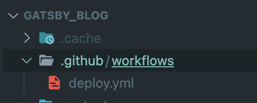
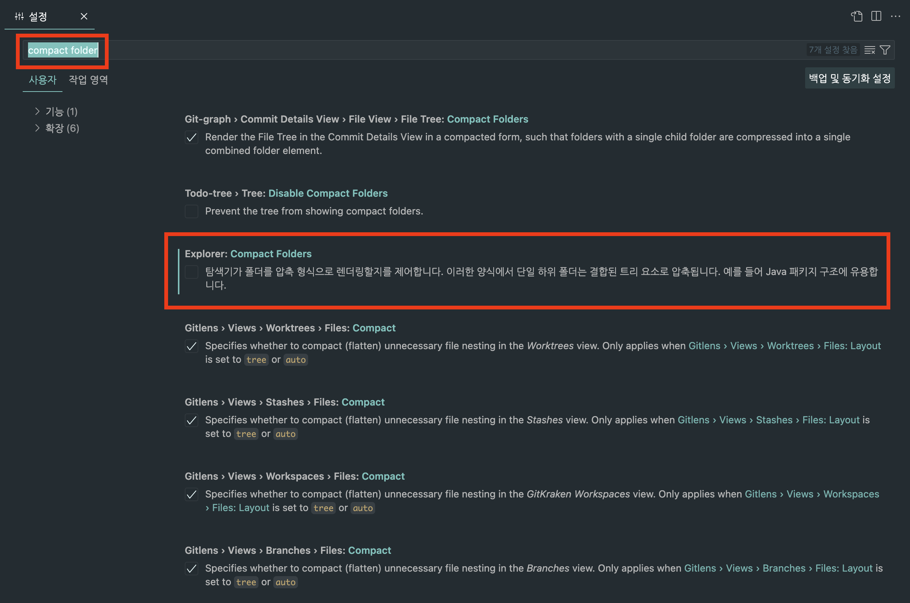

> 최근 vscode가 버벅이기 시작했다.  
> 아마 extension이 너무 많아서 그런 것 같았다.  
> vscode를 처음 사용할 때 이것저것 설치했던게,  
> 현재 나의 발목을 잡는 것 같아서 지우고 다시 설치했다.

 

나는 익숙한 환경이 중요하다고 생각한다.  
키보드, 맥북, 모니터, 보기방식 등  
'뭘 이렇게 따지는게 많냐'며 주위에서 핀찬을 듣곤 하지만  
적어도 내겐 정말 중요한 것들이다.

 

나는 집중력이 좋지 못하다.  
그래서 서서히 끌어올리는 편이다.  
회사에서 출근 1시간은 개발에 관한 아티클 및 새롭게 변경된 사항, 새로운 기술을 읽곤 했다.  
이렇게 끌어올린 집중력을 작은 이슈로 인해 깨지길 바라지 않는다.

 

### 그래서 어떻게 해결하는건데..?

vscode를 다시 설치하고 나서, 다음과 같은 문제(?)가 발생했다.

폴더 뎁스를 표현하는 보기방식이, 폴더가 단일로 존재하면 vscode에서 알아서 간략하게 표현해주는 것이다.
하지만 나의 경우엔 다음과 같이 보기방식을 선호한다.

회사에서도 마찬가지로 불편함을 겪었다. 어떻게 하면 이를 개선할 수 있을까?

 

방법은 간단했다. 이를 개선할 수 있는 방법은 `Compact Folders`라는 설정을 변경해주면 되는 것이었다.

Compact Folders는 `cmd + ,`를 누르고 compact folder를 검색해서 해당 Compact Folders의 체크를 '해지'해주면 된다.

 

이렇게 해주면, 폴더 뎁스를 표현하는 보기방식이 변경된다.
