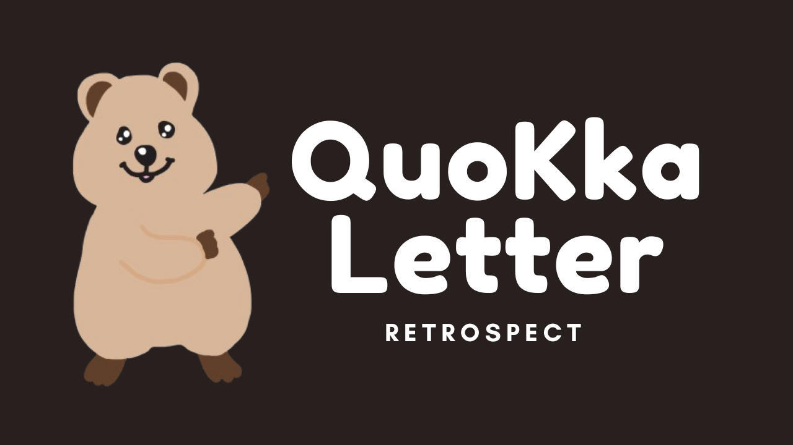
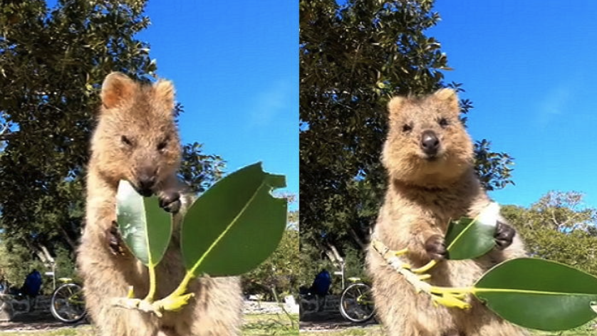
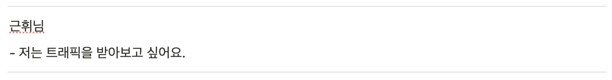
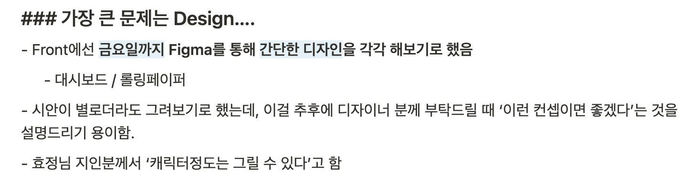
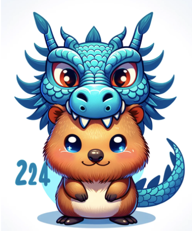
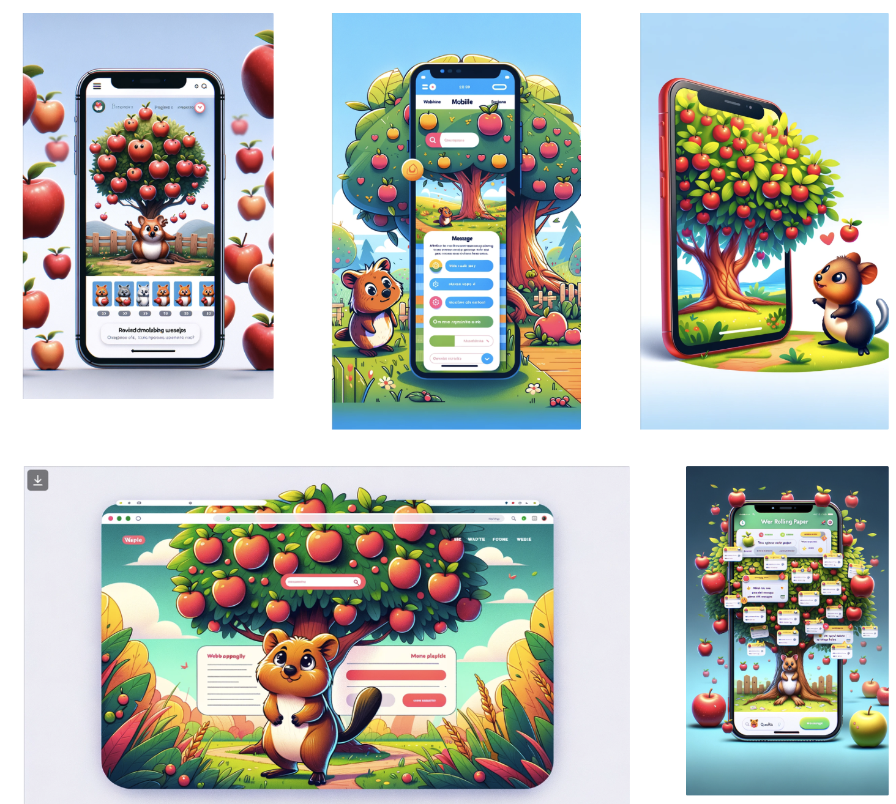
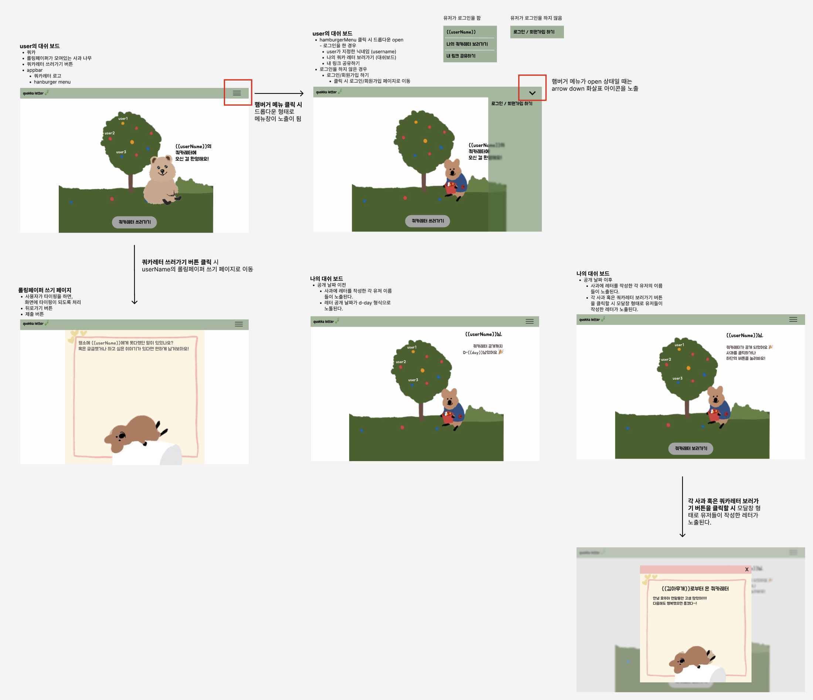
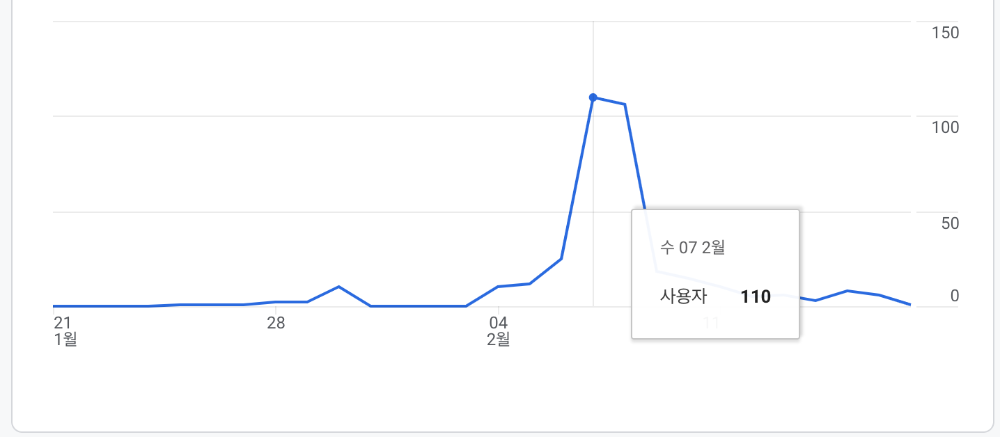
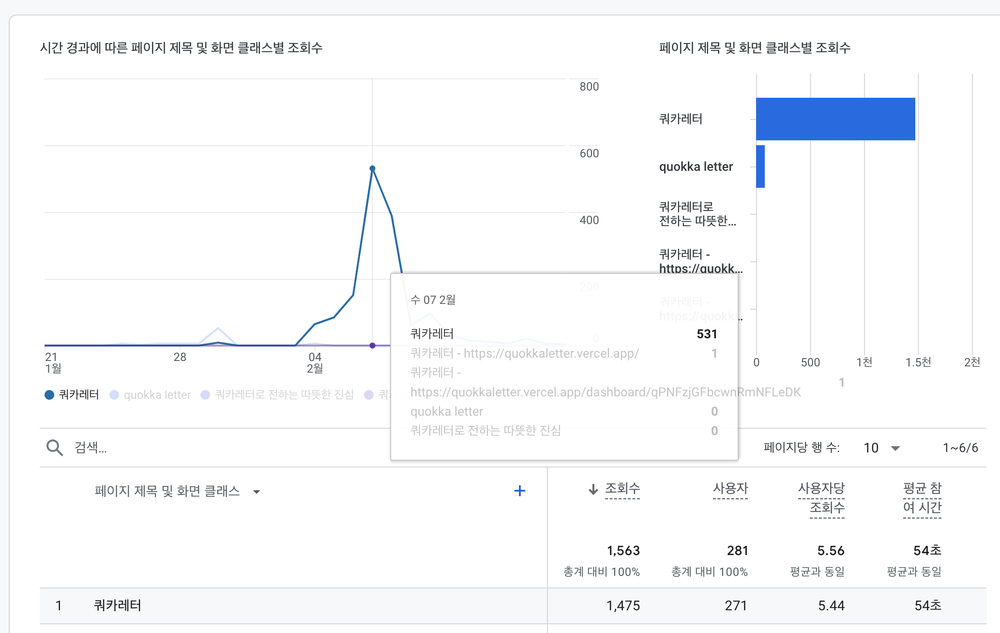

> 기간: 2023.11 ~ 2024-02  
> 작년 11월부터 ~ 2월까지의 현재 사이드프로젝트 팀원들과 함께 진행한 프로젝트에 대한 회고록
>
> 전적으로 팀원, 팀과 무관한 저의 관점에서 작성된 글입니다 :)

 

## 배경

> 사용자의 트래픽을 받아보고 싶어요!

사이드프로젝트를 시작할 당시, 이전회사에서 근무하고 있었다.  
이전회사에선 기존에 운영하던 서비스는 홀딩된 상태였고, 새로운 서비스를 런칭하기 위해 프로젝트를 진행하고 있었다.

하지만 여러사정으로 인해 내가 계획했던 일정이 딜레이되기도 하고, 기획의 방향이 바뀌기도 했다.  
그래서 동료들에게 공유하는 일정 또한 딜레이 되다보니, 만들고 있는 서비스를 얼른 출시해서 피드백을 받고 싶은데 그러지 못했다.

회사에서 나의 니즈가 충족되지 못하다보니, 외부로 시선을 돌렸다.

 

## 첫 번째 팀 결성

부트캠프에서 만난 소중한 동료들과 함께 사이드프로젝트 팀 결성을 했다.  
프론트 2명에 백엔드 1명으로 결성된 팀이었다.

팀만 결성되고 아무것도 정해진 건 없었다.  
막연히 무엇을 하고 싶다는 생각만 가지고 있었다.

당시에 나는 3D에 관심이 많았다.  
Three.js를 통해 사이드프로젝트를 하고 싶었고, 서비스의 컨셉은 '롤링페이퍼'의 성향을 띄길 바랐다.  
개인적으로 나는 쿼카라는 동물을 좋아해서, 쿼카캐릭터가 들어가면 더할나위 없이 좋겠다는 바람도 있었다.

그렇게 서로가 하고 싶은걸 이야기하는 자리로, 강남역 인근 카페에서 만나 첫 기획회의를 진행했다.  
초반 방향은 3D를 제외하고, 롤링페이퍼 성향을 띄는 서비스를 만들기로 결정했다.  
그리고 백엔드에서 하고 싶은 방향과, 프론트에서 하고 싶은 방향을 논의하는 기술스택도 정했다.

 

## 기울어져가는 프로젝트

여러 사이드프로젝트의 회고를 보면, 회사를 다니고 있는 상태에서 별개로 진행되는 사이드프로젝트는 어느정도의 시간이 딜레이 되기 시작하면 기울어져 간다고 한다.  
하지만 그게 우리에게 해당될 것이라고는 처음 시작할 땐 (당연히) 생각하지 못했다.

매 주마다 회의를 할 때, '죄송해요. 이번에 회사일이 있어서 하지 못했어요.' 라는 말을 팀원도, 나도 하게됐다.  
특히, 이직을 하신 분도 있었고, (현재 이직을 해보니 얼마나 많은 시간을 회사에 쏟아야하는지 체감하고 있다..)  
회사 업무의 신-서비스 개발로 인해 정신없이 보내는 분도 있었다.  
당시를 회상해보면, 나는 회사에서도 개인적으로도, 시간적 여유가 허락되는 시기였던 것 같다.

그럼에도 불구하고 나는 프로젝트를 잘 리딩하지 못했다.  
여기서 내가 '프로젝트의 리더인가?'를 생각해봤을 때, 리더는 아니었다.  
리더가 아니더라도 팀을 충분히 리딩할 수 있다고 생각한다.  
(묵묵히 할 일을 꾸준히하며 팀원들 독촉하는게 아니라, 따라오게 만드는 조용한 리더도 있지 않는가)

나는 그러지 못했고, 팀원들의 일정 딜레이에 자연히 나도 묻혀가길 바랐던 것 같다.  
(정말 잘못된 판단이었다.)

결국 한달 두달, 진행상황의 큰 진척이 없다가, 백엔드팀원의 지속적인 회사업무 야근으로 인해 프로젝트를 진행하기 힘들 것 같다는 답변을 들었다.
그렇게 프로젝트는 중단되었다.  
당시 시기는 23년 8~9월쯔음이었다.

 

## 새로운 팀원, 다시 시작

프로젝트가 홀딩되고 (사실상 중단), 팀프로젝트보단 개인프로젝트를 해야겠다는 생각했다.  
하지만 이상하게 용기가 없었다.  
무슨말이냐하면, 혼자서 만든 프로젝트를 지인이 아닌 모르는 사람들에게 공개할 용기가 없었다.

가령 사례로, 블로그 글을 쓰면 자신의 글을 1,000명이 넘는 커뮤니티 또는 오픈채팅방에 피드백을 부탁드리거나, 글을 공유하는 차원에서 올리는 분들이 계신다.  
그 분들의 용기에 감탄하면서도 한편으로 나는 이렇게는 '절대 못할거야' 라며 나의 한계를 나 스스로 제한해두고 있기도 했다.

그래서 만들면서도, 이걸 다른사람한테 보여줄꺼냐는 나 스스로의 질문에 나는, '아니'라고 답했고, 흐지부지되기 일쑤였다.

 

그러던 찰나, 남아있던 팀원 한 분께서 새롭게 알게 된 백엔드 개발자분이 계시는데, 우리의 (중단된) 사이드프로젝트 컨셉을 흥미로워 한다고 말씀해주셨다.  
당시 한 번 실패한 프로젝트였다고 판단하고 있어서, 솔직하게 '될까..?' 라고 생각했다.

결국 남은 팀원 한 분이, 새로운 팀원 한 분을 데리고 와주셨다. (🙏)  
첫 미팅날짜를 잡고 구글 밋으로 소통을 했는데, 소통 10분 전까지도 나는.. 아무생각이 없었다.  
뭔가를 준비할 생각도 못했고, 진짜 아무 생각 없이 미팅에 참여했던 것 같다 🥲

미팅을 진행하면서, 그제서야 나의 후미를 당기는 느낌이 들었다.  
이유를 곰곰이 생각해보니, 나를 제외한 다른 두 분이 사이드프로젝트를 하고 싶다는 열정이 크셨다.

그 때, 나에 대해서도 알게 됐는데 나라는 사람은,

- 스스로 불을 피울 수 있지만, 오래 지속하진 못한다.
- 스스로 피운 불을 다른 사람에게 전달하는 것도 못한다.
- 하지만 상대방이 피운 불이 내게 옮겨 붙였을 때, 나는 그들의 불만큼 혹은, 그 이상으로 타오르기 시작한다.

즉, 다른사람의 열정을 받아서 나도 불을 키울 수 있는 사람이었다.  
당시 회의에서 공통된 니즈는, '사이드프로젝트 하고 싶어요.' 였고, 그 분들의 불이 나에게도 옮겨붙게 됐다.

 

## 사이드프로젝트를 통해 얻고자 했던 것

> 다른 팀원의 기록도 모두 작성되어있지만, 개인적인 기록이라 저만 공개합니다. 🙇‍♂️

다시 시작된 사이드프로젝트 첫 미팅 때, 나는 각자가 무엇을 가장 하고 싶은지 물어봤었다.
내용은 간략히 적어두었는데, 다시봐도 얼마나 사용자 피드백을 갈망했었는지 알 수 있었다.

 

## 사이드프로젝트 진행 중 시행착오

### 1. 디자인은 어떡하죠?

문제가 발생했다. 프론트2명에 백엔드 1명..  
기획은 어찌저찌 했는데 디자인은 도저히 손을 댈 수 없었다.  
심지어 쿼카캐릭터를 어떻게 할 지도 고민이었다.  
초반엔 프론트 2명이서 어찌어찌 피그마를 사용해 캐릭터를 그려보려 시도했지만, 역시나 실패했다.

그러던 찰나, 프론트 팀원의 지인이 디자인을 할 수 있다는 말씀을 하셨다.  
그래서 몇 가지 시안을 GPT를 통해서 요청했고, 다음과 같은 시안을 전달드렸다.

 

이 시행착오를 겪으며, 두 가지가 머리속에 떠올랐다.  
첫 번째는, 사이드프로젝트 이후 간단한 프로토타입 시안 정도는 Figma를 공부해서 그릴 줄 아는 사람이 되어야겠다는 생각  
두 번째는, 어느정도 고도화가 필요할 땐, 내가 모든 일을 처리하기 보단, 컨셉만 명확히 드리고 이 작업을 더 잘할 수 있는 분께 위임해야한다는 것이다.

첫 번째는, 프리랜서의 관점이었고 두 번째는 회사의 관점이다.  
나는 현재는 회사에 속해있지만 훗날 프리랜서의 삶도 고려하고 있다.

하지만 글을 쓰고 있는 현 시점의 나는 회사에 집중해야할 때이고, 모든 걸 다 잘할 수 없다고 생각한다.  
그렇기에 회사에서 각 자의 역할이 있다고 생각하고, 나보다 더 잘할 수 있는 분께 이 작업을 위임하는 것도 용기라고 생각한다.

이번 사이드프로젝트를 통해 간접적으로 나마 이를 경험할 수 있었다.  
감사하게도 동료의 지인이 디자인 해주셨고, 디자인에 대한 긍정적인 피드백이 정-말 많았다.  
다시 한번 각자의 역할에 대해 배우게 된 계기였다.

참고로, 동료 프론트개발자는 Figma로 디자인을 시도하셨다.

이 시안으로 디자이너분께 우리의 컨셉을 더 명확히 전달할 수 있었다.  
이런 건, 내가 정말 배워야할 점이다.  
<small>안될 것 같다고 생각되더라도, 부딪혀보고 시도해보는 것!</small>

### 2. 일정의 연기

우리는 일정을 **총 3번** 연기했다.  
첫 번째 예정일은 크리스마스 전이었고, 두 번째는 신정(1월 1일)이었다.  
세 번째 연기를 통해 구정(2월 10일)에 오픈하였다.

여기엔 나의 태도 문제가 있는데, 다음과 같다.

> 우리 재밌게 사이드프로젝트 하려는 거니까 너무 부담갖지 마세요~

이런 말을 자주했었다.  
돌이켜보니, 너무 책임감 없는 말이었다는 생각이 든다.  
누군가는 이 사이드프로젝트를 위해 열심히 달리고 있는데, 그 열정을 꺾는 말이 아니었나 싶다.

혹여나 일정상 부담을 가지고 있는 분께 너무 부담갖지 말라는 말을 하고 싶었던 것인데,
이런 의도였다면, 내가 더 많은 시간을 투자해야했다. 하지만 그러지도 않았다.

결국 일정을 두 번이나 미루게 됐다.  
그럼에도 오픈할 수 있었던 이유는 다른 동료들이 꾸준히 노력해주신 덕분이다.

### 3. 소통은 온라인보단 오프라인

일정이 두 번이나 연기되다보니, 스스로는 '이번에도 못하는게 아닐까' 염려스럽기도 했다.  
가장 큰 문제는 서로 질문을 남겼을 때, 답장의 시간동안은 다른 작업을 할 수밖에 없다는 점이었다.

예를들어, 점심에 개발을 하고 질문을 올렸으면, 저녁에 답변을 들을 수 있었다.  
혹여나 대비해서 미리 작업을 해두었더라도, 이해한 방향이 잘못됐으면 수정해야했다.  
예상하지 못한 이슈들이 발생할 때도 마찬가지였다.
결국 오프라인의 필요성이 커졌다.

감사하게도, 공유오피스에서 근무하는 팀원분의 도움으로 주말의 하루를 온종일 함께 할 수 있었다.  
두 번정도 오프라인으로 만났는데, 확실히 오프라인에서의 소통이 더 효율적이었다.  
바로 옆에 있으니 대화를 하면서 개발을 진행할 수 있었다.

두 번의 오프라인의 효율성이 온라인으로 진행됐던 개발의 진척도보다 훨씬 크다고 느꼈다.  
무엇보다, 함께 개발하고 있는 동료들을 눈으로 보니, 내 열정도 크게 타올랐다 🔥

 

## 좋았던 점

### 1. 기술적으로 내가 무엇을 모르고 있었는지 알 수 있었다.

[next-auth를 활용한 인증 및 인가 이해하기](https://geuni620.github.io/blog/2024/1/17/authorization/)  
[미뤄두었던 CSS를 공부하자.](https://geuni620.github.io/blog/2024/1/27/style-css/)

프로젝트를 진행하면서 총 2편의 블로그 글을 기재했다.  
첫 번째는 next-auth를 백엔드개발자분께 설명드리면서, 나 스스로도 인증/인가에 대해 정확히 이해하고 있지 못하다고 생각했다.  
왜냐하면, 설명을 드리는데 나도 내가 무슨말을 하고 있는지 이해하기 어려웠기 때문이다. 💬  
정리의 필요성이 있어서 블로그 글을 작성했다.

두 번째 글은, 사실 이전부터 알고 있던 나의 큰 약점이었다.  
**나는 CSS가 부족하다.**  
개발을 시작할 당시, 눈으로 바로바로 변화하는 스타일에 매료되어 프론트로 가닥을 잡았었는데,  
부족하다고 생각한 결정적 계기는 `tailwind`가 아니었나 싶다.

잠깐 `tailwind`에 대해서 이야기해보자면, 편하지만 쓰지말아야겠다는 생각이 들었다.  
tailwind로 css를 작성하면, **css의 용어가 헷갈리기 시작한다.**

예를들어 `line-height`는 tailwind에서 `leading`이라고 표현하는데, 이런 용어의 변화가 많아질수록 헷갈리기 시작한다. 그래서, 매번 [tailwind 공식문서](https://tailwindcss.com/)를 들어가거나, [tailwind cheat sheet](https://nerdcave.com/tailwind-cheat-sheet)에서 검색해봐야했다.

이 모든 건 리소스가 낭비되는 일이다.  
또한, animation을 표현하기도 쉽지않고, tailwind로 온전히 처리하지 못하는 경우는 결국 `global.css`에 작성하게 된다.
이럴거면, 차라리 css로만 작성하는 것도 괜찮겠다는 생각이 들었다.

돌고돌아 결국 순수 CSS가 가장 중요하다고 결론을 지었다.  
다음 프로젝트를 진행하게 된다면, 이번에도 tailwind를 섞을 수도 있겠지만, 최대한 css로만 작성하는 습관을 들여봐야겠다. **구관이 명관이다.**

### 2. 드디어 실사용자의 피드백을 받을 수 있었다.

여러 시행착오가 있었고, QA를 통해 버그를 찾아내고 수정하는 과정을 반복했음에도 불구하고,  
피드백에서 여러 번 언급되는 문제들이 있었다.🥲

먼저, 사용자의 피드백을 받기위해선, 많은 곳에 우리의 서비스가 있다는 걸 알려야한다.  
우리는 크게 두 가지, **Wecode**와 **글또** 커뮤니티를 통해 우리의 서비스를 알렸다.  
이렇게 두 가지를 선택한 이유는, 3명 모두 이 두가지 교집합에 해당하기 때문이었다.

그리고 3명이서 Google Meet으로 만나, 피드백을 위한 Google Form의 질문리스트를 작성하고, 문구나 글자 한자까지 신경써서 작성했다.  
[당시 작성했던 Google Form](https://docs.google.com/forms/d/e/1FAIpQLSdM_aRqlzPdmotqxXJVct84UyX2dRcuor8q_dxTXhSNMczVGQ/viewform)  
<small>이벤트는 끝났지만, 닫진 않았다.</small>

 

설문조사의 응답은 총 8분이 참여해주셨다.  
(정말 감사합니다! 🙇‍♂️)

예상은 했지만, 생각보다 많은 분들이 설문조사까지 이어지진 않는다는 것을 알게됐다.  
심지어 기프티콘으로 커피한잔으론 부족하다고 생각되어 치킨을 준비했는데도 말이다.

돌이켜보니, 나 역시도 누군가의 설문조사에는 잘 참여하지 않았다.  
그게 설령 보상이 주어지는데도 불구하고 말이다.

하지만, 보상이 주어지던, 주어지지 않던, 설문조사에 참여해야겠다는 생각이 들었다.  
나의 작은 피드백으로 그 서비스와 서비스를 만든 사람들에겐 도움이 된다는 걸 직접 경험해보니, 알 수 있었다.  
그리고 이는 더 나은 생태계를 만드는 밑거름이 될 것이라는 점도 이번 계기로 알게 됐다!

 

치명적 피드백도 몇 가지 존재했는데, 이는 서비스가 중단되기 전에 고쳐야했기에 바로 대응했다.  
예를들면 다음과 같다.

1. network 탭에 비공개되어야하는 기록이 모두 보이는 현상
2. 나무에 달린 아이콘을 클릭했을 때 해당하는 레터가 열리지 않고 항상 첫 번째 레터가 열리는 현상
3. 간단하지만 바로 보이는 From, To 반대로 기재
4. Form의 유효성 검사를 추가하지 않아서 발생한 이슈
5. new Date의 한국 시간 설정오류로 레터 오픈시간이 10일 12시가 아닌, 10일 오전 9시가 되어버림.. 🥲

 

### 3. 수치적으로 확인할 수 있는 장치를 마련했다.

구글 애널리틱스를 통해서 사용자의 트래픽을 확인하였는데, 서비스를 오픈하기 전 팀원분들과 예상수치를 짐작했던 적이있다.

> 모두가 입 모아서 이야기 했던 것은 **100명만 들어와주셔도 감사할 것 같다.** 였다.

  

7일 슬랙 채널을 통해서 공유를 했는데, 총 110명의 사용자가 들어왔다. (조회수는 531)  
하지만, 셋째 날 재방문율이 뚝 떨어지는 것을 확인할 수 있다.  
레터를 비공개에서 공개로 오픈했던 10일엔 총 15명의 사용자가 들어왔다.

아마 우리 팀 3명이 메시지가 오픈했다는 걸 알렸기에 지인들이 들어와주신 것 같다.  
편지가 오픈했다는 걸 알리는 메시지 발송이 있었어야했는데, 개발하지 못했다. 😭  
<small>비하인드 스토리가 있는데, 카톡으로 메시지를 일괄 전송하려면, 비즈니스 등록이 필요했다. 시간상 하지못했다.</small>

회원가입은 총 92명, 주고 받은 총 레터 수는 221개이다.

 

## 아쉬운 점

### 1. (소신발언) 비용이 많이 든 프로젝트

한 번의 사이드프로젝트를 잘 마무리 짓기 위해, 투자(?)를 아끼지 않았다.  
수입을 얻을 수 있는 구조가 아니었음에도 불구하고, 팀원분들의 지갑을 열게 만들었다.  
 ~~죄송합니다. 🙇‍♂️~~

대략 다음과 같은 금액이 나갔다.

1. 디자인

- 프론트개발자분의 지인이 작업해주셔서 합리적인 가격에 /n 하여 계산하였다.

2. 이벤트

- 설문조사에 참여해주신 분
- 가장 많은 레터를 받으신 분
- 가장 많은 레터를 남겨주신 분

위 분들께 기프티콘을 전송해드렸다.

이벤트성 페이지였기에 내 기준에선 즐거운 마음으로 지갑을 열 수 있었다.  
하지만 한 번의 사이드프로젝트만 하고 '이제 끝'이라고 외칠 것이 아니라, 지속적으로 사이드프로젝트를 한다고 가정했을 땐, 수입구조를 만들 수 있어야겠다고 생각했다.

그래야, 지속적으로 개선하여 더 나은 프로덕트로 발전할 수 있고, 그 수입을 프로덕트의 발전에 다시 재투자하는 선 구조를 만들 수 있기 때문이다.  
사업이 아닌, 사이드프로젝트이지만, 나는 이런 경험을 **사이드프로젝트를 통해서 해야한다고 생각한다.**  
<small>사이드프로젝트이기에 마음 것 해볼 수 있다고 생각하기 때문!</small>

 

## 마치며

길고 길었던 사이드프로젝트가 마무리 되어간다.  
혼자서라면 절대 못했을 사항을 '함께' 했기에 하나씩 '시도'해볼 수 있었다.

개인적으론 비즈니스적인 사항들,  
예를들어 이벤트 문구, 홍보, 마케팅 등은 완전 무지했다는 생각이 들었다.  
이번 프로젝트를 통해 혈안되었다고 표현하고 싶다.  
이제 내가 아닌 다른 사람의 사이드프로젝트를 보며, 그들의 입장에서 생각해볼 수 있는 경험이 생겼다.

이 값진 경험으로 다음 스탭을 준비할 것이다.

 
