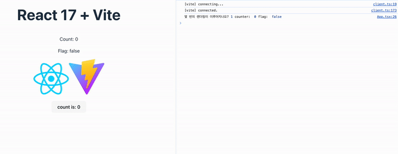
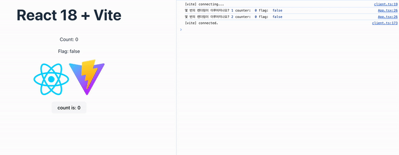
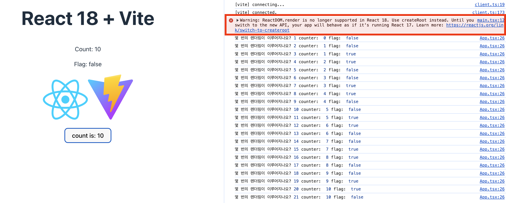
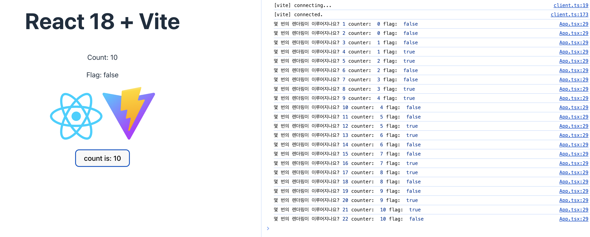
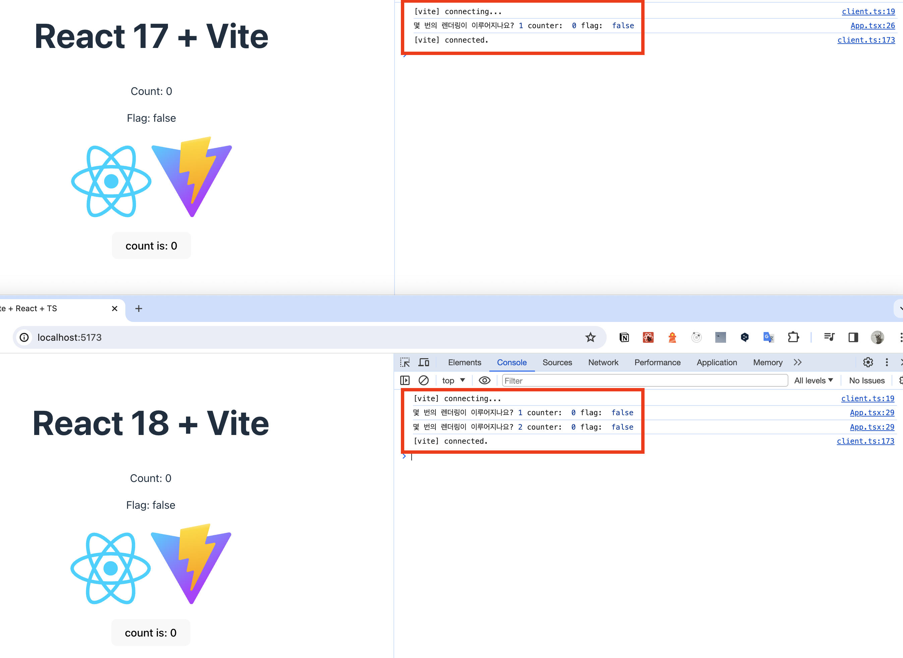

[react-batching repo](https://github.com/Geuni620/react-batching)  
<small>글을 작성하며, 테스트한 코드는 위 링크에서 확인하실 수 있습니다. 🙇‍♂️</small>

> 현 회사에서 React 16버전을 쓰고 있다.
> 인수인계를 위한 문서를 확인하던 도중, 약 1~2년전 회사내 발표자료를 보게 됐다.  
> React 16과 18의 변경점에 대해 소개하는 발표자료였는데, 해당 부분에서 'Automatic Batching' 이라는 키워드를 보게 됐다.  
> 사실 18이 업데이트 됐을 때 가장 핫한 키워드는 Concurrent Mode였는데, Automatic Batching..? 이게 뭘까? 🤔

# Batching vs Automatic Batching

### Batching이라는게 뭘까?

먼저 Batching이라는 단어부터 살펴보자.

- Batching은 성능향상을 위해 여러 state 업데이트는 하나의 리렌더링으로 그룹화하는 것이다.
- React 17과 그 이전 버전에서는 React 이벤트 핸들러 **내에서만** 업데이트가 일괄처리되었다.
- Promise, setTimeout, 네이티브 이벤트 핸들러 등의 업데이트는 기본적으로 React에서 일괄처리 되지 않았다.

[Automatic Batching 리액트 공식문서](https://react.dev/blog/2022/03/08/react-18-upgrade-guide#automatic-batching)

위 내용을 읽고 나서, 궁금해졌다.  
가상돔이 변경된 DOM을 확인 후 state를 한 번에 업데이트 시키는데,  
이 때문에 리렌더링은 항상 일괄처리 된다고 생각하고 있었다.  
그럼 React18 이전 버전에서는 아니었던걸까?

### 기존엔 어떻게 동작했길래..?

```TSX
let rerender = 0;

function App() {
  const [count, setCount] = useState(0);
  const [flag, setFlag] = useState(false);

  const handleClick = () => {
    setCount(count + 1);
    setFlag(!flag);
  };

  useEffect(() => {
    rerender++;
    console.log(
      "몇 번의 렌더링이 이루어지나요?", rerender,
      "counter: ", count,
      "flag: ", flag
    );
  }, [count, flag]);

  return (
    <section>
      //...
    </section>
  );
}
```

간단한 테스트를 해보기 위해 위와 같이 소스코드를 준비했다.
먼저, 한 번의 리렌더링이 될 것이다.
그럼 re-render 값을 1이 될 것이고, 이후에 초기 state값이 주어질 것으로 예상된다.

```
몇 번의 렌더링이 이루어지나요? 1 counter: 0 flag: false
```

이후에 클릭을 진행할 때마다, state는 한 번에 업데이트(Batching) 될테니, rerender 값은 1씩 증가할 것이다.

```
몇 번의 렌더링이 이루어지나요? 2 counter: 1 flag: true
몇 번의 렌더링이 이루어지나요? 3 counter: 1 flag: false
몇 번의 렌더링이 이루어지나요? 4 counter: 1 flag: true
```


잘 동작하는 것 같다.

<br/>

그럼 이제 Automatich batching이 적용되지 않는다고 적혀있던 사항 중 하나인, setTimeout으로 테스트해보자.

```TSX
let rerender = 0;

function App() {
  const [count, setCount] = useState(0);
  const [flag, setFlag] = useState(false);

//   const handleClick = () => {
//     setCount(count + 1);
//     setFlag(!flag);
//   };

const handleClick = () => {
// setTimeout을 사용하여 state를 업데이트
  setTimeout(() => {
    setCount(count + 1);
    setFlag(!flag);
  }, 0);
};

  useEffect(() => {
    rerender++;
    console.log(
      "몇 번의 렌더링이 이루어지나요?", rerender,
      "counter: ", count,
      "flag: ", flag
    );
  }, [count, flag]);

  return (
    <section>
      //...
    </section>
  );
}
```



아하..! 렌더링이 2배로 발생했다.

<br/>

### 그럼 React18에서는 어떻게 동작할까?

React18에선 어떻게 동작할까?  
동일한 환경에서 테스트를 진행해보자

```TSX
// 위에 react 17에서 테스트했던 동일한 코드
let rerender = 0;

function App() {
  const [count, setCount] = useState(0);
  const [flag, setFlag] = useState(false);

const handleClick = () => {
  setTimeout(() => {
    setCount(count + 1);
    setFlag(!flag);
  }, 0);
};

  useEffect(() => {
    rerender++;
    console.log(
      "몇 번의 렌더링이 이루어지나요?", rerender,
      "counter: ", count,
      "flag: ", flag
    );
  }, [count, flag]);

  return (
    <section>
      //...
    </section>
  );
}
```



React 17버전에서는 두 번 리렌더링 되던 현상이, React 18버전에서는 일괄처리되는 것을 확인할 수 있다.

<br/>

### React18에서 추가된 게 무엇이길래, Automatic batching이 가능해진걸까?

react 17과 18의 어떤 점이 달라졌길래, 18에서는 Automatic batching이 가능해진걸까? 🤔  
이건, 리액트가 렌더링할 트리 중 가장 최상단인, Root가 생성되는 소스코드를 살펴보자

```TSX
// react 17
import React from "react";
import ReactDOM from "react-dom";
//...

ReactDOM.render(
  <React.StrictMode>
    <App />
  </React.StrictMode>,
  document.getElementById("root")
);

//---

// react 18
import React from 'react'
import ReactDOM from 'react-dom/client'
//...

ReactDOM.createRoot(document.getElementById('root')!).render(
  <React.StrictMode>
    <App />
  </React.StrictMode>,
)
```

둘의 다른 점을 찾아보자

17버전에서는 `ReactDOM.render`를 사용하여 Root를 생성했고,  
18버전에서는 `ReactDOM.createRoot`를 사용하여 Root를 생성했다.

<br/>

아하, createRoot라는게 새롭게 추가된 것 같다.  
그럼, React 18에서 createRoot를 제거한 상태로, 17버전과 동일하게 적용하면, automatic batching이 적용되지 않겠지?

```TSX
// react 18
import React from "react";
import ReactDOM from "react-dom";
import App from "./App.tsx";
import "./index.css";

// ReactDOM.createRoot(document.getElementById('root')!).render(
//   <React.StrictMode>
//     <App />
//   </React.StrictMode>,
// )

ReactDOM.render(
  <React.StrictMode>
    <App />
  </React.StrictMode>,
  document.getElementById("root")
);
```



로컬에서 리액트를 실행하자마자, 다음과 같은 Warning 문구를 띄워준다.  
해당 내용은 다음과 같다.

> ReactDOM.render는 React 18에서 더 이상 지원되지 않습니다. 대신 createRoot를 사용하세요.  
> **새 API로 전환하기 전까지는 앱이 React 17을 실행하는 것처럼 동작합니다.**

<br/>

확인결과, **createRoot**라는 새로운 API가 React의 18버전에서 추가됐고, 이 API로 인해, Automatic Batching이 가능해진 것으로 보인다.

<br/>

### createRoot가 추가된 이유..?

[Replacing render with createRoot #5](https://github.com/reactwg/react-18/discussions/5)

위 문서를 참고해보면, 다음과 같은 이유로 createRoot가 추가되었다고 한다.

```JSX
// legacy API
import * as ReactDOM from 'react-dom';
import App from 'App';

const container = document.getElementById('app');

// 최초 렌더링
ReactDOM.render(<App tab="home" />, container);

// 업데이트하는 동안 React는
// DOM 요소의 Root에 Access
ReactDOM.render(<App tab="profile" />, container);

// ---

// New Root API
import * as ReactDOMClient from 'react-dom/client';
import App from 'App';

const container = document.getElementById('app');

// root를 생성
const root = ReactDOMClient.createRoot(container);

// 최초 렌더링: element를 root에 렌더링함
root.render(<App tab="home" />);

// 업데이트하는 동안, container를 다시 전달할 필요 없음.
root.render(<App tab="profile" />);
```

API 를 변경한 두 가지 이유를 설명해주는데, 이는 다음과 같다.

1. 업데이트를 실행할 때, API의 일부 인체공학적 문제를 해결했음

   - 이는, 위에 표시된 것처럼 레거시 API에서는 컨테이너가 변경되지 않더라도, 렌더링에 컨테이너를 계속 전달해야함
   - 이 또한, 현재도 여전히 DOM 노드에 루트를 저장할 필요가 없다는 것을 의미함.

2. 위 변경을 통해, Hydration 메서드 제거, Root에서 옵션으로 대체 가능, 부분적 Hydration을 사용하는 환경에서는 의미가 없는 렌더링 콜백을 제거할 수 있음

<br/>

음.. 완전히 이해하진 못했지만, 1이 automatic batching과 연관되는 듯하다.

<br/>

### 만약 강제로 다시 각각의 리렌더링을 유발하고 싶다면?

아직, 나는 이런 경우를 한 번도 접하지 못했지만 일괄처리가 아닌 각각 리렌더링 되길 바랄 수도 있다.  
이 경우엔 [flushSync](https://react.dev/reference/react-dom/flushSync)를 사용하면 된다.

```TSX
import { flushSync } from "react-dom";
let rerender = 0;

function App() {
  const [count, setCount] = useState(0);
  const [flag, setFlag] = useState(false);

  const handleClick = () => {
    // flushSync API를 추가해줌
    flushSync(() => {
      setCount(count + 1);
    });

    flushSync(() => {
      setFlag(!flag);
    });
  };

  useEffect(() => {
    rerender++;
    console.log(
      "몇 번의 렌더링이 이루어지나요?", rerender,
      "counter: ", count,
      "flag: ", flag
    );
  }, [count, flag]);

  return (
    <section>
      //...
    </section>
  );
}
```



위와 같이 각각의 state를 동기적으로 리렌더링 시킬 수 있다.  
단, 공식문서에서도 권장하는 방법이 아니라고 하니 최후의 수단으로 사용되어야한다.

<br/>

### useEffect가 두 번 렌더링 되는 이유

지금까지 테스트를 진행했던 과정 중, 한 가지 더 눈에 띄는 것이 있었다. 👀  
react 17버전에서는 초기 렌더링 되었을 때, **"몇 번의 렌더링이 이루어지나요?" 로그에 1이 출력됐지만**,  
react 18버전에서는 초기 렌더링 되었을 때, **2가 출력됐다.**  
이 이유도 같이 살펴보자.



React 18로 업데이트 되면서, 하나 더 추가된 기능이 있는데, 바로 [Strict mode](https://react.dev/blog/2022/03/29/react-v18#new-strict-mode-behaviors)가 더 엄격해졌다는 것이다.
기존에는 다음과 같이 동작했었다.

```
* React mounts the component. // 컴포넌트가 마운트됨
  * Layout effects are created. // 레이아웃 이펙트가 생성됨
  * Effects are created.  // 이펙트가 생성됨
```

하지만, React 18의 Strict mode에서는 다음과 같이 동작한다.

```
* React mounts the component. // 컴포넌트가 마운트됨
  * Layout effects are created. // 레이아웃 이펙트가 생성됨
  * Effects are created.  // 이펙트가 생성됨
* React simulates unmounting the component. // 컴포넌트가 마운트 해제됨
  * Layout effects are destroyed. // 레이아웃 이펙트가 파괴됨
  * Effects are destroyed.  // 이펙트가 파괴됨
* React simulates mounting the component with the previous state. // 이전 상태로 컴포넌트가 마운트됨
  * Layout effects are created. // 레이아웃 이펙트가 생성됨
  * Effects are created.  // 이펙트가 생성됨
```

- 즉, Strict mode에서 컴포넌트가 마운트 됐다가, 해제됐다가, 다시 마운트되면서 useEffect가 두 번 실행되는 것이다.
- 이를 통해, useEffect의 clean up이 정상 동작했는지를 React가 자체 확인해주는 것이었다.

<br/>

[](https://react.dev/blog/2022/03/29/react-v18#new-strict-mode-behaviors)

<br/>

### 마치며

알게 된 내용을 적고자 했던 글에서, 적다보니 모르는게 더 많이 생긴 것 같다.

- createRoot가 어떻게 동작하길래, batching에서 Automatic batching으로 바뀌었는지,
- useEffect의 clean-up을 작성하지 않아, 메모리 릭을 일부러 재현해보고자 했으나, 실패했다. 어떻게 재현할 수 있는지.

이 외에서 공식문서를 읽으며, 궁금한 것들이 계속 늘어난다.

- 왜 리액트는 불변성을 유지해야하는지.
- setState는 과연 비동기인지 등등

알면 알수록 '이젠 정말 알 것 같아!' 라는 생각보다, 궁금한게 더 많이 생기고, 내가 얼마나 주로 사용하는 기술스택의 근본을 모르고 사용했었는지.. 부끄럽다.  
다음에도 리액트 글을 쓰게 될 것 같다.  
앞으로는 부지런히 모르는 것을 디깅해서 격파해야겠다! 👊🔥

<br/>

### 참고자료

[Vite Typescript for React 17](https://stackoverflow.com/questions/74695028/vite-typescript-for-react-17)

- react 17 setup을 위해 참고

[How to Upgrade to React 18: Automatic Batching](https://react.dev/blog/2022/03/08/react-18-upgrade-guide#automatic-batching)  
[Automatic batching for fewer renders in React 18](https://github.com/reactwg/react-18/discussions/21)  
[Replacing render with createRoot](https://github.com/reactwg/react-18/discussions/5)  
[How to Upgrade to React 18: Updates to Strict Mode](https://react.dev/blog/2022/03/08/react-18-upgrade-guide#updates-to-strict-mode)
