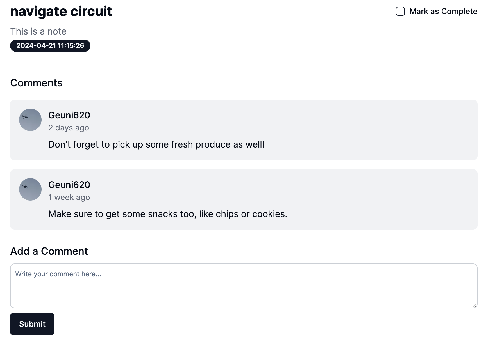
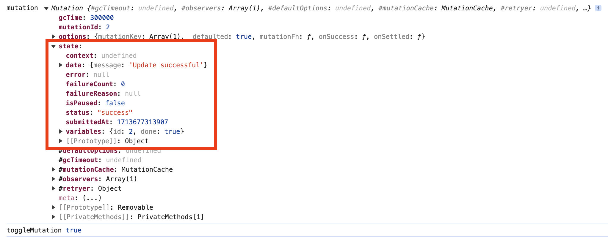
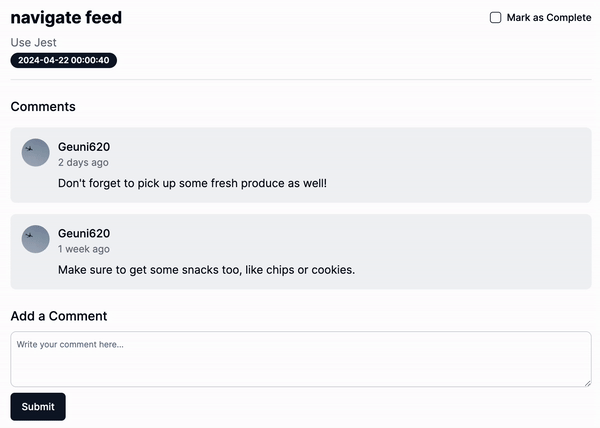

> [공식문서](https://tanstack.com/query/latest/docs/framework/react/guides/optimistic-updates)에 적혀 있는 두 가지 예시를 모두 구현해보자.

<br/>

### 낙관적 업데이트(Optimistic updates)는 어떨 때 사용할까?

낙관적 업데이트는 한 마디로,  
데이터를 변경하려 할 때, **응답을 기다리기 전 미리 UI를 업데이트 시키는 것**이다.

<br/>

나는 다음과 같은 상황에 쓰려고 했다.

- 체크박스가 존재한다.
- 체크박스를 클릭하자마자 DB에 해당 체크박스의 변경된 정보를 저장한다.

간단히 예시를 만들어보자.



<br/>

여기서 `Mark as Complete`의 체크박스를 클릭하면, DB에 데이터가 반영되는 구조다.  
날짜 정보 역시 업데이트 시킨다.

<br/>


테스트해보니, 생각보다.. 업데이트 반응이 느리지 않았다.  
하지만 이는 데스크탑 상황이다.  
데스크탑보다 모바일 성능은 당연히 떨어지며, 반응 역시 느려진다.  
(실제, 이미지 업로드 같은 경우는 업로드 시키고 다시 불러오는데까지 데스크탑보다 훨씬 느렸다.)

모바일 환경이라고 가정해보고 테스트를 해보면 다음과 같다.  
(네트워크탭에서 no throtting를 **Fast 3G**로 변경했다.)

  
확연히 반응속도가 느린 것을 알 수 있었다.  
그럼 이제 낙관적 업데이트로 이를 개선해보자.

<br/>

Tanstack-query v5 공식문서에선 두 가지 낙관적 업데이트(optimistic updates) 방법을 제시한다.

### 1. Via the UI

이 방법은 비교적 간단한 방법으로 cache의 직접적인 변경없이도 구현이 가능했다.

```TSX
export const MUTATION_KEY = 'detail';

// useToggleOptimistic.ts
export const useToggleOptimistic = () => {
  const queryClient = useQueryClient();

  const toggleMutation = useMutation({
    mutationFn: changeToggle,
    onSuccess: () => {

      toast.success('성공적으로 업데이트 하였습니다!');
      /**
      return queryClient.invalidateQueries({
        queryKey: ['detail'],
      });
      */
    },
    onSettled: () => {
      // 반드시 return 시켜줘야함
      // 쿼리를 무효화할 때 프로미스를 반환해야한다.
      // 무효화가 완료되기 전까지 pening가 유지되도록 함
      return queryClient.invalidateQueries({
        queryKey: ['detail'],
      });
    },
    mutationKey: [MUTATION_KEY]
  });

  return toggleMutation;
};
```

이 소스코드에서 크게 두 가지를 살펴보자.

**1. onSettled**

- 보통 mutation의 onSuccess 내에서 invalidateQueies를 통해 캐시를 무효화시킨다.
- 하지만 낙관적 업데이트를 하기 위해선, onSettled에서 invalidateQueries를 작성해주었다.  
  이 둘의 차이점은,

  - `onSuccess`는 mutation이 **성공하고 결과를 전달할 때 실행**
  - `onSettled`는 mutation이 **성공하든 실패하든 모두 실행**

- 주의할 점은, onSettled에서 invalidateQueries로 캐시를 무효화할 땐, **꼭 return을 붙여줘야한다.**
  - 이는 promise를 반환할 때, pending상태임을 인지하기 위해서이다.

<br/>

**2. mutationKey**

```TSX
const DetailPage = () => {
  //...
  const toggleMutation = useToggleOptimistic();
  const pendingData = useMutationState({
    filters: { mutationKey: [MUTATION_KEY], status: 'pending' }, // mutationKey를 통해 pending filter
    select: (mutation) => {
      console.log('mutation', mutation); // 하단 스크린샷
      return mutation.state.variables as DetailData; //
    },
  });

  console.log('toggleMutation', toggleMutation.isPending); // fasle → true → false
  console.log('pendingData', pendingData);  // [] → [{...}] → []

return (
   //...
 );
};
```

- 사용자가 체크박스를 클릭했다고 가정해보자

- 이때, toggleMutation은 false인 상태에서  
  → api 요청이 갔을 것이고, pending 상태가 된다. 이때 true로 변경된다.  
  → response 이후엔 다시 false로 변경된다.
- pendingData 역시 마찬가지다. 빈 배열인 상태에서  
  → api 요청이 갔을 것이고, pending 상태인 데이터가 발생한다. 이때 mutationKey로 이를 filter한다.  
  → 그리고 해당 mutation.state.variables를 가져오는 것이다.



어떤 것을 사용해도 상관없다는 의미다.  
하지만, query와 mutation이 한 컴포넌트에 존재하지 않을 땐,  
pendingData를 통해서 mutation pending 상태를 적용하면 된다.

<br/>

그럼 이제 UI에 반영해보자.

```TSX
const DetailPage = () => {
  const { id } = useParams();
  const detail = useDetailDataGetQuery({ id });
  const toggleMutation = useToggleOptimistic();
  const pendingData = useMutationState({
    filters: { mutationKey: [MUTATION_KEY], status: 'pending' },
    select: (mutation) => {
      console.log('mutation', mutation);
      return mutation.state.variables as DetailData;
    },
  });

  const pending = pendingData ? pendingData[0] : null;
  // console.log('toggleMutation', toggleMutation.isPending);
  // console.log('pendingData', pendingData);


  return (
    // ...
    <div className="mx-auto max-w-4xl px-4 py-8 sm:px-6 lg:px-8">
      <Checkbox
        checked={pending ? pending.done : detail.data.done}
        // checked={detail.data.done}
        onCheckedChange={(checked: boolean) => {
          toggleMutation.mutate({
            id: detail.data.id,
            done: checked,
          });
        }}
      />
      {pending ? (
        <Label className="opacity-20" htmlFor="complete">
          Mark as Complete
        </Label>
      ) : (
        <Label htmlFor="complete">Mark as Complete</Label>
      )}
    </div>
  );
};
```

<small>prettier이 왜 깨지는지 모르겠네..</small>

- checkbox에서 pending이 true일 경우, pending.done을 없을 경우라면, query에서 가져온 데이터로 checkbox 상태를 관리한다.



- UI로 명확히 확인하고자, **pending 상태일 때** Mark as Complete 문구에 opacity를 주었고,  
  **Fast 3G**로 테스트했다.

<br/>

### 2. Via the cache
