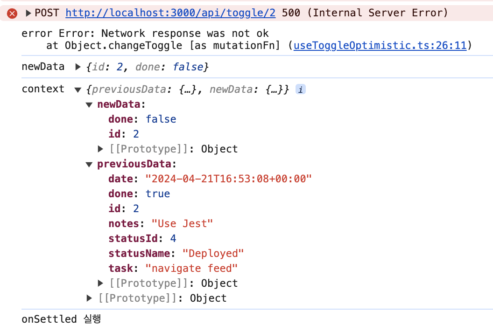
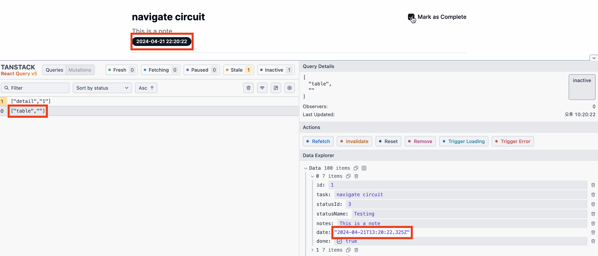

> [공식문서](https://tanstack.com/query/latest/docs/framework/react/guides/optimistic-updates)에 적혀 있는 두 가지 예시를 모두 구현해보자.

<br/>

### 낙관적 업데이트(Optimistic updates)는 어떨 때 사용할까?

낙관적 업데이트는 한 마디로,  
데이터를 변경하려 할 때, **응답을 기다리기 전 미리 UI를 업데이트 시키는 것**이다.

<br/>

다음과 같은 상황에 쓰려고 했다.

- 체크박스가 존재한다.
- 체크박스를 클릭하자마자 DB에 해당 체크박스의 변경된 정보를 저장한다.

간단히 예시를 만들어보자.


<br/>

여기서 `Mark as Complete`의 체크박스를 클릭하면, DB에 데이터가 반영되는 구조다.  
**날짜 정보 역시 업데이트 시킨다.**

<br/>


테스트해보니, 생각보다.. 업데이트 반응이 느리지 않았다.  
하지만 이는 데스크탑 상황이다.  
데스크탑보다 모바일 성능은 당연히 떨어지며, 반응 역시 느려진다.

모바일 환경이라고 가정해보고 테스트를 해보면 다음과 같다.  
(네트워크탭에서 no throtting를 **Fast 3G**로 변경했다.)

  
확연히 반응속도가 느린 것을 알 수 있었다.  
그럼 이제 낙관적 업데이트로 이를 개선해보자.

<br/>

Tanstack-query v5 공식문서에선 두 가지 낙관적 업데이트(optimistic updates) 방법을 제시한다.

### 1. Via the UI

이 방법은 비교적 간단한 방법으로 cache의 직접적인 변경없이도 구현이 가능했다.

```TSX
export const MUTATION_KEY = 'detail';

// useToggleOptimistic.ts
export const useToggleOptimistic = () => {
  const queryClient = useQueryClient();

  const toggleMutation = useMutation({
    mutationFn: changeToggle,
    onSuccess: () => {

      toast.success('성공적으로 업데이트 하였습니다!');
      /**
      return queryClient.invalidateQueries({
        queryKey: ['detail'],
      });
      */
    },
    onSettled: () => {
      // 반드시 return 시켜줘야함
      // 쿼리를 무효화할 때 프로미스를 반환한다.
      // 무효화가 완료되기 전까지 pening가 유지되도록 함
      return queryClient.invalidateQueries({
        queryKey: ['detail'],
      });
    },
    mutationKey: [MUTATION_KEY]
  });

  return toggleMutation;
};
```

이 소스코드에서 크게 두 가지를 살펴보자.

**1. onSettled**

- 보통 mutation의 onSuccess 내에서 invalidateQueies를 통해 캐시를 무효화시킨다.
- 하지만 낙관적 업데이트를 하기 위해선, onSettled에서 invalidateQueries를 작성해주었다.  
  이 둘의 차이점은,

  - `onSuccess`는 mutation이 **성공하고 결과를 전달할 때 실행**
  - `onSettled`는 mutation이 **성공하든 실패하든 모두 실행**

- 주의할 점은, onSettled에서 invalidateQueries로 캐시를 무효화할 땐, **꼭 return을 붙여줘야한다.**
  - 이는 promise를 반환할 때, pending상태임을 인지하기 위해서이다.

<br/>

**2. mutationKey**

```TSX
const DetailPage = () => {
  //...
  const toggleMutation = useToggleOptimistic();
  const pendingData = useMutationState({
    filters: { mutationKey: [MUTATION_KEY], status: 'pending' }, // mutationKey를 통해 pending filter
    select: (mutation) => {
      console.log('mutation', mutation); // 하단 스크린샷
      return mutation.state.variables as DetailData; //
    },
  });

  console.log('toggleMutation', toggleMutation.isPending); // fasle → true → false
  console.log('pendingData', pendingData);  // [] → [{...}] → []

return (
   //...
 );
};
```

- 사용자가 체크박스를 클릭했다고 가정해보자

- 이때, toggleMutation은 false인 상태에서  
  → api 요청이 갔을 것이고, pending 상태가 된다. 이때 true로 변경된다.  
  → response 이후엔 다시 false로 변경된다.
- pendingData 역시 마찬가지다. 빈 배열인 상태에서  
  → api 요청이 갔을 것이고, pending 상태인 데이터가 발생한다. 이때 mutationKey로 이를 filter한다.  
  → 그리고 해당 mutation.state.variables를 가져오는 것이다.


어떤 것을 사용해도 상관없다는 의미다.  
하지만, query와 mutation이 한 컴포넌트에 존재하지 않을 땐,  
pendingData를 통해서 mutation pending 상태를 적용하면 된다.

<br/>

그럼 이제 UI에 반영해보자.

```TSX
const DetailPage = () => {
  const { id } = useParams();
  const detail = useDetailDataGetQuery({ id });
  const toggleMutation = useToggleOptimistic();
  const pendingData = useMutationState({
    filters: { mutationKey: [MUTATION_KEY], status: 'pending' },
    select: (mutation) => {
      console.log('mutation', mutation);
      return mutation.state.variables as DetailData;
    },
  });

  const pending = pendingData ? pendingData[0] : null;
  // console.log('toggleMutation', toggleMutation.isPending);
  // console.log('pendingData', pendingData);


  return (
    // ...
    <div className="mx-auto max-w-4xl px-4 py-8 sm:px-6 lg:px-8">
      <Checkbox
        checked={pending ? pending.done : detail.data.done}
        // checked={detail.data.done}
        onCheckedChange={(checked: boolean) => {
          toggleMutation.mutate({
            id: detail.data.id,
            done: checked,
          });
        }}
      />
      {pending ? (
        <Label className="opacity-20" htmlFor="complete">
          Mark as Complete
        </Label>
      ) : (
        <Label htmlFor="complete">Mark as Complete</Label>
      )}
    </div>
  );
};
```

<small>prettier이 왜 깨지는지 모르겠네..</small>

- checkbox에서 pending이 true일 경우, pending.done을,  
  pending이 flase일 경우, query에서 가져온 데이터로 checkbox 상태를 관리한다.


- UI로 명확히 확인하고자, **pending 상태일 때** Mark as Complete 문구에 **opacity를 주었고**,  
  **Fast 3G**로 테스트했다.

<br/>

### 2. Via the cache

이제 직접적인 두 번째 방법인 cache를 수동으로 변경시켜보자.  
낙관적 업데이트의 핵심은 동일하다.  
(응답을 기다리기 전 미리 UI를 업데이트 시키는 것)

```TSX
// useToggleOptimisticCache.ts
export const useToggleOptimisticCache = () => {
  const queryClient = useQueryClient();
  const toggleMutation = useMutation({
    mutationFn: changeToggle,

    onMutate: async (newData) => {
      const newDataId = newData.id.toString();

     // queryKey에 해당하는 데이터 업데이트를 취소시킨다.
      await queryClient.cancelQueries({ queryKey: ['detail', newDataId] });

     // 그리고 기존의 queryKey에 해당하는 데이터를 가져온다.
      const previousData = queryClient.getQueryData<DetailData>([
        'detail',
        newDataId,
      ]);

     // 새로운 데이터 객체를 생성하여, 기존 데이터에 변경사항을 적용한다.
      const updatedData = {
        ...previousData,
        done: newData.done,
      };

     // 새로운 데이터를 cache에 적용한다.
      queryClient.setQueryData(['detail', newDataId], updatedData);

      return {
        previousData,
        newData,
      };
    },

    onError: (error, newData, context) => {
      // mutation이 실패했을 때, 이전 데이터를 다시 반영한다.
      queryClient.setQueryData(
        ['detail', context?.newData.id],
        context?.previousData,
      );
    },

    onSuccess: () => {
      toast.success('성공적으로 업데이트 하였습니다!');
    },

    onSettled: () => {
      return queryClient.invalidateQueries({
        queryKey: ['detail'],
      });
    },
  });

  return toggleMutation;
};
```

공식문서에도 잘 작성되어있지만 하나씩 살펴보자.

**1. onMutate**

- 먼저, onMutate를 작성해줘야한다. 이는 mutate가 call될 때 동작한다.
- newData는 mutate에서 인자로 넘긴 value가 포함된다.

```TSX
  <Checkbox
    //...
    onCheckedChange={(checked: boolean) => {
      toggleMutation.mutate({
        id: detail.data.id,
        done: checked,
      });
    }}
  />
```

- 위 함수에서, id와 done을 넘겼으니, newData는 id와 done을 받게 된다.

<br/>

소스코드에도 작성되어있지만, 간략히 다시 설명하자면 다음과 같다.

- onMutate에서 queryKey에 해당하는 mutate를 취소한다. (cancelQueries)
- 그리고 변경되기 전 데이터를 가져온다. (getQueryData)
- 업데이트된 객체를 생성한 뒤, 수동으로 cache를 업데이트 시킨다. (setQueryData)

<br/>

**2. onError**

에러가 발생했을 땐 어떻게 동작할까?

```TS
// api/toggle/[id]/route.ts
export async function POST(request: Request) {
  try {
    // 일시적인 오류를 발생시켜보았다.
    throw new Error('일시적 오류 발생!!!');
    // ...
  } catch (error) {
    return handleErrorResponse(error);
  }
}

//
export const useToggleOptimisticCache = () => {
  const toggleMutation = useMutation({
    //...
    onError: (error, newData, context) => {
      console.log('error', error);
      console.log('newData', newData);
      console.log('context', context);

      queryClient.setQueryData(
        ['detail', context?.newData.id.toString()],
        context?.previousData,
      );
    },
    onSettled: () => {
      console.log("onSettled 실행")
      return queryClient.invalidateQueries({
        queryKey: ['detail'],
      });
    },
  });
  return toggleMutation;
};
```

  
소스코드의 log처럼 차례로, error, newData, context이다.  
위에서 언급한대로, onSettled는 mutation이 성공하든 실패하든 모두 실행된다.

<br/>

### 3. 어떤 상황에 쓰면 될까?

마지막으로 두 가지 방법을 어떤 상황에 각각 쓰면 되는걸까?  
공식문서에선 [다음과 같이](https://tanstack.com/query/latest/docs/framework/react/guides/optimistic-updates#when-to-use-what) 제시한다.

정리해보자면,  
UI를 직접 업데이트하는 곳이 한 곳만 있는 경우 → via the UI  
UI를 직접 업데이트하는 곳이 두 곳 이상일 경우 → via the cache

<br/>

현재의 예시에선 detail 페이지만 존재한다.  
detail 페이지 내의 checkbox 상태만 서버로 전송하고, 서버에선 checkbox 상태를 업데이트할 때의 date도 생성해서 같이 DB에 저장한다.

그래서 이 경우엔 via the UI를 사용하면 될 듯하다.  
왜냐하면, 직접 업데이트 되는 곳이 detail 페이지 한 곳이기 때문이다.

만약, detail 페이지가 엄청 세분화 되어있어서, 다른 컴포넌트의 query로 mount되어있는 상태라고 가정해보자.  
그리고, 그 컴포넌트는 체크박스 리스트 중, 상태가 변경된 체크박스의 date를 업데이트 한다고 가정해보자.  
한 걸음 더 나아가, 이 경우도 낙관적 업데이트를 적용해보자.

<br/>

이런 경우라면, vai the cache를 통해 수동적으로 cache를 각각 업데이트 시켜줘야한다.  
예시를 쥐어 짜내고 짜내서, 생각해냈는데, 사실 이런 경우는 흔치 않는 것 같다.

대부분 전자인 via the UI를 사용하지 않을까 싶다.

<br/>

### 번외

3번의 예시를 하나하나 다 만들기엔 시간이 부족해서.. 🥲 최대한 만든 것을 토대로 작성해봤다.

1. detail페이지와 list 페이지가 존재한다.
2. detail페이지에서 체크박스의 상태와 날짜를 낙관적 업데이트한다.
3. 이때, list에 해당하는 날짜도 낙관적 업데이트 시켜보자

```TSX
export const useToggleOptimisticCache = () => {
  const queryClient = useQueryClient();
  const toggleMutation = useMutation({
    mutationFn: changeToggle,
    onMutate: async (newData) => {
      const newDataId = newData.id.toString();

      await queryClient.cancelQueries({ queryKey: ['detail', newDataId] });
      await queryClient.cancelQueries({ queryKey: ['table'] });

      const previousDetail = queryClient.getQueryData<DetailData>([
        'detail',
        newDataId,
      ]);

      const updatedDetail = {
        ...previousDetail,
        done: newData.done,
        date: newData.date,
      };

      queryClient.setQueryData(['detail', newDataId], updatedDetail);

      // table에 해당하는 데이터 중, detail과 동일한 id찾아 체크박스와 date를 업데이트 한다.
      queryClient.setQueryData(['table', ""], (oldData: DetailData[]) => {
        return oldData.map((item) => {
          if (item.id === newData.id) {
            return { ...item, done: newData.done, date: newData.date };
          }

          return item;
        });
      });

      return {
        previousDetail,
        newData,
      };
    },

    onError: (error, newData, context) => {
      queryClient.setQueryData(
        ['detail', context?.newData.id.toString()],
        context?.previousDetail,
      );

      queryClient.setQueryData(['table'], (oldTable: DetailData[]) => {
        return oldTable.map((item) => {
          return item.id === context?.newData.id
            ? context?.previousDetail
            : item;
        });
      });
    },

    onSuccess: () => {
      toast.success('성공적으로 업데이트 하였습니다!');
    },

    onSettled: () => {
      // detail과 table 모두 무효화 시키기
      queryClient.invalidateQueries({
        queryKey: ['detail'],
      });

      queryClient.invalidateQueries({
        queryKey: ['table'],
      });
    },
  });

  return toggleMutation;
};
```

마지막으로 잘 되는지 테스트해보자.  
참고로 DB에 저장할 땐 UTC기준으로 사용했고, UI로 보여주는 시간은 한국시간 기준으로 적용되어있다.  
즉, 9시간 차이가 난다.



table 내 detail id와 동일한 table의 date가 잘 반영된다.

<br/>

### 정리

1.  앞으로 낙관적 업데이트를 적용할 일이 어떤 경우가 있을지 모르겠다.  
    하지만, 적용하게 된다면 **via the UI를 가장 우선 고려할 것 같다.**  
    수동으로 cache를 조작하는 것보다 방법이 편하고 되돌리기도 용이하다.  
    심지어 코드량도 적게 사용할 수 있다.

2.  예시를 만들면서 detail페이지의 UI는 [v0](https://v0.dev/)가 만들어줬다.  
    쉽고 간단하게 코드만 복붙해서 내가 원하는대로 커스텀하기 편했다.  
    프리미엄은.. 결제해보고 싶었다.

3.  tanstack 라이브러리는 배울게 많다.  
    소스코드를 확인해보지 않아서 모르겠지만, core를 두고  
    react에 주입하면 react용으로 사용되고,  
    vue에 주입하면 vue용으로 사용되는 것 같다.  
    이 부분은 차츰차츰 알아가보자!
