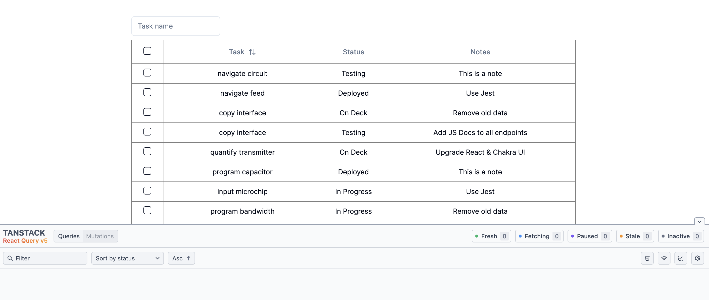
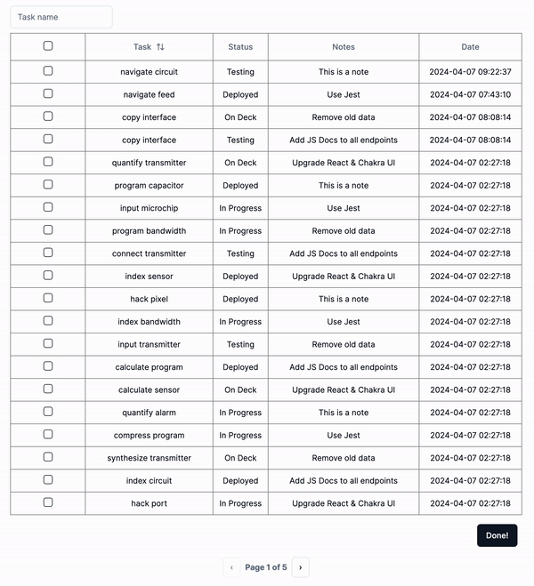
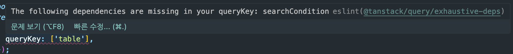
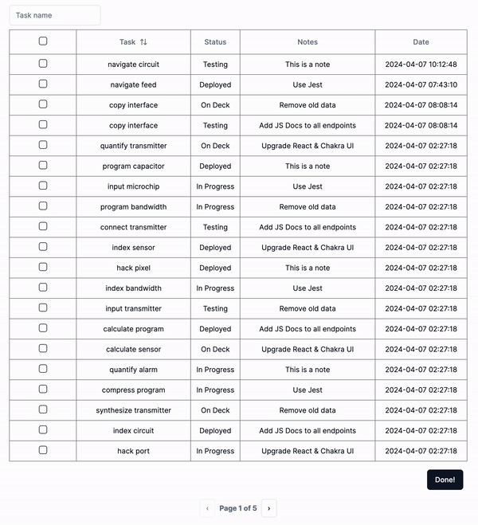

[예시 소스코드](https://github.com/Geuni620/api-get-body)

### 배경

보통의 검색/조회를 할 땐, API Method로 GET을 사용한다.  
하지만 이번엔 POST로 조회를 해야하는 경우가 생겼다.  
검색조건으로 보내야하는 query의 길이가 길어서,  
허용되는 최대 URL 길이를 넘어갈 것으로 예상되었기 때문이다.

[참고](https://stackoverflow.com/questions/417142/what-is-the-maximum-length-of-a-url-in-different-browsers)  
위 참고링크를 확인해보면, 대체로 2000자 이내를 권장하는 듯하다.

<br/>

### MutateAsync

처음 나의 생각은 다음과 같았다.

```
1. 검색조건을 state에 담자
2. 담아준 state를 POST로 보내자
3. 반환받은 데이터를 MutateAsync로 처리하자.
```

```TSX
export default function Home() {
  const inputRef = useRef<HTMLInputElement>(null);
  const tableList = useTableDataGetMutation();

  useEffect(() => {
    // 초기 렌더링 시, 결과물을 불러오기 위함
    tableList.mutateAsync({ searchCondition: '' });
  }, []);

  const onSubmit = (event: FormEvent<HTMLFormElement>) => {
    event.preventDefault();

    if (inputRef.current) {
      tableList.mutateAsync({ searchCondition: inputRef.current.value });
    }
  };

  return (
    <div className="h-screen w-screen">
      <div className="mx-auto w-[900px] pb-20 pt-10">
        <form
          onSubmit={onSubmit}
          className="mb-2 flex items-center justify-between gap-2"
        >
          <Input
            ref={inputRef} // 1. 검색조건은 state에 담아주자
            className="w-[20%]"
            type="text"
            placeholder="Task name"
          />
        </form>
        <TableComponents data={tableList.data?.list || []} /> // 3. 반환받은 데이터를 MutateAsync로 처리하자.
      </div>
    </div>
  );
}
```

- 위와 같이 작성했을 때 검색 결과에 대한, 해당 테이블 데이터는 잘 출력된다.
- 이때까진 큰 문제없다고 생각했다.

<br/>

### 구독상태가 아니다.

위 기능을 구현하고, 잘 된다고 안심하고 있었다.  
하지만, 곧 문제가 발생했다.

위 mutateAsync의 가장 큰 단점은 **구독상태가 아니라는 점이다.**  
보통 useQuery를 사용하면, queryKey를 기반으로 구독상태가 되어,  
queryKey가 변경될 때마다, 데이터를 다시 가져온다.  
하지만 mutateAsync는 그렇지 않다.



<br/>

여기서 만약 이런 요구사항이 있다고 가정해보자.

> Task가 완료되면, 체크박스를 클릭하여 완료처리를 하고, 체크된 Task의 날짜가 기록되어야한다.

<br/>

### 날짜 데이터 추가하기

> 일이 커져버렸다.  
> JSON파일을 fs를 이용해 읽고 구현하려고 했는데, 욕심이 커져서 데이터를 저장할 공간이 필요해졌다.
> 이전이라면 prisma를 사용했을 것이다.  
> 하지만, 최근에 [supabase](https://supabase.com/)를 알고 난 뒤부턴 여기부터 뒤적거리곤 한다.

<br/>

잠깐의 셋업을 거친 뒤 다음과 같은 기능을 추가했다.

1. 페이지에 접속하면, mutateAsync에 의해, 전체 데이터를 가져옴
2. 검색조건을 입력하면 mutateAsync에 의해, 검색된 데이터를 가져옴
3. 체크박스를 클릭하고, Done Button을 클릭하면, task가 업데이트 되고, **날짜도 업데이트 되어야함**

하지만, 여기서 날짜 데이터는 업데이트 되지 않는다.  
위에서 언급했듯이, **mutateAsync는 구독상태가 아니기 때문에,** queryKey가 업데이트 되어도 알 수 있는 방법이 없다.



위 GIF를 보면, Done Button을 클릭했을 때, 날짜가 업데이트 되지 않는 것을 확인할 수 있다.  
하지만 새로고침 이후엔 날짜가 업데이트 되었다.  
`2024-04-07 09:22:37` → `2024-04-07 09:55:59`

<br/>

### useQuery는 GET Method에만 사용해야할까?

> 내가 직면한 문제를 해결하기 위해 POST Method에는 useQuery를 사용하면 안되는걸까?

react-query를 처음 배울 때, useQuery는 대체로 GET Method에 사용하고,  
useMutation은 POST와 PATCH, PUB, DELETE 등에 사용한다고 배웠던 것 같다.

react-query의 메인테이너인 [Tanner Linsley](https://github.com/tannerlinsley)는 다음과 같은 [댓글](https://github.com/TanStack/query/discussions/801#discussioncomment-87385)을 남겼다.

> useQuery for reading data  
> \- 데이터를 읽기 위해선, useQuery를
>
> useMutation for creating, changing, or deleting data  
> \- 데이터를 생성, 변경, 삭제하기 위해선, useMutation을

하지만, 생각해보면, 그 누구도 useQuery는 **GET Method에만 사용해야한다고 말하지 않았다.**

즉, HTTP Method에 따라 useQuery와 useMutation을 나누는 것은 옳지 않다고 생각이 들었다.  
참고로 **POST 역시 데이터를 읽을 수 있다.**

<br/>

그럼 해보자, useQuery로 잘 돌아가는지 테스트해보자.

<br/>

### mutateAsync → useQuery로 변경

```TSX
export default function Home() {
  const inputRef = useRef<HTMLInputElement>(null);
/**
 * 변경!!
  const tableList = useTableDataGetMutation();
*/

/**
 * 제거!!
  useEffect(() => {
    // 초기 렌더링 시, 결과물을 불러오기 위함
    tableList.mutateAsync({ searchCondition: '' });
  }, []);

  const onSubmit = (event: FormEvent<HTMLFormElement>) => {
    event.preventDefault();

    if (inputRef.current) {
      tableList.mutateAsync({ searchCondition: inputRef.current.value });
    }
  };
*/

  const tableList = useTableDataGetQuery({
    searchCondition: inputRef.current?.value || '',
  });


  const onSubmit = (event: FormEvent<HTMLFormElement>) => {
    event.preventDefault();

    tableList.refetch();
  };

  return (
    // ...
  );
}
```

먼저 useTableDataMutation의 hooks 명칭을 변경했다.  
 ( useTableDataGetMutation → useTableDataGetQuery )

그리고 searchCondition을 useTableDataGetQuery의 인자로 넘겨주었다.

```TS
/**
export const useTableDataGetMutation = () => {
  const queryClient = useQueryClient();

  const tableList = useMutation({
    mutationFn: getTableDataViaPOST,
    onSuccess: () => {
      queryClient.invalidateQueries({
        queryKey: ['table'],
      });
    },
  });

  return tableList;
};
*/

export const useTableDataGetQuery = ({ searchCondition }: TableDataProps) => {
  return useQuery({
    queryFn: () => getTableDataViaPOST({ searchCondition }),
    queryKey: ['table'], // Error 발생
  });
};
```

useTableDataGetQuery는 useMutation에서 useQuery로 변경하고,  
넘겨받은 searchCondition을 queryFn에 넘겨주었다.

하지만, 여기서 에러가 발생했다.  
<small>업무를 진행하면서 발생하지 않았던 에러인데, 예시를 만들면서 발생했다.</small>

업무에선 react-query V3를 사용했고, 예시를 만드는 현재는 tanstack-query V5로 진행했다.  
그리고, 현재는 tanstack-qeury에서 권장하는 [eslint](https://tanstack.com/query/v4/docs/eslint/eslint-plugin-query)를 설정했다.



위 이미지를 요약해보자면 다음과 같다.

- queryFn에 사용되는 모든 변수는 쿼리 키에 추가되어야한다.

  - 이렇게 하면 쿼리가 독립적으로 캐시되고, 변수가 변경될 때 자동으로 다시 가져올 수 있다.
  - [Exhaustive dependencies for query keys](https://tanstack.com/query/latest/docs/eslint/exhaustive-deps)

즉, queryKey에 searchCondition을 추가해야한다.

<br/>

```TS
export const useTableDataGetQuery = ({ searchCondition }: TableDataProps) => {
  return useQuery({
    queryFn: () => getTableDataViaPOST({ searchCondition }),
    queryKey: ['table', searchCondition], // searchCondition을 queryKey에 추가
  });
};
```

하지만 queryKey에 searchCondition을 추가하면,  
searchCondition이 변경될 때마다, submit 동작없이 데이터가 바로 변경된다.

만약 검색 조건이 여러 개라고 가정해보자. (select, checkbox 등등)  
searchCondition이 변경될 때마다 데이터를 가져오는 것은 비효율적이다.

그래서 나는, onSubmit이 발생했을 때 데이터를 가져오길 바랐다.

시나리오를 다음과 같이 세웠다.

```
1. useRef를 이용해서 input의 value 값을 가져온다.
2. onSubmit이 발생했을 때, setState로 searchCondition을 변경한다.
3. tableList.refetch()를 호출한다.
```

```TSX
import { FormEvent, useRef, useState } from 'react';

import { TableComponents } from '@/components/table';
import { Input } from '@/components/ui/input';
import { useTableDataGetQuery } from '@/hook/useTableDataGetQuery';

export default function Home() {
  const inputRef = useRef<HTMLInputElement>(null);
  const [searchCondition, setSearchCondition] = useState<string>('');

  const tableList = useTableDataGetQuery({
    searchCondition,
  });

  const onSubmit = (event: FormEvent<HTMLFormElement>) => {
    event.preventDefault();

    setSearchCondition(inputRef.current?.value || '');  // 2. onSubmit이 발생했을 때, setState로 searchCondition을 변경한다.
    tableList.refetch(); // 3. tableList.refetch()를 호출한다.
  };

  return (
    <div className="h-screen w-screen">
      <div className="mx-auto w-[900px] pb-20 pt-10">
        <form
          onSubmit={onSubmit}
          className="mb-2 flex items-center justify-between gap-2"
        >
          <Input
            ref={inputRef} // 1. useRef를 이용해서 input의 value 값을 가져온다.
            className="w-[20%]"
            type="text"
            placeholder="Task name"
          />
        </form>
        <TableComponents data={tableList.data?.list || []} />
      </div>
    </div>
  );
}
```

위와 같이 변경하면, onSubmit이 발생했을 때만, 데이터를 가져온다.  
그럼 이제 가장 초반에 언급한 문제를 다시 살펴보자.

> Task가 완료되면, 체크박스를 클릭하여 완료처리를 하고, 체크된 Task의 날짜가 기록되어야한다.

<br/>

useQuery로 변경했을 땐, 구독상태가 된다. queryKey가 변경될 때마다, 데이터를 가져올 것이다.



예상한대로, Done Button을 클릭했을 때, 날짜가 업데이트 되었다.

<br/>

### 정리

useQuery는 GET Method에만 사용해야한다는 것은 **사실 내 고정관념이었다.**  
useQuery는 데이터를 읽어오기 위한 것이고, useMutation은 데이터를 변경, 삭제, 수정하기 위한 것이다.  
즉, useQuery의 queryFn의 반환이 Promise이면 사용할 수 있다.

<br/>

### 참고자료

[What is the maximum length of a URL in different browsers?](https://stackoverflow.com/questions/417142/what-is-the-maximum-length-of-a-url-in-different-browsers)  
[react-query with axios post #801](https://github.com/TanStack/query/discussions/801)  
[React-Query on post methods #2751](https://github.com/TanStack/query/discussions/2751)
