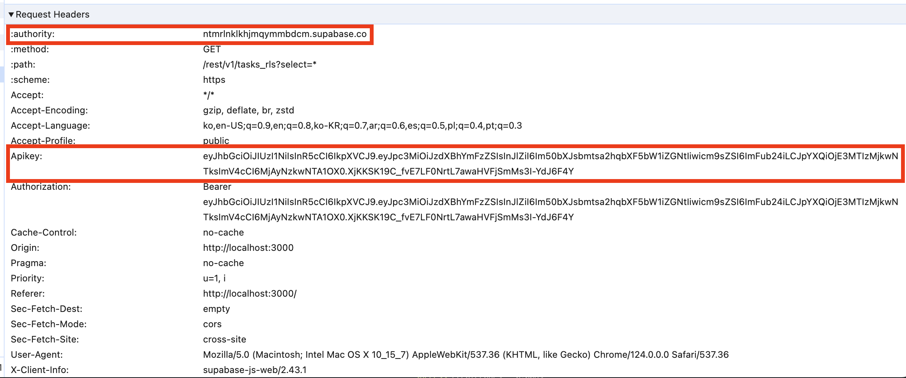
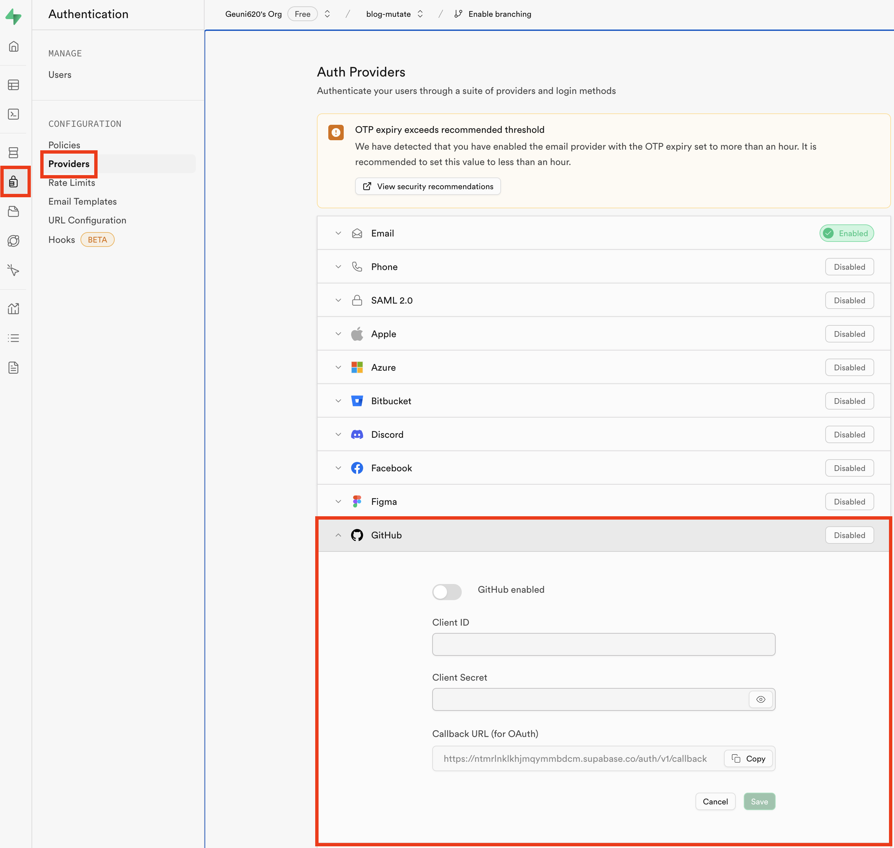
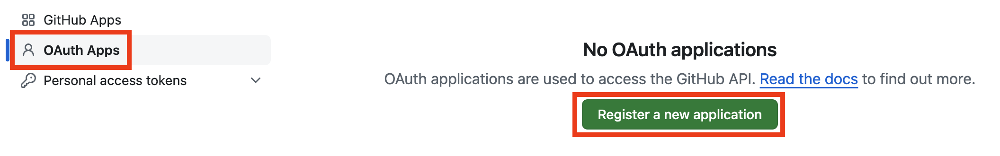
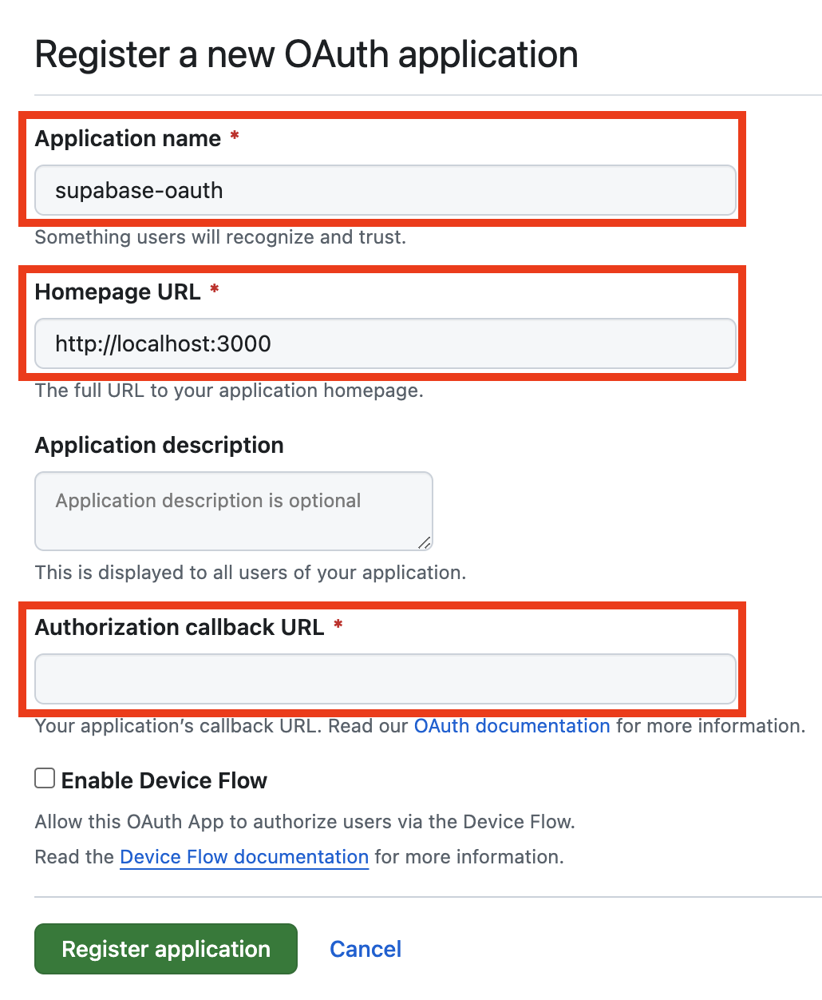
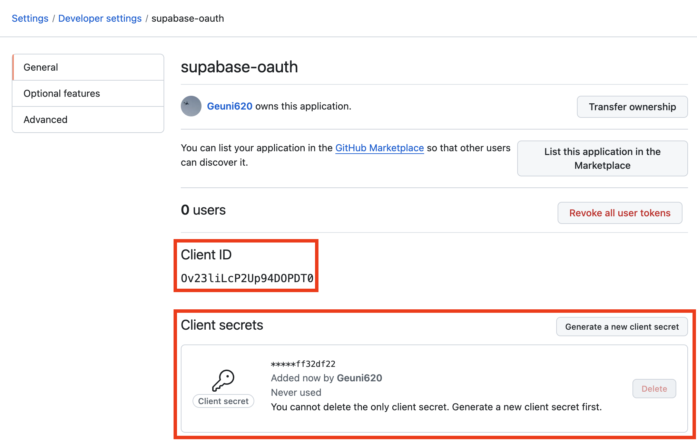

Supabase를 사용할 때, 보통 Next.js로 사용해왔다.  
API 핸들링은 Next.js API 폴더 내에서, Supabase는 ORM처럼 사용하곤 했다.  
이번엔 React를 사용해서 Supabase를 써보려고 한다.

<br/>

### Row Level Security가 왜 필요할까?

예를 들어 이런 상황을 생각해보자.

```TSX
// utils/supabase.ts
import { createClient } from '@supabase/supabase-js';

export const supabase = createClient(
  import.meta.env.VITE_SUPABASE_URL,
  import.meta.env.VITE_SUPBASE_KEY,
);

// useTaskGetQuery.ts
const fetchTask = async () => {
  const { data, error } = await supabase.from(TASK).select('*');

  if (error) {
    throw new Error(error.message);
  }

  return data;
};

export const useTaskGetQuery = () => {
  return useQuery({
    queryKey: QUERYKEYS,
    queryFn: fetchTask,
  });
};
```

`VITE_SUPABASE_URL`과 `VITE_SUPABASE_KEY`는 env를 통해 설정해주었지만, 클라이언트 환경에선 완전히 숨길 수 없다.



스크린샷처럼 API 요청시, 네트워크 탭을 확인해보면,  
env로 설정했던 URL과 KEY가 모두 드러나는 것을 확인할 수 있다.

이를 통해, 타 사용자가 내 DB에 저장된 소중한 데이터를 마음대로 삭제해버릴 수도 있다.

<!-- 이를 복사해서 API 요청, POST Method 뚫어서 확인하기 -->

<br/>

### Row Level Security 설정하기

이를 예방하기 위해 RLS를 설정해보자.  
해당 내용은 [생활코딩 Supabase 인증과 Serverless App](https://www.youtube.com/watch?v=yZ89etxVBKs) 영상을 참고했다.  
먼저 나는 supabase에서 프로젝트를 만들어놓은 상태에서 시작했다.

1. Github으로 로그인

먼저 만들어놓은 프로젝트의 왼쪽 메뉴에서 `Authentication`을 클릭한다.



그리고 Github을 클릭했을 때 다음과 같이 Client ID와 Client Secret를 요구한다.  
(이때 github ID와 비밀번호를 **적는게 아니다.**)

이제 Github으로 이동한다.

- 로그인 이후, 오른쪽 상단에서 프로필 클릭 → 노출된 메뉴 중 `Settings`를 클릭해주자
- 이동된 페이지에서 왼쪽 메뉴들 중 가장 아래에 존재하는 `< > Developer settings`를 클릭해주자

그럼 아래와 같은 페이지가 나온다.



그리고 `Register a new apllication`을 누른다.



name과 URL, 그리고 callback URL을 입력해줘야한다.  
여기서 callback URL은 상단에 `Supabase Authentication`에서  
Github 창을 확인해보면 `Callback URL (for Auth)`라고 적힌게 있다.  
이걸 붙여넣으면 된다.



확인 버튼을 누르고 난 뒤, 새롭게 뜨는 페이지에서, Client ID와 secrets를 복사해서,  
`Supabase Authentication`로 이동한 뒤, 각각 붙여넣고 저장을 눌러주면 된다.

<br/>

### 참고자료
